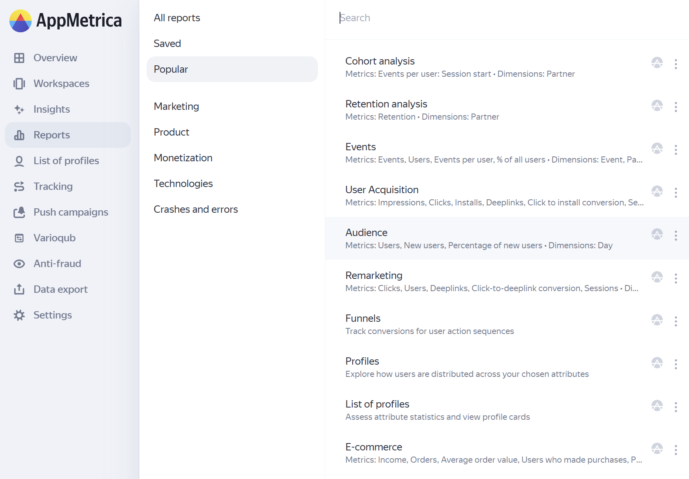

# Big Interface Update in AppMetrica: New Navigation in the Menu, Dashboards, and Widgets

We are excited to introduce a major interface update in AppMetrica. Our team has worked hard to make your analytics experience even more convenient and effective. Frequently used features are now always at your fingertips, and important tools are conveniently grouped to keep the interface simple and user-friendly.

## New Sidebar Menu

We completely reworked the structure of the sidebar menu to make it even more convenient and focused on your daily tasks.

The most popular sections are now front and center. For example, the product report "List of profiles" is now directly available from the main menu. Previously, it was in the "Reports" section.

Tools such as "A/B experiments" and "Flag Config" are now located in the unified "Varioqub" section, and "Saved Reports" and "Technologies" have been moved to the common "Reports" section.

{style="border: solid 1px #cccccc; max-width: 800px;"}
_New Sidebar Menu._

## Changes in Reports and Widget Visualizations

All reports are now organized by role-based principles, which makes it easier to find the information you need. We divided them into 6 logical categories: marketing, product and monetization reports, the "Technologies" block, and "Crashes and Errors" reports.

This structure allows each specialist to quickly find the data that matches their tasks:

- **Marketing Reports** are needed to assess the effectiveness of advertising campaigns, track traffic sources, and view push campaign statistics. This section includes the following reports: User Acquisition, User Acquisition SKAdNetwork, Remarketing, and "Push Campaigns".

- **Product Reports** help analyze key product metrics such as active users, retention, and engagement. This section includes reports such as:

    - Events

    - Funnels

    - Retention Analysis

    - Cohort Analysis

    - Engagement

    - Audience

    - Profiles

    - Profile list

- **Monetization Reports** are used to track metrics related to your app’s revenue from in-app purchases or ad monetization. This section includes the In-App Revenue and Ecommerce reports.

- In the **Technologies** block, data on the technical characteristics of your users' devices and operating system versions will be stored. Reports such as "App Versions," "Operating Systems," "Device Types," "SDK Versions," and others will be available here.

- The updated **"Crashes and Errors"** report now provides comprehensive information on the most common failures in your app’s performance. You can view detailed statistics on critical crashes, software bugs, and ANRs (Application Not Responding).

A new **"Popular"** section has been added, where you’ll find the reports most frequently visited by a specific user. These reports will be shown based on the number of views per user. There can be up to 10 reports in this section.

## New Ecommerce Dashboard

AppMetrica now features the Ecommerce dashboard, with flexible and personalized settings. You can create sub-sections with headings and subheadings, change the order of widgets, and adjust the number of widgets per row.

The dashboard allows you to track the entire customer journey — from the first visit to the purchase. The following metrics can be tracked:

- Purchases

- Purchases per User

- AOV (Average Order Value)

- Paying Users

- Purchases: Products

- Purchases: Categories

You can customize the dashboard to fit your needs, choose the widget type ("Graph," "Table," "Indicator"), and select the visualization format.

## Widgets

Dashboards now offer a more convenient visualization format. Instead of the usual line and bar charts, you can now use:

- Stacked Line Charts

- Stacked Bar Charts

- Category Bar Charts

- Pie Charts

Three types of widgets are now available: "Graph," "Indicator," or "Table."

These updates make AppMetrica even more user-friendly, allowing you to find the necessary data faster, work flexibly with visualizations, and make decisions based on accurate analytics.

**Leave a Request and Connect AppMetrica** to analyze your audience, exclude ineffective traffic sources, and develop successful retention strategies.
