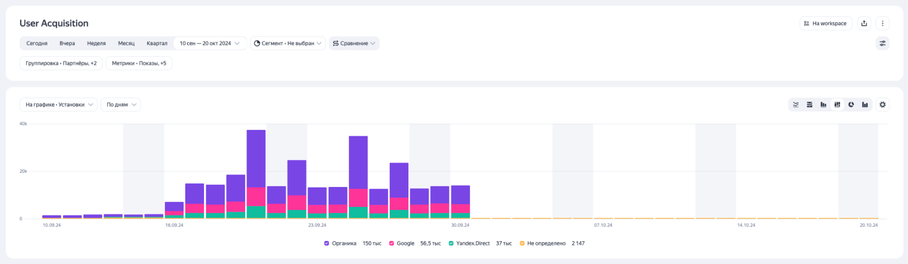
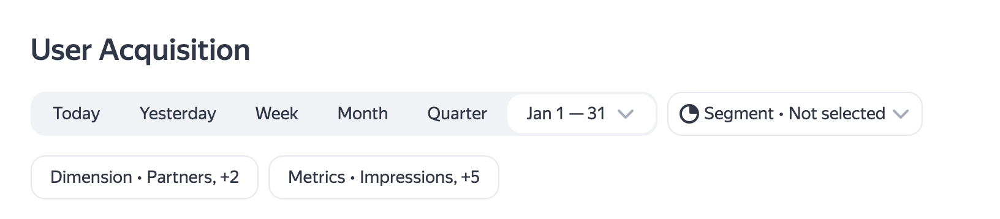

# Update to AppMetrica Report Interfaces

As we keep upgrading AppMetrica for you, we've enhanced the User Acquisition, Remarketing, and Events reports.

Here’s what’s changed.

## Easier segmentation

Working with segmentation is now even easier. Previously, selecting parameters took up a lot of screen space, which made it difficult to analyze and create clear screenshots for colleagues. Here’s how we solved this problem:

- We introduced a new, compact segmentation format for quicker access to relevant data.

- We ensured that segmentation conditions are always visible but do not obstruct data viewing.

{style="border: solid 1px #cccccc; max-width: 800px;"}
_New segmentation._

## Search by nested dimensions and parameters

### New Dimension — Profile attributes

In AppMetrica, now you can choose new dimensions such as profile attributes. A profile is a characteristic of an individual app user, consisting of three types of attributes: **system**, **user-defined**, and **installation-based**. You can find guidelines on profiles in the [Help section](../mobile-api/logs/ref/profiles.md).

These dimensions help analyze differences in user behavior across various groups. For example, in the Engagement report, you can compare how much time users with different loyalty program statuses or game levels spend in the app.

Additionally, profile attributes reflect the user's current data rather than their characteristics at the time of an event. For instance, a user might be registered in Moscow but make purchases and perform actions in different cities while traveling. Their profile will display Moscow as their registered location, even if events occurred elsewhere.

{style="border: solid 1px #cccccc; max-width: 800px;"}
_New profile attributes._

We’ve also added attributes related to app installation sources. These can be used for attribution analysis across various reports.

{style="border: solid 1px #cccccc; max-width: 800px;"}
_Attributes about app installation sources._

### Charts

You can now display any metrics on charts—just select the one you need in the report settings.

{style="border: solid 1px #cccccc; max-width: 800px;"}

{style="border: solid 1px #cccccc; max-width: 800px;"}

Additionally, we've introduced four new visualization types:

- Area chart

- Pie chart

- Value distribution

- Stacked bar chart

If you don’t need a visualization for a specific task, you can now hide the chart too:

{style="border: solid 1px #cccccc; max-width: 800px;"}

{style="border: solid 1px #cccccc; max-width: 800px;"}

{style="border: solid 1px #cccccc; max-width: 800px;"}

### Search by table

Searching for nested dimensions and event parameters now works using a dot notation, just like in segmentation. If you need to find a value that contains a dot, place a backslash (\\) before it.

{style="border: solid 1px #cccccc; max-width: 600px;"}
_Search by table._

### Grouping and metrics

We’ve moved the grouping and metrics settings to the top of the report settings next to dates and segments. Changes to these settings now affect both the chart and the table.

Settings at the top of the page now determine results in the lower section.

{style="border: solid 1px #cccccc; max-width: 800px;"}
_Groupings and metrics in the User Acquisition report._

### Switching between apps while retaining settings

You no longer need to reconfigure segmentation and groupings when switching between apps in your account. This makes it faster to compare the same parameters across different apps and saves you more time.

## Other improvements

The interface is now neater and more streamlined. We reduced padding to make reports more compact, and highlighted weekends in color for easier time-series analysis.
