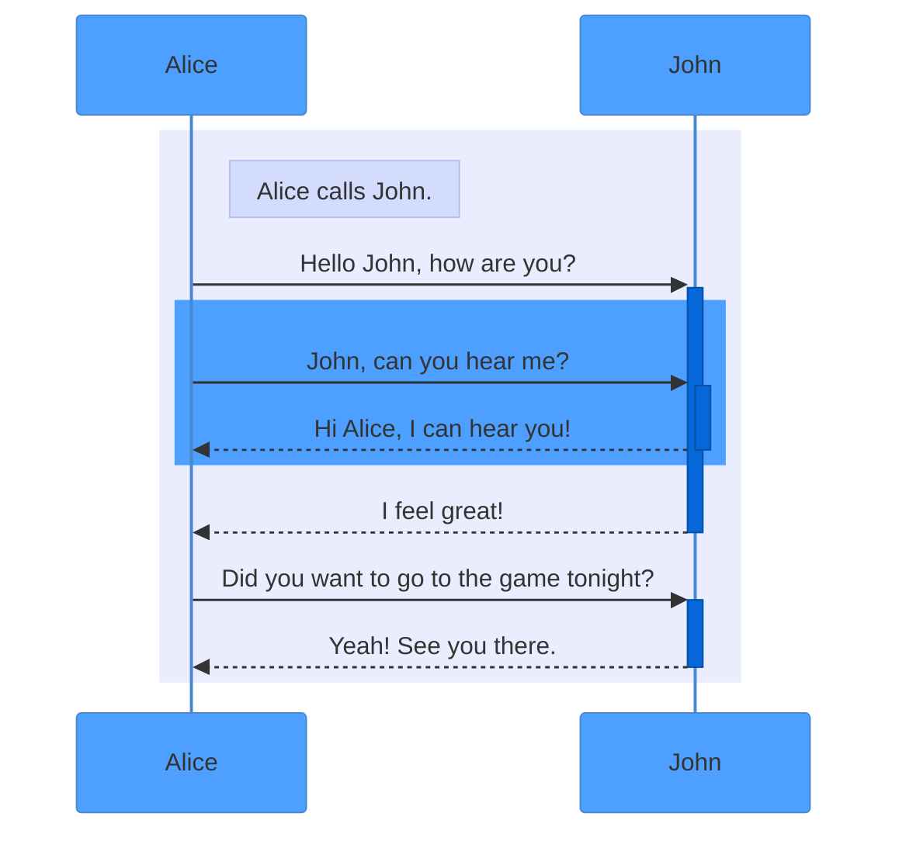
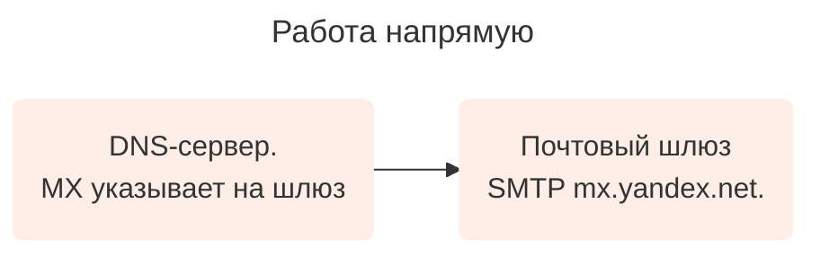
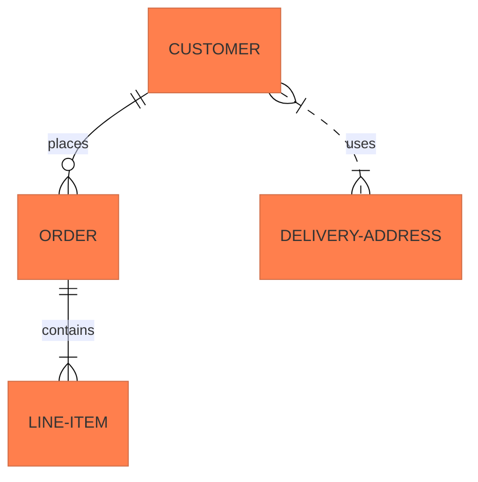
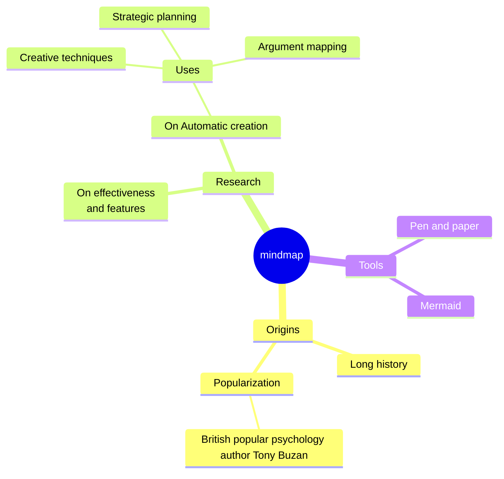
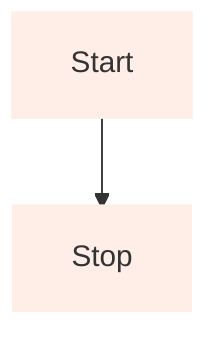

# Mermaid Diagram Customization Guide

## Introduction

Mermaid is a JavaScript-based tool for creating diagrams and charts that uses Markdown-inspired text definitions and a renderer to create and modify complex diagrams.

Within this guide, we have prepared several basic diagrams that may be encountered in documentation.

## Useful links

- [Mermaid Documentation](https://mermaid.js.org/ecosystem/tutorials.html "title")
- [Mermaid Live Editor](https://www.mermaidchart.com/play#pako:eNqrVkrOT0lVslJKyslPztZNSi1JjMlTAIPk_JzS3LxiBUOYgGN0jFJwSWJRSYxSLEwsJb88zwYorgAUs9MA8TRhUs4aIOX5BTFKUKGYPKVaAFC4IAA "title")



This guide primarily describes color customization of diagrams. You can learn about the logic of building diagrams on the Mermaid website.



## Basic conditions

- Mermaid diagrams are only applicable on yfm pages.
- Any insertion starts with ` ```mermaid` and ends with ` ``` `.
- Each diagram is filled in separately.

## Sequence diagram

- [Mermaid Documentation](https://mermaid.js.org/syntax/sequenceDiagram.html "title")
- [Mermaid Live Editor](https://www.mermaidchart.com/play?utm_source=mermaid_live_editor&utm_medium=banner_ad&utm_campaign=visual_editor#pako:eNptzEEKwjAQheGrvGZrc4EuKoIL6xncDPHZBNIEo0Wk9O4mqcvOamC-fxZl4p2qUy8-ZwbDs5MxyXQLyHPyzlD3_eEabehwofcRZW9h4weSiG-cj7t4Y0ZCIbCUhIl_Wm46U12b_NhtdYuhFlXnrNnnAx6kx5go70atPxjSPW8 "title")



- 



### Code block

````

````

Parameters for color customization:
- `'primaryColor'::` — the color value for the diagram "actors" "Alice" and "John" and the lines connecting them. According to the design project, we specify `'#4DA0FF'`.
- `'secondaryColor':` — the color value for the blocks after the arrows. According to the design project, we specify `'#0667D8'`.
- `'noteBkgColor':` — the color value for marking blocks of the "Alice calls John" format. According to the design project, we specify `'#D3DCFD'`.
- `rect rgba(233, 237, 254, 1)` — the color value for the diagram background. The action is limited to the second `end`.
- `rect rgba(77, 160, 255, 1)` — the color value for the dark blue block in the middle of the diagram. The action is limited to the first `end`.

## Flowchart

- [Mermaid Documentation](https://mermaid.js.org/syntax/flowchart.html "title")
- [Mermaid Live Editor](https://www.mermaidchart.com/play?utm_source=mermaid_live_editor&utm_medium=banner_ad&utm_campaign=visual_editor#pako:eNqrVkrOT0lVslJKy8kvT85ILCpR8AmKyVMAAkcFXd18BScIxwnIqVBwjslTqgUAkRUOXw "title")







### Code block

````

````

Parameters for color customization:
For each "set" of colors, you need to specify parameters in the line

```
%% Styling
classDef orange fill:#FEEEE7,stroke:#FEEEE7,stroke-width:2px;
```

Where:

- `orange` — the text value for the color set that we define. The value can be anything.
- `fill:` — the color value for blocks with text. According to the design project, we specify `#FEEEE7`.
- `stroke:` — the color value for the block borders. According to the design project, we specify `#FEEEE7`.
- `stroke-width:` — the border width. According to the design project, we specify `2px`.

To assign the values of a color "set" to a specific element, specify the name of that "set". For example
`A("DNS-сервер. MX указывает на шлюз"):::orange`, where `:::orange` is the name of the color "set". 

## Entity Relationship Diagram

- [Mermaid Documentation](https://mermaid.js.org/syntax/entityRelationshipDiagram.html "title")
- [Mermaid Live Editor](https://www.mermaidchart.com/play?utm_source=mermaid_live_editor&utm_medium=banner_ad&utm_campaign=visual_editor#pako:eNp1z90KwiAYgOFbEc_tAnYWU0KoDGeDwU7MfZWwZljtZO7esx_pjzzz4_FVB2xcAzjD4KnVO68PdYfiyteFEgsm0RgmkzAgyua8ZLIiU0olKwqUob0-fdkQCHEDEpLGTYaOrTbwx_BlKXjOoqpxa_WmBbR1vsYP_XPbV9mDAdundmrdUHgh43rwT_KYvQPCFVtEZTvTXpqUWklB17ki-VSxmZBVOvKc36vdWdvu03-8L5Vr7HwDHpp4x-1jeLwCmiBtBQ "title")
- Template link - TBD






### Code block

````

````

Parameters for color customization:

- `'primaryColor':` — the color value for the main blocks with text. According to the design project, we specify `'#FF7F4D'`.
- `'tertiaryColor':` — the color value for secondary blocks with text located on the arrows. In accordance with the design project, we specify `'#D3DCFD'`.

## Mindmaps

- [Mermaid Documentation](https://mermaid.js.org/syntax/flowchart.html "title")
- [Mermaid Live Editor](https://www.mermaidchart.com/play?utm_source=mermaid_live_editor&utm_medium=banner_ad&utm_campaign=visual_editor#pako:eNpdkMFOw0AMRH_Fyik5IO4VQmq5glqVcuvF3Tgbi8RevLuVUsS_k5KmQH3zm_Fo5M_CaU3FouhZ6h7DXgBMNZXlBVTVGQGsjT1LnBaAZxUPLcekNsxssWCnUjYIDd4dVN-rWdloyB0anzCxykwBVsaJYwth0iHEwbXaqR8Ac2rVYKcywCqf8HK1pUhorp0z1gLUNOQSH0koxoeD3T-i1NAQpmwU_xiXOWk_NnDgjG6avMVf6zRPP54jQSLXCn_kW8NrMkzkx7jQoQiL_68vzeeeJMH4xXBVd6rdNWhDAueyAQPZDF_IeuR6L8XXN7kLgpw "title")






### Code block

````

````



Color customization of Mindmaps is done through custom CSS styles.



## Block Diagram

- [Mermaid Documentation](https://mermaid.js.org/syntax/block.html "title")
- [Mermaid Live Editor](https://www.mermaidchart.com/play?utm_source=mermaid_live_editor&utm_medium=banner_ad&utm_campaign=visual_editor#pako:eNqrVkrOT0lVslJKyslPztZNSi1JjMlTAIPk_JzS3LxiBUOYgGN0jFJwSWJRSYxSLEwsJb88zwYorgAUs9MA8TRhUs4aIOX5BTFKUKGYPKVaAFC4IAA "title")







### Code block

````

````

Color values in this diagram are set for each individual block using a string of the form:
- `style A` — the name of the block to be recolored.
- `fill:` — the color value for the block. In accordance with the design project, we specify `#FEEEE7`.
- `stroke:` — the color value for the block border.
- `stroke-width:` — the border width value. By default, we specify `4px`.



Currently, Diplodoc supports diagrams of the "graph TD" type. If you specify "block-beta", as indicated in the documentation, the diagram will not be built.


