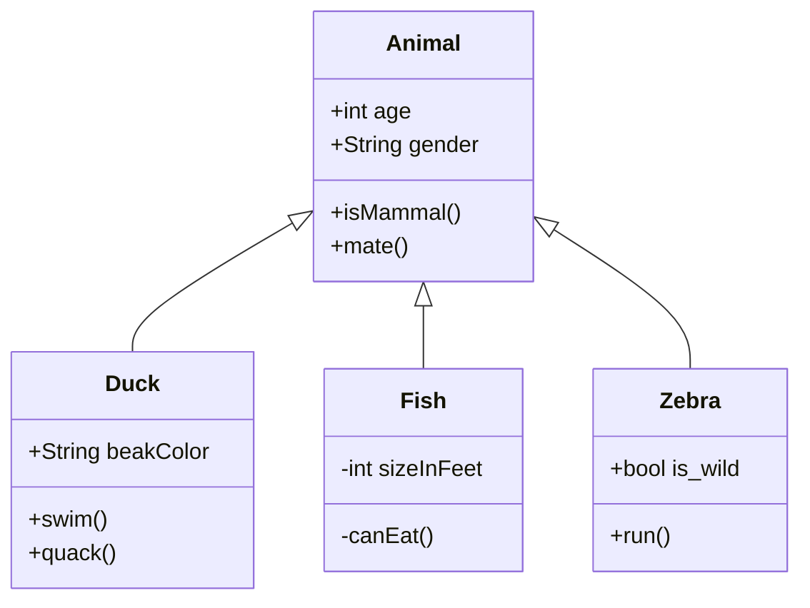
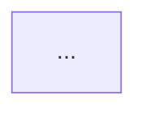

# Mermaid

Mermaid is a library for creating diagrams and flowcharts using a markup language similar to Markdown. All supported diagram types are listed [in the official documentation](https://mermaid.js.org/intro/#diagram-types).

Learn more:

- [Mermaid syntax](https://mermaid.js.org/intro/syntax-reference.html)
- [Mermaid Live Editor](https://mermaid.live)

## Example {#example}

Syntax:

````
```mermaid

...описание диаграммы...

```
````

Markup:

```
classDiagram
    Animal <|-- Duck
    Animal <|-- Fish
    Animal <|-- Zebra
    Animal : +int age
    Animal : +String gender
    Animal: +isMammal()
    Animal: +mate()
    class Duck{
      +String beakColor
      +swim()
      +quack()
    }
    class Fish{
      -int sizeInFeet
      -canEat()
    }
    class Zebra{
      +bool is_wild
      +run()
    }
```

Result:



## ELK layout {#elk-layout}

In addition to the standard `dagre` layout, the [ELK](https://eclipse.dev/elk/) layout algorithm from Eclipse Layout Kernel is supported. ELK handles large and complex graphs better: it minimizes edge crossings, positions nodes more neatly, and supports additional placement options. It applies to diagram types `flowchart` and `stateDiagram`.

The layout is set via the `%%{init}%%` directive at the beginning of the diagram block.



- Flowchart

  Markup:

  ````
  ```mermaid
  %%{
    init: {
      'layout': 'elk'
    }
  }%%
  flowchart LR
      A[Начало] --> B{Условие}
      B -->|Да| C[Шаг 1]
      B -->|Нет| D[Шаг 2]
      C --> E[Конец]
      D --> E
  ```
  ````

  Result:

  ```mermaid
  %%{
    init: {
      'layout': 'elk'
    }
  }%%
  flowchart LR
      A[Начало] --> B{Условие}
      B -->|Да| C[Шаг 1]
      B -->|Нет| D[Шаг 2]
      C --> E[Конец]
      D --> E
  ```

- StateDiagram

  Markup:

  ````
  ```mermaid
  %%{
    init: {
      'layout': 'elk'
    }
  }%%
  stateDiagram-v2
      [*] --> Ожидание
      Ожидание --> Обработка: старт
      Обработка --> Успех: ok
      Обработка --> Ошибка: fail
      Успех --> [*]
      Ошибка --> Ожидание: retry
  ```
  ````

  Result:

  ```mermaid
  %%{
    init: {
      'layout': 'elk'
    }
  }%%
  stateDiagram-v2
      [*] --> Ожидание
      Ожидание --> Обработка: старт
      Обработка --> Успех: ok
      Обработка --> Ошибка: fail
      Успех --> [*]
      Ошибка --> Ожидание: retry
  ```



### ELK parameters {#elk-options}

Additional parameters are set in the `elk` field inside `init`:

````

````

Available parameters:

- `mergeEdges` — merge parallel edges between the same pair of nodes into a common segment. Values: `true`, `false` (default).
- `nodePlacementStrategy` — strategy for placing nodes within a layer. Values:
  - `BRANDES_KOEPF` (default) — balanced placement with minimization of edge bends;
  - `NETWORK_SIMPLEX` — optimization of total edge length;
  - `LINEAR_SEGMENTS` — alignment of nodes along straight segments;
  - `SIMPLE` — simple placement centered in the layer.
- `cycleBreakingStrategy` — strategy for breaking cycles in the graph. Values:
  - `GREEDY` (default) — greedy algorithm based on heuristics;
  - `DEPTH_FIRST` — depth-first traversal;
  - `INTERACTIVE` — preserve edge direction from the original description;
  - `MODEL_ORDER` — according to the order of declaration in the diagram.
- `considerModelOrder` — take into account the order of node declaration when minimizing crossings. Values: `NONE` (default), `NODES_AND_EDGES`, `PREFER_EDGES`, `PREFER_NODES`.
- `forceNodeModelOrder` — forcibly preserve the order of nodes from the original description. Values: `true`, `false` (default).

The full list of parameters is available in the [Mermaid documentation](https://mermaid.js.org/config/schema-docs/config-properties-elk.html).
