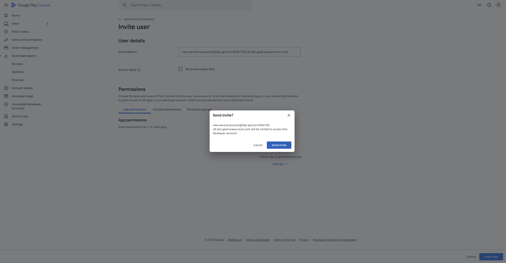

# Google Play in-app subscriptions

<!-- 

This feature is discontinued and will no longer receive updates. Data accuracy not guaranteed.

AppMetrica provides an [alternative tracking technology](https://appmetrica.yandex.com/docs/en/data-collection/apphud/apphud-about) available in certain regions.

 -->

To track subscription status updates on Google Play, create and upload a service account JSON file to AppMetica. The steps for creating a service account are described in detail below.

## Creating a service account {#create-service-account}

1. Open an existing Google Cloud project or create a new one in [Google Cloud Resource Manager](https://console.cloud.google.com/cloud-resource-manager).

   

   {style="border: solid 1px #cccccc; max-width: 800px;"}

   

1. Search for the **Service accounts** menu and open it.

   

   {style="border: solid 1px #cccccc; max-width: 800px;"}

   

1. On the page that opens, click **+ CREATE SERVICE ACCOUNT** at the top of the screen.

   

   {style="border: solid 1px #cccccc; max-width: 800px;"}

   

1. Enter a name for the account, such as "AppMetrica", and click **CREATE**.

   

   {style="border: solid 1px #cccccc; max-width: 800px;"}

   

1. Select the **Editor** role for this account (you can find it via Basic — Editor).

   

   {style="border: solid 1px #cccccc; max-width: 800px;"}

   

1. Create a new private key for the account. To do this, click  in the **Actions** section to the right of the service account and select **Manage keys**.

   

   {style="border: solid 1px #cccccc; max-width: 800px;"}

   

1. Next, click **ADD KEY — Create new key** on the key management page that opens. Select the **JSON** key type and click **CREATE**.

   

   {style="border: solid 1px #cccccc; max-width: 800px;"}

   {style="border: solid 1px #cccccc; max-width: 800px;"}

   

1. Grant the service account access to the app's financial data so that AppMetrica can validate and check the status of Google Play subscriptions.

   Go to the [Users and permissions](https://play.google.com/console/users-and-permissions?hl=en) page in the Google Play console.

1. Click **Invite new users**.

   

   {style="border: solid 1px #cccccc; max-width: 800px;"}

   

1. In the email address field, enter the email address linked to your service account:

   

   {style="border: solid 1px #cccccc; max-width: 800px;"}

   

1. On the same page, go to the **Account permissions** tab and select the following options:
   - View app information and download bulk reports (read-only).
   - View financial data, orders, and cancellation survey responses.
   - Manage orders and subscriptions.

   {style="border: solid 1px #cccccc; max-width: 800px;"}

1. Go back to the **App permissions** tab and select the app you're setting up tracking for (**Add app**). Click **Invite user**, then in the **Send Invite** pop-up window:

   {style="border: solid 1px #cccccc; max-width: 800px;"}

1. Open AppMetrica, go to your app's settings, and select the **Revenue** section.

1. In AppMetrica, go to **Settings** → **Revenue** → **Tracking and validating Google Play subscriptions** and upload the service account's JSON file.

   

   {style="border: solid 1px #cccccc; max-width: 800px;"}

   

## Topic for tracking subscriptions {#topic}

You can also track subscription statuses using the Google Cloud Console topic. AppMetrica has three options for working with the topic to choose from:

1. A new topic will be created in AppMetrica. If you don't use another subscription tracking service, we recommend choosing this option.

   Copy the topic name in the interface and paste it into **Google Play Console** → **Monetization setup** → **insert the topic in the Topic Name field**.

   

   Make sure that the Cloud Pub/Sub topic exists and you have granted Google the necessary permissions to publish notifications. For more information, see the [documentation](https://developer.android.com/google/play/billing/getting-ready#configure-rtdn).

   

2. Use an existing topic. If you use an additional service to track subscriptions, there should be an existing topic. Google Cloud Console doesn't let you use two topics at the same time. Therefore, you need to copy your current topic and paste it into AppMetrica, the **Settings** section, the **Revenue** subsection.

   To do this, go to **Google Play Console** → **Monetization setup**, copy the topic name from the **Topic name** field, and paste it into the Revenue settings input field in the AppMetrica interface.

3. Don't use a topic. We don't recommend choosing this option, because when no topic is present, AppMetrica will only check subscription statuses once a day and subscription data may be delayed by up to 24 hours. Some of the subscription events will also be unavailable.

## Troubleshooting {#troubleshooting}



The `PERMISSION_DENIED: Cloud Pub/Sub API has not been used in project before or it is disabled` error occurs.

It means the Pub/Sub API isn't enabled for the project. To fix the error, follow the link in the error message (for example, [https://console.developers.google.com/apis/api/pubsub.googleapis.com/overview?project=123456](https://console.developers.google.com/apis/api/pubsub.googleapis.com/overview?project=123456)) and click **Enable** to activate the Pub/Sub API. Next, return to AppMetrica and click **Save and enable tracking** again.

{style="border: solid 1px #cccccc; max-width: 800px;"}



{{ feedback }}

<a href="../troubleshooting/feedback-new.html">
  Contact support
</a>


