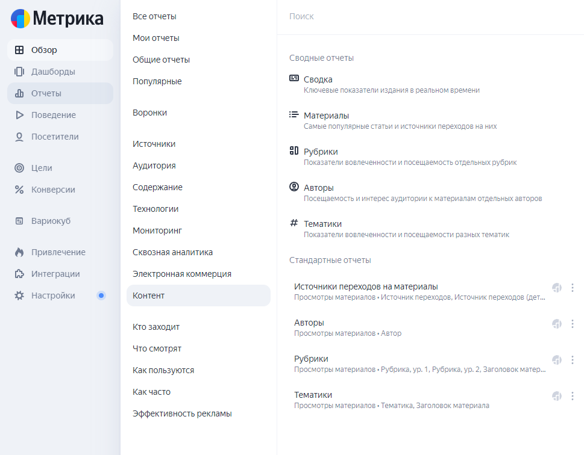
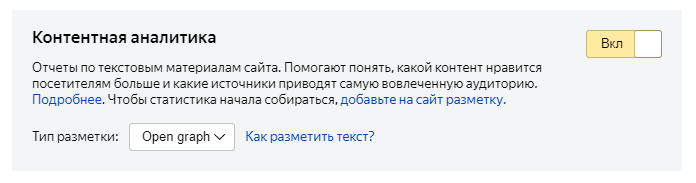
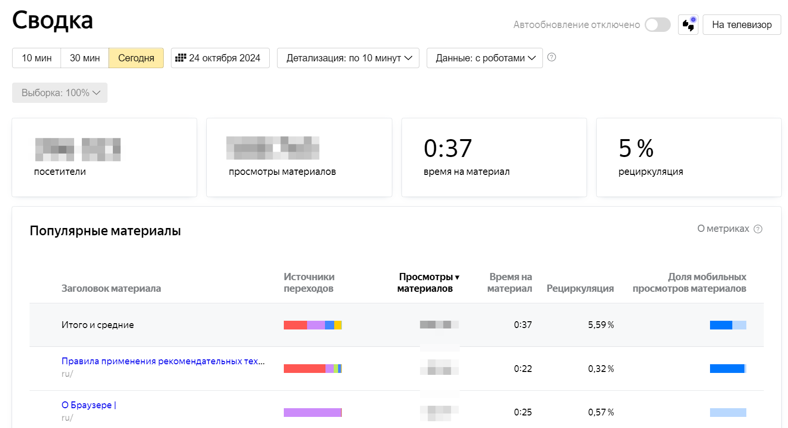
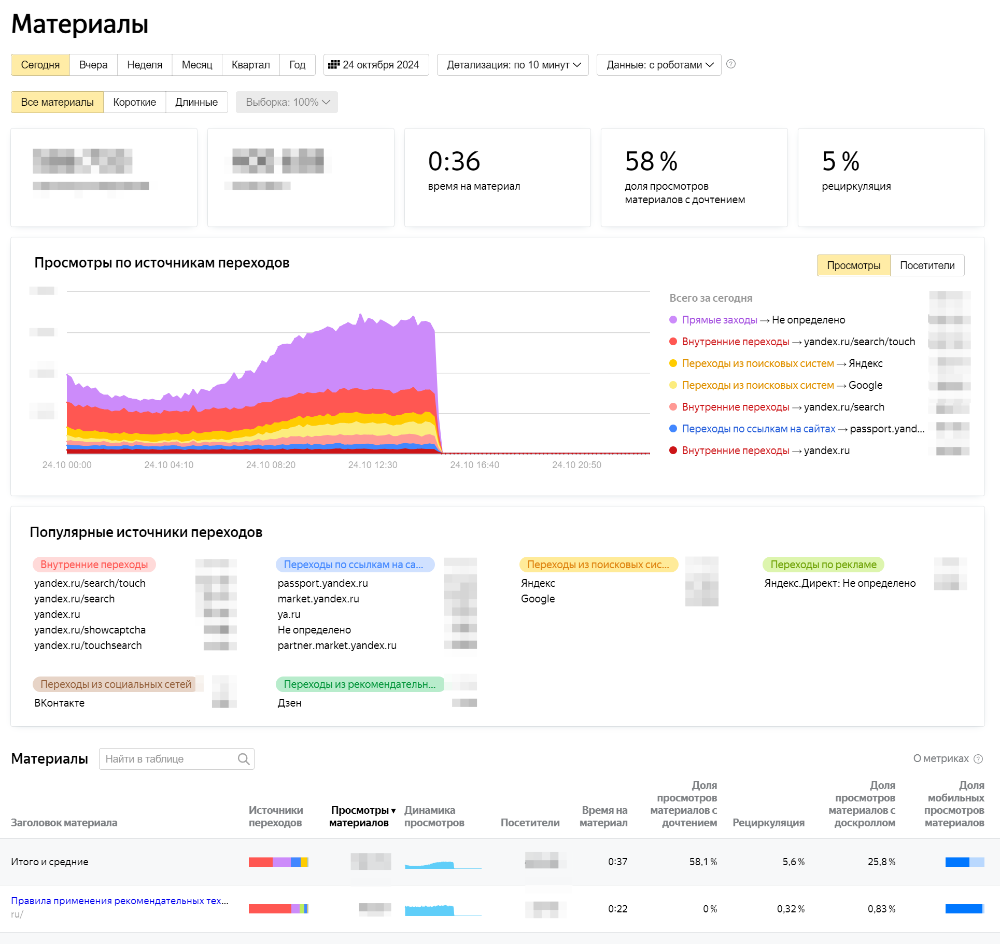
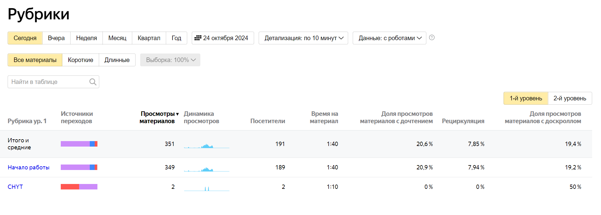
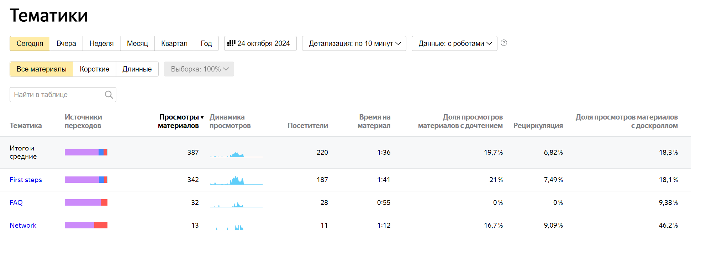
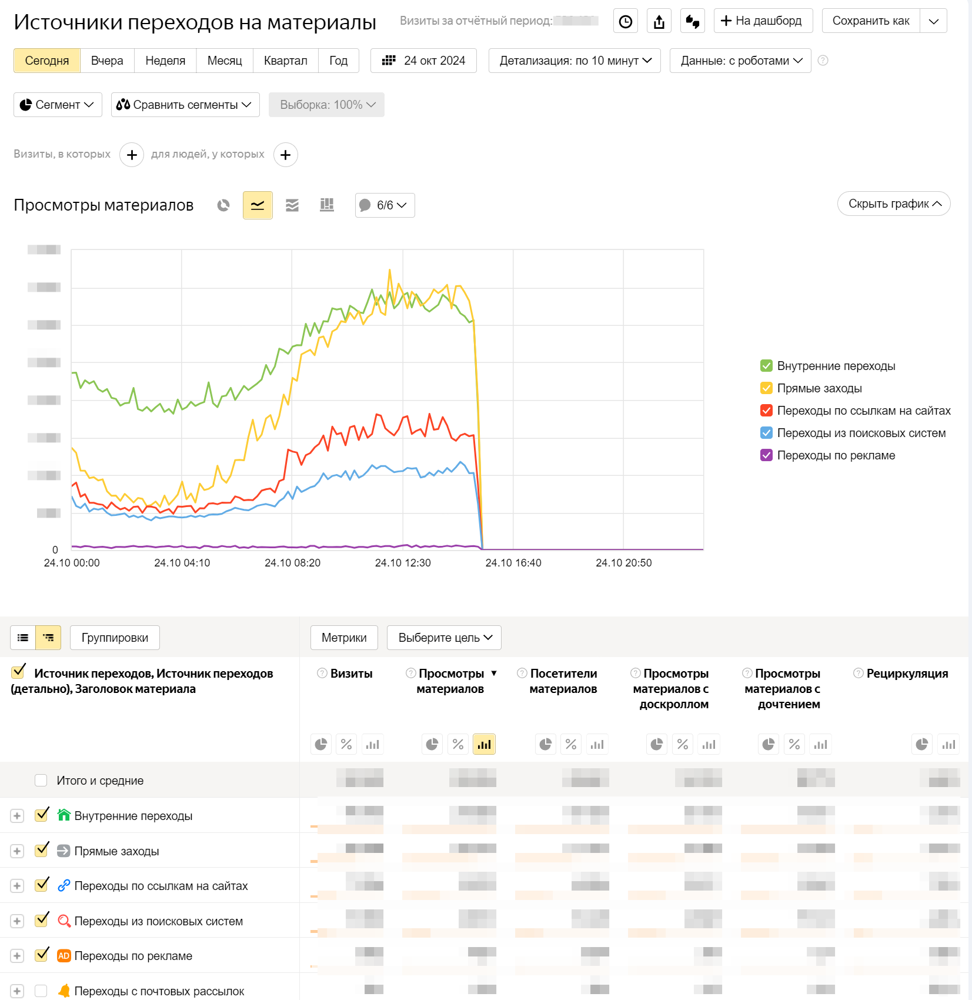
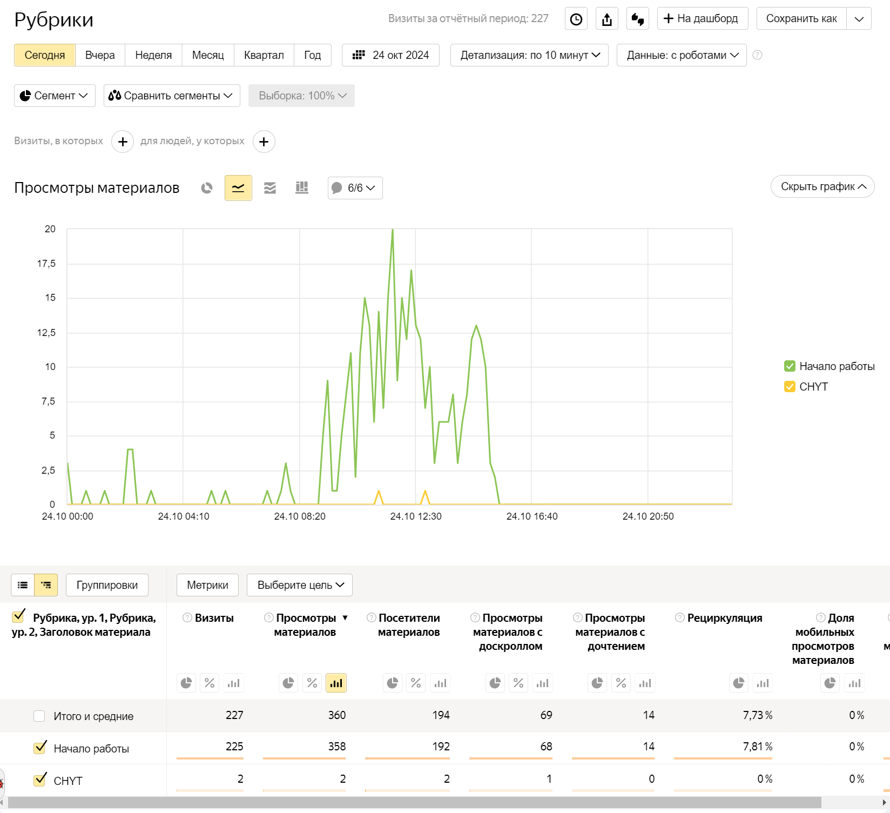
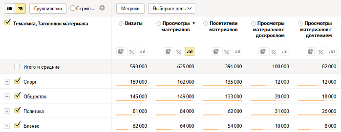
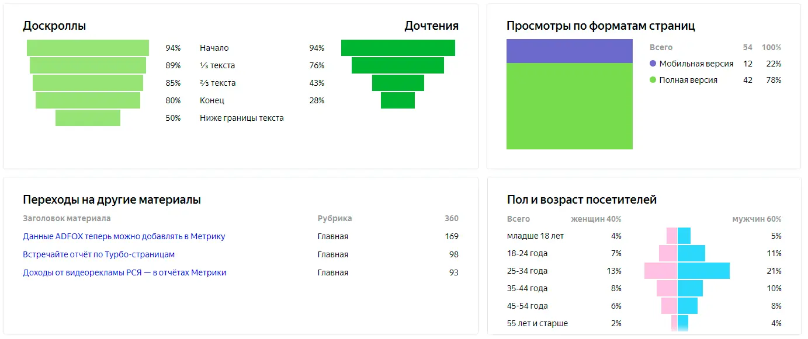

# Content analytics for documentation projects


Technical documentation is part of the product and requires continuous optimization to meet user needs.

Data-driven content analytics helps you understand how users interact with your materials and what improvements are needed. Yandex Metrica allows you to analyze and optimize technical documentation. In this article, we will look at how to integrate Yandex Metrica content analytics into documentation workflows.

## Content reports in Yandex Metrica {#content-reports}

Since [July 1, 2019](https://yandex.ru/adv/news/yandeks-metrika-dlya-media-vstrechayte-otchety-po-kontentu), Metrica has had special [reports](https://yandex.ru/support/metrica/publishers/about.html) for content projects and media publications.

Unlike traffic source or demographic reports, which contain information about users, content reports show how users interact with site materials. This is a useful tool for technical writers and those responsible for creating and optimizing the information content of documentation projects. 







Content reports include: 

- Statistics on materials, sections, authors, and topics.
- Statistics on scroll depth and read-through.
- Time spent reading an article. Mouse movements, clicks, and scrolls within 5 seconds are taken into account. If there is no activity within 5 seconds, the time is not attributed.
- Article view dynamics.
- Share of materials with read-through.
- Percentage of users who navigated to other pages of the site.
- Share of views of materials with scroll depth.
- Engagement metrics and section traffic.
- Most popular articles.
- Traffic sources.
- Overall summary for the documentation project.

## How to organize content analytics in your documentation project {#organize}

### Creating a Metrica counter {#metric-counter}

1. Create a Metrica counter according to the [instructions](https://yandex.ru/support/metrica/general/).
1. In the counter settings, [enable the option](https://yandex.ru/support/metrica/publishers/about.html#about) "Content analytics" and specify the markup type `OpenGraph`:

   

2. Add the counter to the documentation project using the [configuration file `.yfm`](../settings.md#analytics-metrika).
  
   Example:

   ```yaml
   analytics:
     metrika:
       - id: 44444444
   ```

### Adding meta information {#meta-information}

In content reports, data is collected only for marked-up materials. For marking up materials, it is recommended to use the semantic data markup vocabulary [OpenGraph](https://yandex.ru/support/metrica/publishers/open-graph/open-graph.html).
Markup is specified in the [metadata](../project/meta.md) of documentation files with the `md` extension.



OpenGraph allows you to control how pages are displayed in search engines and social media platforms.

OpenGraph data should be placed in the `head` tag of your document.
You can specify the title, description, image, and other parameters that will be displayed when your link is published on social media sites.

More about OpenGraph:

- [The Open Graph protocol](https://ogp.me/)
- [Webmaster. Help](https://yandex.ru/support/webmaster/open-graph/intro-open-graph.html) 



Example of use in a documentation article: {#meta-information-example}

#|
|| **Source code in the file** | **Result in the documentation** ||
||

```yaml
---
metadata:
    - property: 'og:type'
      content: 'article'
    - property: 'og:title'
      content: 'В Москве побит температурный рекорд 1922 года'
    - property: 'og:url'
      content: 'https://www.example-news.com/life/weather/moscow#cao'
    - property: 'article:section'
      content: 'Погода'
    - property: 'article:modified_time'
      content: '2018-12-11T08:56:49Z'
    - property: 'article:published_time'
      content: '2018-11-06T09:26:10+04:00'
    - property: 'article:author'
      content: 'Иван Иванов'
    - property: 'article:author'
      content: 'Петр Петров'
    - property: 'article:tag'
      content: 'Жара'
    - property: 'article:tag'
      content: 'Москва'
---
```

|

```html
<meta property="og:type" content="article"/>
<meta property="og:title" content="Temperature record of 1922 broken in Moscow"/>
<meta property="og:url" content="https://www.example-news.com/life/weather/moscow#cao"/>
<meta property="article:section" content="Weather">
<meta property="article:modified_time" content="2018-12-11T08:56:49Z">
<meta property="article:published_time" content="2018-11-06T09:26:10+04:00">   
<meta property="article:author" content="Ivan Ivanov">
<meta property="article:author" content="Petr Petrov">
<meta property="article:tag" content="Heat">
<meta property="article:tag" content="Moscow">
```

||
|#



Documentation articles can be marked up with the [following elements](https://yandex.ru/support/metrica/publishers/open-graph/open-graph.html#open-graph__material):

#|
|| **Element** | **Comment** ||
|| Type of the described object[*](*parametr) | Metrika only supports marking up objects of the [article](https://ogp.me/#type_article) type. Other objects marked up according to the [Open Graph](https://ogp.me/#type_article) standard will not appear in Metrika reports. The object type is specified in the `og:type` property.

```html
<meta property="og:type" content="article">
```

||
|| Title[*](*parametr) | The title is displayed in Metrika reports. It is specified in the `og:title` property.

```html
<meta property="og:title" content="Temperature record of 1922 broken in Moscow">
```

||
|| Text[*](*parametr) | The content of the node that contains the described material is used as the text. If the markup is in the `head` tag, the text will be the entire content of the `body` tag. Tag characters are not taken into account. The number of characters is determined in the text — this is needed to calculate the volume of the material and the scroll depth and read-through metrics.



Full statistics can be obtained for material with more than 500 characters in its text.


||
|| Author | The author is specified using the `article:author` property. If there are multiple authors, list them in separate meta tags.

```html
<meta property="article:author" content="Ivan Ivanov">
<meta property="article:author" content="Petr Petrov">
```

Thanks to this data, you can view statistics for individual authors. ||
|| Topics | As topics, you can specify, for example, keywords or hashtags. Specify topics in the `article:tag` property. If there are multiple topics, list them in separate meta tags.

```html
<meta property="article:tag" content="Heat">
<meta property="article:tag" content="Moscow">
```

||
|| Publication and modification dates | Publication and modification dates are specified in the `article:published_time` and `article:modified_time` properties. Dates are written in the [ISO 8601](https://www.iso.org/standard/40874.html) format.

```html
<meta property="article:modified_time" content="2018-12-11T08:56:49Z">
<meta property="article:published_time" content="2018-11-06T09:26:10+04:00">
```

||
|| Section | A section is a part of the site dedicated to a specific topic. To specify the section of the material, use the `article:section` property.

```html
<meta property="article:section" content="Weather">
```

||
|| Material URL | The material URL must be contained in the `og:url` property.

```html
<meta property="og:url" content="https://www.example-news.com/life/weather/moscow"/>
```

Otherwise, the value will be taken from the canonical link.

```html
<link rel="canonical" href="https://www.example-news.com/life/weather/moscow">
```

If the markup is correct and the counter is properly connected, statistics for the material will start being collected in Metrica after some time. ||
|#

\* Required element



## Using content analytics reports {#use}

### Summary reports {#summary-reports}

#|
|| **Report** | **Description** ||
|| Summary
|
The report provides brief statistics on content for a selected day or period. Statistics include data on views and user interactions with documentation materials.
In the summary, you can:

- understand how active the audience is;
- find out which materials are most popular and get a brief summary of them;
- find out where visitors come from to your materials.

If you enable auto-refresh, statistics will update every 60 seconds.

[Details](https://yandex.ru/support/metrica/publishers/reports/overview.html)
||
||





| > ||
|| Materials
|
The report helps compare materials with each other, track view dynamics, highlight the most interesting posts (they will have a high read-through rate), and decide in which direction to continue working with content.
Understand how interesting the information is to readers, who and at what age searches for data, from which devices they read most often, and which format to adapt the material for.

[Details](https://yandex.ru/support/metrica/publishers/reports/material.html)
||
||





| > ||
|| Sections
|
The sections report allows you to get overall statistics and compare sections with each other. View and audience engagement metrics allow you to determine the effectiveness of a section and understand whether it is worth paying attention to or whether it should be abandoned.



When implementing the markup, keep in mind that the number of sections is currently limited to two levels of nesting, and this must be taken into account during implementation.



For documentation projects, it is proposed to use documentation sections — first-level menu items — as sections.

[Details](https://yandex.ru/support/metrica/publishers/reports/rubric.html)
||
||





| > ||
|| Authors
|
The report allows you to get overall statistics on authors and compare an author's results with the rest of the editorial team.
If documentation is written by several different authors, such data will help determine which writer attracts users the most and continue working with them. Or understand what exactly attracts the audience to an author and help other authors attract users, boosting their own traffic.

[Details](https://yandex.ru/support/metrica/publishers/reports/author.html)
||
|| Topics
|
The report allows you to collect overall statistics on topics that reflect the content of an article. Including:

- Find out which topics are interesting to readers and which are not.
- See who reads materials on a selected topic and how.

Unlike sections, the number of topics for a material is not limited.

[Details](https://yandex.ru/support/metrica/publishers/reports/topic.html)
||
||





| > ||
|#

### Standard reports {#standard-reports}

#|
|| **Report** | **Description** ||
|| Traffic sources for materials
|
The report allows you to collect overall statistics on topics that reflect the content of an article. Unlike sections, the number of topics for a material is not limited.
||
||





| > ||
|| Sections
|
The report contains overall statistics on the sections and materials of your documentation.
||
||





| > ||
|| Authors
|
The report contains statistics on material authors.
||
|| Topics
|
The report contains statistics on material topics.
||
||





| > ||
|| Material page
|
In the report for a specific material, you can study in detail how visitors progressed through the text.
The scroll funnel shows how far users typically scroll through a material; the closer the funnel is to a rectangle, the more visitors scroll the article to the end.
The read-through funnel shows whether the user manages to read the text; it also takes into account the time spent interacting with the content.
The report helps understand how the article's audience is distributed by gender and age, and how much traffic comes from different formats: desktop, mobile, and Turbo version.
||
||





| > ||
|#

## Conclusion {#end}

Integrating content analytics using Yandex Metrica into technical documentation helps better understand user needs and adapt content in line with their expectations.

A data-driven approach allows not only improving the quality of documentation but also ensuring better user interaction with your product by providing information in the right form and at the right moment.

The recommendations provided will help increase the value of your documentation and make it a useful tool for users.

**See also**

- [Content reports](https://yandex.ru/support/metrica/publishers/reports/main.html) (documentation)
- [Checking content analytics data transfer](https://yandex.ru/support/metrica/publishers/check-data.html)

[*parametr]: Required element.
