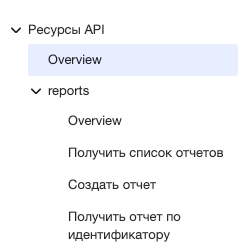
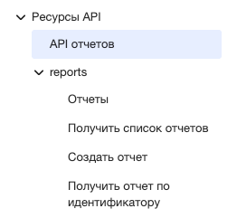

# Generating from an OpenAPI specification

You can generate a document from an [OpenAPI specification](https://www.openapis.org/) and include it in the main document.



The OpenAPI includer requires permission to use HTML in the documentation, so you must specify the value `allowHtml: true` in the configuration file `.yfm`.



## Requirements for the OpenAPI specification {#requirements}

- The version of the specification used must be no lower than 3.x.
- Only the operators `oneOf` and `allOf` are allowed.
- No restrictions are imposed on the use of basic functionality.

## Usage example {#example}

Connect the specification to a documentation project located in the `doc_root` directory:

1. Place the OpenAPI specification at `doc_root/ru/ref/api.yaml`.

1. Include it in the table of contents `doc_root/toc.yaml` using the [OpenAPI includer](includers.md):

    ```yaml
    # doc_root/toc.yaml
    title: documentation
    href: index.yaml
    items:
      - name: Ресурсы API
        include:
          path: ref
          includers:
            - name: openapi
              input: ru/ref/api.yaml
          mode: link
    ```

    

    The path to the OpenAPI specification file in the `input` parameter is specified relative to the root of the documentation project.

    

1. Connect the landing page in `doc_root/index.yaml`:

    ```yaml
    # doc_root/index.yaml
    title: documentation
    links:
      - title: Ресурсы API
        href: ref/
    ```

After the build, endpoint descriptions will be organized into sections — one for each tag in the specification. Each section will have an Overview page.

## Display settings {#customization}

The parameters `tags`, `leadingPage`, and `sandbox` allow you to change the appearance of the documentation. To do this, specify them inside the includer object — at the same level as `name: openapi` and `input`:

```yaml
# doc_root/toc.yaml
items:
  - name: Ресурсы API
    include:
      path: ref
      includers:
        - name: openapi
          input: ru/ref/api.yaml
          tags:              # настройка отдельных разделов-тегов
            __root__:
              name: API отчетов
          leadingPage:       # настройка всех оглавлений сразу
            spec:
              renderMode: hidden
          sandbox:           # таб с песочницей
            tabName: Песочница
            host: 'https://api.example.com/v1'
      mode: link
```

### tags {#tags}

Allows you to change the names of table of contents sections individually. The keys inside `tags` are the tag names from the OpenAPI specification. The special key `__root__` configures the top-level table of contents.

Syntax:

```yaml
# doc_root/toc.yaml
items:
  - name: Ресурсы API
    include:
      path: ref
      includers:
        - name: openapi
          input: ru/ref/api.yaml
          tags:
            __root__:
              name: API отчетов
            reports:
              name: Отчеты
              path: reports-intro.md
            'Регистрация пользователя':
              alias: registration
            internal:
              hidden: true
      mode: link
```

Each tag has parameters:

- `name` — changes the name of the table of contents displayed on the site.

- `path` — sets custom content for the tag's table of contents (Overview) page. During the build, the contents of the specified file are copied to this page instead of the auto-generated content. The link in the navigation points to the table of contents page, not to the source file.

    File requirements:

    - A regular MD file (YFM). There is no need to add it as a separate item in `toc.yaml`.
    - The path to the file is specified relative to the OpenAPI specification file, not relative to the project root. If the file is not found at the specified path, the build will fail with an error.
    - The build does not transform relative links or image paths inside the file. Specify them relative to the table of contents page (`<path-from-include.path>/<tag>/index.md`), not relative to the source file.

- `alias` — changes the path to the section in the URL. Tags in Russian are transliterated by default: for example, the tag `Регистрация пользователя` will get a link like `doc.com/ref/Registraciya-polzovatelya/`. If you specify `alias: registration`, the link will look like `doc.com/ref/registration/`.

- ``hidden` — hides the tag's table of contents from navigation.

Result:

#|
||
Before configuration, the top-level section is called "Overview":

{style="border: solid 1px #cccccc;"}{width=240px}
|
After configuring `tags.__root__.name: API отчетов`:

{style="border: solid 1px #cccccc;"}{width=240px}
||
|#

### leadingPage {#leadingpage}

Unlike `tags`, it allows you to configure all table of contents sections at once.

Syntax:

```yaml
# doc_root/toc.yaml
items:
  - name: Ресурсы API
    include:
      path: ref
      includers:
        - name: openapi
          input: ru/ref/api.yaml
          leadingPage:
            name: Обзор
            spec:
              renderMode: hidden
      mode: link
```

Parameters:

- ``name` — changes the name of all table of contents.

- ``spec.renderMode` — determines whether the OpenAPI specification should be displayed on the table of contents page:

    - ``inline` — the specification is displayed directly on the page (default value). If the size of the specification's json schema exceeds the value of [##maxOpenapiIncludeSize##](../settings.md#max-openapi-include-size) (100 KB by default), the mode automatically switches to `link`;
    - ``link` — instead of the specification, a link to the json schema file is inserted on the page;
    - ``hidden` — the specification is hidden, only links to sections remain on the page.

### sandbox {#sandbox}

Adds a tab with a form to endpoint pages, through which you can send requests to the API directly from the documentation.

Syntax:

```yaml
# doc_root/toc.yaml
items:
  - name: Ресурсы API
    include:
      path: ref
      includers:
        - name: openapi
          input: ru/ref/api.yaml
          sandbox:
            tabName: Песочница
            host: 'https://api.example.com/v1'
      mode: link
```

Parameters:

- ``tabName` — the name of the tab on the endpoint page.

- ``host` — the address of the server to which the sandbox will send requests.

Result:

{style="border: solid 1px #cccccc;"}{width=700px}

## Hiding fields

To hide operation parameters or object fields, add `x-hidden: true` to their description:

```yaml
# api.yaml
x-hidden: true
```

Example:

```yaml
- name: example
    required: false
    schema:
      type: string
      description: "Пример"
    x-hidden: true
```

## Hiding descriptions

There are 3 types of filtering:

* ``filter`;
* ``nobuild`;
* ``noindex`.

They have a common filtering interface:

```yaml
# doc_root/toc.yaml
filter:
    endpoint: tags contains "nobuild" != true
    tag: name == "noindex"
```

The `endpoint` field allows you to mark an endpoint with a specific property (depending on the selected filtering mode), similar to how the `tag` field marks tags.

### `filter`

Allows you to specify a condition that determines whether an endpoint should be added to the build.

#### Syntax

```yaml
# doc_root/toc.yaml
filter:
    endpoint: tags contains "nobuild" != true
```

#### Usage example

It is necessary to prevent unfinished descriptions from being included in the documentation. To achieve this result:

1. Add the `nobuild` tag to each description (you can use any tag, but for simplicity it is customary to add this one).

1. Add a filter for this tag:

    ```yaml
    filter:
        endpoint: tags contains "nobuild" != true
    ```

As a result of the filter, unnecessary pages will not appear in the documentation.

### `noindex`

Allows you to write a condition that determines whether a description will be indexed by search robots.

#### Syntax

```yaml
# doc_root/toc.yaml
noindex:
    tag: name == "noindex"
```

#### Usage example

It is necessary to hide the description from search robots. To achieve this result:

1. Add the `noindex` tag to each description (you can use any tag, but for simplicity it is customary to add this one).

1. Add a filter for this tag:

    ```yaml
    noindex:
        tag: name == "noindex"
    ```
