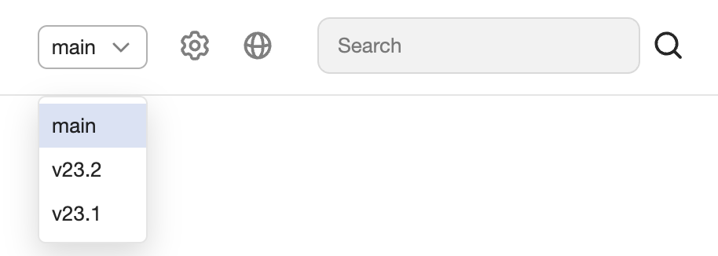

# Setting up documentation versioning



The functionality is available only in the [server version](../about.md) of Diplodoc.



Versioning allows you to manage different documentation sets for different project versions. The feature ensures documentation is published for new versions while retaining access to old documentation.

{width=500}

The functionality is enabled by [adding parameters](https://github.com/diplodoc-platform/docs-release-action?tab=readme-ov-file#release-version) to **Actions** during the release.

## Release with automatic version {#automatic-version}

In the basic scenario, a new version is created with each release. This version automatically becomes the default.

To enable documentation versioning, pass the `version` parameter during the release.



**Basic example: the title and version number will be updated**

```yaml
name: Release tag

on:
  push:
    paths: 'docs/**'
    tags:
      - 'v*.*.*'

jobs:
  <...>
  release:
    needs: upload
    runs-on: ubuntu-latest
    steps:
      - name: Release
        uses: diplodoc-platform/docs-release-action@v2
        with:
          revision: "$not_var{{ github.sha }}"
          version: "$not_var{{ github.ref_name }}"
          storage-bucket: $not_var{{ secrets.DIPLODOC_STORAGE_BUCKET }}
          storage-access-key-id: $not_var{{ secrets.DIPLODOC_ACCESS_KEY_ID }}
          storage-secret-access-key: $not_var{{ secrets.DIPLODOC_SECRET_ACCESS_KEY }}
```



## Setting the default version {#default-version}

During the documentation release, you can specify which version will be considered the default.

1. Add the `Set Default Version` step to your release **Actions**.
1. Specify the value `DEFAULT_VERSION`.
1. In the `Releas` step, add `update-only-version`: `"$not_var{{ env.UPDATE_ONLY_VERSION }}"`.
   

  
```yaml
name: Release tag

on:
  push:
    branches:
      - 'main'
      - 'stable-**'
    paths: 
      - 'docs/**'
  workflow_dispatch:

jobs:
  <...>
  release:
    needs: upload
    runs-on: ubuntu-latest
    concurrency:
      group: release-documentation-$not_var{{ github.ref }}
      cancel-in-progress: true
    steps:
      - name: Extract version
        shell: bash
        run: echo "version=${GITHUB_HEAD_REF:-${GITHUB_REF#refs/heads/}}" | sed -e 's|stable-|v|g' -e 's|-|.|g' >> $GITHUB_OUTPUT
        id: extract_version

      - name: Set Default Version
        id: set-default-version
        shell: bash
        env:
          DEFAULT_VERSION: "main"
        run: |
          BRANCH_NAME=${GITHUB_REF##*/}
          if [[ "$BRANCH_NAME" == "$DEFAULT_VERSION" ]]; then
            echo "UPDATE_ONLY_VERSION=false" >> $GITHUB_ENV
          else
            echo "UPDATE_ONLY_VERSION=true" >> $GITHUB_ENV
          fi

      - name: Release
        uses: diplodoc-platform/docs-release-action@v2
        with:
          revision: "$not_var{{ github.sha }}"
          version: "$not_var{{ steps.extract_version.outputs.version }}"
          storage-bucket: $not_var{{ secrets.DOCS_PROJECT_NAME }}
          storage-access-key-id: $not_var{{ secrets.DOCS_AWS_KEY_ID }}
          storage-secret-access-key: $not_var{{ secrets.DOCS_AWS_SECRET_ACCESS_KEY }}
          update-only-version: "$not_var{{ env.UPDATE_ONLY_VERSION }}"
```

Parameters:

- `version` - documentation version;
- `update-only-version` - parameter for updating only the specified version;
- `DEFAULT_VERSION` - default version value.





`DEFAULT_VERSION` must match across all branches.

For example, if you have releases from the `main` and `stable-24-1-1` branches, make sure the same value is specified in all branches. 

If the `DEFAULT_VERSION` values differ across branches, the default version will change.


