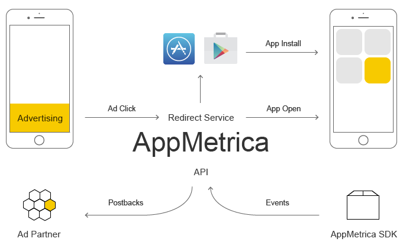

# What is tracking?

The problem of tracking traffic sources is important to any marketing process. Detailed data on the effectiveness of advertising partners is essential for decision-making.

A quality attribution system (attributing a conversion to the media source that attracted the user) is an important part of marketing channel analysis. Analyzing the marketing success of a website is a common task. There are many tools available for web analytics. For example, [Yandex Metrica](https://metrika.yandex.{{domain}}/).

Analyzing performance is more difficult for mobile apps, because the app store stands between the user clicking an ad and installing the app.

AppMetrica allows you to comprehensively analyze the results of mobile app promotion and get real-time data on the main KPIs of your audience:

- Traffic sources.
- Conversions (such as app installs).
- User behavior in the app.
- Numerous project metrics: retention, number of active users, sessions, socio-demographic data, geography, app stability, and others.

## Tracking with AppMetrica {#appmetrica-tracking}

1. The user clicks an ad and goes to the app store via the AppMetrica redirect service.
2. Then the user installs the app and opens it (the first launch is what is considered the install).
3. The AppMetrica SDK integrated with the app informs the server of the installation.
4. AppMetrica uses a unique technology for tracking installs by establishing a link between clicks/impressions and app installs — on both Android and iOS.
5. The advertising partner receives a notification (postback) about the conversion.

AppMetrica lets you track the campaign CPI (cost per install) and CPA (cost per action) and optimize them. Tracking is supported for any type of source: organic clicks, mobile internet ads, app ads, or offline ads with QR codes.



The post-click landing option is no longer supported.



AppMetrica can also help you improve the performance of your advertising campaign using deeplinks and post-click landings.

Since tracking can be flexibly configured, you can use AppMetrica to develop your own unique approach to campaign optimization and create new user scenarios with multiple postbacks and dynamic deeplinks.

## Tracker List {#tracker-list}

You can view the trackers configured in AppMetrica in the **{{ tracking }}** → **{{ tracker-list }}** section.

{style="border: solid 1px #cccccc; max-width: 800px;"}

The link in the **{{ tracker-data }}** column will take you to [tracker editing](add-tracker.md), and the link in the **{{ media-source }}** column will take you to [partner editing](add-partner.md).

To get the [tracking URL](tracking-specification.md) or access the [User Acquisition report](../mobile-reports/user-acquisition-report.md), click the  icon and select the corresponding menu item. 

The list shows the trackers that are active within the selected period. Use the **{{find-tracker }}** button above the list to find the tracker by name or ID.

Using quick filters, you can select trackers by:

- certain media sources;
- created [automatically](auto-create-tracking.md) or manually;
- [remarketing](add-remarketing-tracker.md) or non-remarketing;
- with [FraudScore anti-fraud](../common/fraud-score.md) enabled or disabled (the filter is displayed only if the [option FraudScore](../common/fraud-score.md#setup) is enabled);
- with or without presets (the filter is displayed only if there are trackers with presets in the list).

You can also switch between the list of active and archived trackers.



The tracker is automatically archived if no app installation or deeplink events have been recorded in it for 365 days. 



If you select one or more trackers, a menu of group operations becomes available — moving the filter to the archive/restoring from the archive, enabling/disabling anti-fraud.

{style="border: solid 1px #cccccc; max-width: 800px;"}

## Tracker deactivation {#restrictions}

AppMetrica uses algorithms to detect and block various types of unauthorized tracker activity, such as click spam or click flooding.

Click flooding (click spam) is a type of fraud where attackers use software or other methods to generate large volumes of fake clicks or ad impressions, falsely claiming organic or paid traffic. This means that real users may not even see the ads. As a result, advertisers receive misleading statistics and waste their ad budget.

If your tracker data shows a high volume of clicks or impressions but unusually low conversion rates, especially in terms of app installs, this could be a sign of click flooding. Clicks and impressions for such trackers may not be processed. The tracker is marked with an icon . When you hover the mouse pointer over the icon, an explanation is displayed.

{style="border: solid 1px #cccccc; max-width: 800px;"}

If your tracker has been restricted and deactivated, you need to determine the reason. Discuss with the advertiser how to prevent this from happening again. Stop using the compromised tracker and create a new one instead.



## See also {#learn-more}

- [How combating mobile ad fraud improves ad effectiveness](https://appmetrica.yandex.ru/ru/about/blog/borba-s-frodom-v-mobilnoj-reklame)
- [How to label an app from scratch: A case study of the Pyaterochka app](https://appmetrica.yandex.ru/ru/about/blog/appmetrica-x-pyaterochka)



{{ feedback }}

<a href="../troubleshooting/feedback-new.html">
  Contact support
</a>


