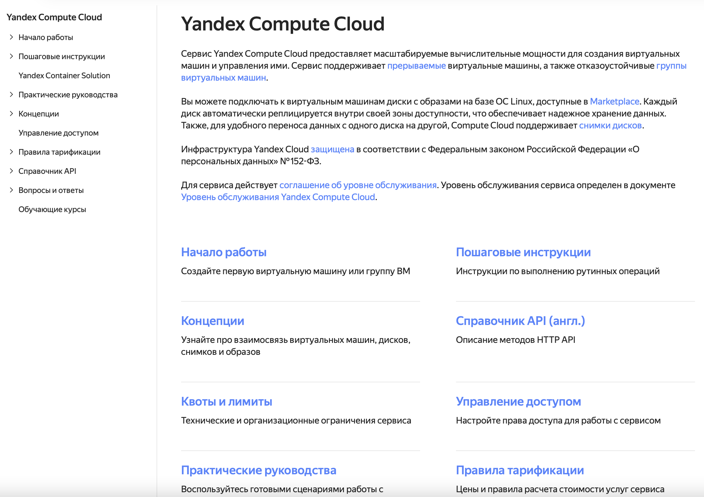

# Landing page

For quick navigation through the document, you can design the page as a grid with links to the main sections.

Example: design of a leading page [for the Yandex Compute Cloud service documentation](https://cloud.yandex.ru/docs/compute/).



## Structure {#structure}

The standard structure of the leading page YAML file is as follows:

```yaml
title: Имя документа
description: Описание документа
meta:
  title: Метаданные
  noIndex: true
links:
- title: Первый раздел
  description: Описание первого раздела
  href: path/to/file
- title: Второй раздел
  description: Описание второго раздела
  href: path/to/file
```
* `title` — document title. It is displayed in the table of contents above the list of all sections.
* `description` — document description.
* `meta` — [metadata](./meta.md).
* `links` — grouping element. For each section within it, the following is specified:
    * `title` — section title. Displayed as the link name.
    * `description` — section description.
    * `href` — relative path to the file without specifying the extension.

Document and section descriptions **do not support** Markdown markup.

## Opening links in a new tab {#target}

By default, all relative links on the leading page open in the current browser tab, while all absolute links open in a new tab. This behavior can be changed using the `target` parameter:

* `_self` — the link will open in the current tab,
* `_blank` — the link will open in a new tab.

```yaml
- title: Абсолютная ссылка
  href: https://github.com
  target: _self
- title: Отдельный раздел в документации
  href: ./some-internal-page/
  target: _blank
```

## Element visibility conditions {#when}

Individual sections can be shown or hidden on the leading page depending on the values of [variables](../syntax/vars.md). The `when` parameter is used to describe visibility conditions.

Available comparison operators: `==`, `!=`, `<`, `>`, `<=`, `>=`.

```yaml
- title: Раздел с условным вхождением
  description: Описание раздела
  href: path/to/conditional/file.md
  when: version == 12
```

## Substitutions and conditional operators {#subtitudes}

The title and description of the document and links support [substitutions](../syntax/vars#subtitudes) and [conditional operators](../syntax/vars#conditions).

```yaml
title: "not_var{{ title }}"
description: "not_var{{ description_legacy }}not_var{{ description }}"
meta:
  title: "not_var{{ meta_title }}"
links:
- title: "not_var{{ link_title }}"
  description: "not_var{{ link_description }}"
  href: path/to/conditional/file.md
```

> See also: [Ajv schema for leading pages](https://raw.githubusercontent.com/diplodoc-platform/ajv/refs/heads/master/src/json/frontmatter-schema.json)
