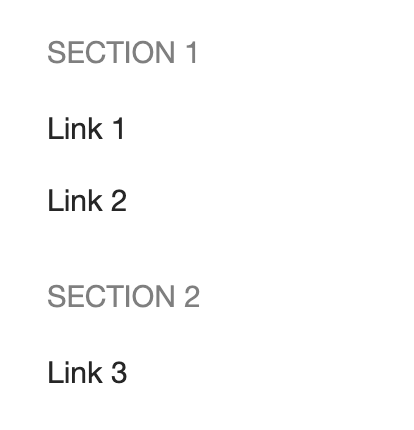
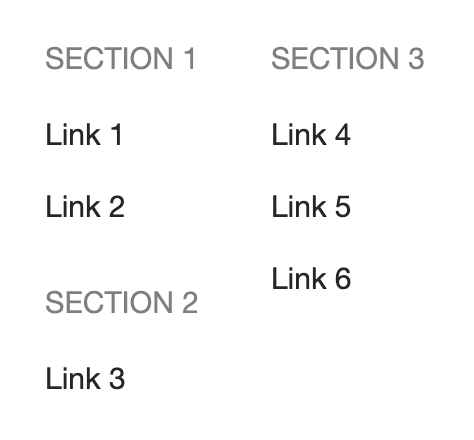
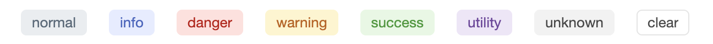

# Extended navigation

The platform supports flexible configuration of the top and bottom navigation (the "header" and "footer") on a page.

For this, the [page-constructor](https://gravity-ui.com/libraries/page-constructor) package is used. In [StoryBook](https://preview.gravity-ui.com/page-constructor/?path=/docs/navigation-navigation--docs), you can find examples of navigation configuration.

## Logo {#logo}

The logo in the top menu is set in `toc.yaml` using the `navigation.logo` parameter:

```yaml
navigation:
  logo:
    url: 'https://diplodoc.com'
    urlTitle : "Текст всплывающей подсказки"
    dark:
      icon: 'https://storage.yandexcloud.net/diplodoc-www-assets/logo/ddos-logo-dark.svg'
      text: 'Diplodoc'
    light:
      icon: 'https://storage.yandexcloud.net/diplodoc-www-assets/navigation/diplodoc-logo.svg'
      text: 'Diplodoc'
```

## Top menu {#header}

The top menu configuration is added to `toc.yaml` as follows:

```yaml
navigation:
  header:
    leftItems:
      - text: 'Relative Link'
        type: 'link'
        url: './ru/settings'
      - text: 'Absolute Link'
        type: 'link'
        url: 'https://diplodoc.com/docs/ru/project/'
    rightItems:
      - text: 'Other Link'
        type: 'link'
        url: 'ru/contribution'
      - type: controls
```

For list items of `leftItems` and `rightItems` of the *first level*, you can use the `when` display conditions and variable substitutions, similar to [table of contents sections](toc.md#when).

### Supported elements {#item-types}

The item type is specified in the `type` property.
The following are available at the first level:

- `dropdown` — a dropdown list; the `items` property can contain items of the following types:
  - `column` — a group of items displayed in a single column;
  - `section` — a group of links combined under a heading specified via the `title` field;
  - `link` — a link;

    

    #|
    ||
    A simple list:
    |>
    ||
    ||

    ```yaml
    - type: dropdown
      text: 'Dropdown'
      items:
        - type: link
          text: 'Link 1'
          url: 'https://diplodoc.com'
        - type: link
          text: 'Link 2'
          url: 'https://diplodoc.com/docs/'
    ```

    |
    ||
    ||
    Several groups of links in one column:
    |>
    ||
    ||

    ```yaml
    - type: dropdown
      text: 'Dropdown'
      items:
        - type: section
          title: 'Section 1'
          items:
            - type: link
              text: Link 1
              url: 'https://diplodoc.com'
            - type: link
              text: Link 2
              url: 'https://diplodoc.com/docs/'
        - type: section
          title: 'Section 2'
          items:
            - type: link
              text: 'Link 3'
              url: 'https://diplodoc.com/docs/'
    ```
    |
    { height=200 }
    ||
    ||
    Groups of links in multiple columns:
    |>
    ||
    ||

    ```yaml wrap
    - type: dropdown
      text: 'Dropdown'
      items:
        - type: column
          items:
          - type: section
            title: 'Section 1'
            items:
              - type: link
                text: 'Link 1'
                url: 'https://diplodoc.com'
              - type: link
                text: 'Link 2'
                url: 'https://diplodoc.com/docs/'
          - type: section
            title: 'Section 2'
            items:
              - type: link
                text: 'Link 3'
                url: 'https://diplodoc.com/docs/'
        - type: column
          items:
          - type: section
            title: 'Section 3'
            items:
              - type: link
                text: 'Link 4'
                url: 'https://diplodoc.com/docs/ru/dev/'
              - type: link
                text: 'Link 5'
                url: 'https://diplodoc.com/docs/ru/quickstart/'
              - type: link
                text: 'Link 6'
                url: 'https://diplodoc.com/docs/ru/project/'
    ```

    |

    { height=200 }
    ||
    |#

    

- `label` — static text; the `theme` property defines the block style:

  { width=600 }

  

    ```yaml
    - type: label
      theme: normal
      text: normal

    - type: label
      theme: info
      text: info

    - type: label
      theme: danger
      text: danger

    - type: label
      theme: warning
      text: warning

    - type: label
      theme: success
      text: success

    - type: label
      theme: utility
      text: utility

    - type: label
      theme: unknown
      text: unknown

    - type: label
      theme: clear
      text: clear
    ```

    

- `search` — a placement point for the search field in the navigation.
  If not specified manually, it is automatically added as the last item in `rightItems`.

- `controls` — a placement point for settings in the navigation.
  If not specified manually, it is automatically added as the last item in `rightItems`.

At the first level, in dropdown lists, groups of elements, and links, the following element is available:

- `link` — a link; the `url` property contains the link text, `target: _blank` enables opening the link in a new tab; relative links are always calculated from the project root, regardless of the level at which ##toc.yaml## is located.

## Bottom menu {#footer}

The bottom menu configuration is added to `toc.yaml` as follows:

```yaml
navigation:
  footer:
    copyright: 'Diplodoc'
    withDivider: true
    menuItems:
      - text: "GitHub"
        url: "https://github.com/diplodoc-platform"
      - text: "Для разработчиков"
        url: "https://diplodoc.com/docs/ru/dev/"
        target: '_self' # по умолчанию _blank
```

Main parameters:
- `copyright` (string) — the copyright text to display,
- `menuItems` — a list of links, where each link is described by the following fields:
  - `text` — the title,
  - `url` — the link,
  - `target` (optional parameter) — to open the link in the same browser tab, you can specify the value `_self` in this field.

The full list of supported parameters can be found on the [Footer component page on the Gravity UI website](https://gravity-ui.com/ru/components/navigation/footer).

> See also: [Ajv schema of toc.yaml table of contents files](https://raw.githubusercontent.com/diplodoc-platform/ajv/refs/heads/master/src/json/toc-schema.json)