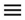

# Error descriptions







The following sections describe common errors that you might encounter while working with the AppMetrica SDK on Android.

## The number of sessions does not increase {#session}

Check your session tracking settings. For more information, see Tracking user activity.

## No events in the report {#events}

1. Perform a minimum of 10 app actions that trigger the event sending.
It's necessary because AppMetrica accumulates events in the buffer and sends to the server in several parts.

2. Wait for 10 minutes and check the report. Reports don't display events immediately.

## Error adding a library to a project {#add-in-project}

```java translate=no
UNEXPECTED TOP-LEVEL EXCEPTION:
com.android.dex.DexIndexOverflowException: method ID not in [0, 0xffff]: 65536
at com.android.dx.merge.DexMerger$6.updateIndex(DexMerger.java:502)
at com.android.dx.merge.DexMerger.mergeMethodIds(DexMerger.java:491)
at com.android.dx.merge.DexMerger$IdMerger.mergeSorted(DexMerger.java:277)
at com.android.dx.command.dexer.Main.runMonoDex(Main.java:303)
at com.android.dx.command.dexer.Main.mergeLibraryDexBuffers(Main.java:454)
at com.android.dx.merge.DexMerger.mergeDexes(DexMerger.java:168)
at com.android.dx.merge.DexMerger.merge(DexMerger.java:189)
at com.android.dx.command.dexer.Main.run(Main.java:246)
at com.android.dx.command.dexer.Main.main(Main.java:215)
at com.android.dx.command.Main.main(Main.java:106)
```

This error indicates that the method limit was exceeded at the DexIndexOverflowException stage of processing. We recommend reviewing the libraries used — perhaps they are very heavy. If they can't be replaced with lightweight alternatives, you can use [multiple DEX files](https://developer.android.com/tools/building/multidex.html). This might increase the app loading time.

## Invalid duration of user session at manual tracking {#listen-root}

If the [manual tracking](android-listen.md#listen) of the user session is incorrectly implemented, it may lead to an inaccurate determination of its duration.

If the user session duration data look invalid, make sure the `AppMetrica.pauseSession()` method is always called when the user session ends. If this method is not called, the library considers that the session is active and commits regular data exchange with the server part of AppMetrica.

We recommend checking the duration of the session timeout. It is set by the `withSessionTimeout()` method. The timeout sets the time interval during which the session will be considered active even after the application is closed.

## High power consumption by the AppMetrica library {#power}

If the library is consuming too much power, make sure you always call the `AppMetrica.pauseSession()` method when the user session ends. If this method is not called, the library considers that the session is active and commits regular data exchange with the server part of AppMetrica.

We recommend checking the duration of the session timeout. It is set by the `withSessionTimeout()` method. The timeout sets the time interval during which the session will be considered active even after the application is closed.

## Code conflict when using automatic collection of Ad Revenue data for Fyber {#fyber-unsupport-adrevenue}

Automatic collection of Ad Revenue data for Fyber is not supported and causes a conflict in the code for versions `6.4.0` to `7.0.0`.

If you call the `Interstitial.setInterstitialListener` method in your app, exclude the `io.appmetrica.analytics:analytics-ad-revenue-fyber-v3` module from the list of dependencies to avoid the conflict.

## My problem is not listed {#not-found}

If your problem is not listed, contact [support service](../../../troubleshooting/feedback-new.md). Specify the following:

1. The source code snippet that shows the SDK integration to your app.
2. Application ID in the AppMetrica web interface.
3. Device ID.

   

    1. Install the [AppMetrica](https://play.google.com/store/apps/details?id=ru.yandex.mobile.appmetrica) app on the test device.
    2. Log in and select your app from the list.
    3. In the upper-left corner, click  → **Device**.
    4. The Google AID is shown in the **AID** field. Enter it in the AppMetrica web interface.

       

       You can enable attribution testing in the AppMetrica app. Enable **Attribution testing** for that.

       
       
4. Device model and manufacturer, platform and OS version, AppMetrica SDK version.

   

{{ feedback }}

<a href="../../../troubleshooting/feedback-new.html">
  <span class="button">Contact support</span>
</a>


