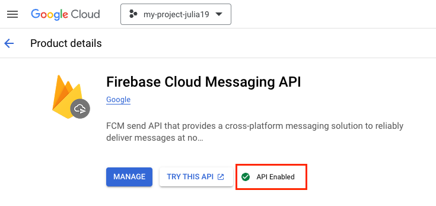

# Configuring your app

## For using Firebase {#firebase}

### Stage 1. Create a project in Firebase and obtain a key {#create-key}

1. Go to the [Firebase Console](https://console.firebase.google.com/), click **Get started with a Firebase project**, and create a project.

   

   If you already have a project, go to **Project settings** and follow the guide starting from Step 3.

   

2. Go to **Your Project** → **Project settings**.

   {style="border: solid 1px #cccccc; max-width: 800px;"}

3. In **Project settings**, go to the **Service accounts** tab and click **Generate new private key**.

   {style="border: solid 1px #cccccc; max-width: 800px;"}

4. In the window that opens, click **Generate key**. The key will be downloaded as a JSON file. Save it: you will need it for AppMetrica.
5. Please make sure the Firebase Cloud Messaging API (FCM API) is enabled. If not, enable it:
   1. Go to <https://console.cloud.google.com/apis/library/fcm.googleapis.com>.
   2. Select your project and check the status of the FCM API.
   3. If your FCM API is disabled, click **Enable**.

      {style="border: solid 1px #cccccc; max-width: 800px;"}

### Stage 2. Add your key in the AppMetrica interface {#add-key}

Add the key obtained in [Stage 1](#create-key) in the AppMetrica interface:

1. In the [Applications](https://appmetrika.yandex.ru/application/list)[Applications](https://appmetrica.yandex.com/application/list) section, select the app that you want to run push campaigns for.
2. In the menu on the left, select **Settings**.
3. Go to the **Push notifications** tab.
4. In the **Android** section, next to **FCM service account key**, click **Select file** and upload the key (JSON file) obtained from Firebase.

<!-- ### Шаг 1. Создайте проект в Firebase {#firebase}

1. Перейдите в [Firebase Console](https://console.firebase.google.com/) и выберите действие:

    

    1. В поле введите название нового проекта.
    2. Выберите страну, в которой зарегистрирована ваша организация и нажмите кнопку **Создать проект**.

    

    

    1. Выберите из выпадающего списка название проекта, для которого вы планируете проводить push-кампании.
    2. Выберите страну, в которой зарегистрирована ваша организация и нажмите кнопку **Добавить Firebase**.

    

2. Нажмите кнопку **Добавьте Firebase в свое приложение для Android** и следуйте инструкциям.

### Шаг 2. Настройте AppMetrica для работы с FCM {#firebase-key}

Получите ключ сервера для использования Firebase Cloud Messaging:

1. В Firebase Console выберите проект, для которого вы планируете проводить push-кампании.
2. В меню слева, рядом с названием проекта, нажмите значок  и перейдите в раздел **Project Settings**.
3. Перейдите на вкладку **Cloud Messaging**.
4. В блоке **Cloud Messaging API** выберите  → **Manage API in Google Cloud Console** → **Enable**.
5. Вернитесь на вкладку **Cloud Messaging**.
6. В блоке **Cloud Messaging API** скопируйте значение поля **Server key**.

Используйте этот ключ в интерфейсе AppMetrica:

1. В разделе [Приложения](https://appmetrika.yandex.ru/application/list)[Приложения](https://appmetrica.yandex.com/application/list) выберите приложение, для которого вы хотите проводить push-кампании.
2. В меню слева выберите пункт **Настройки**.
3. Перейдите на вкладку **Push-уведомления**.
4. В блоке **Android** введите в поле **Ключ сервера** значение, скопированное в интерфейсе Firebase Console и нажмите кнопку **Подключить**. -->

## To use Huawei Mobile Services (HMS) {#hms}

### Stage 1. Create and configure a project in the Huawei console {#hms}

Follow all the stages in the [Huawei](https://developer.huawei.com/consumer/en/doc/development/HMSCore-Guides-V5/android-config-agc-0000001050170137-V5) documentation.



Make sure that [Configuring the Signing Certificate Fingerprint](https://developer.huawei.com/consumer/en/doc/development/HMSCore-Guides-V5/android-config-agc-0000001050170137-V5#EN-US_TOPIC_0000001050170137__section1159841225116) specifies `SHA-256 certificate fingerprint` for all app signatures, including the debug version. Otherwise, the device can't receive push notifications.



### Stage 2. Configure AppMetrica to work with HMS {#hms}

Get the `app ID` and `app secret` from the [Huawei console](https://developer.huawei.com/consumer/ru/service/josp/agc/index.html):

1. In the [list of projects](https://developer.huawei.com/consumer/ru/service/josp/agc/index.html#/myProject) in the Huawei console, select your project.
2. On the project page, copy the `App ID` and `App secret` field values.

Use these keys in the AppMetrica interface:

1. In the [Applications](https://appmetrika.yandex.{{ domain }}/application/list) section, select the app you want to run push campaigns for.
2. In the menu on the left, select **Settings**.
3. Go to the **Push notifications** tab.
4. In the **Huawei** block, fill in the **App ID** and **App secret** fields with values from the Huawei console and click **Submit**.

### See also

- [Connecting the AppMetrica Push SDK](quick-start.md)
- [Launching a push campaign](../../../push/marketing.md)

{{ feedback }}

<a href="../../../troubleshooting/feedback-new">
  Contact support
</a>


