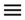

## The number of sessions does not increase {#session-count}

Check your session tracking settings. For more information, see [Tracking user activity](ios-listen.md).

## There are no events in the report {#no-events}

1. Perform a minimum of 10 app actions that trigger the event sending.
   It's necessary because AppMetrica accumulates events in the buffer and sends to the server in several parts.

2. Wait for 10 minutes and check the report. Reports don't display events immediately.

## Problems with Swift Package Manager {#swift-manager}

Read the articles ['Library Not Found' error when you launch the app on your device](../../../troubleshooting/troubleshooting.md#library-not-found) and [Error installing library on the device](../../../troubleshooting/troubleshooting.md#trouble-load).

## AppMetrica crashes with unrecognized selector {#unrecognized-selector}

AppMetrica requies "-ObjC" linker flag. Check that AppMetrica and all target statically linked with AppMetrica use this flag.

This issue may be happen with Tuist. More detailed in [documentation](quick-start.md).

## My problem is not listed {#not-found}

If your problem is not listed, contact support service. Specify the following:

1. The source code snippet that shows the SDK integration to your app.
2. Application ID in the AppMetrica web interface.
3. Device ID.

   

   1. Install the AppMetrica app on the test device.
   2. Log in and select your app from the list.
   3. In the upper-left corner, click  → **Device**.
   4. The Apple IDFA is shown in the **IDFA** field. Enter it in the AppMetrica web interface.

      

      You can enable attribution testing in the AppMetrica app. Enable **Attribution testing** for that.

      

   

4. Device model and manufacturer, platform and OS version, AppMetrica SDK version.

{{ feedback }}

<a href="../../../troubleshooting/feedback-new">
  Contact support
</a>


