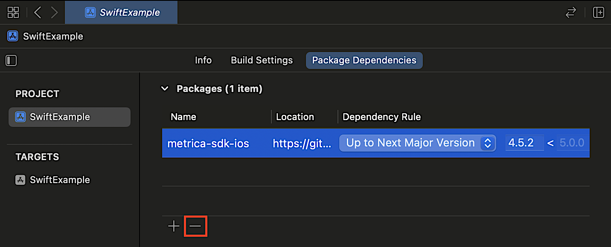
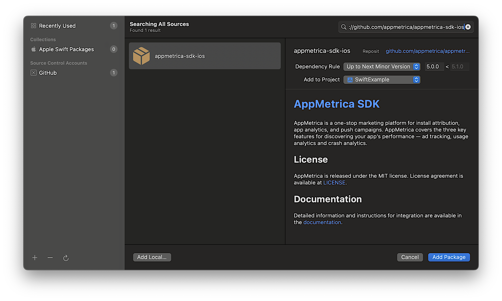
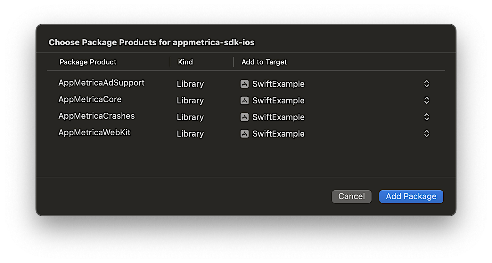
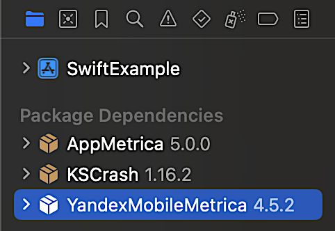
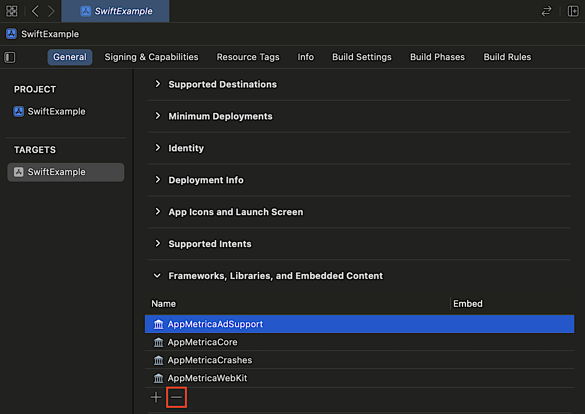

# Migrating to version 5.0.0

When you migrate your app from `YandexMobileMetrica` to `AppMetrica`, the main IDs and data are preserved. That means the transition to the new version should not result in issues or anomalies in the reports.

To migrate to the new version, follow these steps:

1. Replace dependencies. The required changes are provided in the [dependency renaming section](#rename-modules).
1. Make sure you're not using [2 AppMetrica SDK versions in parallel](#two-versions).
1. Import dependencies in the code. The required changes are provide in the [dependency importing section](#import-modules).
1. In the project code, replace the classes and methods that were simply renamed. The required changes are provided in the [API renaming section](#rename-api).
1. If you are using vendor keychain, replace the `com.yandex.mobile.appmetrica` package with `io.appmetrica`, see  [{#T}](ios-vendor-keychain.md).
1. Switch to the new API to send errors using the [instructions](#crash).
1. Temporarily comment out the code with the other errors to ensure that the project can be built.
1. Edit the code you commented out by following the other paragraphs in this guide. If you have any questions, contact [support](../../../troubleshooting/feedback-new.md).

## Renamed dependencies {#rename-modules}



- CocoaPods

  ```ruby translate=no
  pod 'YandexMobileMetrica', '~> 4.0'
  ```

  Replace with:

  ```ruby translate=no
  pod 'AppMetricaAnalytics', '~> 5.0.0'
  ```

  The AppMetrica SDK consists of multiple modules. This enables you to connect only the features you need. When `AppMetricaAnalytics` is connected, all modules are connected as well. For more detailed information about setting up, see the [integration section](quick-start.md).

- SPM in Xcode

  #### If dependencies are set via Xcode

  1. Delete the `metrika-sdk-ios` dependency.

     

  2. In the Xcode **Project Navigator** window, select your project (if **Workspace** is used). In the top menu, click **File** and select **Add Package Dependencies...**.

     

  3. Specify the repository URL `https://github.com/appmetrica/appmetrica-sdk-ios`.

     

  4. Leave only the required modules (to disable a module, select `None` in `Add to Target`):

     

     

- Package.swift

  #### When using the Package.swift manifest

  1. Delete the `.package` dependency with `YandexMobileMetrica` from the file `Package.swift` in your project together with all references to the dependencies in the `targets:` section within your project.
  2. Insert the following code to add the new `appmetrica-sdk-ios` dependency:

      ```swift translate=no
      dependencies: [
        .package(
          name: "AppMetrica",
          url: "https://github.com/appmetrica/appmetrica-sdk-ios",
          .upToNextMinor(from: "5.0.0")
        ),
      ],
      ```
  3. Add the required modules to your project's targets.

      

      ```swift translate=no
      .target(
          name: "MyTargetName",
          dependencies: [
            .product(name: "AppMetricaCore", package: "AppMetrica"),
            .product(name: "AppMetricaCrashes", package: "AppMetrica"),
            .product(name: "AppMetricaWebKit", package: "AppMetrica"),
            // .product(name: "AppMetricaAdSupport", package: "AppMetrica"), // This module is disabled
          ]
      ),
      ```



## Running two versions of AppMetrica SDK in parallel {#two-versions}

We renamed the group and main artifacts. As a result, you can use two AppMetrica SDK versions in a single app in parallel: AppMetrica version 4 and lower (`YandexMobileMetrica`) and version 5 and higher (`AppMetrica`). This situation is not desirable and may occur only under certain conditions.

### 1. The app's dependencies include dependencies on two different AppMetrica SDK versions.



We strongly advise against simultaneously running `YandexMobileMetrica` and `AppMetrica` with the same `API key` in the app code. In other words, you can't use the same `API key` to enable both `YandexMetrica` and `AppMetrica` at the same time. While that won't cause crashes or failures in the app, it will distort and disrupt the statistics. When migrating to `AppMetrica`, make sure the app doesn't have the `YandexMobileMetrica` dependency.



### 2. One of the app's dependencies transitively depends on the AppMetrica SDK.

If the app and libraries use different `API keys`, this situation is acceptable but not desirable. The statistics should be collected normally, though minor deviations are possible. In that case, the app size might increase slightly since it will include two SDKs instead of one.

### How to make sure that YandexMobileMetrica isn't used



- CocoaPods

  Open `Podfile.lock` and search `YandexMobileMetrica`.

  Using the `PODS` block in `Podfile.lock`, you can understand which dependency refers to `YandexMobileMetrica`.

  ```
  PODS:
    ...
     YandexMobileAds (6.4.0):
      - DivKit (= 28.13.0)
      - YandexMobileMetrica (< 5.0.0, >= 4.0.0)
    ...
  ```

- SPM in Xcode

  #### If dependencies are set via Xcode

  Open the project in Xcode. Make sure that `Package Dependencies` don't contain `YandexMobileMetrica`.

  

- Package.swift

  #### When using the Package.swift manifest

  If your project uses the Package.swift manifest to manage dependencies, execute the `swift package show-dependencies` command in the terminal in your project's directory. This will output a list of all project dependencies, including transitive ones.

  ```bash translate=no
  .
  └── yandex-ads-sdk-ios<https://github.com/yandexmobile/yandex-ads-sdk-ios.git@6.4.0>
    ├── metrica-sdk-ios<https://github.com/yandexmobile/metrica-sdk-ios@4.5.2>
    └── divkit-ios<https://github.com/divkit/divkit-ios@28.13.0>
        └── vgsl<https://github.com/yandex/vgsl.git@2.4.1>
  ```

  You can also check the `Package.resolved` file for the `YandexMobileMetrica` dependency.

  ```json translate=no
  {
    "object": {
      "pins": [
        //...
        {
          "package": "YandexMobileMetrica",
          "repositoryURL": "https://github.com/yandexmobile/metrica-sdk-ios",
          "state": {
            "branch": null,
            "revision": "13d8b11181a33938ef42759d49466a621df5e7db",
            "version": "4.5.2"
          }
        },
        //...
      ]
    },
    // ...
  }
  ```



## Importing dependencies {#import-modules}



- Swift

  ```swift translate=no
  import YandexMobileMetrica
  ```

  Replace with:

  ```swift translate=no
  import AppMetricaCore
  import AppMetricaCrashes // if you need to work with errors/crashes
  import AppMetricaWebKit // if you need to set up event sending from WebView
  ```

- Objective-C

  ```obj-c translate=no
  #import <YandexMobileMetrica/YandexMobileMetrica.h>
  ```

  Replace with:

  ```obj-c translate=no
  #import <AppMetricaCore/AppMetricaCore.h>
  #import <AppMetricaCrashes/AppMetricaCrashes.h> // if you need to work with errors/crashes
  #import <AppMetricaWebKit/AppMetricaWebKit.h> // if you need to set up event sending from WebView
  ```



## Renaming the API {#rename-api}



- Swift

  Removed the `YMM` prefix.

  * Renamed the `YMMYandexMetrica` interface to `AppMetrica`.
    * Renamed the `handleOpen(_:)` method to `trackOpeningURL(_:)`.
    * Renamed the `initWebViewReporting(_:onFailure:)` method to `setupWebViewReporting(with:onFailure:)`. For more information, see [Sending an event from the WebView's JavaScript code](#vebview).
    * Removed the `libraryVersion()` method, use the `libraryVersion` property.
    * Renamed the `report(adRevenue:onFailure:)` method to `reportAdRevenue(_:onFailure)`.
    * Renamed the `report(eCommerce:onFailure:)` method to `reportECommerce(_:onFailure:)`.
    * Moved the `report(error:onFailure:)` method to the `AppMetricaCrashes` class and the `AppMetricaCrashes` module, see [Working with crashes and errors](#crash).
    * Moved the `report(error:options:onFailure:)` method to the `AppMetricaCrashes` class and the `AppMetricaCrashes` module, see [Working with crashes and errors](#crash).
    * Moved the `report(nserror:onFailure:)` method to the `AppMetricaCrashes` class and the `AppMetricaCrashes` module, see [Working with crashes and errors](#crash).
    * Moved the `report(nserror:options:onFailure:)` method to the `AppMetricaCrashes` class and the `AppMetricaCrashes` module, see [Working with crashes and errors](#crash).
    * Removed the `reportError(_:exception:onFailure:)` method, see [Working with crashes and errors](#crash).
    * Renamed the `reportEvent(_:onFailure:)` method to `reportEvent(name:onFailure)`.
    * Renamed the `reportEvent(_:parameters:onFailure:)` method to `reportEvent(name:parameters:onFailure)`.
    * Removed the `reportReferralUrl(_:)` method.
    * Renamed the `reporterForApiKey(_:)` method to `reporter(for:)`.
    * Removed the `requestAppMetricaDeviceID(withCompletionQueue:completionBlock:)` method, use `requestStartupIdentifiers(for:on:completion:)`.
    * Removed the `setErrorEnvironmentValue(_:forKey:)` method, use `AppMetricaCrashes.crashes().set(errorEnvironmentValue: value, forKey: key)`.
    * Removed the `setLocation(_:)` method, use the `customLocation` property.
    * Removed the `setLocationTracking(_:)` method, use the `isLocationTrackingEnabled` property.
    * Renamed the `setStatisticsSending(_:)` method to `setDataSendingEnabled(_:)`.
    * Removed the `setUserProfileID(_:)` method, use the `userProfileID` property.
  * Renamed the `YMMYandexMetricaConfiguration` interface to `AppMetricaConfiguration`
    * Removed the `appForKids` property, see [Using the SDK for children's apps](#child).
    * Removed the `crashReporting` property, see [Working with crashes and errors](#crash).
    * Renamed the `location` property to `customLocation`.
    * Renamed the `logs` property to `areLogsEnabled`.
    * Renamed the `statisticsSending` property as `dataSendingEnabled`.
  * Renamed the `YMMYandexMetricaPreloadInfo` interface to `AppMetricaPreloadInfo`.
    * Renamed the `setAdditional(_:forKey:)` method to `setAdditional(info:forKey:)`.

  **Reporter**

  * Renamed the `YMMMutableReporterConfiguration` interface to `MutableReporterConfiguration`.
    * Renamed the `logs` property to `areLogsEnabled`.
    * Renamed the `statisticsSending` property as `dataSendingEnabled`.
  * Renamed the `YMMPluginErrorDetails` interface to `PluginErrorDetails`.
  * Renamed the `YMMReporterConfiguration` interface to `ReporterConfiguration`.
    * Renamed the `logs` property to `areLogsEnabled`.
    * Renamed the `statisticsSending` property as `dataSendingEnabled`.
  * Added the `AppMetricaCrashesConfiguration` interface.
  * Renamed the `YMMStackTraceElement` interface to `StackTraceElement`.
  * Renamed the `YMMYandexMetricaPlugins` interface to `AppMetricaPlugins`.
    * Renamed the `getPluginExtension` method to `pluginExtension`.
  * Added the `AppMetricaCrashes` interface.
    * Added the `-clearErrorEnvironment:` method.
    * Added the `-enableANRMonitoring:` method.
    * Added the `-enableANRMonitoringWithWatchdogInterval:pingInterval:` method.
    * Added the `-requestCrashReportingStateWithCompletionQueue:completionBlock:` method.
    * Added the `-setErrorEnvironmentValue:forKey:` method.
  * Renamed the `YMMYandexMetricaPluginReporting` protocol to `AppMetricaPluginReporting`.
    * Renamed the `getPluginExtension` method to `pluginExtension`.
  * Renamed the `YMMYandexMetricaReporting` protocol to `AppMetricaReporting`.
    * Renamed the `report(adRevenue:onFailure:)` method to `reportAdRevenue(_:onFailure)`.
    * Renamed the `report(eCommerce:onFailure:)` method to `reportECommerce(_:onFailure:)`.
    * Moved the `report(error:onFailure:)` method to the `AppMetricaCrashReporting` protocol, the `AppMetricaCrashes` class, and the `AppMetricaCrashes` module, see [Working with crashes and errors](#crash).
    * Moved the `report(error:options:onFailure:)` method to the `AppMetricaCrashReporting` protocol, the `AppMetricaCrashes` class, and the `AppMetricaCrashes` module, see [Working with crashes and errors](#crash).
    * Moved the `report(nserror:onFailure:)` method to the `AppMetricaCrashReporting` protocol, the `AppMetricaCrashes` class, and the `AppMetricaCrashes` module, see [Working with crashes and errors](#crash).
    * Moved the `report(nserror:options:onFailure:)` method to the `AppMetricaCrashReporting` protocol, the `AppMetricaCrashes` class, and the `AppMetricaCrashes` module, see [Working with crashes and errors](#crash).
    * Renamed the `reportEvent(_:onFailure:)` method to `reportEvent(name:onFailure)`.
    * Renamed the `reportEvent(_:parameters:onFailure:)` method to `reportEvent(name:parameters:onFailure)`.
    * Renamed the `setStatisticsSending(_:)` method to `setDataSendingEnabled(_:)`.
    * Removed the `setUserProfileID(_:)` method, use the `userProfileID` property.
  * Renamed the `kYMMPlatformNative` constant to `PlatformNative`.
  * Renamed the `kYMMPlatformFlutter` constant to `PlatformFlutter`.
  * Added the `CrashReportingStateKey.enabledKey` constant.
  * Added the `CrashReportingStateKey.crashedLastLaunchKey` constant.

  **User attributes**

  * Renamed the `YMMMutableUserProfile` interface to `MutableUserProfile`.
  * Renamed the `YMMProfileAttribute` interface to `ProfileAttribute`.
  * Renamed the `YMMUserProfile` interface to `UserProfile`.
  * Renamed the `YMMGenderType` enumeration to `GenderType`.
  * Renamed the `YMMBirthDateAttribute` protocol to `BirthDateAttribute`.
  * Renamed the `YMMCustomBoolAttribute` protocol to `CustomBoolAttribute`.
  * Renamed the `YMMCustomCounterAttribute` protocol to `CustomCounterAttribute`.
  * Renamed the `YMMCustomNumberAttribute` protocol to `CustomNumberAttribute`.
  * Renamed the `YMMCustomStringAttribute` protocol to `CustomStringAttribute`.
  * Renamed the `YMMGenderAttribute` protocol to `GenderAttribute`.
  * Renamed the `YMMNameAttribute` protocol to `NameAttribute`.
  * Renamed the `YMMNotificationsEnabledAttribute` protocol to `NotificationsEnabledAttribute`.

  **Errors**

  * Renamed the `YMMError` interface to `AppMetricaError` and moved it to the `AppMetricaCrashes` module.
  * Renamed the `YMMBacktraceErrorKey` constant to `BacktraceErrorKey` and moved it to the `AppMetricaCrashes` module.
  * Renamed the `YMMErrorReportingOptions` enumeration as `ErrorReportingOptions` and moved it to the `AppMetricaCrashes` module.
  * Renamed the `YMMErrorRepresentable` protocol to `ErrorRepresentable` and moved it to the `AppMetricaCrashes` module.

  **AdRevenue**

  * Renamed the `YMMAdRevenueInfo` interface to `AdRevenueInfo`.
  * Renamed the `YMMMutableAdRevenueInfo` interface to `MutableAdRevenueInfo`.
  * Renamed the `YMMAdType` enumeration to `AdType`.

  **ECommerce**

  * Renamed the `YMMECommerceAmount` interface to `ECommerceAmount`.
  * Renamed the `YMMECommerceCartItem` interface to `ECommerceCartItem`.
  * Renamed the `YMMECommerceOrder` interface to `ECommerceOrder`.
  * Renamed the `YMMECommercePrice` interface to `ECommercePrice`.
  * Renamed the `YMMECommerceProduct` interface to `ECommerceProduct`.
  * Renamed the `YMMECommerceReferrer` interface to `ECommerceReferrer`.
  * Renamed the `YMMECommerceScreen` interface to `ECommerceScreen`.
  * Renamed the `YMMECommerce` interface to `ECommerce`.

  **Revenue**

  * Renamed the `YMMMutableRevenueInfo` interface to `MutableRevenueInfo`.
  * Renamed the `YMMRevenueInfo` interface to `RevenueInfo`.
    * Removed the `init(price:currency:)` constructor, use `init(priceDecimal:currency)`.
    * Removed the `init(price:currency:quantity:productID:transactionID:receiptData:payload:)` constructor, use `init(priceDecimal:currency:quantity:productID:transactionID:receiptData:payload:)`.

- Objective-C

  Changed the `YMM` prefix to `AMA`.

  * Renamed the `YMMYandexMetrica` interface to `AMAAppMetrica`.
    * Renamed the `-getPluginExtension:` method to `-pluginExtension:` and moved it to the `AMAAppMetricaCrashes` class.
    * Renamed the `+handleOpenURL:` method to `+trackOpeningURL:`.
    * Renamed the `+initWebViewReporting:onFailure:` method to `+setupWebViewReporting:onFailure:`. For more information, see [Sending an event from the WebView's JavaScript code](#vebview).
    * Removed the `+libraryVersion:` method, use the `libraryVersion` property.
    * Removed the `+reportError:exception:onFailure:` method, see [Working with crashes and errors](#crash).
    * Moved the `+reportError:onFailure:` method to the `AppMetricaCrashes` class and the `AppMetricaCrashes` module, see [Working with crashes and errors](#crash).
    * Moved the `+reportError:options:onFailure:` method to the `AppMetricaCrashes` class and the `AppMetricaCrashes` module, see [Working with crashes and errors](#crash).
    * Renamed the `+reportEvent:params:onFailure:` method to `+reportEvent:parameters:onFailure:`
    * Moved the `+reportNSError:onFailure:` method to the `AppMetricaCrashes` class and the `AppMetricaCrashes` module, see [Working with crashes and errors](#crash).
    * Moved the `+reportNSError:options:onFailure:` method to the `AppMetricaCrashes` class and the `AppMetricaCrashes` module, see [Working with crashes and errors](#crash).
    * Removed the `+reportReferralUrl:` method.
    * Renamed the `+reporterForApiKey:` method to `+reporterForAPIKey:`.
    * Removed the `+requestAppMetricaDeviceIDWithCompletionQueue:` method, use `+requestStartupIdentifiersWithKeys:completionQueue:completionBlock:`.
    * Removed the `+setErrorEnvironmentValue:forKey:` method, use `[[AMAAppMetricaCrashes crashes] setErrorEnvironmentValue:value forKey:key]`.
    * Removed the `+setLocation:` method, use the `customLocation` property.
    * Removed the `+setLocationTracking:` method, use the `locationTrackingEnabled` property.
    * Renamed the `+setStatisticsSending:` method as `+setDataSendingEnabled:`.
    * Removed the `+setUserProfileID:` method, use the `userProfileID` property.
  * Renamed the `YMMYandexMetricaConfiguration` interface to `AMAAppMetricaConfiguration`.
    * Renamed the `-initWithApiKey:` constructor as `-initWithAPIKey:`.
    * Renamed the `apiKey` property to `APIKey`.
    * Removed the `appForKids` property, see [Using the SDK for children's apps](#child).
    * Removed the `crashReporting` property, see [Working with crashes and errors](#crash).
    * Renamed the `location` property to `customLocation`.
    * Renamed the `logs` property as `logsEnabled`.
    * Renamed the `statisticsSending` property to `dataSendingEnabled`.
  * Renamed the `YMMYandexMetricaPreloadInfo` interface to `AMAAppMetricaPreloadInfo`.

  **Reporter**

  * Renamed the `YMMMutableReporterConfiguration` interface to `AMAMutableReporterConfiguration`.
    * Renamed the `logs` property to `logsEnabled`.
    * Renamed the `statisticsSending` property to `dataSendingEnabled`.
  * Renamed the `YMMPluginErrorDetails` interface to `AMAPluginErrorDetails`.
  * Renamed the `YMMReporterConfiguration` interface to `AMAReporterConfiguration`.
    * Renamed the `-initWithApiKey:` constructor to `-initWithAPIKey:`.
    * Renamed the `apiKey` property to `APIKey`.
    * Renamed the `logs` property to `logsEnabled`.
    * Renamed the `statisticsSending` property to `dataSendingEnabled`.
  * Added the `AMAAppMetricaCrashesConfiguration` interface.
  * Renamed the `YMMStackTraceElement` interface to `AMAStackTraceElement`.
  * Renamed the `YMMYandexMetricaPlugins` interface to `AMAAppMetricaPlugins`.
    * Renamed the `getPluginExtension` method to `pluginExtension`.
  * Added the `AMAAppMetricaCrashes` interface.
    * Added the `-clearErrorEnvironment:` method.
    * Added the `-enableANRMonitoring:` method.
    * Added the `-enableANRMonitoringWithWatchdogInterval:pingInterval:` method.
    * Added the `-requestCrashReportingStateWithCompletionQueue:completionBlock:` method.
    * Added the `-setErrorEnvironmentValue:forKey:` method.
  * Renamed the `YMMYandexMetricaPluginReporting` protocol to `AMAAppMetricaPluginReporting`.
    * Renamed the `getPluginExtension` method to `pluginExtension`.
  * Renamed the `YMMYandexMetricaReporting` protocol to `AMAAppMetricaReporting`.
    * Moved the `+reportError:onFailure:` method to the `AMAAppMetricaCrashReporting` protocol, the `AppMetricaCrashes` class, and the `AppMetricaCrashes` module, see [Working with crashes and errors](#crash).
    * Moved the `+reportError:options:onFailure:` method to the `AMAAppMetricaCrashReporting` protocol, the `AppMetricaCrashes` class, and the `AppMetricaCrashes` module, see [Working with crashes and errors](#crash).
    * Renamed the `+reportEvent:params:onFailure:` method to `+reportEvent:parameters:onFailure:`.
    * Moved the `+reportNSError:onFailure:` method to the `AMAAppMetricaCrashReporting` protocol, the `AppMetricaCrashes` class, and the `AppMetricaCrashes` module, see [Working with crashes and errors](#crash).
    * Moved the `+reportNSError:options:onFailure:` method to the `AMAAppMetricaCrashReporting` protocol, the `AppMetricaCrashes` class, and the `AppMetricaCrashes` module, see [Working with crashes and errors](#crash).
    * Renamed the `+setStatisticsSending:` method to `+setDataSendingEnabled:`.
  * Renamed the `kYMMPlatformNative` constant to `kAMAPlatformNative`.
  * Renamed the `kYMMPlatformFlutter` constant to `kAMAPlatformFlutter`.
  * Added the `kAMACrashReportingStateCrashedLastLaunchKey` constant starting from version 5.4.0.
  * Added the `kAMACrashReportingStateEnabledKey` constant starting from version 5.4.0.

  **User attributes**

  * Renamed the `YMMMutableUserProfile` interface to `AMAMutableUserProfile`.
  * Renamed the `YMMProfileAttribute` interface to `AMAProfileAttribute`.
  * Renamed the `YMMUserProfile` interface to `AMAUserProfile`.
  * Renamed the `YMMGenderType` enumeration to `AMAGenderType`.
  * Renamed the `YMMBirthDateAttribute` protocol to `AMABirthDateAttribute`.
  * Renamed the `YMMCustomBoolAttribute` protocol to `AMACustomBoolAttribute`.
  * Renamed the `YMMCustomCounterAttribute` protocol to `AMACustomCounterAttribute`.
  * Renamed the `YMMCustomNumberAttribute` protocol to `AMACustomNumberAttribute`.
  * Renamed the `YMMCustomStringAttribute` protocol to `AMACustomStringAttribute`.
  * Renamed the `YMMGenderAttribute` protocol to `AMAGenderAttribute`.
  * Renamed the `YMMNameAttribute` protocol to `AMANameAttribute`.
  * Renamed the `YMMNotificationsEnabledAttribute` protocol to `AMANotificationsEnabledAttribute`.

  **Errors**

  * Renamed the `YMMError` interface to `AMAError`.
  * Renamed the `YMMBacktraceErrorKey` constant to `AMABacktraceErrorKey`.
  * Renamed the `YMMErrorReportingOptions` enumeration to `AMAErrorReportingOptions`.
  * Renamed the `YMMErrorRepresentable` protocol to `AMAErrorRepresentable`.

  **AdRevenue**

  * Renamed the `YMMAdRevenueInfo` interface to `AMAAdRevenueInfo`.
  * Renamed the `YMMMutableAdRevenueInfo` interface to `AMAMutableAdRevenueInfo`.
  * Renamed the `YMMAdType` enumeration to `AMAAdType`.

  **ECommerce**

  * Renamed the `YMMECommerceAmount` interface to `AMAECommerceAmount`.
  * Renamed the `YMMECommerceCartItem` interface to `AMAECommerceCartItem`.
  * Renamed the `YMMECommerceOrder` interface to `AMAECommerceOrder`.
  * Renamed the `YMMECommercePrice` interface to `AMAECommercePrice`.
  * Renamed the `YMMECommerceProduct` interface to `AMAECommerceProduct`.
  * Renamed the `YMMECommerceReferrer` interface to `AMAECommerceReferrer`.
  * Renamed the `YMMECommerceScreen` interface to `AMAECommerceScreen`.
  * Renamed the `YMMECommerce` interface to `AMAECommerce`.

  **Revenue**

  * Renamed the `YMMMutableRevenueInfo` interface to `AMAMutableRevenueInfo`.
  * Renamed the `YMMRevenueInfo` interface to `AMARevenueInfo`.
    * Removed the `-initWithPrice:currency:` constructor, use `-initWithPriceDecimal:currency:`.
    * Removed the `-initWithPrice:currency:quantity:productID:transactionID:receiptData:payload:` constructor, use `-initWithPriceDecimal:currency:quantity:productID:transactionID:receiptData:payload:`.



## Working with crashes and errors {#crash}

The API for working with errors is now in the `AppMetricaCrashes` module. If you're connecting `AppMetricaAnalytics`, you don't need to connect `AppMetricaCrashes` separately, because the module is included in `AppMetricaAnalytics`.



- Swift

  Add the import to all files where you use crash or error API resources:

  ```swift translate=no
  import AppMetricaCrashes
  ```

  The crash sending logic is defined with the `AppMetricaCrashesConfiguration` class:

  ```swift translate=no
  var configuration = AppMetricaCrashesConfiguration()
  configuration.autoCrashTracking = true // If this parameter is enabled, crashes are automatically sent to AppMetrca
  configuration.probablyUnhandledCrashReporting = true // Use this parameter to enable or disable tracking of implicit failures, such as OOM crashes
  configuration.ignoredCrashSignals = [] // This setting enables you to specify an array of UNIX signals from sys/signal.h that will be ignored by the failure tracking system
  configuration.applicationNotRespondingDetection = true // This setting includes detecting situations when the main app thread stops responding (ANR)
  configuration.applicationNotRespondingWatchdogInterval = 4.0 // Sets the time interval that the watchdog will wait before reporting the "Application Not Responding" status (ANR)
  configuration.applicationNotRespondingPingInterval = 0.1 // Sets the frequency at which watchdog will check the "Application Not Responding" status (ANR)
  AppMetricaCrashes.crashes().setConfiguration(configuration)
  ```

  To send errors, use methods of the `AppMetricaCrashes` class. Their signature matches that of similar methods from `YMMYandexMetrica`, so all you need to do is replace `YMMYandexMetrica` with `AppMetricaCrashes.crashes()`.

  ```swift translate=no
  AppMetricaCrashes.crashes().report(error:error)
  AppMetricaCrashes.crashes().report(error:error, onFailure:nil)
  AppMetricaCrashes.crashes().report(error:error, options:options, onFailure:nil)
  AppMetricaCrashes.crashes().report(nserror:error)
  AppMetricaCrashes.crashes().report(nserror:error, onFailure:nil)
  AppMetricaCrashes.crashes().report(nserror:error, options:options, onFailure:nil)
  ```

- Objective-C

  Add the import to all files where you use crash or error API resources:

  ```objectivec translate=no
  #import <AppMetricaCrashes/AppMetricaCrashes.h>
  ```

  The crash sending logic is defined with the `AMAAppMetricaCrashesConfiguration` class:

  ```objectivec translate=no
  AMAAppMetricaCrashesConfiguration *configuration = [[AMAAppMetricaCrashesConfiguration alloc] init];
  configuration.autoCrashTracking = YES; // If this parameter is enabled, crashes are automatically sent to AppMetrca
  configuration.probablyUnhandledCrashReporting = YES; // Use this parameter to enable or disable tracking of implicit failures, such as OOM crashes
  configuration.ignoredCrashSignals = @[]; // This setting enables you to specify an array of UNIX signals from sys/signal.h that will be ignored by the failure tracking system
  configuration.applicationNotRespondingDetection = YES; // This setting includes detecting situations when the main app thread stops responding (ANR)
  configuration.applicationNotRespondingWatchdogInterval = 4.0; // Sets the time interval that the watchdog will wait before reporting the "Application Not Responding" status (ANR)
  configuration.applicationNotRespondingPingInterval = 0.1; // Sets the frequency at which watchdog will check the "Application Not Responding" status (ANR)
  [[AMAAppMetricaCrashes crashes] setConfiguration:configuration];
  ```

  To send errors, use methods of the `AppMetricaCrashes` class. Their signature matches that of similar methods from `YMMYandexMetrica`, so all you need to do is replace `YMMYandexMetrica` with `[AMAAppMetricaCrashes crashes]`.

  ```objectivec translate=no
  [[AMAAppMetricaCrashes crashes] reportError:error onFailure:nil];
  [[AMAAppMetricaCrashes crashes] reportError:error options:options onFailure:nil];
  [[AMAAppMetricaCrashes crashes] reportNSError:error onFailure:nil];
  [[AMAAppMetricaCrashes crashes] reportNSError:error options:options onFailure:nil];
  ```



For more information about sending errors, see [usage examples](ios-operations.md#send-report-error).

## Sending an event from WebView's JavaScript code{#vebview}

The API for setting up event sending from WebView's JavaScript code is now in the `AppMetricaWebKit` module. If you're connecting `AppMetricaAnalytics`, you don't need to connect `AppMetricaWebKit` separately, because the module is included in `AppMetricaAnalytics`.



- Swift

  Add the following string in each file where the WebView setting within the AppMetrica library is used:

  ```swift translate=no
  import AppMetricaWebKit
  ```

  You need to replace the `WKUserContentController` instance with the instance of the `JSController` wrapping. Replace:

  ```swift translate=no
  let userController = WKUserContentController()
  YMMYandexMetrica.initWebViewReporting(userController, onFailure: nil)
  ```

  with

  ```swift translate=no
  let userController = WKUserContentController()
  AppMetrica.setupWebViewReporting(with: JSController(userContentController: userController), onFailure: nil)
  ```

- Objective-C

  Add the following string in each file where the WebView setting is used:

  ```objectivec translate=no
  #import <AppMetricaWebKit/AppMetricaWebKit.h>
  ```

  You need to replace the `WKUserContentController` instance with the instance of the `AMAJSController` wrapping. Replace:

  ```objectivec translate=no
  WKUserContentController *userController = [[WKUserContentController alloc] init];
  [YMMYandexMetrica initWebViewReporting:userController onFailure:nil];
  ```

  with

  ```objectivec translate=no
  WKUserContentController *userController = [[WKUserContentController alloc] init];
  [AMAAppMetrica setupWebViewReporting:[[AMAJSController alloc] initWithUserContentController:userController] onFailure:nil];
  ```



For more information about setting up event sending from WebView, see [usage examples](ios-operations.md#js-event).

## Using the SDK for children's apps {#child}

To use the SDK in a children's app, exclude the `AppMetricaAdSupport` module.



- CocoaPods

  Instead of

  ```ruby translate=no
  pod 'AppMetricaAnalytics', '~> 5.0.0'
  ```

  use

  ```ruby translate=no
  pod 'AppMetricaCore', '~> 5.0.0'
  pod 'AppMetricaCrashes', '~> 5.0.0' # if you need crashes and errors
  pod 'AppMetricaWebKit', '~> 5.0.0' # if you need to send events from WebView
  ```

- SPM in Xcode

  #### If dependencies are set via Xcode

  Exclude `AppMetricaAdSupport` from `Frameworks, Libraries, and Embedded Content` for your target.

  

- Package.swift

  #### When using the Package.swift manifest

  Disable the `AppMetricaAdSupport` module:

  ```swift translate=no
   .target(
      name: "MyTargetName",
      dependencies: [
         .product(name: "AppMetricaCore", package: "AppMetrica"),
         .product(name: "AppMetricaCrashes", package: "AppMetrica"),
         .product(name: "AppMetricaWebKit", package: "AppMetrica"),
         // .product(name: "AppMetricaAdSupport", package: "AppMetrica"), // This module is disabled
      ]
   ),
   ```



{{ feedback }}

<a href="../../../troubleshooting/feedback-new.html">
  <span class="button">Contact support</span>
</a>


