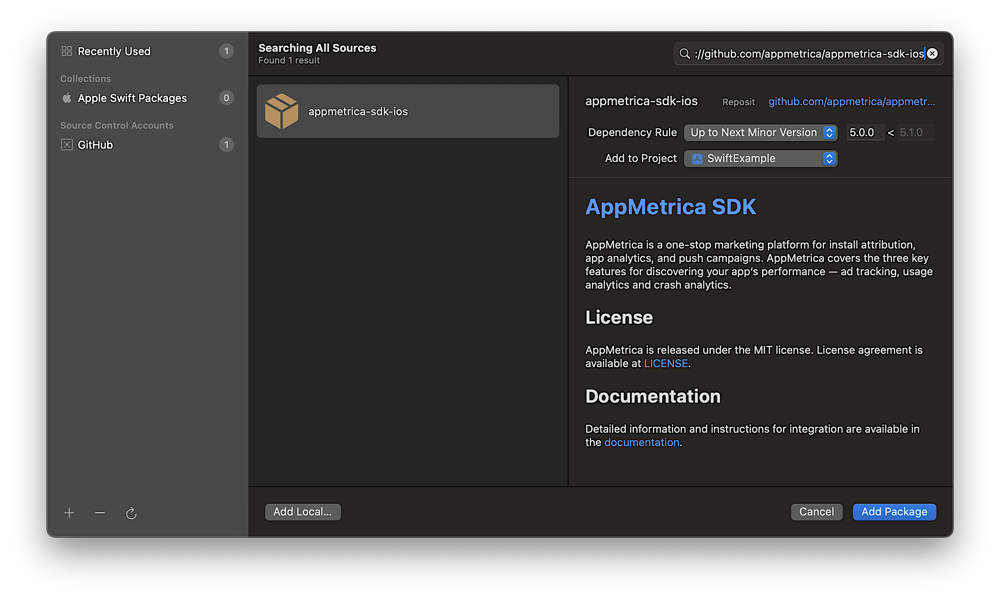

# SDK integration

The SDK for iOS is provided as modules with source code.

## Step 1. Enable the library {#integration}



- CocoaPods

   To connect the analytics library, add the following dependency to your project's Podfile:

   ```ruby translate=no
   pod 'AppMetricaAnalytics', '~> {{ ios-appmetrica-sdk-version }}'
   ```

   

   If your app is intended for children, connect modules without the use of `AppMetricaAdSupport`:

   ```ruby translate=no
   pod 'AppMetricaCore', '~> {{ ios-appmetrica-sdk-version }}'
   pod 'AppMetricaCrashes', '~> {{ ios-appmetrica-sdk-version }}'
   pod 'AppMetricaWebKit', '~> {{ ios-appmetrica-sdk-version }}'
   ```

   

   

   If you don't need all the features of the AppMetrica SDK, connect only the required modules:

   ```ruby translate=no
   pod 'AppMetricaCore', '~> {{ ios-appmetrica-sdk-version }}' # The main module for working with the AppMetrica SDK, mandatory for connection
   pod 'AppMetricaAdSupport', '~> {{ ios-appmetrica-sdk-version }}' # Required for collecting IDs. IDFAs won't be collected without it
   pod 'AppMetricaCrashes', '~> {{ ios-appmetrica-sdk-version }}' # The module for detecting crashes and sending errors
   pod 'AppMetricaWebKit', '~> {{ ios-appmetrica-sdk-version }}' # The module for setting up event sending from the WebView's JS code
   ```

   

- SPM in Xcode

   #### Integration via the Xcode interface

   To connect the library, follow these steps:

   1. In the Xcode project navigator (**Project Navigator**) window, select your project (if **Workspace** is used). In the top menu, click **File** and select **Add Package Dependencies...**.

      

   2. Specify the repository URL `https://github.com/appmetrica/appmetrica-sdk-ios`.

      

   3. Leave only the required modules (to disable a module, select `None` in `Add to Target`):

      

      

      

- Package.swift

   #### Integration via the Package.swift manifest

   First, add the following dependency to the `dependencies:` array of your package:

   ```swift translate=no
   dependencies: [
      .package(
         url: "https://github.com/appmetrica/appmetrica-sdk-ios",
         from: "{{ ios-appmetrica-sdk-version }}"
      )
   ],
   ```

   The AppMetrica SDK modules that you can connect depending on the needs of your project:

   

   

   Example of connecting modules in the `dependencies:` array of the target:

   ```swift translate=no
   .target(
      name: "MyTargetName",
      dependencies: [
         .product(name: "AppMetricaCore", package: "AppMetrica"),
         .product(name: "AppMetricaCrashes", package: "AppMetrica"),
         .product(name: "AppMetricaWebKit", package: "AppMetrica"),
         // .product(name: "AppMetricaAdSupport", package: "AppMetrica"), // This module is disabled
      ]
   ),
   ```
- Tuist with Package.swift

   #### Integration via Tuist with the Package.swift manifest
   
   Add AppMetrica into your Tuist/Package.swift
   
   ```
   import PackageDescription

   #if TUIST
       import struct ProjectDescription.PackageSettings

       let packageSettings = PackageSettings(
           productTypes: [:]
       )
   #endif

   let package = Package(
       name: "NewTuist",
       dependencies: [
           .package(url: "https://github.com/appmetrica/appmetrica-sdk-ios", from: "5.0.0")
       ]
   )
   ````
   
   Now add dependencies for target in Project.swift. 
   AppMetrica requires "-ObjC" linker flag. Append settings for all targets statically linked with AppMetrica, e. g.:
   
   ```
   dependencies: [
       .external(name: "AppMetricaCore"),
   ],
   settings: .settings(
      base: ["OTHER_LDFLAGS": "$(inherited) -ObjC"]
   )
   ```



## Step 2. Initialize the library {#initialization}



- Swift

   Add the import:

   ```swift translate=no
   import AppMetricaCore
   ```

   Initialize the library in the `application(_:didFinishLaunchingWithOptions:)` method of your `UIApplicationDelegate`:

   ```swift translate=no
   func application(_ application: UIApplication, didFinishLaunchingWithOptions launchOptions: [UIApplication.LaunchOptionsKey : Any]? = nil) -> Bool {
       // Initializing the AppMetrica SDK.
       let configuration = AppMetricaConfiguration(apiKey: "API key")
       AppMetrica.activate(with: configuration!)
   }
   ```

- Objective-C

   Add the import:

   ```obj-c translate=no
   #import <AppMetricaCore/AppMetricaCore.h>
   ```

   Initialize the library in the `application:didFinishLaunchingWithOptions:` method of your `UIApplicationDelegate`:

   ```obj-c translate=no
   - (BOOL)application:(UIApplication *)application didFinishLaunchingWithOptions:(NSDictionary *)launchOptions
   {
       // Initializing the AppMetrica SDK.
       AMAAppMetricaConfiguration *configuration = [[AMAAppMetricaConfiguration alloc] initWithAPIKey:@"API key"];
       [AMAAppMetrica activateWithConfiguration:configuration];
       return YES;
   }
   ```





{{ api-key }}



AppMetrica allows tracking pre-installed apps. For more information, see [Tracking pre-installed apps](../../../mobile-tracking/preinstalled-app-attr.md).

## Step 3. (Optional) Configure sending of events, profile attributes, and revenue {#send}

1. To collect information on user actions in the app, set up sending your own events. For more information, see [Sending your own events](../../../data-collection/about-events.md).

2. To collect information about users, set up sending profile attributes. For more information, see [Profiles](../../../data-collection/about-profiles.md).

   

   Unlike events, a profile attribute can take only one value. When you send a new attribute value, the old value is overwritten.

   

4. To track in-app purchases, set up Revenue sending. For more information, see [In-App purchases](../../../data-collection/about-revenue.md).

## Step 4. Test the library operation {#test}

To test how the library works:

1. Start the app with the AppMetrica SDK and use it for a while.
2. Make sure your device is connected to the internet.
3. In the AppMetrica interface, make sure that:
   * There is a new user in the [Audience](../../../mobile-reports/audience-report.md) report.
   * The number of sessions in the **Engagement** → **Sessions** report has increased.
   * There are events and profile attributes in the [Events](../../../mobile-reports/events-report.md) and [Profiles](../../../mobile-reports/profile-report.md) reports.

## Learn more {#learn-more}

- [Sending a custom event](ios-operations.md#report-event)
- [Sending profile attributes](ios-operations.md#send-attribute-profile)
- [Sending E-commerce events](ios-operations.md#send-ecommerce)
- [Sending Revenue data](ios-operations.md#send-revenue)
- [Sending Ad Revenue data](ios-operations.md#send-adrevenue)
- [How do I enable user location sending?](../../../troubleshooting/troubleshooting.md#region)

## Troubleshooting {#faq}

- [The number of sessions does not increase](ios-errors.md#faq-session-count)
- [There are no events in the report](ios-errors.md#no-events)
- [Problems with Swift Package Manager](ios-errors.md#swift-manager)
- [My problem is not listed](ios-errors.md#not-found)

{{ feedback }}

<a href="../../../troubleshooting/feedback-new">
  <span class="button">Contact support</span>
</a>


