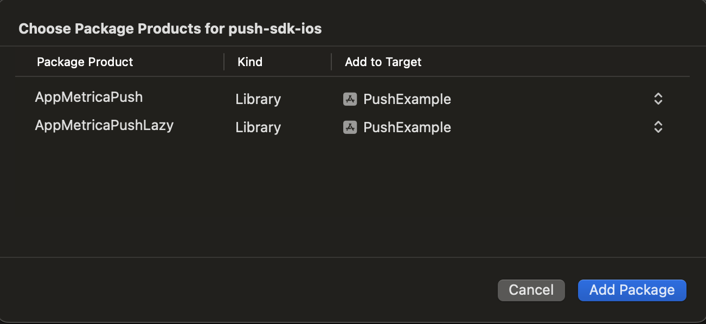

# Installation and initialization

Before using the AppMetrica Push SDK {{ ios-push-sdk }}, you need to [enable and initialize the AppMetrica SDK](../analytics/quick-start.md) version 5.9.0 or higher.

## Step 1. Enable the library {#installation}

The library can work with the following dependency managers:



- CocoaPods

   To connect the Push SDK library, add the following dependencies to your project's Podfile:

   ```ruby translate=no
   pod 'AppMetricaPush', '~> {{ ios-push-sdk }}' # Main module for working with Push SDK, it's required for connecting
   pod 'AppMetricaPushLazy', '~> {{ ios-push-sdk }}' # Additional module for lazy push notifications
   ```

- SPM in Xcode

   **Integration via the Xcode interface**

   To connect the library, follow these steps:

   1. In the Xcode project navigator (**Project Navigator**) window, select your project (if **Workspace** is used). In the top menu, click **File** and select **Add Package Dependencies...**.

      

   2. Specify the repository URL `https://github.com/appmetrica/push-sdk-ios`.

      

   3. Leave only the required modules (to disable a module, select `None` in `Add to Target`):

      

      * `AppMetricaPush`: The main mandatory Push SDK module. You need to enable it to use AppMetrica.
      * `AppMetricaPushLazy`: Additional module for lazy push notifications.

- Package.swift

   **Integration via the Package.swift manifest**

   First, add the following dependency to the `dependencies:` array of your package:

   ```swift translate=no
   dependencies: [
      .package(
         url: "https://github.com/appmetrica/push-sdk-ios",
         from: "{{ ios-push-sdk }}"
      )
   ],
   ```

   The AppMetrica Push SDK modules that you can enable depending on the needs of your project:

   * `AppMetricaPush`: The main mandatory Push SDK module. You need to enable it to use AppMetrica.
   * `AppMetricaPushLazy`: Additional module for lazy push notifications.

   Example of connecting modules in the `dependencies:` array of the target:

   ```swift translate=no
   .target(
      name: "MyTargetName",
      dependencies: [
         .product(name: "AppMetricaPush", package: "push-sdk-ios"),
         // .product(name: "AppMetricaPushLazy", package: "push-sdk-ios"), // This module is disabled
      ]
   ),
   ```



## Step 2. Configure AppMetrica Push {#setup}

Setup AppMetrica in application and extension as described in [{#T}](../analytics/ios-appgroup.md).



- Objective-C

   Add the following code to the corresponding implementation of the `UIApplicationDelegate` method:

   ```objectivec translate=no
   - (BOOL)application:(UIApplication *)application didFinishLaunchingWithOptions:(NSDictionary *)launchOptions
   {
       // Activating AppMetrica.
       ...
       [AMPAppMetricaPush setExtensionAppGroup:appGroup]; // optional, need to send stored events from AppMetricaPush-2.2 and earlier
       ...
       [AMPAppMetricaPush handleApplicationDidFinishLaunchingWithOptions:launchOptions];
       ...
   }
   ```

- Swift

   Add the following code to the corresponding implementation of the `AppDelegate` method:

   ```objectivec translate=no
   func application(_ application: UIApplication, didFinishLaunchingWithOptions launchOptions: [UIApplicationLaunchOptionsKey :Any]? = nil) -> Bool
   {
       // Activating AppMetrica.
       ...
       AppMetricaPush.setExtensionAppGroup(appGroup) // optional, need to send stored events from AppMetricaPush-2.2 and earlier
       ...
       AppMetricaPush.handleApplicationDidFinishLaunching(options: launchOptions)
       ...
   }
   ```



### Collecting push notification dismiss interactions {#dismiss}

To collect the statistics of dismiss interactions of push notifications, set the following option for the ` UNNotificationCategory`  category:



- Objective-C

   ```objectivec translate=no
   options:UNNotificationCategoryOptionCustomDismissAction
   ```

- Swift

   ```swift translate=no
   options: UNNotificationCategory.customDismissAction
   ```



## Step 3. (_Optional_) Setup AppMetrica in Notification Service Extension {#notification}

Setup AppMetrica in application and extension as described in [{#T}](../analytics/ios-appgroup.md).

Add Notification Service Extension via XCode
1. In Xcode, select **File** → **New** → **Target**.
2. In the**iOS** extensions section, choose **Notification Service Extension** from the list and click **Next**.
3. Enter the name of the extension in the **Product Name**  field and click **Finish**.
 

Add the following code in your extension class:



- Swift

  ```swift translate=no
  class NotificationService: UNNotificationServiceExtension {

      var contentHandler: ((UNNotificationContent) -> Void)?
      var bestAttemptContent: UNMutableNotificationContent?
      
      override func didReceive(_ request: UNNotificationRequest, 
                              withContentHandler contentHandler: @escaping (UNNotificationContent) -> Void) {
         // system does not always spawn new process to handle few notification, but AppMetrica ignore second initialization
         let configuration = AppMetricaConfiguration(apiKey: "API-KEY")!
         AppMetrica.activate(with: configuration)
         AMPAppMetricaPush.setExtensionAppGroup(appGroup) // optional, need to send stored events from AppMetricaPush-2.2 and earlier
         
         AMPAppMetricaPush.handleDidReceive(request)

         self.contentHandler = contentHandler
         bestAttemptContent = (request.content.mutableCopy() as? UNMutableNotificationContent)
         
         // custom logic
            
         AppMetrica.sendEventsBuffer()

      }    
  }
  ```  

- Objective-C

  ```objectivec translate=no
  @interface NotificationService: UNNotificationServiceExtension

  @property (nonatomic, strong) void (^contentHandler)(UNNotificationContent *contentToDeliver);
  @property (nonatomic, strong) UNMutableNotificationContent *bestAttemptContent;

  @end
  @implementation NotificationService

  + (void)initialize {
      if ([self class] == [NotificationService class]) {
          AMAAppMetricaConfiguration *configuration =
              [[AMAAppMetricaConfiguration alloc] initWithAPIKey:@"API-KEY"];
          [AMAAppMetrica activateWithConfiguration:configuration];
          [AMPAppMetricaPush setExtensionAppGroup:appGroup]; # push saved events
      }
  }

  - (void)didReceiveNotificationRequest:(UNNotificationRequest *)request 
                    withContentHandler:(void (^)(UNNotificationContent * _Nonnull))contentHandler {
      
      [AMPAppMetricaPush handleDidReceiveNotificationRequest:request];
      
      self.contentHandler = contentHandler;
      self.bestAttemptContent = [request.content mutableCopy];
      
      // custom logic
      
      [AMAAppMetrica sendEventsBuffer]; // force send all events
  }

  @end
  ```  



## Step 4. Register your app in the Apple Push Notification Service (APNs) {#apns}

Registration prepares the app to work with push notifications. To send notifications to iOS devices, make the following changes to the app's code:



- Swift

   ```swift translate=no
   let center = UNUserNotificationCenter.current()
   center.requestAuthorization(options:\[.badge, .alert, .sound\]) { (granted, error) in
     // Enable or disable features based on authorization.
   }
   application.registerForRemoteNotifications()
   ```

   This data is usually passed in the following method:

   ```swift translate=no
   func application(_ application: UIApplication, didFinishLaunchingWithOptions
                    launchOptions: [UIApplicationLaunchOptionsKey :Any]? = nil) -> Bool
   ```

   For more details about the methods used, see the documentation at `developer.apple.com`:

   * [UNUserNotificationCenter.current()](https://developer.apple.com/documentation/usernotifications/unusernotificationcenter/1649510-current)
   * [UNUserNotificationCenter.requestAuthorization(options:completionHandler:)](https://developer.apple.com/documentation/usernotifications/unusernotificationcenter/1649527-requestauthorization)
   * [UIApplication.registerForRemoteNotifications()](https://developer.apple.com/documentation/uikit/uiapplication/1623078-registerforremotenotifications)

- Objective-C

   ```objectivec translate=no
   UNAuthorizationOptions options =
     UNAuthorizationOptionAlert |
       UNAuthorizationOptionBadge |
       UNAuthorizationOptionSound;
   UNUserNotificationCenter *center = [UNUserNotificationCenter currentNotificationCenter];
   [center requestAuthorizationWithOptions:options completionHandler:^(BOOL granted, NSError *error) {
     // Enable or disable features based on authorization.
   }];
   [application registerForRemoteNotifications];
   ```

   This data is usually passed in the following method:

   ```objectivec translate=no
    - (BOOL)application:(UIApplication *)application didFinishLaunchingWithOptions:(NSDictionary *)launchOptions
   ```

   For more details about the methods used, see the documentation at `developer.apple.com`:

   * [[UNUserNotificationCenter currentNotificationCenter]](https://developer.apple.com/documentation/usernotifications/unusernotificationcenter/1649510-currentnotificationcenter?language=objc)
   * [[UNUserNotificationCenter requestAuthorizationWithOptions:completionHandler:]](https://developer.apple.com/documentation/usernotifications/unusernotificationcenter/1649527-requestauthorizationwithoptions?language=objc)
   * [[UIApplication registerForRemoteNotifications]](https://developer.apple.com/documentation/uikit/uiapplication/1623078-registerforremotenotifications?language=objc)



## Step 5. Register a device token for your app {#device-token}

To send push notifications using AppMetrica, your app's device token is required. To register it:



- Swift

   Add the following code to `AppDelegate`:

   ```swift translate=no
   func application(_ application: UIApplication, didRegisterForRemoteNotificationsWithDeviceToken deviceToken: Data)
   {
       // If the AppMetrica SDK library was not initialized before this step,
       // calling the method causes the app to crash.
       AppMetricaPush.setDeviceTokenFrom(deviceToken)
   }
   ```

- Objective-C

   Add the following code to your implementation of `UIApplicationDelegate`:

   ```objectivec translate=no
   - (void)application:(UIApplication *)application didRegisterForRemoteNotificationsWithDeviceToken:(NSData *)deviceToken
   {
       // If the AppMetrica SDK library was not initialized before this step,
       // calling the method causes the app to crash.
       [AMPAppMetricaPush setDeviceTokenFromData:deviceToken];
   }
   ```



To register the device token and send the APN environments, add the following code:



- Swift

   ```swift translate=no
   func application(_ application: UIApplication, didRegisterForRemoteNotificationsWithDeviceToken deviceToken: Data)
   {
       // If the AppMetrica SDK library was not initialized before this step,
       // calling the method causes the app to crash.
       #if DEBUG
           let pushEnvironment = AppMetricaPushEnvironment.development
       #else
           let pushEnvironment = AppMetricaPushEnvironment.production
       #endif
       AppMetricaPush.setDeviceTokenFrom(deviceToken, pushEnvironment: pushEnvironment)
   }
   ```

- Objective-C

   ```objectivec translate=no
   - (void)application:(UIApplication *)application didRegisterForRemoteNotificationsWithDeviceToken:(NSData *)deviceToken
   {
       // If the AppMetrica SDK library was not initialized before this step,
       // calling the method causes the app to crash.
       #ifdef DEBUG
           AMPAppMetricaPushEnvironment pushEnvironment = AMPAppMetricaPushEnvironmentDevelopment;
       #else
           AMPAppMetricaPushEnvironment pushEnvironment = AMPAppMetricaPushEnvironmentProduction;
       #endif
       [AMPAppMetricaPush setDeviceTokenFromData:deviceToken pushEnvironment:pushEnvironment];
   }
   ```





AppMetrica allows you to send push notifications to Sandbox APNs. However, push notification processing may not work correctly if versions of the application with different environments were run on the device(_development_ and _production_). To avoid this issue, you can use a separate test API key for _development_ environment.



## Step 6. Configure handling the opening of push notifications {#opening}

Configure handling the opening of push notifications:

1. Use the delegate `UserNotificationCenterDelegate`/`AMPUserNotificationCenterDelegate`. It handles the receipt of push notifications automatically when they're opened.

   Make the following changes to the code:

   

   - Swift

      ```swift translate=no
      import UserNotifications

      // In the "func application(_ application: UIApplication, didFinishLaunchingWithOptions
      //                          launchOptions: [UIApplicationLaunchOptionsKey : Any]? = nil) -> Bool" method:
      let delegate = AppMetricaPush.userNotificationCenterDelegate
      UNUserNotificationCenter.current().delegate = delegate
      ```

   - Objective-C

      ```objectivec translate=no
      #import <UserNotifications/UserNotifications.h>

      // In the   "- (BOOL)application:(UIApplication *)application
      // didFinishLaunchingWithOptions:(NSDictionary *)launchOptions" method:
      [UNUserNotificationCenter currentNotificationCenter].delegate =
              [AppMetricaPush userNotificationCenterDelegate];
      ```

   

   To track push notification openings and other actions with them, create your own delegate named `UNUserNotificationCenterDelegate` and add it to `nextDelegate`:

   

   - Swift

      ```swift translate=no
      AppMetricaPush.userNotificationCenterDelegate.nextDelegate = yourDelegate
      ```

   - Objective-C

      ```objectivec translate=no
      [AMPAppMetricaPush userNotificationCenterDelegate].nextDelegate = yourDelegate;
      ```

   

   After that, you can use the appropriate methods of your delegate.

2. If you also use [UISceneDelegate](https://developer.apple.com/documentation/uikit/uiscenedelegate), add the following code to the `scene(_:willConnectTo:options:)` method:

   

   - Swift

      ```swift translate=no
      func scene(_ scene: UIScene, willConnectTo
                 session: UISceneSession, options
                 connectionOptions: UIScene.ConnectionOptions) {
           AppMetricaPush.handleSceneWillConnectToSession(with: connectionOptions)
      }
      ```

   - Objective-C

      ```objectivec translate=no
      - (void)scene:(UIScene *)scene willConnectToSession:(UISceneSession *)session
            options:(UISceneConnectionOptions *)connectionOptions
      {
          [AMPAppMetricaPush handleSceneWillConnectToSessionWithOptions:connectionOptions];
      }
      ```

   

## Step 7. (_Optional_) Enable push tokens update {#actualization}

If a device's push token is no longer valid (for example, the user deleted the app), the APNS service may return a 410 error saying "The device token is no longer active for the topic". AppMetrica can maintain a list of valid tokens by sending silent push notifications. This will give you an idea of the number of devices before the start of a push campaign.

To enable this, open the AppMetrica web interface, go to the app settings, and select the **Update tokens with a Silent Push-notification** option in the **Push notifications** tab.

Using silent push notifications will make the evaluation of your push campaign's audience and push notification reports more accurate, as well as affect the successful delivery of app push notifications.

## Step 8. (_Optional_) Configure uploading attached files {#download-file}



The functionality is not available in the web interface of push campaigns.



You can configure uploading attached files in push notifications:

1. Configure uploading attached files in push notifications by calling the [downloadAttachmentsForNotificationRequest](objectivec/AMPAppMetricaPush.md#method_downloadAttachmentsForNotificationRequest) method in the Push SDK. See an example of integration in the article [Uploading attached files](ios-push-download-file.md).
2. Add attachments (the `attachments` parameter) using the [Sending push messages](../../../mobile-api/push/post-send-batch.md) operation in the Push API.

## Sending additional information {#send-additional-info}

You can send additional information with the push notification if necessary. This data is specified in the AppMetrica web interface when [configuring the push campaign](../../../push/marketing.md). To get this information, use the following method:



- Swift

   ```swift translate=no
   let userData = AppMetricaPush.userData(forNotification: userInfo)
   ```

- Objective-C

   ```objectivec translate=no
   NSString *userData = [AMPAppMetricaPush userDataForNotification:userInfo];
   ```



where `userInfo` contains information about the push notification.

## Defining the recipient of a notification {#detect-internal-push}

AppMetrica allows you to detect <q>own</q> push notifications, if several Push SDKs were built into the application.

To detect, if the AppMetrica is the recipient of a notification, use the following method:



- Swift

   ```swift translate=no
   let isRelatedToAppMetricaSDK = AppMetricaPush.isNotificationRelated(toSDK: userInfo)
   ```

- Objective-C

   ```objectivec translate=no
   BOOL isRelatedToAppMetricaSDK = [AMPAppMetricaPush isNotificationRelatedToSDK:userInfo];
   ```



### See also

- [Example of library integration](https://github.com/yandexmobile/metrica-push-sdk-ios)
- [Configuring an iOS application to send push notifications](ios-settings.md)

{{ feedback }}

<a href="../../../troubleshooting/feedback-new">
  <span class="button">Contact support</span>
</a>


