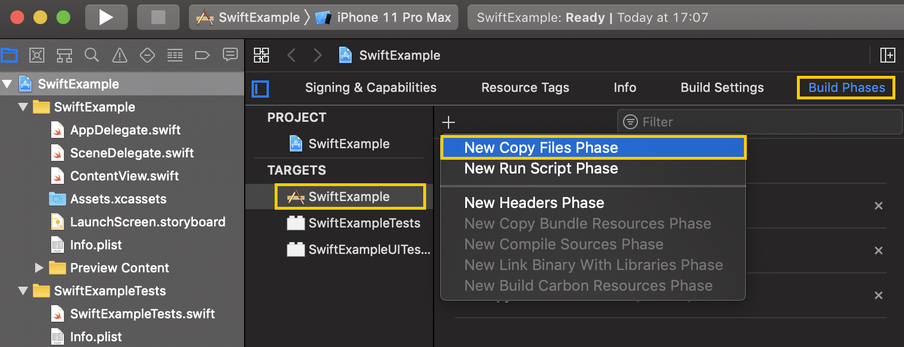
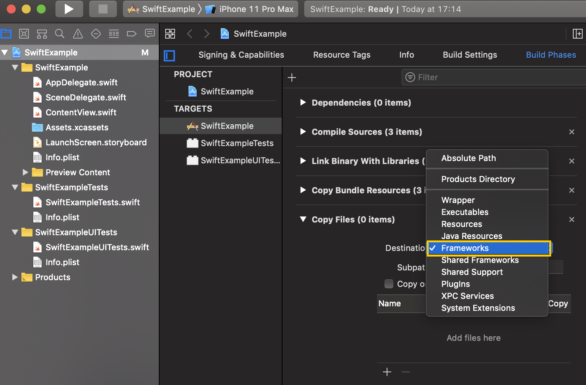
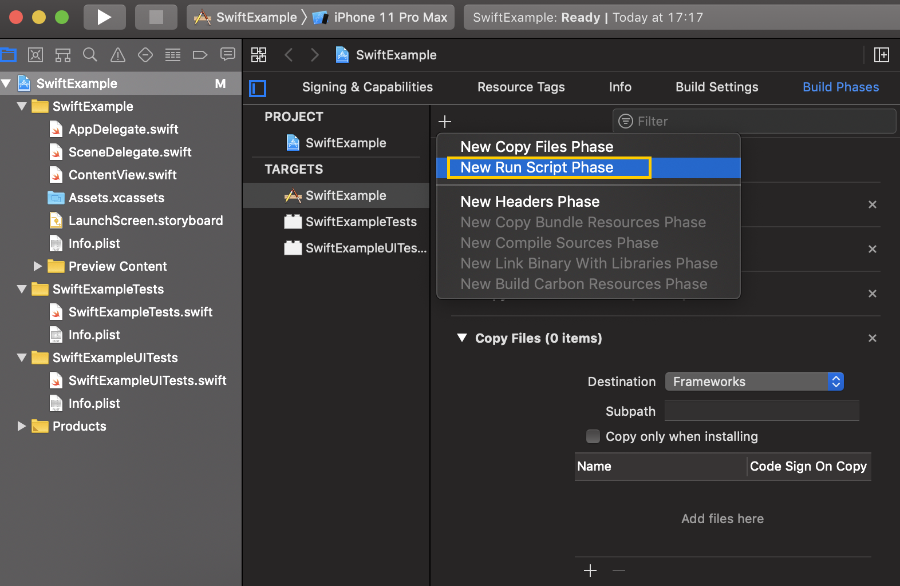

# FAQ and troubleshooting

## Creating an app {#create-app}

#### {#api-key}



We recommend using the same API key for the same app on different platforms. This ensures a more convenient presentation of the general app statistics for a given platform and enables the use of smartlinks in trackers.



## SDK integration {#sdk-integration}

#### {#newest-android-version}



To ensure that you have the latest versions of the AppMetrica SDK and AppMetrica Push SDK libraries installed, follow these steps:

1. In the Android Studio menu bar, select **Analyze** → **Run Inspection By Name**.
2. In the window that opens, type in and then select **Newer Library Versions Available**.
3. Select the libraries to update.



#### {#update-version}



To update the version of the AppMetrica SDK library:



- Android

  1. Edit the library version in the `build.gradle` file.
  2. Initialize the library in the app.

  For more information, see [Installation and initialization](../sdk/android/analytics/quick-start.md).

- iOS

  1. Edit the library version in your project's `Podfile`.
  2. Initialize the library in the app.

  For more information, see [Installation and initialization](../sdk/ios/analytics/quick-start.md).





#### {#region}



AppMetrica can determine the location of a device. Location accuracy depends on the configuration that the library uses for initialization:

**With the locationTracking option enabled**
:   

    For iOS, the option is enabled by default, but the AppMetrica SDK doesn't request permission to access location data. You should implement this using the methods of the [CLLocationManager](https://developer.apple.com/documentation/corelocation/cllocationmanager?language=objc) class.

    

    Location is determined down to the city level. You can retrieve the information in [reports](../mobile-reports/index.md) and via the [Logs API](../mobile-api/logs/about.md).

    The app requests GPS access. Battery consumption may increase.

**With the locationTracking option disabled**
:   

    Starting with the Android AppMetrica SDK 5.0.0, the `locationTracking` option is disabled by default.

    If the version is lower than 5.0.0, the `locationTracking` option is enabled by default.

    

    The location is determined by the IP address with accuracy to the country. You can retrieve the information in [reports](../mobile-reports/index.md) but not the [Logs API](../mobile-api/logs/about.md).

    The app requests GPS access. Battery consumption does not increase.

    

    If you have IP address masking enabled, AppMetrica determines the location with country-level accuracy using the unmasked part of the IP address.

    

See examples in [{#T}](../data-collection/geo.md#track-location).



#### {#library-not-found}



The error occurs because Xcode cannot sign the libraries that SPM provides. There is a [task to fix](https://bugs.swift.org/browse/SR-13343) in the SPM project, but at the moment it is not solved.

To resolve this problem, follow this sequence of steps:

1. At the build stage of your app, add a step to copy files.

    {style="border: solid 1px #cccccc; max-width: 800px;"}

2. For **Destination** select **Frameworks**.

    {style="border: solid 1px #cccccc; max-width: 800px;"}

3. Add a step to run the script.

    {style="border: solid 1px #cccccc; max-width: 800px;"}

4. Add the script. The script will sign the libraries that SPM provides.

    ```bash translate=no
    find "${CODESIGNING_FOLDER_PATH}" -name '*.framework' -print0 | while read -d $'\0' framework
    do
    codesign --force --deep --sign "${EXPANDED_CODE_SIGN_IDENTITY}" --preserve-metadata=identifier,entitlements --timestamp=none "${framework}"
    done
    ```



#### {#trouble-load}



During library installation, the error specified below may occur (example log). To solve the problem, follow the steps in ["Library Not Found" error when launching the app on the device](#library-not-found).



```bash translate=no
Details

Unable to install "Your App"
Domain: com.apple.dt.MobileDeviceErrorDomain
Code: -402620395
--
A valid provisioning profile for this executable was not found.
Domain: com.apple.dt.MobileDeviceErrorDomain
Code: -402620395
User Info: {
    DVTRadarComponentKey = 487925;
    MobileDeviceErrorCode = "(0xE8008015)";
    "com.apple.dtdevicekit.stacktrace" = (
	0   DTDeviceKitBase                     0x00000001212d493f DTDKCreateNSErrorFromAMDErrorCode + 220
	1   DTDeviceKitBase                     0x0000000121313124 __90-[DTDKMobileDeviceToken installApplicationBundleAtPath:withOptions:andError:withCallback:]_block_invoke + 155
	2   DVTFoundation                       0x000000010576db33 DVTInvokeWithStrongOwnership + 71
	3   DTDeviceKitBase                     0x0000000121312e65 -[DTDKMobileDeviceToken installApplicationBundleAtPath:withOptions:andError:withCallback:] + 1440
	4   IDEiOSSupportCore                   0x0000000121183d28 __118-[DVTiOSDevice(DVTiPhoneApplicationInstallation) processAppInstallSet:appUninstallSet:installOptions:completionBlock:]_block_invoke.292 + 3513
	5   DVTFoundation                       0x000000010589c29a __DVT_CALLING_CLIENT_BLOCK__ + 7
	6   DVTFoundation                       0x000000010589debc __DVTDispatchAsync_block_invoke + 1191
	7   libdispatch.dylib                   0x00007fff73c476c4 _dispatch_call_block_and_release + 12
	8   libdispatch.dylib                   0x00007fff73c48658 _dispatch_client_callout + 8
	9   libdispatch.dylib                   0x00007fff73c4dc44 _dispatch_lane_serial_drain + 597
	10  libdispatch.dylib                   0x00007fff73c4e5d6 _dispatch_lane_invoke + 363
	11  libdispatch.dylib                   0x00007fff73c57c09 _dispatch_workloop_worker_thread + 596
	12  libsystem_pthread.dylib             0x00007fff73ea2a3d _pthread_wqthread + 290
	13  libsystem_pthread.dylib             0x00007fff73ea1b77 start_wqthread + 15
    );
}
--

System Information

macOS Version 10.15.7 (Build 19H15)
Xcode 12.1 (17222)
```





#### {#get-ids}



You can get the `appmetrica_device_id` by using the `requestStartupParams()` method. Make sure to request the `DeviceIdHashKey`.




## Tracking {#tracking}

#### {#differences}



- App versions are updated, and when users update them in the standard way (from the store), you won't be able to use the build name to differentiate a pre-installed app from a regular one. Even if you build the app with a separate package name, it won't differ from the regular one after it is updated.
- You can use pre-install tracking to link a user to a traffic source (pre-install) and segment reports. This is also helpful when working with multiple vendors: you just need to create multiple trackers and use different tracking IDs when initializing the AppMetrica library.
- Since the installation is linked to a single traffic source, you won't have to pay the advertising partner if there is a coincidental match during attribution (for example, using [Probabilistic Matching](../mobile-tracking/technology.md)).



#### {#remarketing-campaign}



To create a [remarketing campaign](*remarketing campaign):



- Android

  1. Make sure you have AppMetrica SDK version 3.1.0 or higher.
  2. Add [deeplink support](https://developer.android.com/training/app-links/deep-linking#adding-filters) to your app.
  3. Add [tracking app openings via deeplinks for Android](../sdk/android/analytics/android-operations.md).
  4. Create a [tracker for a remarketing campaign](../mobile-tracking/add-remarketing-tracker.md).

- iOS

  1. Make sure that you have the AppMetrica SDK version 3.1.2 or higher.
  2. Add [Universal Links support](https://developer.apple.com/documentation/uikit/core_app/allowing_apps_and_websites_to_link_to_your_content) to your app.
  3. Add [tracking app openings via deeplinks for iOS](../sdk/ios/analytics/ios-operations.md).
  4. Create a [tracker for a remarketing campaign](../mobile-tracking/add-remarketing-tracker.md).



For more information about attribution, see [Attributing remarketing campaigns](../mobile-tracking/remarketing-attribution.md).



#### {#utm}



AppMetrica allows you to use UTM tags in the tracking URL, destination URL, and deeplink. You can add the UTM tag to the created link as a parameter: after the question mark in the _key-value_ format. For more information, see [Parameters of the tracking URL](../mobile-tracking/tracking-specification.md).



It is not necessary to save a tracking URL (destination URL or deeplink) with UTM tags when creating a tracker. Add tags before placing the ad. This way, you can use the same link with different UTM tags.



AppMetrica shows UTM tags as tracker parameters in reports. They are also available for grouping.



#### {#format}



The `click_id` parameter can contain any string.



#### {#tracking-url}



To create a tracking link, you can [create an advertising partner](../mobile-tracking/add-partner.md) in the AppMetrica web interface. Then when [creating a tracker](../mobile-tracking/add-tracker.md), you can set any parameters you need in the tracking link. More information about [custom parameters](../mobile-tracking/tracking-specification.md).



#### {#tracker-archived}



Trackers that haven't reported any installs in the 12 months are automatically archived. The gathered tracker statistics will still be reflected in the reports.

You can restore an archived tracker:

1. Navigate to the tracker list.
2. Enable the **Show archived** option.
3. Click **Restore** on the tracker you want to unarchive.



#### {#security}



Set the correct date and time on the device.



#### {#tracker-link}



Smartlink settings allow you to specify different links for various device types. You might see a 404 error on your PC if no link for desktop devices is set in the tracker. You can specify the URL in Fallback. [Learn more](../mobile-tracking/add-tracker.md#step2).



#### {#universal-link}



For iOS, instead of the usual tracking link, you need to use [Universal link](../sdk/ios/analytics/ios-universal-links.md).



## Reports {#reports}

#### {#downloads}



Google Play and the App Store count installs after the app is downloaded to the smartphone, while AppMetrica counts installs after the app is opened (the first initialization of the AppMetrica SDK).



#### {#no-installs}



Check the **Events** and **Engagement** reports to see if AppMetrica receives information about events and sessions:

- If there are no installs shown, but there are events and sessions, check the use of the method or property `handleFirstActivationAsUpdate` in the extended configuration.

    This option is disabled by default, and new installs show up in reports. If this option is enabled, all new installs will be considered an app update and will not be shown in the reports. See examples for [Android](../sdk/android/analytics/android-operations.md) and [iOS](../sdk/ios/analytics/ios-operations.md).

- If there are no installs, events, or sessions, make sure that AppMetrica is tracking [session activity](../sdk/android/analytics/android-listen.md) correctly.

    If your app supports devices with:

    - Android 4.0 or higher — call the `enableActivityAutoTracking` method after the library is initialized and before the first screen opens.
    - Android below 4.0 — use the `AppMetrica.resumeSession(activity)` and `AppMetrica.pauseSession(activity)` methods.

**Learn more**

- [Identify new installs on Android](../sdk/android/analytics/android-operations.md)
- [Identify new installs on iOS](../sdk/ios/analytics/ios-operations.md)
- [Sessions on Android](../sdk/android/analytics/android-listen.md)
- [Sessions on iOS](../sdk/ios/analytics/ios-listen.md)



#### {#logs}



AppMetrica groups crash logs by their [stack trace](https://en.wikipedia.org/wiki/Stack_trace). You don't have to go through each log to find the cause of the error. You can just look at one of the logs from a group.

To get crash statistics for particular types of devices, we recommend using segmentation.





#### {#week-audience}



In most cases, the same user launches the app on different days during the week. The result is that this user is counted several times in the daily audience, but only once in the weekly audience.

For example, an app's weekly audience is 100 users. And if you sum up the number of users for each day, you get 110 users. This means that some users have run the app several times over the past week.



#### {#retention-value}





**Learn more**

- [Retention Analysis](../mobile-reports/retention-report.md)





#### {#organic}



Google Play enables you to get the source of an organic install using the [Play Install Referrer Library](https://developer.android.com/google/play/installreferrer/library). The App Store doesn't offer a similar mechanism.



#### {#send-event}



AppMetrica SDK does not send an event immediately after it occurred. Events are buffered and sent in batches. To immediately send buffered events after passing important checkpoints of user scenarios, call the `sendEventsBuffer()` method. This will flush the buffer and send all queued events.



Frequent use of the `sendEventsBuffer()` method can lead to increased outgoing internet traffic and energy consumption.





## API. Data export {#api-export}

#### {#differences-logs-api-and-reports}



Data in reports and Logs API may differ:

User Acquisition report

:   The Logs API export includes all installs, including reinstalls on the same device. You can identify re-installs by the `is_reinstallation` field.
The report doesn't count reinstalls. It only counts one installation per device.
Learn more about the [User Acquisition report](../mobile-reports/user-acquisition-report.md)

Remarketing report

:   To measure re-engagement, the report tracks unique devices that opened the app via deeplinks during the selected period, while the Logs API export records all deeplink openings.
Learn more about the [Remarketing report](../mobile-reports/remarketing-report.md)



#### {#raw-data}



The raw event data obtained from the Logs API doesn't include information about the event's source. Events come with the `appmetrica_device_id` user ID. The reports use this ID to determine that the event is associated with a specific user, whose source is identified at the installation time.

The source information is included in the exported installation data, which also includes `appmetrica_device_id`.

You can extract installation and event data and then use the VLOOKUP function or any other convenient method to identify the user in each table by `appmetrica_device_id`. This will allow you to retrieve fields from the settings table that correspond to the event and are linked to the attribution. For example:

  - `click_id`
  - `click_url_parameters`
  - `publisher_name`
  - `tracker_name`
  - `tracking_id`



## Integration with Yandex Ads SDK {#yandex-ads-sdk}

#### {#yads-sdk-extended}



Initialize AppMetrica SDK manually using the API Key specified in the **Settings** → **Main** section.



#### {#yads-sdk-already-using}



No, the AppMetrica SDK behavior doesn't depend on the Yandex Mobile Ads SDK.



#### {#yads-sdk-disable-auto}



Use the method [setAppAdAnalyticsReporting](https://yastatic.net/s3/doc-binary/src/dev/mobile-ads/ru/javadoc/com/yandex/mobile/ads/common/MobileAds.html#setAppAdAnalyticsReporting(java.lang.Boolean)) for Android and method [setAppAdAnalyticsReportingEnabled](https://yastatic.net/s3/doc-binary/src/dev/mobile-ads/ru/jazzy/Classes/MobileAds.html#/c:@M@YandexMobileAds@objc(cs)YMAMobileAds(cm)setAppAdAnalyticsReportingEnabled) for iOS in the Yandex Mobile Ads SDK configuration.



#### {#yads-sdk-other-logic}



[Initialize AppMetrica SDK](../common/quick-start.md#integration-sdk) manually using the API Key specified in the **Settings** → **Main** section.



## Other {#misc}

#### {#change-device-id}





Starting from Android AppMetrica SDK 5.0.0 and higher, `appmetrica_device_id` changes when the app is reinstalled on a mobile phone. This is due to new Google policies.



`appmetrica_device_id` change conditions:

- Current Google policies prohibit the use of IDs that are not reset after the app is reinstalled.
- The recommended source for generating the device ID is described in the [Google documentation](https://developer.android.com/training/articles/app-set-id). `appmetrica_device_id` is generated from it.
- `appmetrica_device_id` is reset when the app is reinstalled if only one vendor app is installed on the device.
- `appmetrica_device_id` is not reset when one of the apps is reinstalled if several vendor apps are installed on the device.
- Other behavior subjects the app to legal claims from Google.



#### {#get-id}



You can get the IDFA/GAID values:

- Using a postback. If you have your own server, you can send all the postbacks to it. More information about [setting up postbacks](../mobile-tracking/add-tracker.md).
- Using the [Logs API](../mobile-api/logs/about.md) to download non-aggregated data.



#### {#app-stores}



Yes, you can. App stores have no effect on AppMetrica analytics. Even if you're distributing your app outside of stores, statistics will still be collected.

Tracking will also work for such apps, including the attribution methods [Device Identifier Matching](../mobile-tracking/technology.md) and [Probabilistic Matching](../mobile-tracking/technology.md#device-fingerprint-matching).



{{ feedback }}

<a href="feedback-new.html">
  <span class="button">Contact support</span>
</a>



<!--<style>

    .yfm h4 { margin: 0 !important; padding: 0 !important }

</style>-->

[*remarketing campaign]: An ad campaign aimed at getting users to come back to an app they previously installed. For more information, see [Creating a remarketing tracker](../mobile-tracking/add-remarketing-tracker.md).
