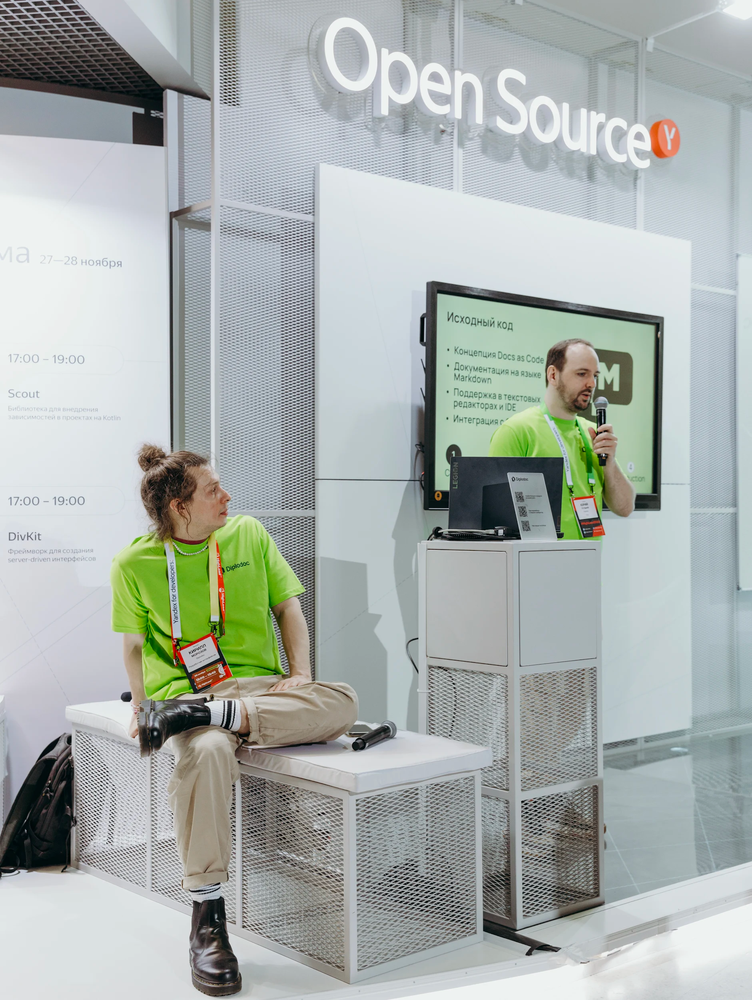

# Web Developer for the Documentation Platform

## What our work is like

We develop a software documentation platform in the [documentation as a code](https://yandex.ru/search/?text=documentation+as+a+code&clid=1955453&win=547&lr=2) paradigm.

The platform helps developers and technical writers produce high-quality documentation with minimal effort.

All documentation for [Yandex Cloud](https://cloud.yandex.ru/ru/docs), [Diplodoc](https://diplodoc.com/docs/ru/), the page you are currently reading, and many other products you cannot see yet are created on our platform.

The documentation as a code concept implies that writing documents should follow **[the principles of writing code](*documentation-as-a-code-rules)**, which aim to create a clear structure for easy understanding and reading.

### Minimum markup

In terms of interface, documentation is a simple service.

We take the main interface components from the open source library [@gravity-ui/uikit](https://gravity-ui.com/libraries/uikit).

For complex user content, we provide integration with [@gravity-ui/page-constructor](https://gravity-ui.com/libraries/page-constructor).

### Maximum logic

Most of our work involves text processing, extending the syntax of [Markdown constructs](https://github.com/diplodoc-platform/transform/blob/master/src/transform/plugins/table/index.ts), and creating new [extensions](https://github.com/diplodoc-platform/mermaid-extension) for the platform.

It is important not to get lost in loop increments, not to create excessive nesting, and to skillfully choose **[data structures](*data-structures)**.

### Servers{#servers}

The platform works not only as a set of utilities for building documentation,
but also as several server-side installations that help dynamically render documentation and index it.

The main technologies we work with on the servers:
{{servers}}

We work hands-on with all the listed technologies. We monitor server stability. We work on the architecture. We establish processes to ensure stability.



In total, more than one million unique users visit our servers per day.





Our task is to show documentation to users quickly and without errors, in any weather.



### OpenSource

Most of our platform is [hosted in open source](https://github.com/diplodoc-platform/diplodoc).

Supporting open source is an important part of our daily work:

- Communicating in issues and pull requests on GitHub in Russian and predominantly English.
- Presenting/promoting the product at various ** [conferences](*conference)**{.photo} and ** [meetups](*meetup)**{.photo}.
- Developing the product not for a specific company, but for the collective experience/expectations of the community.

## Expectations from the candidate

We expect that you already know or would be **interested** in quickly learning:



Nothing exotic is required. But you need to have a good grasp of the basics. And be able to apply them skillfully.

{{algorithms}}

An additional plus would be if you have worked with text tokenization algorithms or are familiar with text search algorithms.

Because we break texts into pieces and then assemble something new and wonderful from them.





{{servers}}

Because [we work a lot with servers](#servers)





**CommonMark** Markdown specification.

**GitHub Flavored Markdown** Markdown specification.

**JSONSchema** - we work with schemas more often than the average developer





**Git** - a bit deeper than just creating commits. We use it at the programmatic level.

**GitHub** - also deeply integrated into our product. We write gh-actions and gh-extensions for external consumers of the documentation platform.

**Webpack** - at the level of writing your own plugins.





We will understand each other better if you have already read:

**Clean Code** by Robert Martin

**Clean Architecture** by Robert Martin

**Site Reliability Engineering** by Betsy Beyer et al.



We also expect good communication skills. We have many external and internal customers.
There are many democratic processes within the development of a shared open source technology.
You need to listen a lot, analyze, and negotiate.

[*documentation-as-a-code-rules]:
- **DRY (Don’t Repeat Yourself)**: it is important to avoid duplicating information in documents.
- **KISS (Keep It Simple, Stupid)**: it is necessary to avoid unnecessary complexity and strive for simplicity in presenting information.
- **SRP (Single Responsibility Principle)**: each documentation block should be responsible for only one part of the functionality to maintain clarity of structure.
- **SLAP (Single Level of Abstraction Principle)**: it is necessary to break large documents into levels of abstraction and create separate concise documents for each level.
- **LoD (Law of Demeter)**: it is necessary to link only to relevant documents.
- The system is user-oriented, and it values not only readability but also the visual component. Therefore, the use of visual aids such as diagrams, charts, and video tutorials is also becoming increasingly important.
- **Quality control**: the system assumes a unified coding style, including text structure, indentation, spacing, etc., to facilitate understanding.
- **Versioning**: the system is integrated with popular VCS.
- **Localization**: the system is available to users in multiple languages. This is ensured by integration with [automatic](https://cloud.yandex.ru/ru/docs/translate/?from=int-console-empty-state) and [semi-automatic](https://ru.smartcat.com/) translation services.
- **Accessibility**: the system is accessible to visually impaired users.

[*data-structures]:
{{algorithms}}

[*meetup]:

[*conference]:

