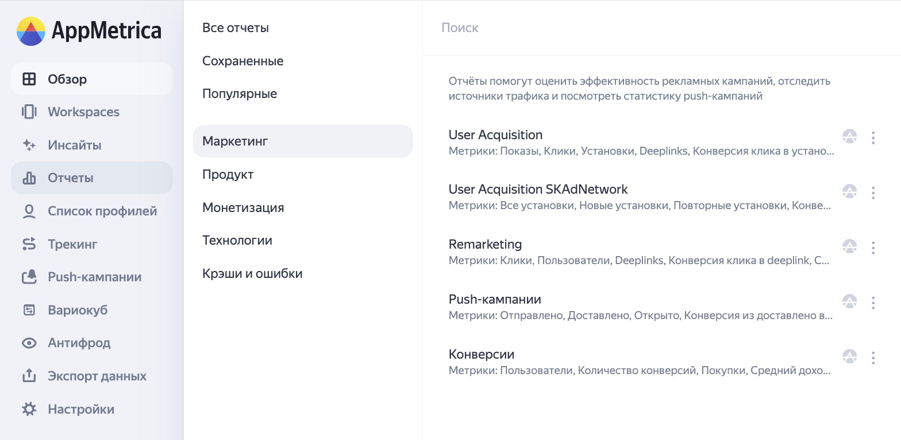
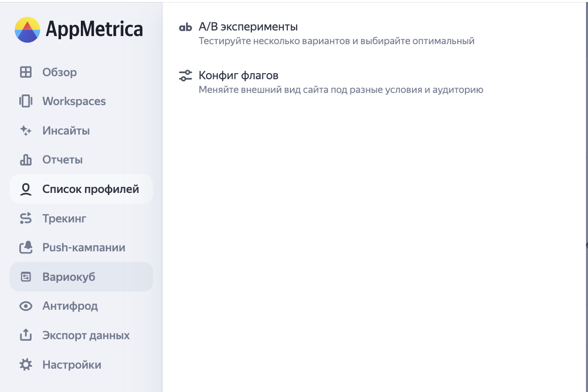
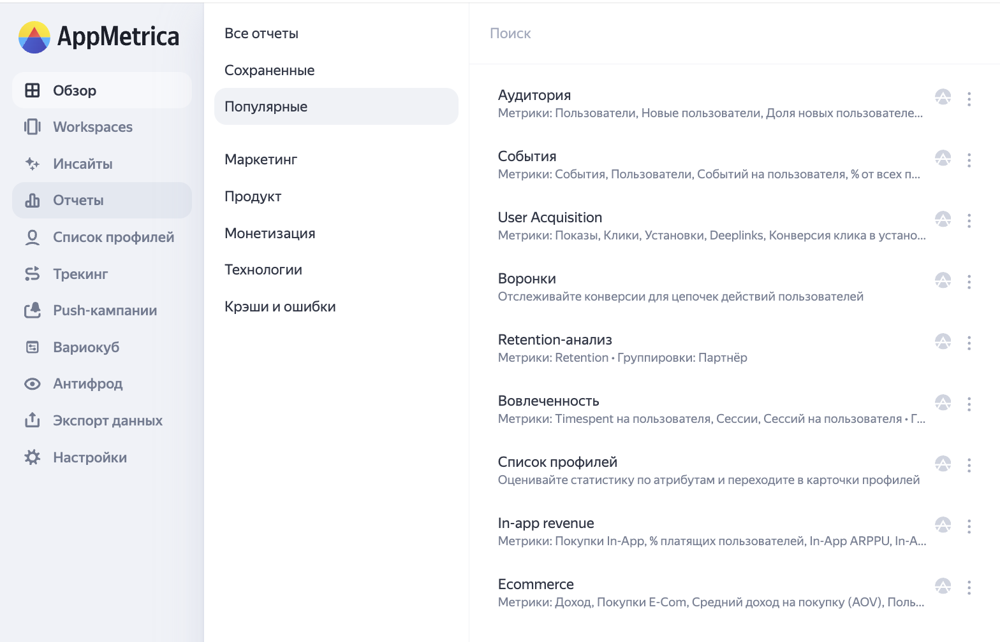
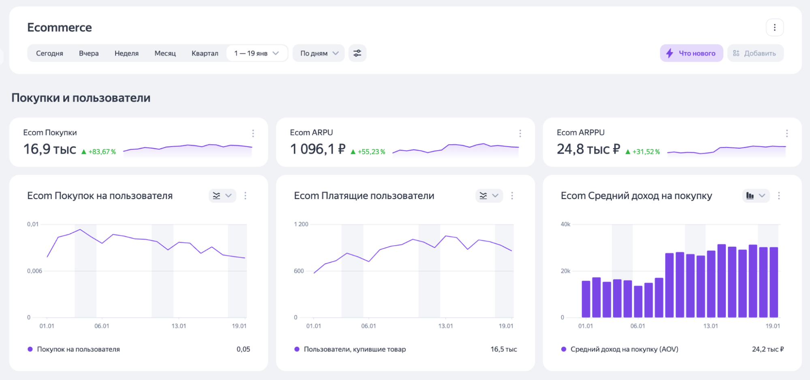
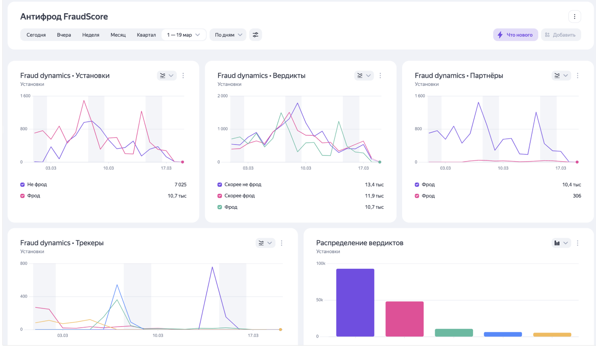

# Большое обновление интерфейса в AppMetrica: новая навигация в меню, дашборды и виджеты 

Представляем масштабное обновление интерфейса в AppMetrica. Наша команда долго работала, чтобы сделать вашу работу с аналитикой ещё удобнее и эффективнее. Теперь часто используемые функции всегда под рукой, а важные инструменты удобно сгруппированы, чтобы интерфейс оставался простым и удобным.

## Новое боковое меню

Мы полностью пересмотрели структуру бокового меню и сделали его ещё удобнее и ориентированным на ваши повседневные задачи.

Самые востребованные разделы теперь находятся на первом плане. Например, продуктовый отчёт «Список профилей» доступен напрямую из основного меню. Раньше он был в разделе «Отчёты».

Такие инструменты, как «А/B эксперименты» и «Конфиг флагов», теперь находятся в едином разделе «Вариокуб», а «Сохранённые отчёты» и «Технологии» перемещены в общий раздел «Отчёты».

{style="border: solid 1px #cccccc; max-width: 800px;"}
_Новое боковое меню._

{style="border: solid 1px #cccccc; max-width: 800px;"}
_Раздел Вариокуб._

## Изменения в отчётах и визуализации в виджетах

Все отчёты теперь систематизированы по ролевому принципу, что упрощает поиск нужной информации. Мы разделили их на 6 логических категорий: отчёты по маркетингу, продукту и монетизации, блок «Технологии», отчёты «Крэши и ошибки».

Такая структура позволяет каждому специалисту быстро находить именно те данные, которые соответствуют его задачам:

- **Маркетинговые отчёты** нужны для оценки эффективности рекламных кампаний, помогут отследить источники трафика и посмотреть статистику push-кампаний. В этот раздел войдут отчёты User Acquisition, User Acquisition SKAdNetwork, Remarketing и «Push-кампании».

- **Продуктовые отчёты** помогут проанализировать ключевые метрики продукта: активную аудиторию, возвращаемость и вовлечённость. В этот раздел войдут отчёты:

    - События

    - Воронки

    - Retention-анализ

    - Когортный анализ

    - Вовлечённость

    - Аудитория

    - Профили

    - Список профилей

- **Отчёты по монетизации** нужны, чтобы отследить метрики, которые связаны с доходами вашего приложения от In-Аpp покупок или рекламной монетизации. В этот раздел войдут отчёты In-Аpp Revenue и Ecommerce.

- **В блоке «Технологии»** будут храниться данные о технических характеристиках устройств ваших пользователей и версиях операционных систем. В нём можно найти такие отчёты, как «Версии приложения», «Операционные системы», «Тип устройства», «Версии SDK» и другие.

- **Обновлённый отчёт «Крэши и ошибки»** теперь предоставляет исчерпывающую информацию о наиболее частых сбоях в работе вашего приложения. Вы сможете увидеть детальную статистику по критическим крэшам, программным ошибкам и ситуациям с отсутствием отклика — ANRs.

Также появился раздел «Популярные», где находятся отчёты, которые чаще всего посещает конкретный пользователь. Такие отчёты будут показываться из расчётов количества просмотров на одного пользователя. В разделе может быть до 10 отчётов. 

{style="border: solid 1px #cccccc; max-width: 800px;"}
_Раздел «Популярные»._

## Новые дашборды 

В AppMetrica появились новые дашборды, а настройка стала гибкой и персонализированной. В дашбордах теперь можно создавать подразделы с заголовками и подзаголовками, менять порядок виджетов и настраивать их количество в ряду.

### Дашборды

Добавили дашборды Ecommerce и «Антифрод», чтобы эффективнее анализировать весь путь пользователя и оперативно отслеживать уровень фрода.

#### Дашборд Ecommerce

Позволяет отслеживать весь путь клиента — от первого визита до покупки. Какие метрики можно будет отслеживать:

- Покупки

- Покупки на пользователя

- AOV — средний доход на покупку

- Платящие пользователи

- Покупки: товары

- Покупки: категории

Вы можете настраивать дашборд под свои задачи: выбирать тип виджета — «График», «Таблица», «Показатель» — и формат визуализации.

Так выглядит дашборд в интерфейсе: 
{style="border: solid 1px #cccccc; max-width: 800px;"}

#### Дашборд Антифрод

В боковом меню появился новый дашборд «Антифрод», который поможет быстро оценивать уровень фрода. В нём можно анализировать установки, вердикты, партнёров и трекеры, а также отслеживать распределение вердиктов, если данная опция подключена.

{style="border: solid 1px #cccccc; max-width: 800px;"}

Вы можете настраивать дашборд под свои задачи: добавлять или удалять виджеты, менять их тип и визуализацию. Доступны разные форматы отображения: графики, таблицы, показатели: «Фрод», «Не фрод», «Итого и среднее».

## Виджеты

Для дашбордов можно подобрать удобную визуализацию. Вместо привычных линейных и столбчатых графиков теперь доступны:

- Линейные графики с накоплением

- Столбчатые графики с накоплением

- Столбчатые графики по категориям

- Круговые диаграммы

Теперь виджеты — это не только «График». Они могут быть трёх типов: «График», «Показатель» или «Таблица». 

Эти обновления делают AppMetrica ещё удобнее — чтобы вы могли быстрее находить нужные данные, гибко работать с визуализациями и принимать решения на основе точной аналитики.
