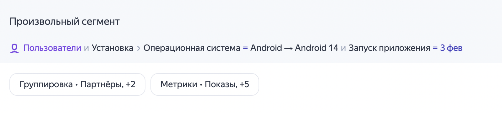
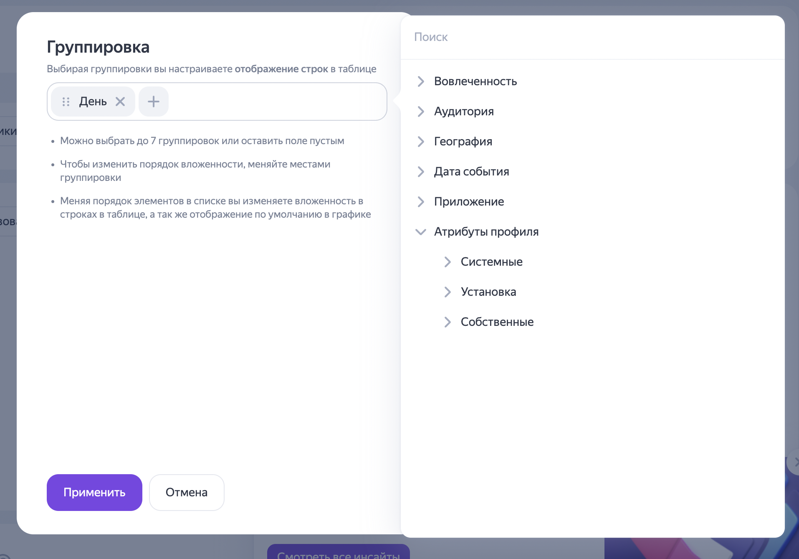
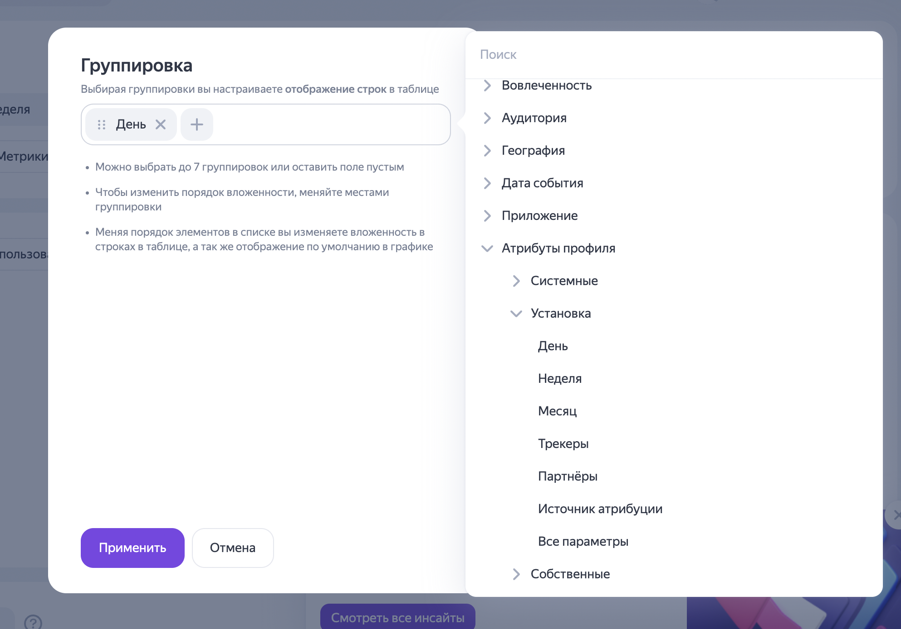
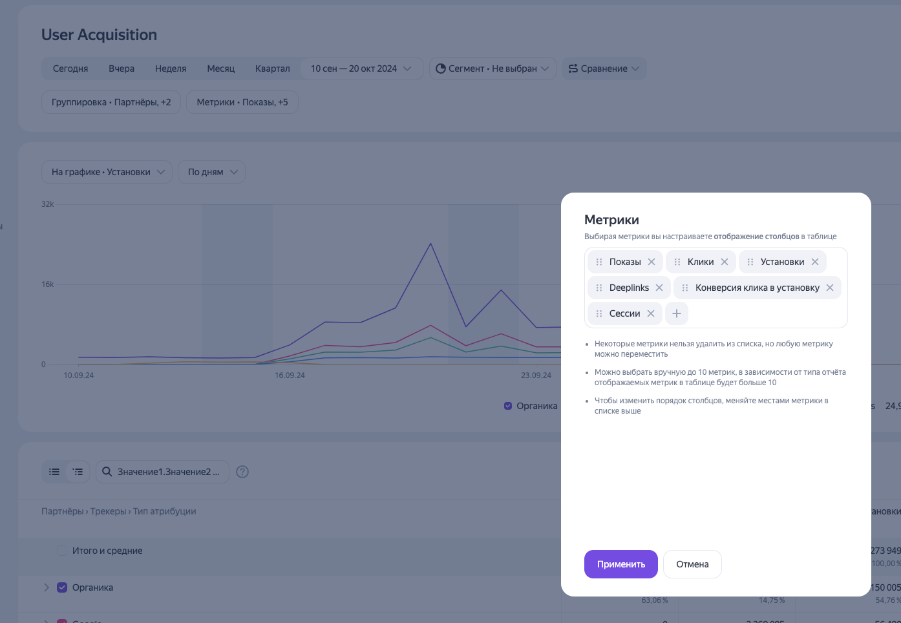
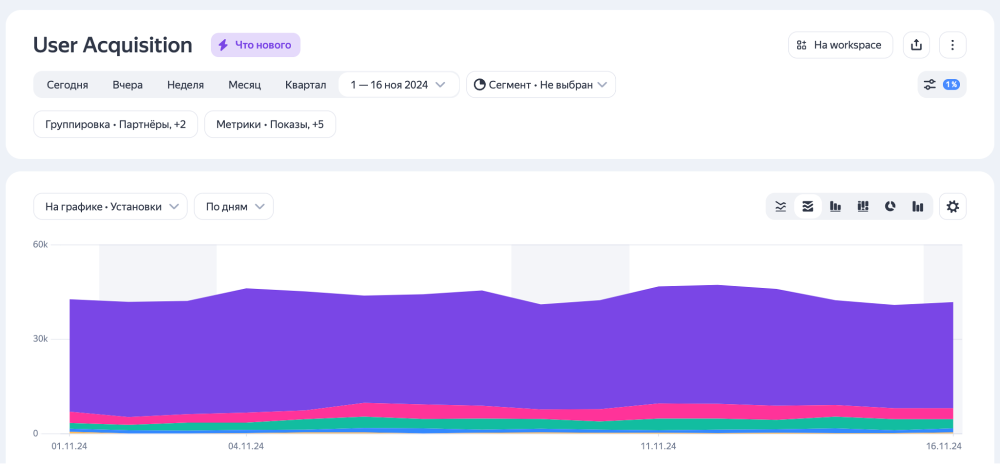
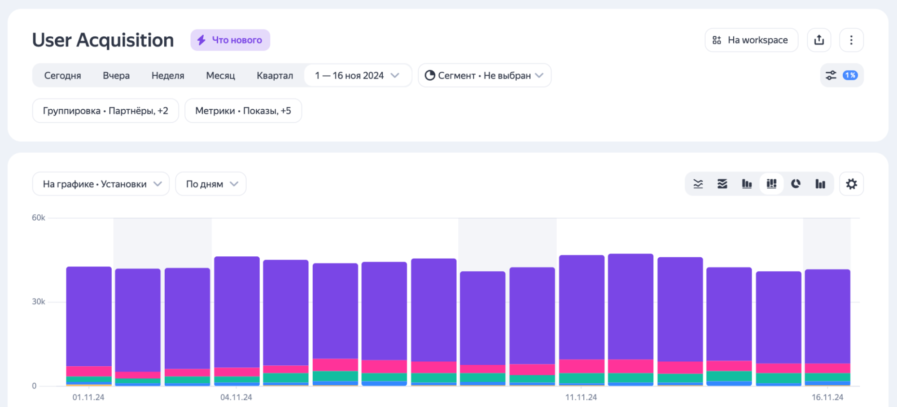
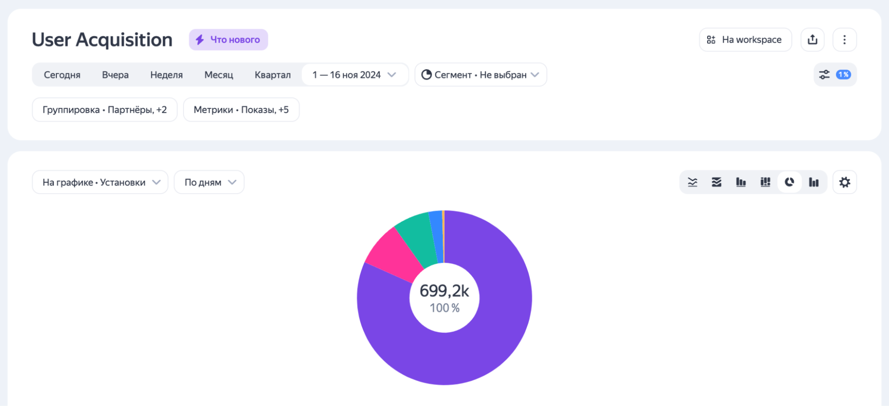
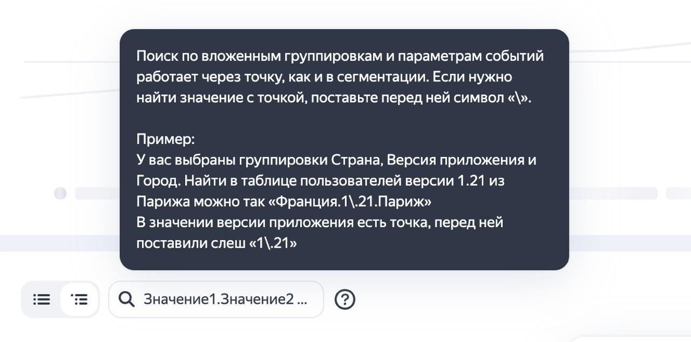
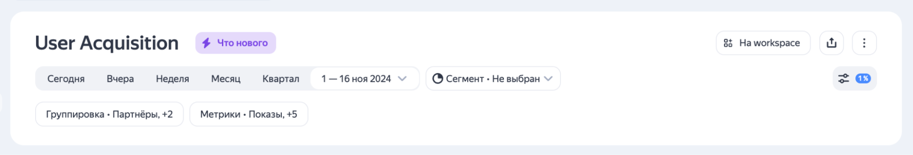

# Обновление интерфейсов отчётов в AppMetrica

Продолжаем делать AppMetrica лучше для вас. Мы усовершенствовали отчёты User Acquisition, Remarketing и «События». Рассказываем, что изменилось.

## Удобная сегментация

Теперь работать с сегментацией стало ещё проще. Раньше выбор параметров занимал много места на экране, что затрудняло анализ и создание понятных скриншотов для коллег. Вот как мы решили эту проблему:

- Создали новый компактный формат сегментации, с помощью которой можно быстрее находить нужную информацию и работать с ней.

- Сделали так, чтобы условия сегментации всегда были видны, но не мешали просмотру данных.

{style="border: solid 1px #cccccc; max-width: 800px;"}
_Новая сегментация._

## Поиск по вложенным группировкам и параметрам

### Группировка по атрибутам профиля

В отчётах AppMetrica теперь доступна группировка по атрибутам профиля. Профиль — это характеристика отдельного пользователя приложения, которая состоит из трёх атрибутов: системных, пользовательских и установок. Как правильно работать с профилями, рассказали в [Справке](../mobile-api/logs/ref/profiles.md).

Группировка по атрибутам профиля помогает проанализировать, чем различается поведение разных групп пользователей. С их помощью вы можете сравнить, например, в отчёте «Вовлеченность», сколько времени пользователи с разным статусом в программе лояльности или игровым уровнем проводят в приложении.

Кроме того, атрибуты профиля показывают текущие данные пользователя, а не его характеристики на момент совершения событий. Например, пользователь может быть зарегистрирован в Москве, но совершать покупки и действия в разных городах во время поездок. В профиле будет отображаться его московская регистрация, хотя события могли происходить в других локациях.

{style="border: solid 1px #cccccc; max-width: 800px;"}
_Группировка по атрибутам профиля._

Ещё появились атрибуты об источнике установки приложения, и вы сможете использовать данные по атрибуции в различных отчётах.

{style="border: solid 1px #cccccc; max-width: 800px;"}
_Атрибуты об источнике установки приложения._

### Графики

Теперь на график можно выводить любые метрики — просто выберите нужную в настройках отчёта.

{style="border: solid 1px #cccccc; max-width: 800px;"}

Кроме того, мы обновили визуализацию: диаграмму областей, круговую диаграмму, распределение значений и составную столбчатую диаграмму. А если для вашей задачи не нужна визуализация, то график можно скрыть.

{style="border: solid 1px #cccccc; max-width: 800px;"}

{style="border: solid 1px #cccccc; max-width: 800px;"}

{style="border: solid 1px #cccccc; max-width: 800px;"}

### Поиск по таблице

Поиск по вложенным группировкам и параметрам событий работает через точку, как и в сегментации. Если нужно найти значение с точкой, поставьте перед ней символ «\».

{style="border: solid 1px #cccccc; max-width: 600px;"}
_Поиск по таблице._

### Группировки и метрики

Ещё мы перенесли настройку группировок и метрик в верхнюю часть настроек отчёта — рядом с датами и сегментами. Их изменение влияет и на график, и на таблицу. Теперь настройки в верхней части страницы влияют на результат в нижней.

{style="border: solid 1px #cccccc; max-width: 800px;"}
_Группировки и метрики в отчёте User Acquisition._

### Переключение между приложениями с сохранением настроек

Больше не нужно заново настраивать сегментацию и группировки при переключении между приложениями в аккаунте. Это позволит быстрее сравнивать одни и те же параметры в разных приложениях и сэкономит время.

## Другие улучшения

Интерфейс стал аккуратнее и лаконичнее. Для этого мы уменьшили отступы, чтобы отчёты выглядели более компактно. Кроме того, мы выделили выходные дни цветом для удобства анализа временных рядов.
