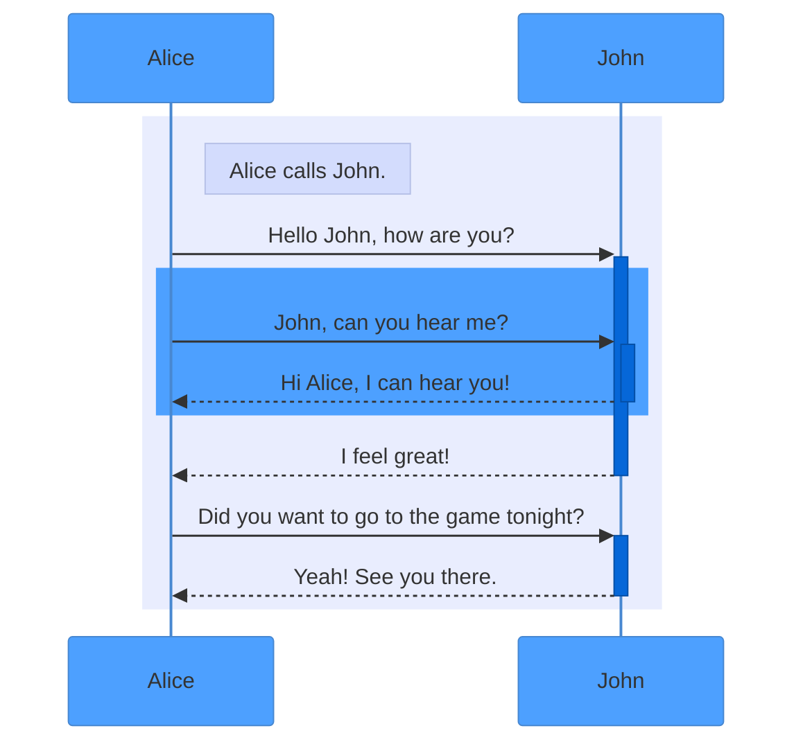
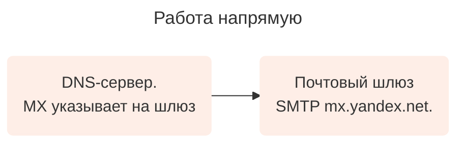
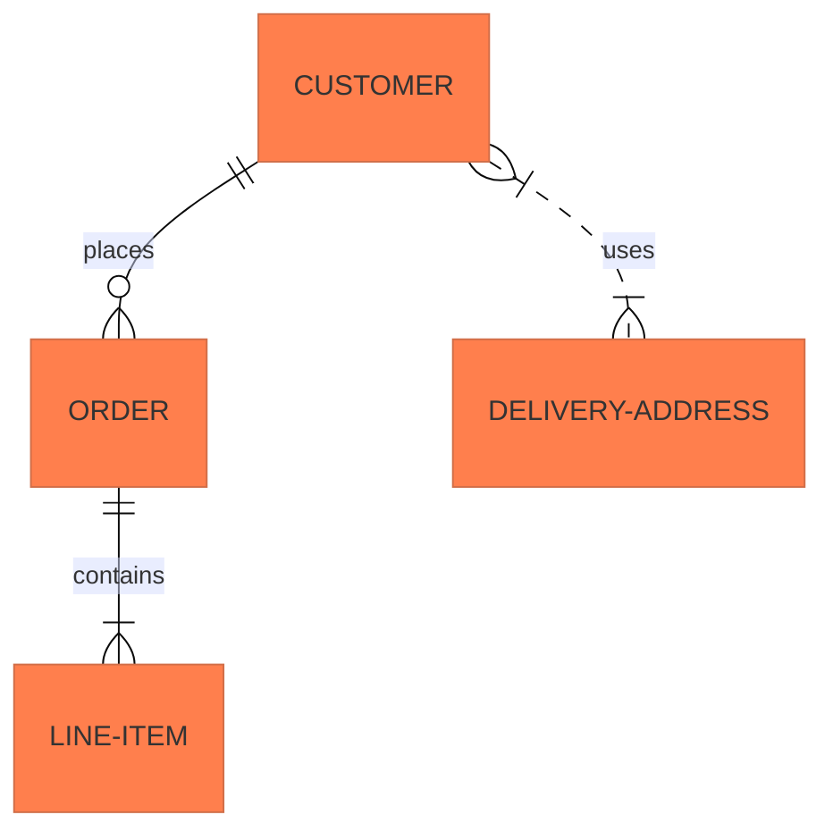
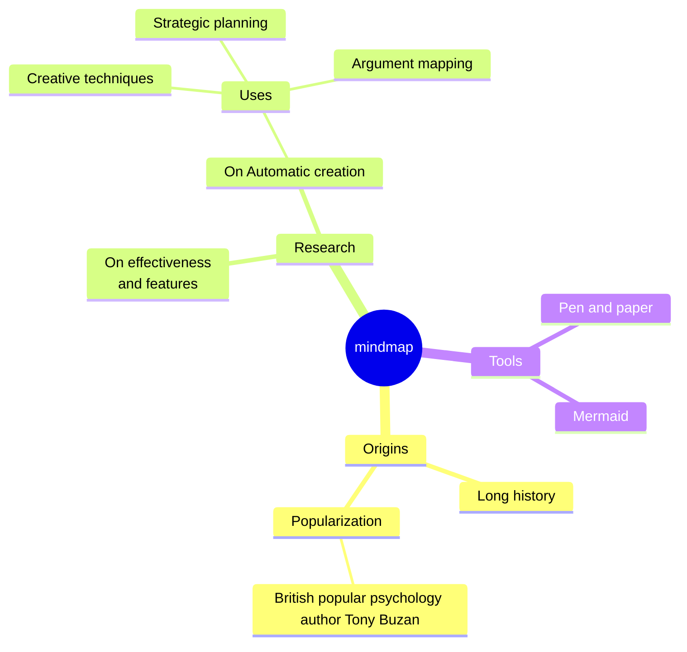
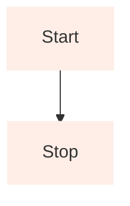

# Инструкция кастомизации Mermaid-диаграмм

## Введение

Mermaid — это инструмент для создания диаграмм и графиков на основе JavaScript, который использует определения текста на основе Markdown, и средство визуализации для создания и изменения сложных диаграмм.

В рамках этой инструкции мы подготовили несколько основных диаграмм, которые могут встречаться в документациях.

## Полезные ссылки

- [Документация Mermaid](https://mermaid.js.org/ecosystem/tutorials.html "title")
- [Песочница Mermaid](https://www.mermaidchart.com/play#pako:eNqrVkrOT0lVslJKyslPztZNSi1JjMlTAIPk_JzS3LxiBUOYgGN0jFJwSWJRSYxSLEwsJb88zwYorgAUs9MA8TRhUs4aIOX5BTFKUKGYPKVaAFC4IAA "title")



Данная инструкция в первую очередь описывает цветовую кастомизацию диаграмм. С логикой построения диаграмм можно ознакомиться на сайте Mermaid.



## Основные условия

- Диаграммы Mermaid применимы только на yfm-страницах.
- Любая вставка начинается с ` ```mermaid` и заканчивется ` ``` `.
- Каждая диаграмма заполняется отдельно.

## Sequence diagram

- [Документация Mermaid](https://mermaid.js.org/syntax/sequenceDiagram.html "title")
- [Песочница Mermaid](https://www.mermaidchart.com/play?utm_source=mermaid_live_editor&utm_medium=banner_ad&utm_campaign=visual_editor#pako:eNptzEEKwjAQheGrvGZrc4EuKoIL6xncDPHZBNIEo0Wk9O4mqcvOamC-fxZl4p2qUy8-ZwbDs5MxyXQLyHPyzlD3_eEabehwofcRZW9h4weSiG-cj7t4Y0ZCIbCUhIl_Wm46U12b_NhtdYuhFlXnrNnnAx6kx5go70atPxjSPW8 "title")



- 



### Блок кода

```

```

Параметры для цветовой кастомизации:
- `'primaryColor'::` — цветовое значение для «акторов» диаграммы «Alice» и «John» и соединяющих их линий. В соответствии с дизайн-проектом указываем `'#4DA0FF'`.
- `'secondaryColor':` — цветовое знание для блоков после стрелок. В соответствии с дизайн-проектом указываем `'#0667D8'`.
- `'noteBkgColor':` — цветовое значение для обозначения блоков формата «Alice calls John». В соответствии с дизайн-проектом указываем `'#D3DCFD'`.
- `rect rgba(233, 237, 254, 1)` — цветовое значение для подложки диаграммы. Действие ограничивается вторым `end`.
- `rect rgba(77, 160, 255, 1)` — цветовое значение для темно-синего блока посередине диаграммы. Действие ограничивается первым `end`.

## Flowchart

- [Документация Mermaid](https://mermaid.js.org/syntax/flowchart.html "title")
- [Песочница Mermaid](https://www.mermaidchart.com/play?utm_source=mermaid_live_editor&utm_medium=banner_ad&utm_campaign=visual_editor#pako:eNqrVkrOT0lVslJKy8kvT85ILCpR8AmKyVMAAkcFXd18BScIxwnIqVBwjslTqgUAkRUOXw "title")







### Блок кода

```

```

Параметры для цветовой кастомизации:
Для каждого «набора» цветов необходимо задавать параметры в строке

```
%% Styling
classDef orange fill:#FEEEE7,stroke:#FEEEE7,stroke-width:2px;
```

Где:

- `orange` — текстовое значение для цветового набора, которым мы задаем. Значение может быть любым.
- `fill:` — цветовое значение для блоков с текстом. В соответствии с дизайн-проектом указываем `#FEEEE7`.
- `stroke:` — цветовое значение для рамки блоков. В соответствии с дизайн-проектом указываем `#FEEEE7`.
- `stroke-width:` — ширина рамки. В соответствии с дизайн-проектом указываем `2px`.

Чтобы присвоить значения «набора» цветов для конкретного элемента, укажите название этого «набора». На примере
`A("DNS-сервер. MX указывает на шлюз"):::orange`, где `:::orange` — название цветового «набора». 

## Entity Relationship Diagram

- [Документация Mermaid](https://mermaid.js.org/syntax/entityRelationshipDiagram.html "title")
- [Песочница Mermaid](https://www.mermaidchart.com/play?utm_source=mermaid_live_editor&utm_medium=banner_ad&utm_campaign=visual_editor#pako:eNp1z90KwiAYgOFbEc_tAnYWU0KoDGeDwU7MfZWwZljtZO7esx_pjzzz4_FVB2xcAzjD4KnVO68PdYfiyteFEgsm0RgmkzAgyua8ZLIiU0olKwqUob0-fdkQCHEDEpLGTYaOrTbwx_BlKXjOoqpxa_WmBbR1vsYP_XPbV9mDAdundmrdUHgh43rwT_KYvQPCFVtEZTvTXpqUWklB17ki-VSxmZBVOvKc36vdWdvu03-8L5Vr7HwDHpp4x-1jeLwCmiBtBQ "title")
- Ссылка на шаблон - TBD






### Блок кода

```

```

Параметры для цветовой кастомизации:

- `'primaryColor':` — цветовое значение для основных блоков с текстом. В соответствии с дизайн-проектом указываем `'#FF7F4D'`.
- `'tertiaryColor':` — цветовое значение для второстепенных блоков с текстом, которые расположены на стрелках. В соответствии с дизайн-проектом указываем `'#D3DCFD'`.

## Mindmaps

- [Документация Mermaid](https://mermaid.js.org/syntax/flowchart.html "title")
- [Песочница Mermaid](https://www.mermaidchart.com/play?utm_source=mermaid_live_editor&utm_medium=banner_ad&utm_campaign=visual_editor#pako:eNpdkMFOw0AMRH_Fyik5IO4VQmq5glqVcuvF3Tgbi8RevLuVUsS_k5KmQH3zm_Fo5M_CaU3FouhZ6h7DXgBMNZXlBVTVGQGsjT1LnBaAZxUPLcekNsxssWCnUjYIDd4dVN-rWdloyB0anzCxykwBVsaJYwth0iHEwbXaqR8Ac2rVYKcywCqf8HK1pUhorp0z1gLUNOQSH0koxoeD3T-i1NAQpmwU_xiXOWk_NnDgjG6avMVf6zRPP54jQSLXCn_kW8NrMkzkx7jQoQiL_68vzeeeJMH4xXBVd6rdNWhDAueyAQPZDF_IeuR6L8XXN7kLgpw "title")






### Блок кода

```

```



Цветовая кастомизация Mindmaps происходит через кастомные css-стили.



## Block Diagram

- [Документация Mermaid](https://mermaid.js.org/syntax/block.html "title")
- [Песочница Mermaid](https://www.mermaidchart.com/play?utm_source=mermaid_live_editor&utm_medium=banner_ad&utm_campaign=visual_editor#pako:eNqrVkrOT0lVslJKyslPztZNSi1JjMlTAIPk_JzS3LxiBUOYgGN0jFJwSWJRSYxSLEwsJb88zwYorgAUs9MA8TRhUs4aIOX5BTFKUKGYPKVaAFC4IAA "title")







### Блок кода

```

```

Цветовые значения в этой диаграмме задаются для каждого отдельного блока через строку вида:
- `style A` — название блока, который нужно перекрасить.
- `fill:` — цветовое значение для блока. В соответствии с дизайн-проектом указываем `#FEEEE7`.
- `stroke:` — цветовое значение для рамки блока.
- `stroke-width:` — значение ширины рамки. По умолчанию указываем `4px`.



На текущий момент Diplodoc умеет поддерживать диаграмму вида «graph TD». Если указать «block-beta», как это указано в документации, диаграмма не соберется.


