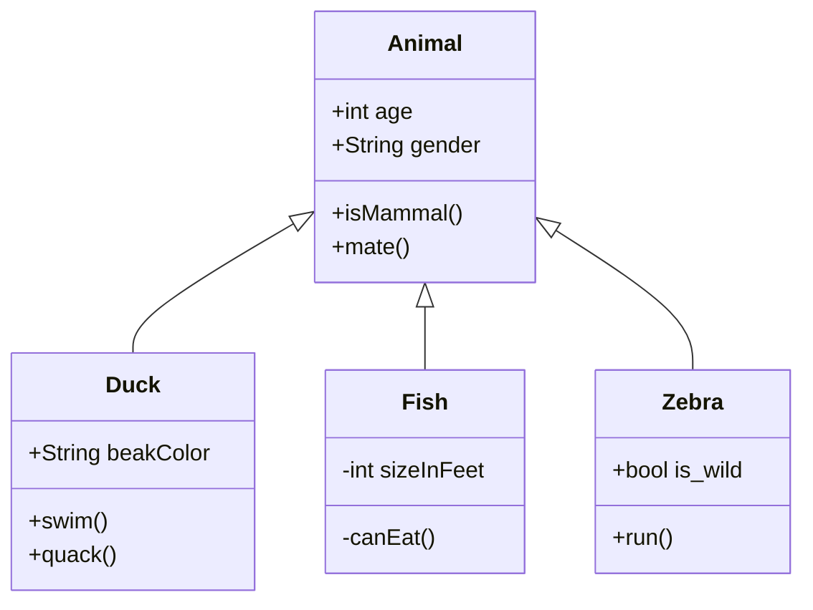

# Mermaid

Mermaid — библиотека для создания диаграмм и блок-схем с помощью языка разметки, похожего на Markdown. Все поддерживаемые типы диаграмм перечислены [в официальной документации](https://mermaid.js.org/intro/#diagram-types).



Использовать Mermaid можно только после установки расширения `@diplodoc/mermaid-extension`.

Подробнее о том, как устанавливать и подключать расширения, смотрите в разделе [Расширения Diplodoc](../extensions/index.md).



#### Узнайте больше

- [Синтаксис Mermaid](https://mermaid.js.org/intro/syntax-reference.html)
- [Mermaid Live Editor](https://mermaid.live)

## Пример работы

Разметка:

```
classDiagram
    Animal <|-- Duck
    Animal <|-- Fish
    Animal <|-- Zebra
    Animal : +int age
    Animal : +String gender
    Animal: +isMammal()
    Animal: +mate()
    class Duck{
      +String beakColor
      +swim()
      +quack()
    }
    class Fish{
      -int sizeInFeet
      -canEat()
    }
    class Zebra{
      +bool is_wild
      +run()
    }
```

Результат:


