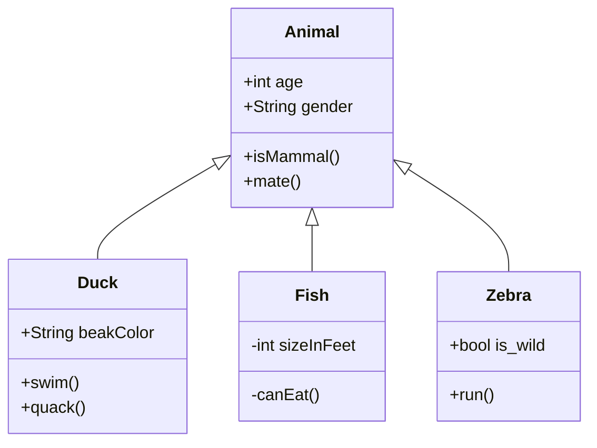
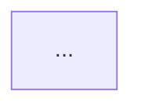

# Mermaid

Mermaid — библиотека для создания диаграмм и блок-схем с помощью языка разметки, похожего на Markdown. Все поддерживаемые типы диаграмм перечислены [в официальной документации](https://mermaid.js.org/intro/#diagram-types).



Использовать Mermaid можно только после установки расширения `@diplodoc/mermaid-extension`.

Подробнее о том, как устанавливать и подключать расширения, смотрите в разделе [Расширения Diplodoc](../extensions/index.md).



Узнайте больше:

- [Синтаксис Mermaid](https://mermaid.js.org/intro/syntax-reference.html)
- [Mermaid Live Editor](https://mermaid.live)

## Пример {#example}

Синтаксис:

````
```mermaid

...описание диаграммы...

```
````

Разметка:

```
classDiagram
    Animal <|-- Duck
    Animal <|-- Fish
    Animal <|-- Zebra
    Animal : +int age
    Animal : +String gender
    Animal: +isMammal()
    Animal: +mate()
    class Duck{
      +String beakColor
      +swim()
      +quack()
    }
    class Fish{
      -int sizeInFeet
      -canEat()
    }
    class Zebra{
      +bool is_wild
      +run()
    }
```

Результат:


```mermaid
classDiagram
    Animal <|-- Duck
    Animal <|-- Fish
    Animal <|-- Zebra
    Animal : +int age
    Animal : +String gender
    Animal: +isMammal()
    Animal: +mate()
    class Duck{
      +String beakColor
      +swim()
      +quack()
    }
    class Fish{
      -int sizeInFeet
      -canEat()
    }
    class Zebra{
      +bool is_wild
      +run()
    }
```

## Компоновка ELK {#elk-layout}

Помимо стандартной компоновки `dagre` поддерживается алгоритм компоновки [ELK](https://eclipse.dev/elk/) от Eclipse Layout Kernel. ELK лучше справляется с большими и сложными графами: минимизирует пересечения рёбер, аккуратнее располагает узлы и поддерживает дополнительные параметры размещения. Применяется к диаграммам типов `flowchart` и `stateDiagram`.

Компоновка задаётся через директиву `%%{init}%%` в начале блока диаграммы.



- Flowchart

  Разметка:

  ````
  ```mermaid
  %%{
    init: {
      'layout': 'elk'
    }
  }%%
  flowchart LR
      A[Начало] --> B{Условие}
      B -->|Да| C[Шаг 1]
      B -->|Нет| D[Шаг 2]
      C --> E[Конец]
      D --> E
  ```
  ````

  Результат:

  ```mermaid
  %%{
    init: {
      'layout': 'elk'
    }
  }%%
  flowchart LR
      A[Начало] --> B{Условие}
      B -->|Да| C[Шаг 1]
      B -->|Нет| D[Шаг 2]
      C --> E[Конец]
      D --> E
  ```

- StateDiagram

  Разметка:

  ````
  ```mermaid
  %%{
    init: {
      'layout': 'elk'
    }
  }%%
  stateDiagram-v2
      [*] --> Ожидание
      Ожидание --> Обработка: старт
      Обработка --> Успех: ok
      Обработка --> Ошибка: fail
      Успех --> [*]
      Ошибка --> Ожидание: retry
  ```
  ````

  Результат:

  ```mermaid
  %%{
    init: {
      'layout': 'elk'
    }
  }%%
  stateDiagram-v2
      [*] --> Ожидание
      Ожидание --> Обработка: старт
      Обработка --> Успех: ok
      Обработка --> Ошибка: fail
      Успех --> [*]
      Ошибка --> Ожидание: retry
  ```



### Параметры ELK {#elk-options}

Дополнительные параметры задаются в поле `elk` внутри `init`:

````

```mermaid
%%{
  init: {
    'layout': 'elk',
    'elk': {
      'mergeEdges': true,
      'nodePlacementStrategy': 'BRANDES_KOEPF',
      'cycleBreakingStrategy': 'GREEDY'
    }
  }
}%%
flowchart LR
    ...
```
````

Доступные параметры:

- `mergeEdges` — объединять параллельные рёбра между одной парой узлов в общий отрезок. Значения: `true`, `false` (по умолчанию).
- `nodePlacementStrategy` — стратегия размещения узлов внутри слоя. Значения:
  - `BRANDES_KOEPF` (по умолчанию) — сбалансированное размещение с минимизацией изгибов рёбер;
  - `NETWORK_SIMPLEX` — оптимизация суммарной длины рёбер;
  - `LINEAR_SEGMENTS` — выравнивание узлов вдоль прямых сегментов;
  - `SIMPLE` — простое размещение по центру слоя.
- `cycleBreakingStrategy` — стратегия разрыва циклов в графе. Значения:
  - `GREEDY` (по умолчанию) — жадный алгоритм на основе эвристики;
  - `DEPTH_FIRST` — обход в глубину;
  - `INTERACTIVE` — сохранение направления рёбер из исходного описания;
  - `MODEL_ORDER` — по порядку объявления в диаграмме.
- `considerModelOrder` — учитывать порядок объявления узлов при минимизации пересечений. Значения: `NONE` (по умолчанию), `NODES_AND_EDGES`, `PREFER_EDGES`, `PREFER_NODES`.
- `forceNodeModelOrder` — принудительно сохранять порядок узлов из исходного описания. Значения: `true`, `false` (по умолчанию).

Полный список параметров доступен в [документации Mermaid](https://mermaid.js.org/config/schema-docs/config-properties-elk.html).
