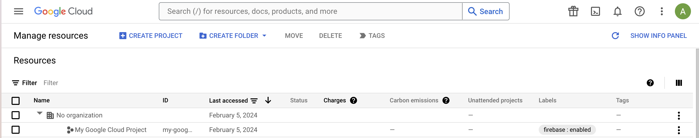
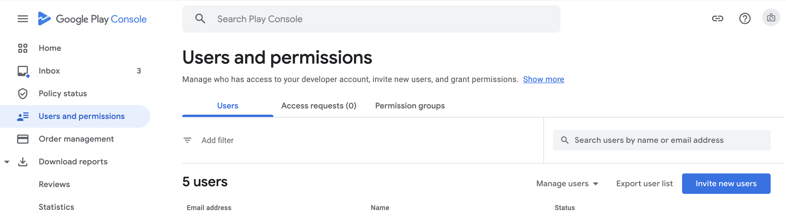
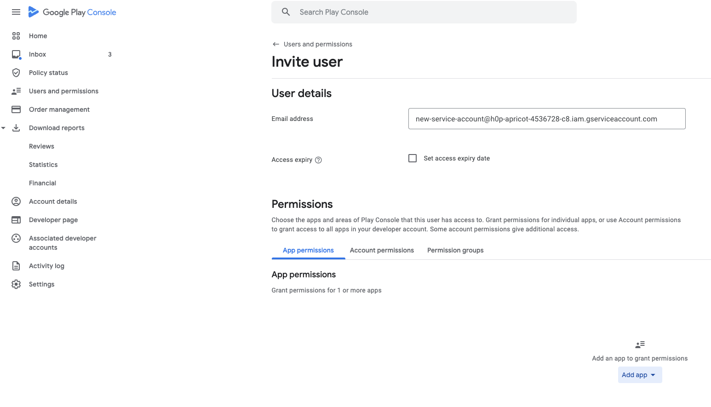
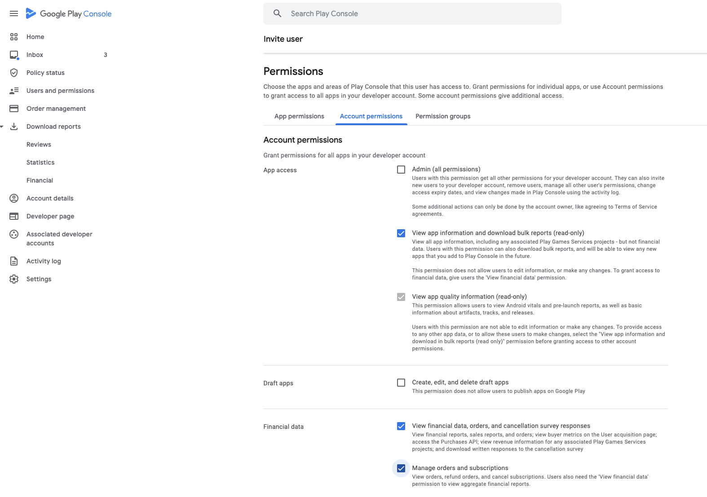
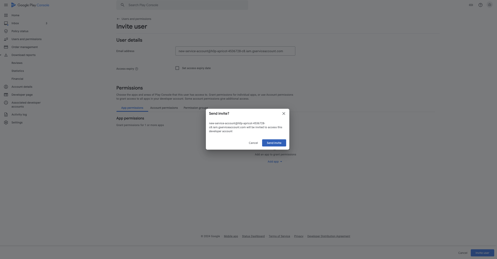

# In-app подписки Google Play

<!-- 

Функциональность больше не поддерживается и не обновляется. Точность данных не гарантируется.

AppMetrica предоставляет [альтернативную технологию трекинга](https://appmetrica.yandex.com/docs/ru/data-collection/apphud/apphud-about), которая доступна в некоторых регионах.

 -->

Для отслеживания изменений статуса подписок в Google Play необходимо создать и загрузить в AppMetica json-файл сервисного аккаунта. Ниже подробно описаны шаги для создания сервисного аккаунта.

## Создание сервисного аккаунта {#create-service-account}

1. Откройте существующий или создайте новый Google Cloud проект в [управлении ресурсами Google Cloud](https://console.cloud.google.com/cloud-resource-manager).

    
    
    {style="border: solid 1px #cccccc; max-width: 800px;"}

    
    
1. Через поиск найдите меню **Service accounts** и перейдите в него.
    
    
    
    {style="border: solid 1px #cccccc; max-width: 800px;"}
    
    
    
1. На открывшейся странице нажмите **+ CREATE SERVICE ACCOUNT** в верхней части экрана.
    
    
    
    {style="border: solid 1px #cccccc; max-width: 800px;"}
    
    
    
1. Введите имя аккаунта, например, "AppMetrica" и нажмите кнопку **CREATE**.
    
    
    
    {style="border: solid 1px #cccccc; max-width: 800px;"}
    
    
    
1. Выберите роль **Editor** для этого аккаунта (можно найти через Basic — Editor).
    
    
    
    {style="border: solid 1px #cccccc; max-width: 800px;"}
    
    
    
1. Создайте новый приватный ключ для этого аккаунта. Для этого нажмите  в разделе **Actions** справа от сервисного аккаунта и выберите **Manage keys**.
    
    
    
    {style="border: solid 1px #cccccc; max-width: 800px;"}
    
    
    
1. Далее на открывшейся странице управления ключами нажмите **ADD KEY — Create new key**. Выберите тип ключа **JSON** и нажмите **CREATE**.
    
    
    
    {style="border: solid 1px #cccccc; max-width: 800px;"}
    
    {style="border: solid 1px #cccccc; max-width: 800px;"}
    
    
    
1. Предоставьте сервисному аккаунту доступ к финансовым данным приложения, чтобы AppMetrica могла валидировать и проверять статус подписок Google Play.
    
    Перейдите на страницу [Users and permissions](https://play.google.com/console/users-and-permissions?hl=ru) в консоли Google Play.
    
1. Нажмите **Invite new users**.

    
    
    {style="border: solid 1px #cccccc; max-width: 800px;"}
    
    
    
1. В поле адреса электронной почты укажите адрес электронной почты вашего сервисного аккаунта:
    
    
    
    {style="border: solid 1px #cccccc; max-width: 800px;"}
    
    
    
1. На этой же странице перейдите на вкладку **Account permissons** и отметьте следующие пункты:
    - View app information and download bulk reports (read-only).
    - View financial data, orders, and cancellation survey responses.
    - Manage orders and subscriptions.

    {style="border: solid 1px #cccccc; max-width: 800px;"}
    
1. Вернитесь на вкладку **App permissions** и выберите приложение, для которого настраиваете отслеживание (**Add app**). Далее нажмите **Invite user** и во всплывающем окне **Send Invite**:

    {style="border: solid 1px #cccccc; max-width: 800px;"}
    
1. Перейдите в интерфейс AppMetrica, в настройки вашего приложения и раздел **Revenue**.
    
1. В AppMetrica, перейдите в **Настройки** → **Revenue** → **Отслеживание и валидация подписок Google Play** и загрузите JSON сервисного аккаунта.
    
    
    
    {style="border: solid 1px #cccccc; max-width: 800px;"}
    
    

## Топик для отслеживания подписок {#topic}

Также для отслеживания статусов подписок используется топик Google Cloud Console. В AppMetrica можно выбрать один из трех вариантов работы с топиком:

1. В AppMetrica будет создан новый топик. Если вы не используете еще один сервис для отслеживания подписок, рекомендуется этот вариант.
    
    Скопируйте название топика в интерфейсе и вставьте его в **Google Play Console** → **Monetization setup** → **вставьте топик в поле Topic name**.
    
    
    
    Убедитесь, что топик Cloud Pub/Sub существует, и что вы предоставили Google необходимые права на публикацию уведомлений. Подробнее в [документации](https://developer.android.com/google/play/billing/getting-ready#configure-rtdn).
    
    
    
2. Использовать существующий топик. Если вы используете дополнительный сервис для отслеживания подписок, у вас уже создан топик. В Google Cloud Console нет возможности использовать одновременно два топика, поэтому вам необходимо скопировать ваш текущий топик и вставить его в AppMetrica, в раздел **Настройки**, подраздел **Revenue**.
    
    Для этого перейдите в **Google Play Console** → **Monetization setup**, в поле **Topic name** скопируйте название топика и вставьте его в поле ввода в настройках Revenue в интерфейсе AppMetrica.
    
3. Не использовать топик. Такой вариант не рекомендуется, так как при отсутствии топика AppMetrica будет только раз в день проверять статусы подписок, то есть данные о подписках могут приходить с задержкой в 24 часа. Также часть событий о подписках будет недоступна.

## Возможные проблемы и их решение {#troubleshooting}



Возникает ошибка `PERMISSION_DENIED: Cloud Pub/Sub API has not been used in project before or it is disabled`.

Это означает, что для проекта не было активировано Pub/Sub API, необходимо перейти по ссылке в сообщении об ошибке, например: [https://console.developers.google.com/apis/api/pubsub.googleapis.com/overview?project=123456](https://console.developers.google.com/apis/api/pubsub.googleapis.com/overview?project=123456), и нажать **Enable**, чтобы активировать Pub/Sub API. Затем вернуться в AppMetrica и еще раз нажать **Сохранить и включить отслеживание**.

{style="border: solid 1px #cccccc; max-width: 800px;"}



{{ feedback }}

<a href="../troubleshooting/feedback-new.html">
  Написать в службу поддержки
</a>


