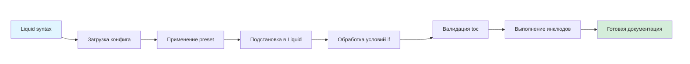

# Правила для внешних контрибьюторов

На странице описано, что нужно сделать, чтобы ваши изменения приняли в проект Diplodoc.



Перед началом работы над изменениями в CLI изучите файл [AGENTS.md](https://github.com/diplodoc-platform/cli/blob/master/AGENTS.md) — он содержит контекст о структуре и архитектуре проекта.



## Процесс сборки документации



Схема показывает последовательность этапов сборки документации в Diplodoc: от исходных файлов с Liquid-синтаксисом до финальной версии документации.

## Требования к коду {#code-requirements}

### Код-стайл и линтинг

Пишите код в едином стиле. Для проверки используйте [пакет `@diplodoc/lint`](https://www.npmjs.com/package/@diplodoc/lint):

- ESLint — проверка JavaScript/TypeScript кода.
- Prettier — форматирование кода.
- Stylelint — проверка CSS/SCSS.

Перед отправкой пул-реквеста выполните:

```bash
npm run lint
```

Для автоматического исправления ошибок:

```bash
npm run lint:fix
```

### TypeScript

- Пишите весь исходный код на TypeScript.
- Расширяйте общую конфигурацию `@diplodoc/tsconfig`.
- Проверяйте типы командой `npm run typecheck`.

### Документирование архитектурных изменений (ADR)

Если ваши изменения затрагивают архитектуру проекта, создайте [ADR](*adr)-файл в формате Markdown в соответствующей папке репозитория. В файле укажите:

- контекст проблемы;
- рассмотренные варианты решения;
- принятое решение и его обоснование.

## Тестирование {#test-requirements}

Покрывайте изменения тестами — это обязательное условие для принятия пул-реквеста.

### Тест-раннер

В проекте используется Vitest. Другие тест-раннеры, например, Jest не поддерживаются.

```bash
npm run test        # Запуск тестов
npm run test:watch  # Запуск в watch-режиме
```

### Структура тестов

- Unit-тесты — размещайте рядом с тестируемым кодом:

  - `src/**/*.test.ts`
  - `src/**/*.spec.ts`
  - `src/**/__tests__/`

- Интеграционные тесты — в директории `test/` (не `tests/`):

  - `test/**/*.test.ts`

### Конфигурация

Создайте файл `vitest.config.mjs` в корне пакета:

```javascript
import {defineConfig} from 'vitest/config';

export default defineConfig({
    test: {
        include: ['src/**/*.test.ts', 'test/**/*.test.ts'],
        exclude: ['node_modules', 'build'],
    },
});
```

## Требования к пул-реквестам {#pr-requirements}

### Описание изменений

Добавьте в пул-реквест:

- Описание проблемы — что исправляете или добавляете.
- Описание решения — как решили проблему.
- Ссылки — на связанные issues или документацию.

#|
|| **Тип изменений** | **Что добавить** ||
|| Исправление ошибки | Ссылка на issue или описание ошибки ||
|| Новая функциональность | Описание функциональности, примеры использования ||
|| Визуальные изменения | Скриншоты или видео до/после ||
|| Изменения API | Примеры кода до/после ||
|#

### Оформление коммитов

Подробные требования к оформлению коммитов смотрите в разделе [**Внесение изменений в проект**](./contribution.md).

## Требования к Extensions {#extension-requirements}

### Использование шаблона

При создании нового расширения используйте официальный шаблон из репозитория [package-template](https://github.com/diplodoc-platform/package-template).

### Учёт многопоточности

Сборка документации может выполняться в многопоточном режиме. Убедитесь, что ваше расширение:

- не использует глобальное состояние;
- корректно работает при параллельном выполнении;
- не создает race conditions.

## Инфраструктура модулей {#infrastructure}

### @diplodoc/lint

Используйте `@diplodoc/lint` для единой инфраструктуры линтинга:

```bash
# Инициализация нового пакета
npx @diplodoc/lint init

# Обновление существующего пакета
npx @diplodoc/lint update
```

### Скрипты в package.json

Определите в `package.json` следующие скрипты:

#|
|| **Скрипт** | **Назначение** ||
|| `build` | Полная сборка пакета ||
|| `build:js` | Сборка JavaScript (esbuild) ||
|| `build:declarations` | Генерация TypeScript деклараций ||
|| `typecheck` | Проверка типов: `tsc --noEmit` ||
|| `test` | Запуск тестов: `vitest run` ||
|| `test:watch` | Запуск тестов в watch-режиме ||
|| `lint` | Проверка кода: `lint update && lint` ||
|| `lint:fix` | Исправление ошибок: `lint update && lint fix` ||
|| `prepublishOnly` | Проверки перед публикацией ||
|#



Используйте скрипт `test:watch` в процессе разработки. Он запускает тесты в режиме отслеживания изменений и автоматически перезапускает их при сохранении файлов. Это позволяет оперативно проверять работу кода без необходимости ручного перезапуска.



### Режим watch

Команда `npm run watch` запускает среду разработки: собирает пакеты, следит за изменениями и автоматически перезапускает сборку. Это позволяет сразу видеть результат изменений без ручного запуска команд сборки.

[Подробнее на GitHub](https://github.com/diplodoc-platform/diplodoc/blob/master/.agents/monorepo.md#watch-mode)

### Файлы модуля

Добавьте в каждый модуль:

- `SECURITY.md` — политика безопасности
- `CONTRIBUTING.md` — руководство для контрибьюторов
- `LICENSE` — лицензия проекта
- `vitest.config.mjs` — конфигурация Vitest
- `.github/workflows/` — CI/CD workflows

## Неподдерживаемые инструменты {#unsupported}

Инструменты и пакеты, которые не поддерживаются в проекте. Используйте рекомендуемые альтернативы.

**Сборка**

- Webpack → используйте esbuild
- tsc для сборки JS → используйте esbuild, tsc только для деклараций

**Устаревшие пакеты**

- `@diplodoc/eslint-config` → используйте `@diplodoc/lint`
- `@diplodoc/prettier-config` → используйте `@diplodoc/lint`

## Чеклист перед отправкой PR {#checklist}

Перед отправкой пул-реквеста проверьте:

- Код соответствует стилю проекта (`npm run lint` проходит без ошибок).
- Типы проверены (`npm run typecheck` проходит без ошибок).
- Тесты написаны и проходят (`npm run test` проходит без ошибок).
- Сборка работает (`npm run build` проходит без ошибок).
- Пул-реквест содержит описание изменений.
- Для архитектурных изменений создан ADR.
- Для визуальных изменений добавлены скриншоты.
- Коммиты оформлены согласно [conventional commits](https://www.conventionalcommits.org/).
- Используются только поддерживаемые инструменты (Vitest, esbuild).

## Дополнительные ресурсы

- [Требования к участию в метапакете](https://github.com/diplodoc-platform/diplodoc/blob/master/.agents/metapackage-requirements.md)
- [Управление метапакетами](https://github.com/diplodoc-platform/diplodoc/blob/master/.agents/monorepo.md)
- [Инфраструктура разработки](https://github.com/diplodoc-platform/diplodoc/blob/master/.agents/dev-infrastructure.md)

[*adr]: Architecture Decision Records
