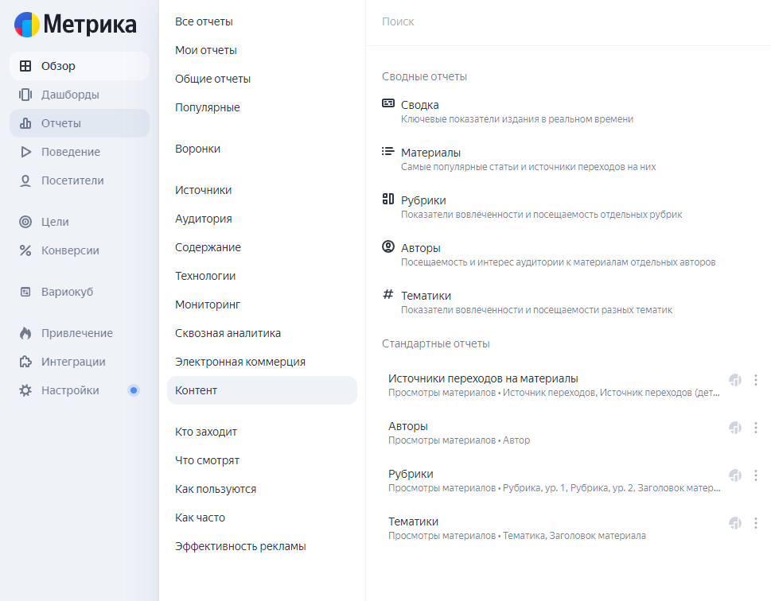
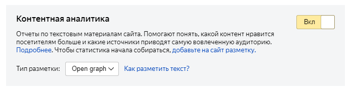
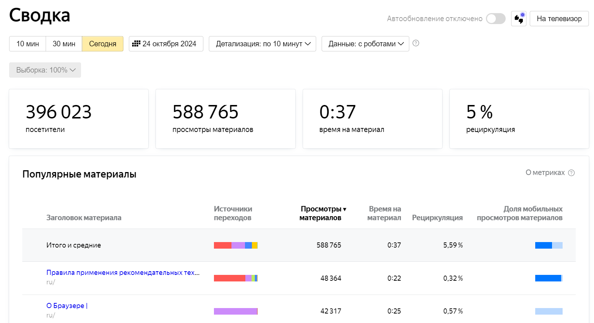
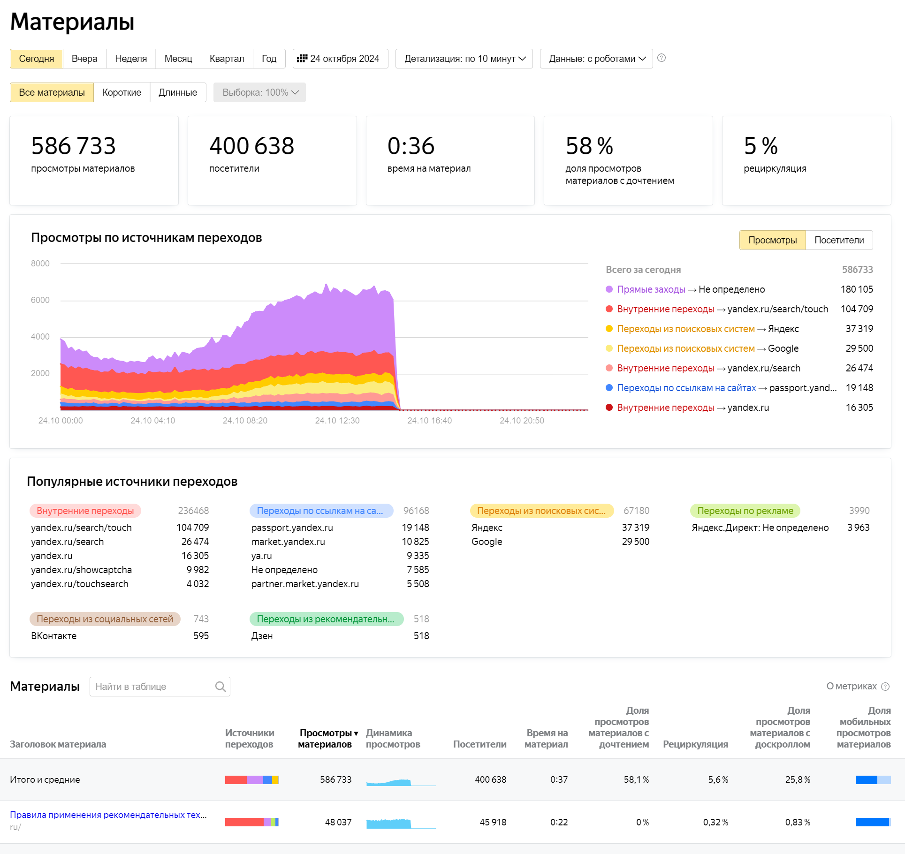
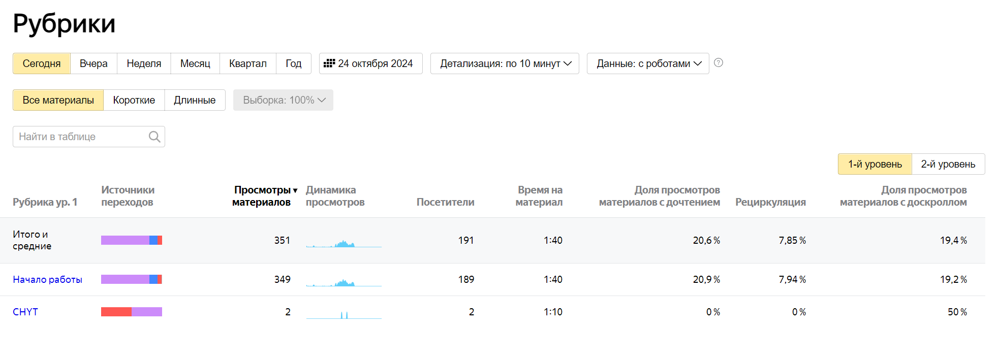
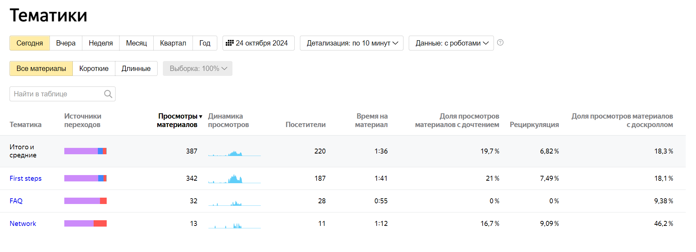
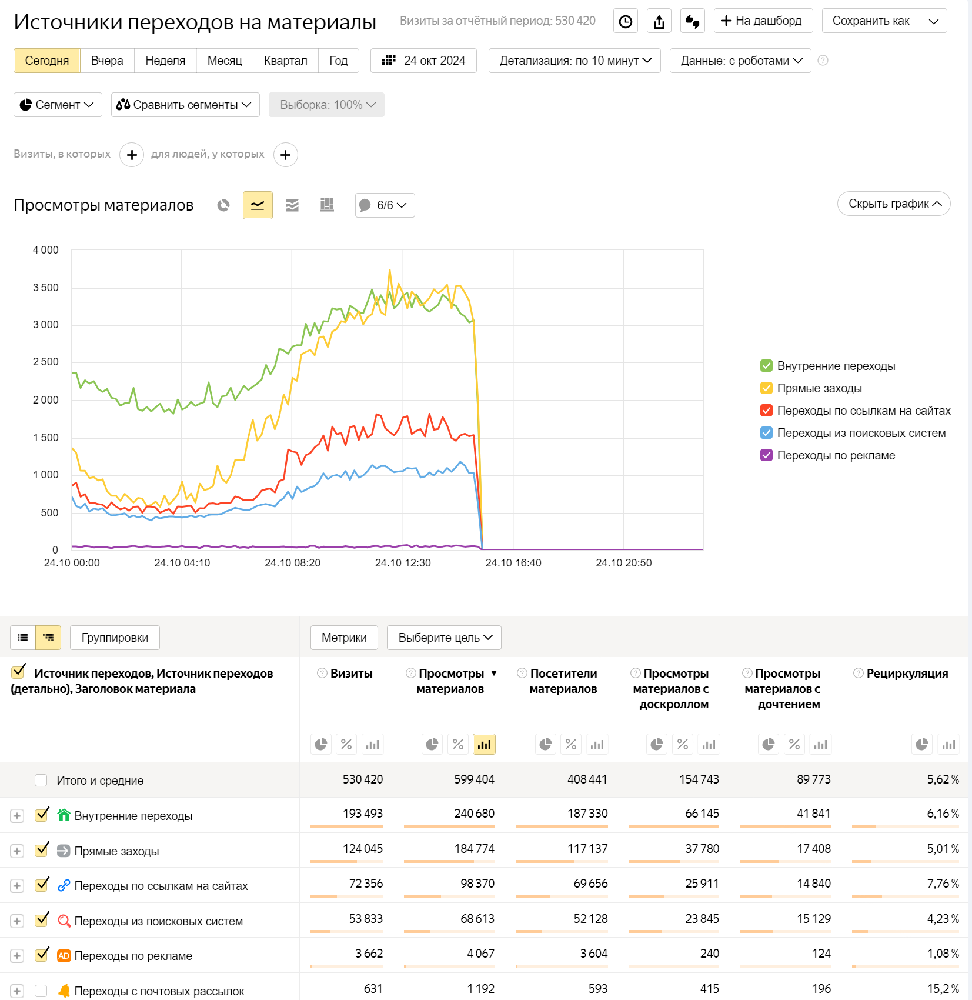
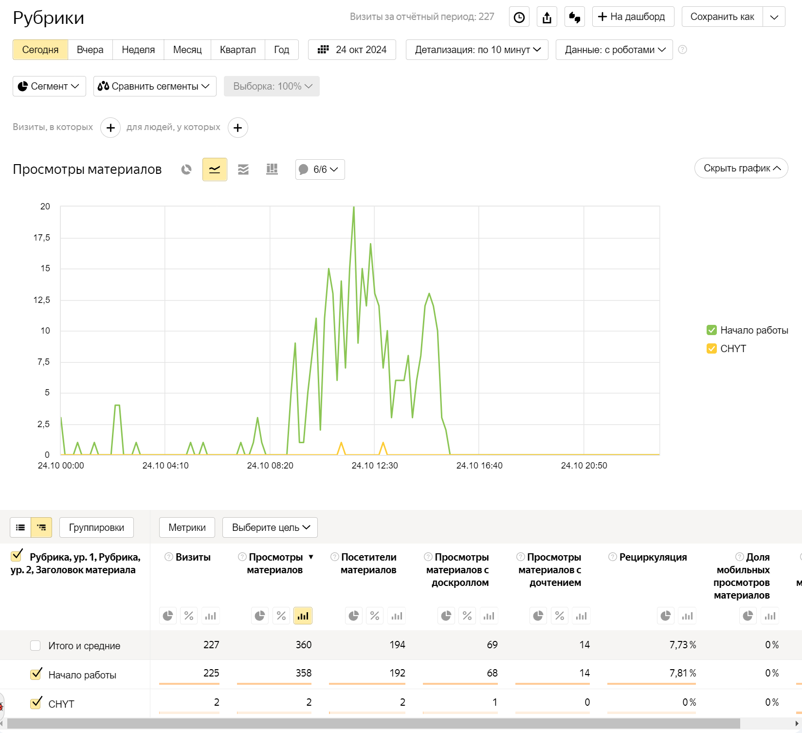
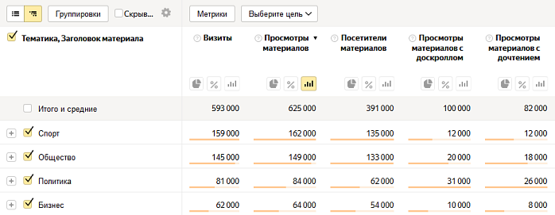
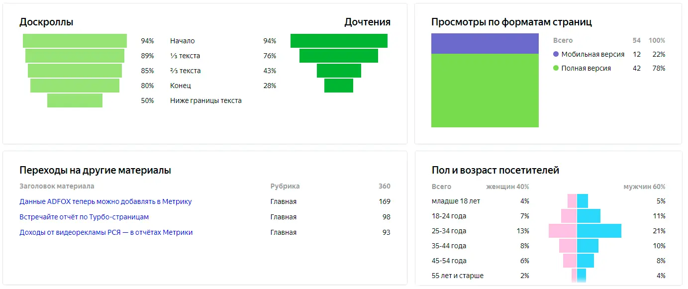

# Контентная аналитика для документационных проектов


В современном мире качественная техническая документация является неотъемлемым элементом успешного продукта. Однако даже самая качественная документация нуждается в постоянной оптимизации, чтобы соответствовать потребностям пользователей.

Контентная аналитика, основанная на данных, помогает понять, как пользователи взаимодействуют с вашими материалами и какие улучшения необходимы. В этом контексте, Яндекс Метрика становится мощным инструментом для анализа и оптимизации технической документации. В этой статье мы рассмотрим, как интегрировать контентную аналитику Яндекс Метрики в работу с документацией.

## Отчёты по контенту в Яндекс Метрике {#content-reports}

В Метрике c [1 июля 2019](https://yandex.ru/adv/news/yandeks-metrika-dlya-media-vstrechayte-otchety-po-kontentu) года существуют специальные [отчеты](https://yandex.ru/support/metrica/publishers/about.html) для контентных проектов и медиа изданий.

В отличие от других отчетов (например, по источникам трафика или демографическим данным), которые больше сосредоточены на информации о пользователях, отчёты по контенту ориентированы на то, как пользователи взаимодействуют с контентом сайта. Это делает их незаменимыми для технических писателей и тех, кто отвечает за создание и оптимизацию информационного наполнения документационных проектов. 







Отчеты по контенту содержат: 

- Статистику по материалам, рубрикам, авторам, тематикам.
- Статистику по доскроллам и дочитыванию.
- Время на чтение статьи. Учитываются движения мыши, клики, скроллы в пределах 5 секунд. Если в течении 5 секунд нет активности, время не атрибуцируется.
- Динамика просмотра статей.
- Доля материалов с дочитыванием.
- Процент пользователей, которые перешли на другие страницы сайта.
- Доля просмотров материалов с доскроллом.
- Показатели вовлечённости и посещаемость рубрик.
- Самые популярные статьи.
- Источники переходов.
- Общая сводка по документационному проекту.

## Как организовать контентную аналитику в своём документационном проекте {#organize}

### Создание счетчика метрики {#metric-counter}

1. Создайте счетчик метрики в соответствии с [инструкцией](https://yandex.ru/support/metrica/general/).
1. В настройках счетчика [включите опцию](https://yandex.ru/support/metrica/publishers/about.html#about) «Контентная аналитика» и укажите тип разметки `OpenGraph`:
   
   

1. Добавьте счётчик в документационный проект, используя конфигурационный файл [`.yfm`](https://diplodoc.com/docs/ru/project/config).
  
   Пример:

   ```
   allowHTML: true
   apply-presets: true
   varsPreset: external
   langs: ['ru', 'en']

   docs-viewer:
     metrika: 44444444
     project-name: your-project-name
   ```

### Добавление метаинформации {#meta-information}

В отчетах по контенту данные собираются только по размеченным материалам. Для разметки материала рекомендуется использовать словарь семантической разметки данных [OpenGraph](https://yandex.ru/support/metrica/publishers/open-graph/open-graph.html).
Разметка задаётся в файлах документации с расширением `md`, в блоке [front-matter](*front-matter).



OpenGraph — это простой и эффективный способ контролировать то, как ваши страницы представлены в поисковых системах и на социальных медиа платформах.

Данные OpenGraph должны располагаться в теге `head` вашего документа. 
Вы можете задать название, описание, изображение и другие параметры, которые будут отображаться, при публикации вашей ссылки на сайтах в социальных сетях.

Подробнее про OpenGraph:
- [The Open Graph protocol](https://ogp.me/)
- [Вебмастер. Справка](https://yandex.ru/support/webmaster/open-graph/intro-open-graph.html) 



Пример использования в статье документации:

#|
|| **Исходный код в файле** | **Результат в документации** ||
||
```
---
metadata:
    - property: 'og:type'
      content: 'article'
    - property: 'og:title'
      content: 'В Москве побит температурный рекорд 1922 года'
    - property: 'og:url'
      content: 'https://www.example-news.com/life/weather/moscow#cao'
    - property: 'article:section'
      content: 'Погода'
    - property: 'article:modified_time'
      content: '2018-12-11T08:56:49Z'
    - property: 'article:published_time'
      content: '2018-11-06T09:26:10+04:00'
    - property: 'article:author'
      content: 'Иван Иванов'
    - property: 'article:author'
      content: 'Петр Петров'
    - property: 'article:tag'
      content: 'Жара'
    - property: 'article:tag'
      content: 'Москва'
---
```
|
```
<meta property="og:type" content="article"/>
<meta property="og:title" content="В Москве побит температурный рекорд 1922 года"/>
<meta property="og:url" content="https://www.example-news.com/life/weather/moscow#cao"/>
<meta property="article:section" content="Погода">
<meta property="article:modified_time" content="2018-12-11T08:56:49Z">
<meta property="article:published_time" content="2018-11-06T09:26:10+04:00">   
<meta property="article:author" content="Иван Иванов">
<meta property="article:author" content="Петр Петров">
<meta property="article:tag" content="Жара">
<meta property="article:tag" content="Москва">
```
||
|#



Статьи документации можно разметить [следующими элементами](https://yandex.ru/support/metrica/publishers/open-graph/open-graph.html#open-graph__material):

#|
|| **Элемент** | **Комментарий** ||
|| Тип описываемого объекта[*](*parametr) | Метрика поддерживает только разметку объектов типа [article](https://ogp.me/#type_article). Другие объекты, размеченные по стандарту [Open Graph](https://ogp.me/#type_article), не попадут в отчеты Метрики. Тип объекта указывается в свойстве `og:type`.

```
<meta property="og:type" content="article">
```
||
|| Заголовок[*](*parametr) | Заголовок отображается в отчетах Метрики. Он указывается в свойстве `og:title`.

```
<meta property="og:title" content="В Москве побит температурный рекорд 1922 года">
```
||
|| Текст[*](*parametr) | В качестве текста берется содержимое узла, в который вложен описываемый материал. Если разметка находится в теге `head`, текстом будет все содержимое тега `body`. Символы тегов не учитываются. В тексте определяется количество символов — это нужно для расчета объема материала и метрик доскроллов и дочтения.



Полную статистику можно получить по материалу, в тексте которого больше 500 символов.


||
|| Автор | Автор указывается с помощью свойства `article:author`. Если авторов несколько, перечислите их в разных метатегах.

```
<meta property="article:author" content="Иван Иванов">
<meta property="article:author" content="Петр Петров">
```

Благодаря этим данным можно посмотреть статистику по отдельным авторам. ||
|| Тематика | В качестве тематик можно указать, например, ключевые слова или хэштеги. Укажите тематики в свойстве `article:tag`. Если тематик несколько, перечислите их в разных метатегах.

```
<meta property="article:tag" content="Жара">
<meta property="article:tag" content="Москва">
```
||
|| Даты публикации и изменения | Даты публикации и изменения указываются в свойствах `article:published_time` и `article:modified_time`. Даты записываются в формате [ISO 8601](https://www.iso.org/standard/40874.html).

```
<meta property="article:modified_time" content="2018-12-11T08:56:49Z">
<meta property="article:published_time" content="2018-11-06T09:26:10+04:00">
```
||
|| Рубрика | Рубрика — это раздел сайта, посвященный определенной теме. Чтобы указать рубрику материала, используйте свойство `article:section`.

```
<meta property="article:section" content="Погода">
```
||
|| URL материала | URL материала должен содержаться в свойстве `og:url`.

```
<meta property="og:url" content="https://www.example-news.com/life/weather/moscow"/>
```

Иначе значение будет взято из канонической ссылки:

```
<link rel="canonical" href="https://www.example-news.com/life/weather/moscow">
```

Если разметка верна и правильно подключен счетчик, через некоторое время по материалу начнет собираться статистика в Метрике. ||
|#

\* Обязательный элемент



## Использование отчетов по контентной аналитике {#use}

### Сводные отчеты {#summary-reports}

#|
|| **Отчет** | **Описание** ||
|| Сводка
|
Отчет дает краткую статистику по контенту за выбранный день или период. Что позволяет быстро оценить происходящее в документации, и понять на что обратить свое внимание.
В сводке вы можете:
- понять, насколько активна аудитория;
- узнать, какие материалы наиболее популярны, и получить краткую сводку по ним;
- выяснить, откуда посетители переходят к вашим материалам.

Вы можете включить автообновление — тогда статистика начнет обновляться каждые 60 секунд.

[Подробнее](https://yandex.ru/support/metrica/publishers/reports/overview.html)
||
||





| > ||
|| Материалы 
| 
Отчет помогает сравнить материалы между собой, отследить динамику просмотров, выделить самые интересные посты (у них будет высокий показатель дочтений) и решить в каком направлении продолжать работу с контентом.
Понять насколько читателям интересна информация, кто и какого возраста ищет данные, с каких устройств чаще читают и под какой вариант адаптировать материал.

[Подробнее](https://yandex.ru/support/metrica/publishers/reports/material.html)
||
||





| > ||
|| Рубрики 
|
Отчет по рубрикам позволяют получить общую статистику и сравнить рубрики между собой. Показатели просмотров и вовлеченности аудитории позволяют определить эффективность рубрики и понять, стоит уделять им внимание или следует отказаться от них.



При реализации разметки, нужно помнить, что количество рубрик ограничено на данный момент двумя уровнями вложенности и это необходимо учитывать при реализации.



В качестве рубрик в документационных проектах предлагается использовать разделы документации — пункты меню первого уровня.

[Подробнее](https://yandex.ru/support/metrica/publishers/reports/rubric.html)
||
||





| > ||
|| Авторы 
|
Отчет позволяет получить общую статистику по авторам и сравнить результаты автора с остальной редакцией.
Если документацию пишет несколько разных авторов, такие данные помогут определить, какой писатель больше всего привлекает пользователей и продолжить работу с ним. Или понять, чем именно автор привлекает аудиторию и помочь другим авторам привлечь пользователей, поднимая себе трафик.

[Подробнее](https://yandex.ru/support/metrica/publishers/reports/author.html)
||
|| Тематики
|
Отчет позволяет собрать общую статистику по тематикам, которые отражают содержание статьи.
Отчет позволяет:
- Узнать, какие тематики интересны читателям, а какие нет.
- Посмотреть, кто и как читает материалы по выбранной тематике.

В отличие от рубрик, количество тематик материала не ограничено.

[Подробнее](https://yandex.ru/support/metrica/publishers/reports/topic.html)
||
||





| > ||
|#

### Стандартные отчеты {#standard-reports}


#|
|| **Отчет** | **Описание** ||
|| Источники переходов на материалы
|
Отчет позволяет собрать общую статистику по тематикам, которые отражают содержание статьи. В отличие от рубрик, количество тематик материала не ограничено.
||
||





| > ||
|| Рубрики
|
Отчет содержит общую статистику по рубрикам и материалам вашей документации.
||
||





| > ||
|| Авторы
|
Отчет содержит статистику об авторах материалов.
||
|| Тематики
|
Отчет содержит статистику по тематикам материалов.
||
||





| > ||
|| Страница материала
|
В отчёте по конкретному материалу можно подробно изучить, как посетители продвигались по тексту.
Воронка доскроллов покажет, до какой точки пользователи обычно долистывают материал, чем больше воронка похожа на прямоугольник, тем больше посетителей прокручивают статью до конца.
Воронка дочтений покажет успевает ли пользователь прочитать текст, в ней также учитывается время взаимодействия с контентом.
Отчёт поможет понять, как распределяется аудитория статьи по полу и возрасту, и сколько трафика приходится на разные форматы: десктоп, мобильную и Турбо-версию.
||
||





| > ||
|#

## Заключение {#end}

Интеграция контентной аналитики с помощью Яндекс Метрики в техническую документацию помогает глубже понимать потребности пользователей и адаптировать контент в соответствии с их ожиданиями.

Подход на основе данных позволяет не только улучшать качество документации, но и обеспечивать лучшее взаимодействие пользователей с вашим продуктом, предоставляя информацию в наиболее подходящей форме и в нужный момент.

Следуя приведённым рекомендациям, вы сможете значительно повысить ценность и эффективность вашей документации в глазах пользователей и сделать её действительно полезным инструментом.

#### Смотрите также

- [Отчёты по контенту](https://yandex.ru/support/metrica/publishers/reports/main.html) (документация)
- [Проверка передачи данных контентной аналитики](https://yandex.ru/support/metrica/publishers/check-data.html)

[*front-matter]: Секция метаданных, размещенная в начале Markdown-файла, заключенная между тремя дефисами `---` . Она используется для определения ключевой информации о документе, такой как заголовок, автор, дата и различные параметры настройки, которые могут влиять на обработку и отображение содержимого документа.

[*parametr]: Обязательный элемент.
