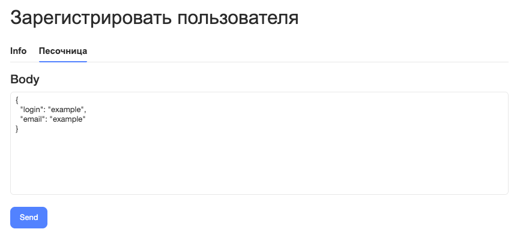

# Генерация из OpenAPI-спецификации

Вы можете сгенерировать документ из [OpenAPI-спецификации](https://www.openapis.org/) и включить ее в основной документ.



Openapi-инклюдер требует разрешение на использование HTML в документации, поэтому внутри конфигурационного файла `.yfm` необходимо указать значение `allowHtml: true`.



## Требования к OpenAPI-спецификации {#requirements}

- Версия используемой спецификации не ниже 3.x.
- Допускается использование только операторов `oneOf` и `allOf`.
- Ограничения на использование базового функционала не накладываются.

## Пример использования {#example}

Подключите спецификацию к документационному проекту, который лежит в директории `doc_root`:

1. Разместите OpenAPI-спецификацию по пути `doc_root/ru/ref/api.yaml`.

1. Включите ее в оглавление `doc_root/toc.yaml` с помощью [openapi-инклюдера](includers.md):

    ```yaml
    # doc_root/toc.yaml
    title: documentation
    href: index.yaml
    items:
      - name: Ресурсы API
        include:
          path: ref
          includers:
            - name: openapi
              input: ru/ref/api.yaml
          mode: link
    ```

    

    Путь к файлу OpenAPI-спецификации в параметре `input` указывается от корня документационного проекта.

    

1. Подключите разводящую страницу в `doc_root/index.yaml`:

    ```yaml
    # doc_root/index.yaml
    title: documentation
    links:
      - title: Ресурсы API
        href: ref/
    ```

После сборки описания конечных точек будут разложены по разделам — по одному на каждый тег спецификации. В каждом разделе появится страница Overview.

## Настройка отображения {#customization}

Параметры `tags`, `leadingPage` и `sandbox` позволяют изменить внешний вид документации. Для этого укажите их внутри includer-объекта — на том же уровне, что и `name: openapi` и `input`:

```yaml
# doc_root/toc.yaml
items:
  - name: Ресурсы API
    include:
      path: ref
      includers:
        - name: openapi
          input: ru/ref/api.yaml
          tags:              # настройка отдельных разделов-тегов
            __root__:
              name: API отчетов
          leadingPage:       # настройка всех оглавлений сразу
            spec:
              renderMode: hidden
          sandbox:           # таб с песочницей
            tabName: Песочница
            host: 'https://api.example.com/v1'
      mode: link
```

### tags {#tags}

Позволяет менять названия разделов оглавления по отдельности. Ключи внутри `tags` — имена тегов из OpenAPI-спецификации. Специальный ключ `__root__` настраивает оглавление верхнего уровня.

Синтаксис:

```yaml
# doc_root/toc.yaml
items:
  - name: Ресурсы API
    include:
      path: ref
      includers:
        - name: openapi
          input: ru/ref/api.yaml
          tags:
            __root__:
              name: API отчетов
            reports:
              name: Отчеты
              path: reports-intro.md
            'Регистрация пользователя':
              alias: registration
            internal:
              hidden: true
      mode: link
```

У каждого тега есть параметры:

- `name` — меняет отображаемое на сайте имя оглавления.

- `path` — задает свой контент для страницы оглавления (Overview) тега. При сборке содержимое указанного файла копируется на эту страницу вместо автогенерированного. Ссылка из навигации ведет на страницу оглавления, а не на исходный файл.

    Требования к файлу:

    - Обычный MD-файл (YFM). Добавлять его в `toc.yaml` отдельным пунктом не нужно.
    - Путь до файла указывается относительно файла OpenAPI-спецификации, а не от корня проекта. Если файл по указанному пути не найден, сборка завершится ошибкой.
    - Сборка не преобразует относительные ссылки и пути к изображениям внутри файла. Указывайте их относительно страницы оглавления (`<путь-из-include.path>/<тег>/index.md`), а не относительно исходного файла.

- `alias` — меняет путь до раздела в URL. Теги на русском языке по умолчанию преобразуются в транслит: например, тег `Регистрация пользователя` получит ссылку вида `doc.com/ref/Registraciya-polzovatelya/`. Если указать `alias: registration`, вид у ссылки станет `doc.com/ref/registration/`.

- `hidden` — скрывает оглавление тега из навигации.

Результат:

#|
||
До настройки раздел верхнего уровня называется «Overview»:

{style="border: solid 1px #cccccc;"}{width=240px}
|
После настройки `tags.__root__.name: API отчетов`:

{style="border: solid 1px #cccccc;"}{width=240px}
||
|#

### leadingPage {#leadingpage}

В отличие от `tags`, позволяет настроить все разделы оглавления одновременно.

Синтаксис:

```yaml
# doc_root/toc.yaml
items:
  - name: Ресурсы API
    include:
      path: ref
      includers:
        - name: openapi
          input: ru/ref/api.yaml
          leadingPage:
            name: Обзор
            spec:
              renderMode: hidden
      mode: link
```

Параметры:

- `name` — меняет название всех оглавлений.

- `spec.renderMode` — определяет, нужно ли отображать OpenAPI-спецификацию на странице оглавления:

    - `inline` — спецификация отображается прямо на странице (значение по умолчанию). Если размер json-схемы спецификации превышает значение [##maxOpenapiIncludeSize##](../settings.md#max-openapi-include-size) (по умолчанию 100 Кб), режим автоматически переключается на `link`;
    - `link` — вместо спецификации на страницу вставляется ссылка на файл json-схемы;
    - `hidden` — спецификация скрыта, на странице остаются только ссылки на разделы.

### sandbox {#sandbox}

Добавляет на страницы конечных точек таб с формой, через которую можно отправлять запросы к API прямо из документации.

Синтаксис:

```yaml
# doc_root/toc.yaml
items:
  - name: Ресурсы API
    include:
      path: ref
      includers:
        - name: openapi
          input: ru/ref/api.yaml
          sandbox:
            tabName: Песочница
            host: 'https://api.example.com/v1'
      mode: link
```

Параметры:

- `tabName` — название таба на странице конечной точки.

- `host` — адрес сервера, на который песочница будет отправлять запросы.

Результат:

{style="border: solid 1px #cccccc;"}{width=700px}

## Скрытие полей

Чтобы скрыть параметры операции или поля объекта, добавьте в их описание `x-hidden: true`:

```yaml
# api.yaml
x-hidden: true
```

Пример:

```yaml
- name: example
    required: false
    schema:
      type: string
      description: "Пример"
    x-hidden: true
```

## Скрытие описаний

Существует 3 вида фильтрации:

* `filter`;
* `nobuild`;
* `noindex`.

Они имеют общий интерфейс фильтрации:

```yaml
# doc_root/toc.yaml
filter:
    endpoint: tags contains "nobuild" != true
    tag: name == "noindex"
```

Поле `endpoint` позволяет пометить конечную точку определенным свойством (зависит от выбранного режима фильтрации) аналогично тому, как поле `tag` помечает теги.

### `filter`

Позволяет указать условие, определяющее, нужно ли добавлять конечную точку в сборку.

#### Синтаксис

```yaml
# doc_root/toc.yaml
filter:
    endpoint: tags contains "nobuild" != true
```

#### Пример использования

Необходимо, чтобы незавершенные описания не попали в документацию. Чтобы получить такой результат:

1. Добавьте каждому описанию тег `nobuild` (можно использовать любой тег, но для простоты принято добавлять именно этот).

1. Добавьте фильтр на этот тег:

    ```yaml
    filter:
        endpoint: tags contains "nobuild" != true
    ```

В результате работы фильтра в документации не будет ненужных страниц.

### `noindex`

Позволяет написать условие, определяющее, будет ли описание индексироваться поисковыми роботами.

#### Синтаксис

```yaml
# doc_root/toc.yaml
noindex:
    tag: name == "noindex"
```

#### Пример использования

Необходимо скрыть описание от поисковых роботов. Чтобы получить такой результат:

1. Добавьте каждому описанию тег `noindex` (можно использовать любой тег, но для простоты принято добавлять именно этот).

1. Добавьте фильтр на этот тег:

    ```yaml
    noindex:
        tag: name == "noindex"
    ```
