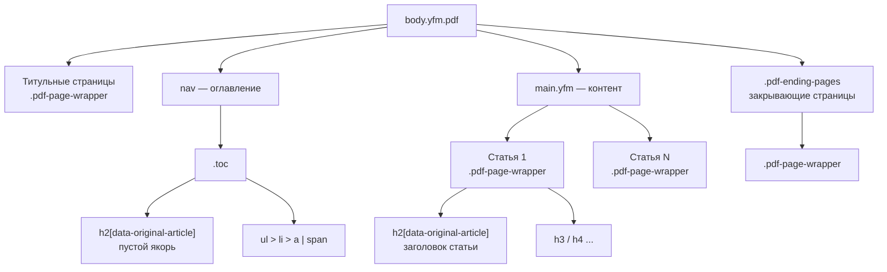

---
tags:
    - Стизилизация
---
# Пользовательские стили в PDF

[PDF-версия документации](generate-pdf.md) собирается в три шага:

1. Сборщик складывает контент всех статей в один JSON-файл.
1. Генератор PDF собирает из него отдельный HTML-документ.
1. Генератор печатает этот документ в PDF через браузер.

Разметка этого HTML-документа отличается от разметки сайта:

- часть классов сайта в нем отсутствует;
- уровни заголовков сдвинуты;
- к контенту применяются дополнительные стили печати.

Поэтому селекторы, которые работают в обычной HTML-версии, в PDF могут не сработать.

## Как стили попадают в PDF { #how-styles-apply }

Отдельная настройка для PDF не нужна. [Стили, подключенные к проекту](../style/css-js.md) через блок `resources.style` конфигурационного файла `.yfm`, применяются и к сайту, и к PDF-документу.

Всегда используйте флаг `--allow-custom-resources` при сборке:

```bash
yfm build -i . -o ./docs-output --pdf --allow-custom-resources
```

Без флага `--allow-custom-resources` блок `resources.style` игнорируется целиком — стили не попадают ни в сборку сайта, ни в PDF.

## Класс pdf { #pdf-class }

Тег `<body>` PDF-документа всегда имеет класс `pdf`:

```html
<body class="yfm pdf">
```

Этот класс больше нигде не используется, поэтому по нему можно отделить правила для PDF от общих правил проекта:

```css
/* Правило действует только в PDF. */
body.pdf main.yfm {
    font-size: 14px;
}
```

Учитывайте ограничения:

- Классы интерфейса сайта в PDF отсутствуют: `dc-doc-page`, `dc-doc-page__content`, `dc-toc`, `dc-mini-toc`, `dc-subnavigation`, `dc-controls` и другие. Селекторы на них в PDF не сработают.

    
    
    `App`, `Layout`, `Layout__body`, `Layout__content`, `desktop`, `col-reset`,
    `dc-root_wide-format`, `dc-root_document-page`,
    `dc-doc-layout`, `dc-doc-layout__center`, `dc-doc-layout__left`,
    `dc-doc-layout__right`, `dc-doc-layout__toc`, `dc-doc-layout__desktop-only`,
    `dc-doc-layout__mobile-only`,
    `dc-doc-page`, `dc-doc-page__aside`, `dc-doc-page__body`, `dc-doc-page__content`,
    `dc-doc-page__content-mini-toc`, `dc-doc-page__controls`, `dc-doc-page__main`,
    `dc-doc-page__title`, `dc-doc-page__toc-nav-panel`, `dc-doc-page__under-title-info`,
    `dc-doc-page__page-contributors`, `dc-doc-page-title`,
    `dc-mini-toc*`, `dc-toc*`, `dc-toc-item__*`,
    `dc-nav-toc-panel*`, `dc-subnavigation*`, `dc-sidebar-navigation*`,
    `dc-controls*`, `dc-control`, `dc-share-button`, `dc-widgets`,
    `pc-constructor-block`, `pc-constructor-block_type_page`,
    `pc-block-base`, `pc-block-base_indentTop_0`, `pc-block-base_indentBottom_0`,
    `pc-block-base_reset-paddings`,
    `yfm-tooltip-live-region`.
    
    

- Тема Gravity в PDF не применяется. Класс `.g-root` на `<body>` не назначается, поэтому переменные `--g-*` не действуют. Задавайте свойства напрямую.

```css
/* Шрифт в PDF не изменится: переменных темы в PDF нет. */
.g-root {
    --g-font-family-sans: 'Georgia', serif;
}

/* Шрифт изменится. */
body.pdf,
body.pdf main.yfm {
    font-family: 'Georgia', serif;
}
```

## Структура PDF-документа { #structure }

PDF-документ состоит из титульных страниц, оглавления, основного контента и закрывающих страниц.



Как это выглядит в разметке:

```html
<body class="yfm pdf">
    <div class="pdf-page-wrapper">
        <!-- титульная страница из pdf.startPages -->
    </div>
    <nav>
        <div class="toc">
            <!-- оглавление -->
        </div>
    </nav>
    <main class="yfm">
        <div class="pdf-page-wrapper">
            <h2 data-original-article="page1.html">Заголовок статьи</h2>
            <!-- контент статьи -->
        </div>
        <div class="pdf-page-wrapper">
            <!-- следующая статья -->
        </div>
    </main>
    <div class="pdf-ending-pages">
        <div class="pdf-page-wrapper">
            <!-- закрывающая страница из pdf.endPages -->
        </div>
    </div>
</body>
```

Селекторы для каждой части документа:

#|
|| **Часть документа** | **Селектор** ||
|| Титульные страницы | `body.pdf > .pdf-page-wrapper` ||
|| Оглавление | `body.pdf > nav .toc` ||
|| Статья | `body.pdf main.yfm > .pdf-page-wrapper` ||
|| Закрывающие страницы | `body.pdf .pdf-ending-pages > .pdf-page-wrapper` ||
|#



Титульные страницы, статьи и закрывающие страницы используют один класс `.pdf-page-wrapper` и различаются только положением в дереве: титульные страницы — прямые потомки `body`, статьи лежат внутри `main.yfm`. Селектор `.pdf-page-wrapper` без дочернего комбинатора `>` применится ко всем трем типам страниц.



### Титульные и закрывающие страницы { #start-end-pages }

[Титульные и закрывающие страницы](generate-pdf.md#start-pages) задаются в файле `toc.yaml` в блоках `pdf.startPages` и `pdf.endPages`.

Титульные страницы выбираются селектором по положению в дереве, закрывающие — по обертке `.pdf-ending-pages`:

```css
/* Только титульные страницы. */
body.pdf > .pdf-page-wrapper {
    text-align: center;
    padding-top: 200px;
}

/* Только закрывающие страницы. */
body.pdf .pdf-ending-pages > .pdf-page-wrapper {
    text-align: center;
    color: #808080;
}
```

### Оглавление { #toc }

Оглавление — это отдельная страница внутри PDF, которую генератор создает из файла `toc.yaml` и размещает между титульными страницами и основным контентом. С боковым меню обычной HTML-версии оно не связано.

Разметка оглавления:

```html
<nav>
    <div class="toc">
        <h2 data-original-article="./none/toc"></h2>
        <ul>
            <li><a href="#page1">Страница 1</a></li>
            <li>
                <span>Название раздела без ссылки</span>
                <ul>
                    <li><a href="#page2">Вложенная страница</a></li>
                </ul>
            </li>
        </ul>
    </div>
</nav>
```

Особенности разметки:

- `<a>` — пункт со ссылкой на статью;
- `<span>` — название раздела, объединяющего группу статей;
- у `<a>` и `<span>` могут быть классы `labeled` и `hidden` — они приходят из `toc.yaml`;
- вложенность любой глубины передается вложенными `<ul>`;
- заголовок `<h2 data-original-article="./none/toc">` — пустой служебный якорь, который нужен для переноса оглавления на новую страницу. Правило, написанное для всех `h2`, применится и к нему.



```css
/* Кегль оглавления. */
body.pdf > nav .toc {
    font-size: 13px;
}

/* Ссылки без подчеркивания. */
body.pdf > nav .toc a {
    text-decoration: none;
}

/* Названия разделов — отдельным начертанием. */
body.pdf > nav .toc span {
    font-weight: bold;
    color: #333333;
}
```



### Статьи { #articles }

При сборке PDF каждая статья попадает в свою обертку — блок `.pdf-page-wrapper` внутри `main.yfm`. Обертки идут друг за другом в том же порядке, что и статьи в оглавлении, и каждая начинается с новой страницы. Поэтому, чтобы стилизовать статью целиком, обращайтесь к этой обертке.

Обратиться к оберткам можно одним из способов:

- по классу `.pdf-page-wrapper`;
- по атрибуту `data-page-break="true"`, который есть у всех оберток.

Селектор по атрибуту продолжит работать, даже если имя класса изменится в будущих версиях сборки.

Например, так можно добавить отступ сверху в начале каждой статьи:

```css
body.pdf main.yfm > [data-page-break="true"] {
    padding-top: 20px;
}
```

## Заголовки { #headings }

При генерации PDF-версии все статьи проекта склеиваются в один документ, поэтому уровни заголовков понижаются на единицу:

#|
|| **Markdown** | **HTML (сайт)**  | **PDF** ||
|| `# Заголовок` | `h1` | `h2[data-original-article]` ||
|| `## Раздел` | `h2` | `h3` ||
|| `### Подраздел` | `h3` | `h4` ||
|#



В PDF нет ни одного тега `h1`, поэтому селекторы на `h1` не сработают. Заголовок статьи — это `h2` с атрибутом `data-original-article`.



Общего заголовка документа генератор не создает: корневой узел — `<body>`, а заголовки статей начинаются сразу с `h2`.

**Пример:** заголовки всех статей в документе выделены цветом и отделены от текста тонкой линией снизу:

```css
/* Заголовок статьи. */
body.pdf main.yfm h2[data-original-article] {
    color: #1a4d80;
    border-bottom: 1px solid #d0d0d0;
}
```

Чтобы якоря разных статей не конфликтовали в одном документе, к каждому `id` добавляется префикс с именем страницы: `id="anchor"` превращается в `id="page1_anchor"`. В результате селекторы в PDF работают только по префиксованному `id` (`#page1_anchor`).

## Разрывы страниц { #page-breaks }

Разрывами управляют свойства `page-break-before`, `page-break-after` и `page-break-inside`. Часть таких правил Diplodoc применяет по умолчанию. Учитывайте их при написании своих стилей: например, отмененный в пользовательских стилях разрыв страницы сохранится, если его дублирует другое встроенное правило.

Правила, которые действуют в PDF сейчас:

#|
|| **Что** | **Правило** | **Результат** ||
|| `.pdf-page-wrapper` | `page-break-after: always`, `page-break-inside: avoid` | Каждая статья начинается с новой страницы. ||
|| `h2[data-original-article]` | `page-break-before: always` | То же самое, дублирующий механизм. ||
|| `nav` | `page-break-after: always` | Контент начинается после оглавления. ||
|| `.pdf-ending-pages` | `page-break-before: always` | Закрывающие страницы начинаются с новой страницы. ||
|| `h1`–`h6` | `page-break-after: avoid` | Заголовок не отрывается от следующего за ним текста. ||
|| `.yfm-note` | `page-break-inside: avoid` | Заметка не разрывается между страницами. ||
|| Ячейки таблиц | `page-break-inside: avoid` | Ячейка не разрывается между страницами. ||
|#

Набор правил пополняется по мере развития генератора PDF.



Разрыв «каждая статья с новой страницы» обеспечивается сразу двумя механизмами: оберткой `.pdf-page-wrapper` и заголовком `h2[data-original-article]`. Чтобы изменить это поведение, переопределите оба правила.





```css
/* Не разрывать свой блок между страницами. */
body.pdf .my-block {
    page-break-inside: avoid;
}

/* Начать элемент с новой страницы. */
body.pdf .my-section {
    page-break-before: always;
}

/* Не отрывать заголовок ката и шапку табов от содержимого. */
body.pdf .yfm-cut,
body.pdf .yfm-tabs {
    page-break-inside: avoid;
}
```



## Размеры и единицы измерения { #units }

Указывайте размеры в пикселях, как для обычной веб-страницы. Базовые размеры контента заданы переменными `yfm.css`:

- основной текст — 15px;
- заголовки — от 17px до 32px.

При печати браузер переводит пиксели в пункты и дополнительно применяет масштаб 0,85. Поэтому на бумаге текст получается мельче, чем указано в CSS.

Итоговый размер считается по формуле:

```text
размер на бумаге в pt = значение CSS в px × 0,75 × 0,85
```

Например, основной текст `15px` на бумаге занимает примерно `9,6pt`.

## Порядок применения стилей { #cascade }

Корректно написанное правило может не сработать из-за порядка подключения стилей. В PDF-документе стили подключаются по правилу «ниже — сильнее»:

1. Пользовательские стили из `resources.style`.
1. Базовые стили контента `yfm.css`.
1. Стили печати `print.css`.
1. Стили генератора PDF.

Пользовательские стили подключаются раньше служебных. При равной специфичности выигрывают служебные правила, а часть из них задана с `!important`.

Если правило не применилось, действуйте по порядку:

1. Повысьте специфичность селектора: `body.pdf main.yfm .my-class` вместо `.my-class`.
1. Если не помогло — добавьте `!important`.

```css
body.pdf main.yfm {
    max-width: 100% !important;
    padding: 20px !important;
}
```

Чаще всего пользовательские правила перебиваются стилями генератора, которые адаптируют контент к печати:

- таблицы разворачиваются целиком (`display: table`) — в PDF нет горизонтальной прокрутки;
- длинные строки кода переносятся (`white-space: pre-wrap`);
- у `main` фиксированная ширина 980px и отступы 45px;
- термины разворачиваются в сноски — всплывающие подсказки в PDF не работают.

## Отладка { #debugging }

Генератор создает промежуточный файл `pdf-source.html`, который затем печатается в PDF. Файл `pdf-source.html` можно открыть в браузере и исследовать через инструменты разработчика.

1. Соберите проект с флагами `--pdf-debug` и `--allow-custom-resources`:

    ```bash
    yfm build -i . -o ./docs-output --pdf --pdf-debug --allow-custom-resources
    ```

    Флаг `--pdf-debug` дополнительно создает HTML-версии титульных и закрывающих страниц. Подробнее читайте в разделе [Создание PDF из документации](generate-pdf.md#build).

1. Запустите генератор PDF:

    ```bash
    npx -- @diplodoc/pdf-generator@latest -i ./docs-output
    ```

1. Откройте файл `docs-output/pdf/pdf-source.html` в браузере на базе Chromium: Chrome, Edge, Яндекс Браузер — генератор печатает PDF именно через Chromium. В инструментах разработчика видно итоговую разметку, все подключенные стили и то, какое правило сработало в каскаде.

1. Включите эмуляцию печати: **DevTools** → **Rendering** → **Emulate CSS media type** → **print**. Правила из `print.css` действуют только в этом режиме.

## Полный пример { #example }

Файл `_assets/style/custom.css`, который оформляет основные части PDF-документа:

```css
/* ---------- Общие правила PDF ---------- */

/* Класс pdf есть только на body PDF-документа. */
body.pdf,
body.pdf main.yfm {
    font-family: 'Georgia', serif;
}

/* Поля страницы вместо стандартных 45px. */
body.pdf main.yfm {
    max-width: 100% !important;
    padding: 30px !important;
}

/* ---------- Титульные страницы ---------- */
/* Прямые потомки body — комбинатор > обязателен. */

body.pdf > .pdf-page-wrapper {
    text-align: center;
    padding-top: 240px;
}

/* ---------- Оглавление ---------- */

body.pdf > nav .toc {
    font-size: 13px;
}

body.pdf > nav .toc a {
    text-decoration: none;
    color: #1a4d80;
}

/* Названия разделов без ссылок. */
body.pdf > nav .toc span {
    font-weight: bold;
}

/* ---------- Статьи ---------- */
/* Внутри main.yfm — не заденет титульные страницы. */

body.pdf main.yfm > .pdf-page-wrapper {
    padding-top: 10px;
}

/* Заголовок статьи: в PDF это h2, а не h1. */
body.pdf main.yfm h2[data-original-article] {
    color: #1a4d80;
    border-bottom: 1px solid #d0d0d0;
    padding-bottom: 8px;
}

/* ---------- Разрывы страниц ---------- */

/* Не разрывать заметки, каты и блоки табов. */
body.pdf .yfm-note,
body.pdf .yfm-cut,
body.pdf .yfm-tabs {
    page-break-inside: avoid;
}

/* Закрывающие страницы — сразу после контента, без разрыва. */
body.pdf .pdf-ending-pages {
    page-break-before: auto;
}
```
