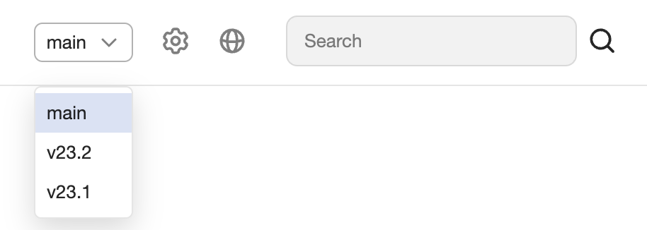

# Настройка версионирования документации

Версионирование позволяет управлять различными наборами документации для разных версий вашего проекта. Это упрощает процесс предоставления актуальной информации для пользователей, использующих разные версии вашего продукта. С помощью этой функции вы можете легко обновлять документы для новых версий продукта, сохраняя доступ к старой документации для тех, кто еще не обновился.

{width=500}

Запуск функциональности происходит через [добавление параметров](https://github.com/diplodoc-platform/docs-release-action?tab=readme-ov-file#release-version) в **Actions** во время релиза.

## Релиз с автоматической версией {#automatic-version}

В базовом сценарии, при каждом релизе создается новая версия. Эта версия автоматически становится по умолчанию.

Чтобы включить версионирование документации, передавайте параметр `version` во время релиза.



**Базовый пример: заголовок и номер версии будут обновлены**

```yaml
name: Release tag

on:
  push:
    paths: 'docs/**'
    tags:
      - 'v*.*.*'

jobs:
  <...>
  release:
    needs: upload
    runs-on: ubuntu-latest
    steps:
      - name: Release
        uses: diplodoc-platform/docs-release-action@v2
        with:
          revision: "${{ github.sha }}"
          version: "${{ github.ref_name }}"
          storage-bucket: ${{ secrets.DIPLODOC_STORAGE_BUCKET }}
          storage-access-key-id: ${{ secrets.DIPLODOC_ACCESS_KEY_ID }}
          storage-secret-access-key: ${{ secrets.DIPLODOC_SECRET_ACCESS_KEY }}
```



## Установка версии по умолчанию {#default-version}

Во время релиза документации можно указать, какая версия будет считаться по умолчанию.

1. Добавьте шаг `Set Default Version` в ваш **Actions** релиза.
1. Укажите значение `DEFAULT_VERSION`.
1. В шаге `Releas` добавьте `update-only-version`: `"${{ env.UPDATE_ONLY_VERSION }}"`.
   

  
```yaml
name: Release tag

on:
  push:
    branches:
      - 'main'
      - 'stable-**'
    paths: 
      - 'docs/**'
  workflow_dispatch:

jobs:
  <...>
  release:
    needs: upload
    runs-on: ubuntu-latest
    concurrency:
      group: release-documentation-${{ github.ref }}
      cancel-in-progress: true
    steps:
      - name: Extract version
        shell: bash
        run: echo "version=${GITHUB_HEAD_REF:-${GITHUB_REF#refs/heads/}}" | sed -e 's|stable-|v|g' -e 's|-|.|g' >> $GITHUB_OUTPUT
        id: extract_version

      - name: Set Default Version
        id: set-default-version
        shell: bash
        env:
          DEFAULT_VERSION: "main"
        run: |
          BRANCH_NAME=${GITHUB_REF##*/}
          if [[ "$BRANCH_NAME" == "$DEFAULT_VERSION" ]]; then
            echo "UPDATE_ONLY_VERSION=false" >> $GITHUB_ENV
          else
            echo "UPDATE_ONLY_VERSION=true" >> $GITHUB_ENV
          fi

      - name: Release
        uses: diplodoc-platform/docs-release-action@v2
        with:
          revision: "${{ github.sha }}"
          version: "${{ steps.extract_version.outputs.version }}"
          storage-bucket: ${{ secrets.DOCS_PROJECT_NAME }}
          storage-access-key-id: ${{ secrets.DOCS_AWS_KEY_ID }}
          storage-secret-access-key: ${{ secrets.DOCS_AWS_SECRET_ACCESS_KEY }}
          update-only-version: "${{ env.UPDATE_ONLY_VERSION }}"
```

Параметры:

- `version` - версия документации;
- `update-only-version` - параметр для обновления только указанной версии;
- `DEFAULT_VERSION` - значение версии по умолчанию.





`DEFAULT_VERSION` должно совпадать во всех ветках.

Например, если у вас есть релизы из ветки `main` и `stable-24-1-1`, убедитесь, что во всех ветках указано одинаковое значение. 

При несовпадении значений `DEFAULT_VERSION` в разных ветках изменится версия по умолчанию.


