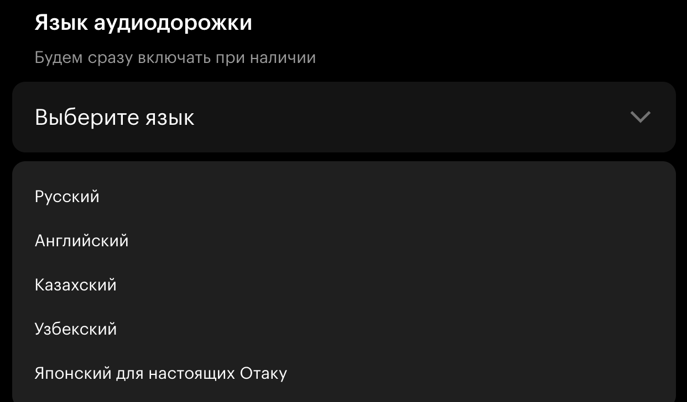

# Единый источник

Единый источник — это способ организации проекта, который позволяет получить несколько похожих версий документа из одного и того же исходного текста. Например, справки для разных платформ, языков или аудиторий.

Единый источник упрощает обновление проекта и снижает количество ошибок. Повторяющийся текст находится в одном месте, поэтому при обновлении не нужно искать и править все его вхождения.

### Примеры 

* [Справка Яндекс Почты](https://yandex.ru/support/yandex-360/customers/mail/ru/web/letter/create/letter-from-mobile?tabs=defaultTabsGroup-002l0bah_android)

Пользователь мобильного приложения Яндекс Почты может найти в справке инструкции, адаптированные [под смартфон](https://yandex.ru/support/yandex-360/customers/mail/ru/web/letter/create/letter-from-mobile?tabs=defaultTabsGroup-002l0bah_android). В то же время пользователь [веб-версии](https://yandex.ru/support/yandex-360/customers/mail/ru/web/letter/create/write-letter) видит инструкции, учитывающие особенности работы с сервисом в браузере. При этом обе версии справки создаются на основе одного исходного текста.

* [Справка Яндекс Музыки](https://yandex.ru/support/music/ru/new-template/gettingstart)

После установки Яндекс Музыки пользователь может обратиться к справке, чтобы разобраться с работой сервиса. Справка содержит понятные инструкции, адаптированные под конкретную платформу. Например, [Xiaomi GetApps](https://global.app.mi.com/details?lo=RU&la=ru&id=ru.yandex.music) или [компьютер](https://music.yandex.ru/download/).

* [Справка Кинопоиска](https://yandex.ru/support/kinopoisk/ru/authorization/get-started)

При просмотре фильма пользователь может выбирать аудиодорожку на нужном ему языке:

{width=400}

## Методы работы с единым источником {#methods}

* [**Профилирование**](./profiling.md) используется для формирования нескольких похожих документов из одного документа-источника. Текст размечается с помощью [условных операторов](https://diplodoc.com/docs/ru/syntax/vars#conditions) или [переменных](https://diplodoc.com/docs/ru/syntax/vars). При сборке в каждый выходной документ подставляются только нужные фрагменты текста.

  Способ применяется, если общего контента больше, чем уникального.

  

  В [справке Яндекс Почты](https://yandex.ru/support/yandex-360/customers/mail/ru/) в одном исходном тексте содержатся инструкции по работе с сервисом. С помощью профилирования из этого текста формируются две версии справки: 
  * для мобильного приложения включаются фрагменты, описывающие действия, специфичные для смартфона (например, действия для [написания письма](https://yandex.ru/support/yandex-360/customers/mail/ru/web/letter/create/letter-from-mobile?tabs=defaultTabsGroup-nrz4zeaf_android));
  * для веб-версии включаются фрагменты, описывающие действия, специфичные для браузера (например, [добавление файлов](https://yandex.ru/support/yandex-360/customers/mail/ru/web/letter/attachments)).

  

* **Переиспользование** контента позволяет подставлять повторяющиеся фрагменты текста внутри одного или нескольких документов. 
    
    Способ применяется, если уникального контента больше, чем общего. 

    Переиспользование обеспечивают:
      
    * [Инклюды](./includes.md) — отдельные файлы с текстом, ссылки на которые вставляются в нужном месте текста. При сборке текст из файла подставляется полностью.

      

      В [справке Яндекс Музыки](https://yandex.ru/support/music/ru/) некоторые разделы содержат повторяющуюся информацию. Такие блоки оформляются в виде инклюдов и включаются в нужные места текста. Например, [Дополнительные преимущества в сервисах Яндекса](https://yandex.ru/support/music/ru/new-template/gettingstart) и [Что входит в подписку Плюса](https://yandex.ru/support/music/ru/access-and-account/why-is-paid). 

      

    * [Пресеты переменных](./presets.md) — набор переменных и их значений. При сборке документа в текст подставляется значение переменной в зависимости от условий сборки.

      

      В [справке Яндекс Почты](https://yandex.ru/support/yandex-360/customers/mail/ru/) переменная `действие_с_письмом` может иметь разные значения: 
      * для [мобильного приложения](https://yandex.ru/support/yandex-360/customers/mail/ru/web/letter/create/letter-from-mobile?tabs=defaultTabsGroup-08mm4747_android) — «Нажмите значок  в правом нижнем углу экрана»; 
      * для [веб-версии](https://yandex.ru/support/yandex-360/customers/mail/ru/web/letter/create/write-letter) — «Чтобы создать новое письмо, в левом верхнем углу экрана нажмите „Написать“».

      

    * [Вставки оглавлений](toc_includes.md) — блоки оглавления, которые вставляются в основное оглавление.

      

      В [справке Яндекс Почты](https://yandex.ru/support/yandex-360/customers/mail/ru/) основная справка содержит несколько крупных разделов, например, [«Управление контактами»](https://yandex.ru/support/yandex-360/customers/mail/ru/web/abook), [«Настройка почтового ящика»](https://yandex.ru/support/yandex-360/customers/mail/ru/box-settings). Для каждого раздела создается свой блок оглавления, который включает подразделы и ключевые темы. С помощью вставок оглавлений эти блоки включаются в общее оглавление справки, что позволяет пользователям быстро находить нужные разделы и ориентироваться в большом объеме информации.

      

## Особенности {#peculiaritys}

* Каталоги с изображениями и инклюдами принято размещать в папках с названием `_assets` и `_includes` соответственно. Символ `_` означает, что папка не будет отображаться в итоговой сборке, но может быть использована как источник.

* Внутри проекта с профилированием можно дополнительно использовать инклюды или пресеты переменных, поэтому способы можно комбинировать.

* Если из одного документа-источника необходимо опубликовать несколько документов на разных доменах, то нужно настроить конфигурационные файлы для [профилирования](./profiling.md#configs). В случае переиспользования возможна публикация нескольких документов только на одном домене с разными URL.
