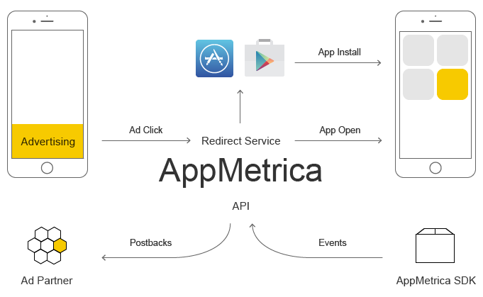

# Что такое трекинг

Задача отслеживания источников трафика важна в любых маркетинговых процессах. Для принятия решений необходимо руководствоваться детальными данными по эффективности рекламных партнеров.

Качественная система атрибуции (отнесения целевого действия партнеру, который привел пользователя) — важный элемент в аналитике маркетинговых каналов. Анализ маркетинговой эффективности сайта является распространенной задачей. Для ее решения существует множество инструментов веб-аналитики. Например, [Яндекс Метрика](https://metrika.yandex.{{domain}}/).

Проанализировать эффективность мобильных приложений сложнее, так как между переходом пользователя по рекламе и установкой им приложения находится посредник — магазин приложений.

AppMetrica позволяет всесторонне анализировать эффективность продвижения мобильных приложений и в реальном времени иметь данные по основным KPI вашей аудитории:

- источники трафика;
- достижение пользователями целевых действий (например, установка приложения);
- поведение пользователей в приложении;
- множество проектных показателей: retention (привычка использования приложения), количество активных пользователей, сессии, социально-демографические данные, география, стабильность приложения и пр.

## Трекинг с AppMetrica {#appmetrica-tracking}

1. Пользователь переходит по рекламе и попадает в магазин приложений через сервис редиректов AppMetrica.
2. Устанавливает приложение и запускает его (именно первый запуск считается установкой).
3. AppMetrica SDK, интегрированный в приложение, сообщает об этом серверу.
4. AppMetrica использует оригинальную технологию трекинга установок, восстанавливая связь между кликом/показом и установкой приложения для любой платформы — Android, iOS.
5. Рекламный партнер получает уведомление (postback) о конверсии.

AppMetrica позволяет отслеживать CPI (cost per install) и CPA (cost per action) кампании и оптимизировать их. Поддерживается трекинг для любого вида источника: органические переходы, реклама в мобильном интернете, реклама в приложениях или оффлайн-реклама с QR-кодами.



Опция post-click лэндинг больше не поддерживается.



Также AppMetrica может помочь повысить эффективность рекламной кампании с помощью deeplink и использования post-click лэндинг.

Благодаря гибкости настройки трекинга AppMetrica позволяет реализовать ваши собственные уникальные подходы к оптимизации кампании и построить новые пользовательские сценарии — благодаря множественным postback и dynamic deeplinks.

## Список трекеров {#tracker-list}

Настроенные в AppMetrica трекеры можно посмотреть в разделе **{{ tracking }}** → **{{ tracker-list }}**. 

{style="border: solid 1px #cccccc; max-width: 800px;"}

По ссылке из столбца **{{ tracker-data }}** вы перейдете к [редактированию трекера](add-tracker.md), а из столбца **{{ media-source }}** — к [редактированию партнера](add-partner.md). 

Чтобы посмотреть [трекинг-ссылку](tracking-specification.md) или перейти в отчет [User Acquisition](../mobile-reports/user-acquisition-report.md), нажмите значок  и выберите соответствующий пункт меню. 

В списке отображаются трекеры, действующие в рамках выбранного периода. С помощью кнопки **{{ find-tracker }}** над списком можно найти трекер по названию или идентификатору. 

Используя быстрые фильтры, вы можете отобрать трекеры:

- определенных партнеров;
- созданные [автоматически](auto-create-tracking.md) или вручную;
- [ремаркетинговые](add-remarketing-tracker.md) или неремаркетинговые;
- с включенным или отключенным [антифродом от FraudScore](../common/fraud-score.md) (фильтр отображается только если подключена [опция FraudScore](../common/fraud-score.md#setup));
- с [предустановками](preinstalled-app-attr.md) или без них (фильтр отображается только если в списке есть трекеры с предустановками).

Вы также можете переключаться между списком активных и архивных трекеров. 



Трекер автоматически переносится в архив, если в нем не было зафиксировано событий установки приложения или перехода по deeplink в течение 365 дней.



Если выбрать один или несколько трекеров, становится доступно меню групповых операций — перенос фильтра в архив/восстановление из архива, включение/отключение антифрода.

{style="border: solid 1px #cccccc; max-width: 800px;"}

## Отключение трекера {#restrictions}

AppMetrica использует алгоритмы для выявления различных видов нецелевого использования трекеров (например, click spam/click flood) и их блокировки в случае обнаружения. 

Клик-флудинг (клик-спам) — это вид мошенничества, в рамках которого злоумышленник генерирует множество фейковых кликов/показов объявления, программным или иным способом, с целью присвоить себе органический или другой платный трафик. При этом реальные пользователи могут даже не видеть объявления. В результате рекламодатель получает искаженную статистику и неэффективно расходует бюджет.

Если данные трекера отражают одновременно большое количество кликов/показов и аномально низкую конверсионность (малое количество установок), это может быть расценено как признак клик-флудинга. Клики и показы для таких трекеров могут быть исключены из обработки. В списке трекер отмечается значком , при наведении указателя мыши на значок отображается пояснение.

{style="border: solid 1px #cccccc; max-width: 800px;"}

Если созданный вами трекер попал под ограничение и был отключен, проанализируйте причины. Обсудите с рекламодателем, какие меры стоит предпринять, чтобы это не повторилось. Не используйте больше скомпрометированный трекер, создайте новый.



## См. также {#learn-more}

- [Как борьба с фродом в мобильной рекламе помогает повысить ее эффективность](https://appmetrica.yandex.ru/ru/about/blog/borba-s-frodom-v-mobilnoj-reklame)
- [Как разметить приложение с нуля: разбираем на примере приложения «Пятерочка»](https://appmetrica.yandex.ru/ru/about/blog/appmetrica-x-pyaterochka)



{{ feedback }}

<a href="../troubleshooting/feedback-new.html">
  Написать в службу поддержки
</a>


