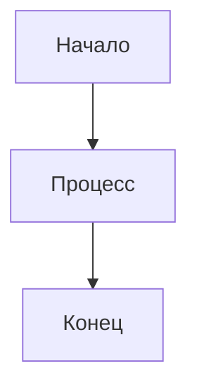

# Расширения

Расширения — это дополнительные модули, которые расширяют функциональность Diplodoc, добавляя новые возможности для обработки и отображения контента. В отличие от плагинов markdown-it, расширения работают на уровне всего процесса сборки документации.

## Что такое расширения

Расширения позволяют:
- Добавлять новые типы контента и блоков
- Интегрироваться с внешними сервисами
- Обрабатывать метаданные документов
- Модифицировать процесс сборки

## Встроенные расширения

В Diplodoc включены следующие встроенные расширения, которые служат примерами для создания собственных:

### OpenAPI Extension
Расширение для отображения OpenAPI спецификаций в документации.

**Возможности:**
- Автоматическое создание документации API из OpenAPI/Swagger файлов
- Интерактивное отображение эндпоинтов
- Поддержка различных форматов спецификаций

**Использование:**
```yaml
# В файле конфигурации
openapi:
  spec: path/to/openapi.yaml
```

### Mermaid Extension  
Расширение для создания диаграмм с помощью Mermaid.

**Возможности:**
- Создание блок-схем, диаграмм последовательности, диаграмм Ганта
- Рендеринг диаграмм на стороне клиента или сервера
- Поддержка тем оформления

**Использование:**
```markdown

```

## Создание собственных расширений

Встроенные расширения служат примерами архитектуры для создания собственных расширений. Они демонстрируют:

- Структуру кода расширения
- Интеграцию с процессом сборки
- Обработку конфигурации
- Взаимодействие с другими компонентами системы

### Архитектура расширения

Расширение должно экспортировать объект со следующими свойствами:

```javascript
module.exports = {
  name: 'extension-name',
  transform: (params) => {
    // Логика обработки контента
  },
  hooks: {
    // Хуки для интеграции с процессом сборки
  }
};
```

### Подключение расширения

Расширения подключаются через конфигурационный файл:

```javascript
// diplodoc.config.js
module.exports = {
  extensions: [
    './path/to/custom-extension',
    '@scope/published-extension'
  ]
};
```

## Разница между плагинами и расширениями

| Плагины | Расширения |
|---------|------------|
| Работают на уровне markdown-it | Работают на уровне всего процесса сборки |
| Обрабатывают синтаксис Markdown | Могут модифицировать любую часть процесса |
| Простая интеграция | Более сложная архитектура |
| Множество готовых решений | Специфичны для Diplodoc |

## Полезные ссылки

- [Документация по разработке расширений](../dev/extensions-api.md)
- [Примеры расширений на GitHub](https://github.com/diplodoc-platform/)
- [API для разработчиков расширений](../dev/extensions/core-concepts.md)