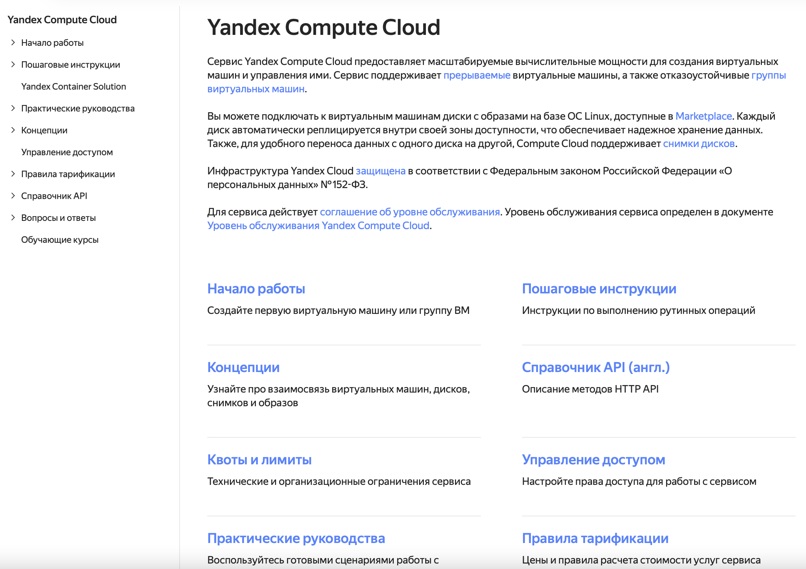

# Разводящая страница

Для быстрой навигации по документу вы можете оформить страницу в виде сетки со ссылками на основные разделы.

Пример: оформление разводящей страницы [документации сервиса Yandex Compute Cloud](https://cloud.yandex.ru/docs/compute/).



## Структура {#structure}

Стандартная структура yaml-файла разводящей страницы имеет вид:

```yaml
title: Имя документа
description: Описание документа
meta:
  title: Метаданные
  noIndex: true
links:
- title: Первый раздел
  description: Описание первого раздела
  href: path/to/file
- title: Второй раздел
  description: Описание второго раздела
  href: path/to/file
```
* `title` — название документа. Отображается в оглавлении над списком всех разделов.
* `description` — описание документа.
* `meta`— [метаданные](./meta.md).
* `links` — группирующий элемент. Для каждого раздела внутри него задается:
    * `title` — название раздела. Отображается как имя ссылки.
    * `description`— описание раздела.
    * `href` — относительный путь до файла без указания расширения.

Описания документа и разделов **не поддерживают** markdown-разметку.

## Открытие ссылок в новой вкладке {#target}

По умолчанию, все относительные ссылки на разводящей открываются в текущей вкладке браузера, все абсолютные ссылки – в новой вкладке. Это поведение можно менять с помощью параметра `target`:

* `_self` — ссылка будет открываться в текущей вкладке,
* `_blank` — ссылка будет открываться в новой вкладке.

```yaml
- title: Абсолютная ссылка
  href: https://github.com
  target: _self
- title: Отдельный раздел в документации
  href: ./some-internal-page/
  target: _blank
```

## Условия видимости элементов {#when}

Отдельные разделы можно отображать или не отображать на разводящей странице в зависимости от значений [переменных](../syntax/vars.md). Для описания условий видимости используется параметр `when`.

Доступные операторы сравнения: `==`, `!=`, `<`, `>`, `<=`, `>=`.

```yaml
- title: Раздел с условным вхождением
  description: Описание раздела
  href: path/to/conditional/file.md
  when: version == 12
```

## Подстановки и условные операторы {#subtitudes}

Название и описание документа и ссылок поддерживают [подстановки](../syntax/vars#subtitudes) и [условные операторы](../syntax/vars#conditions).

```yaml
title: "not_var{{ title }}"
description: "not_var{{ description_legacy }}not_var{{ description }}"
meta:
  title: "not_var{{ meta_title }}"
links:
- title: "not_var{{ link_title }}"
  description: "not_var{{ link_description }}"
  href: path/to/conditional/file.md
```

> Смотри также: [Ajv схема разводящих страниц](https://raw.githubusercontent.com/diplodoc-platform/ajv/refs/heads/master/src/json/frontmatter-schema.json)
