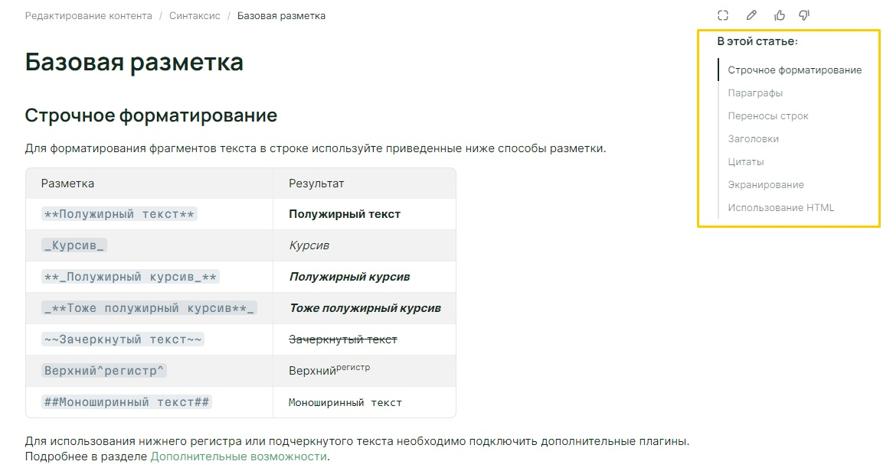
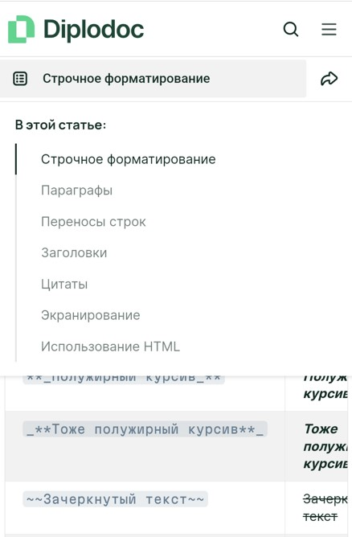

# Оглавление на странице документации

Оглавление — специальное меню, в котором собраны заголовки для удобной навигации по статье.



Оглавление включает заголовки до третьего уровня. Заголовки четвертого уровня и выше в оглавление не попадают.



Расположение оглавления зависит от типа устройства, на котором открывается документация.



- Устройства с большими экранами

  Если документация открывается на устройствах с большими экранами, например, на компьютере или ноутбуке, то оглавление будет расположено в правой части документации.

  

- Мобильные устройства

  Если документация открывается на мобильных устройствах, то оглавление будет скрыто для экономии места на экране.
  
  Чтобы показать оглавление, нажмите на иконку .

  



## Особенности работы с заголовками

### Заголовок первого уровня

В YFM заголовок первого уровня — это заголовок страницы, поэтому:

- Такой заголовок не попадает в оглавление.
- На такой заголовок не получится повесить якорь.

### Оглавление не отображается на странице

Оглавление не будет отображаться на странице, если:

- пропущен один из уровней заголовков;

  ```markdown
  # Заголовок 1
  ### Заголовок 2
  #### Заголовок 3
  ```

- заголовки выстроены не по возрастанию уровней;

  ```markdown
  # Заголовок 1
  ### Заголовок 2
  ## Заголовок 3
  ```