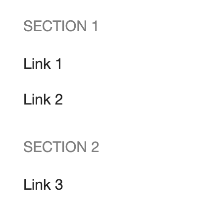
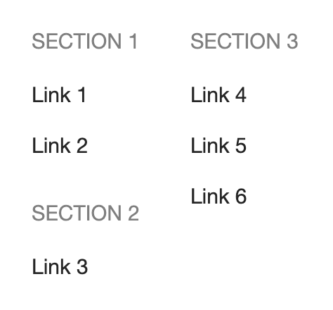

# Расширенная навигация

Платформа поддерживает гибкую настройку верхней навигации («шапки») на странице.
Для этого используется пакет [page-constructor](https://gravity-ui.com/libraries/page-constructor). В [StoryBook](https://preview.gravity-ui.com/page-constructor/?path=/docs/navigation-navigation--docs) можно ознакомиться с примерами конфигурации навигации.

Блок конфигурации добавляется в `toc.yaml` следующим образом:

```yaml
navigation:
  logo:
    url: 'https://diplodoc.com'
    dark:
      icon: 'https://storage.yandexcloud.net/diplodoc-www-assets/logo/ddos-logo-dark.svg'
      text: 'Diplodoc'
    light:
      icon: 'https://storage.yandexcloud.net/diplodoc-www-assets/navigation/diplodoc-logo.svg'
      text: 'Diplodoc'
  header:
    leftItems:
      - text: 'Relative Link'
        type: 'link'
        url: './ru/settings'
      - text: 'Absolute Link'
        type: 'link'
        url: 'https://diplodoc.com/docs/ru/project/'
    rightItems:
      - text: 'Other Link'
        type: 'link'
        url: 'ru/contribution'
      - type: controls
```

Для элементов списков `leftItems` и `rightItems` *первого уровня* можно использовать условия вывода `when` и подстановки переменных по аналогии с [разделами оглавления](toc.md#when).

## Поддерживаемые элементы верхнего меню {#item-types}

Тип элемента указывается в свойстве `type`.
На первом уровне доступны:

- `dropdown` — выпадающий список; свойство `items` может содержать элементы следующих типов:
  - `column` — группа элементов, отображаемых в одну колонку;
  - `section` — группа ссылок, объединённых заголовком, задаваемым через поле `title`;
  - `link` — ссылка;

    

    #|
    ||
    Простой список:
    |>
    ||
    ||

    ```yaml
    - type: dropdown
      text: 'Dropdown'
      items:
        - type: link
          text: 'Link 1'
          url: 'https://diplodoc.com'
        - type: link
          text: 'Link 2'
          url: 'https://diplodoc.com/docs/'
    ```

    |
    ||
    ||
    Несколько групп ссылок в одной колонке:
    |>
    ||
    ||

    ```yaml
    - type: dropdown
      text: 'Dropdown'
      items:
        - type: section
          title: 'Section 1'
          items:
            - type: link
              text: Link 1
              url: 'https://diplodoc.com'
            - type: link
              text: Link 2
              url: 'https://diplodoc.com/docs/'
        - type: section
          title: 'Section 2'
          items:
            - type: link
              text: 'Link 3'
              url: 'https://diplodoc.com/docs/'
    ```
    |
    { height=200 }
    ||
    ||
    Группы ссылок в нескольких колонках:
    |>
    ||
    ||

    ```yaml
    - type: dropdown
      text: 'Dropdown'
      items:
        - type: column
          items:
          - type: section
            title: 'Section 1'
            items:
              - type: link
                text: 'Link 1'
                url: 'https://diplodoc.com'
              - type: link
                text: 'Link 2'
                url: 'https://diplodoc.com/docs/'
          - type: section
            title: 'Section 2'
            items:
              - type: link
                text: 'Link 3'
                url: 'https://diplodoc.com/docs/'
        - type: column
          items:
          - type: section
            title: 'Section 3'
            items:
              - type: link
                text: 'Link 4'
                url: 'https://diplodoc.com/docs/ru/dev/'
              - type: link
                text: 'Link 5'
                url: 'https://diplodoc.com/docs/ru/quickstart/'
              - type: link
                text: 'Link 6'
                url: 'https://diplodoc.com/docs/ru/project/'
    ```

    |

    { height=200 }
    ||
    |#

    

- `label` — статичный текст; свойство `theme` определяет стиль блока:

  { width=600 }

  

    ```yaml
    - type: label
      theme: normal
      text: normal

    - type: label
      theme: info
      text: info

    - type: label
      theme: danger
      text: danger

    - type: label
      theme: warning
      text: warning

    - type: label
      theme: success
      text: success

    - type: label
      theme: utility
      text: utility

    - type: label
      theme: unknown
      text: unknown

    - type: label
      theme: clear
      text: clear
    ```

    

- `search` — точка размещения поля поиска в навигации.
  Если не указана вручную, то автоматически добавляется последним элементом в `rightItems`.

- `controls` — точка размещения настроек в навигации.
  Если не указана вручную, то автоматически добавляется последним элементом в `rightItems`.

На первом уровне, в выпадающих списках, группах элементов и ссылок доступен элемент:

- `link` — ссылка, свойство `url` содержит текст ссылки; относительные ссылки всегда рассчитываются от корня проекта, на каком бы уровне ни находился ##toc.yaml##.
