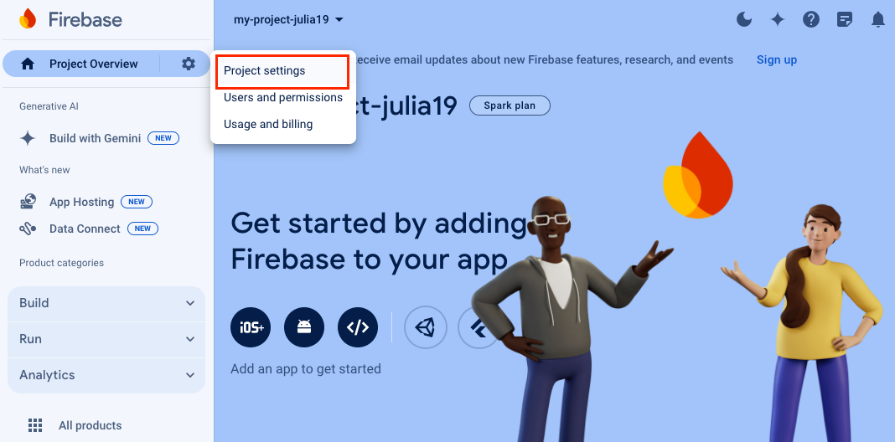
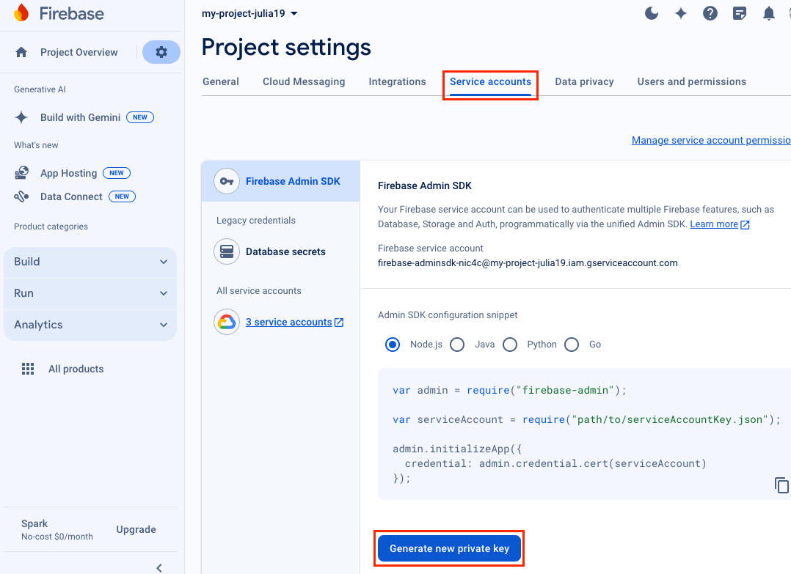
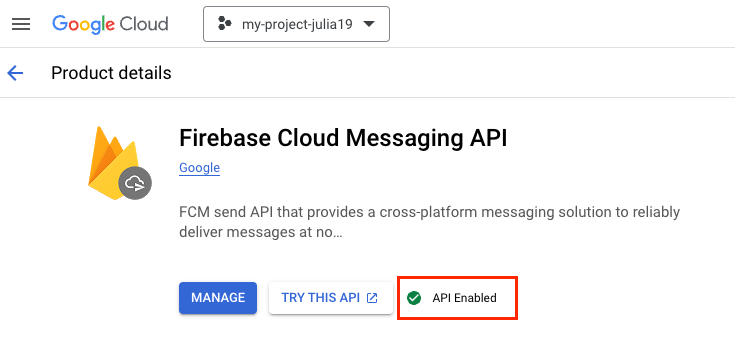

# Настройка приложения

## Для использования Firebase {#firebase}

### Шаг 1. Создайте проект в Firebase и получите ключ {#create-key}

1. Перейдите в [Firebase Console](https://console.firebase.google.com/), нажмите **Get started with a Firebase project** и создайте проект.

   

   Если у вас уже есть проект, перейдите в **Project settings** и следуйте инструкции, начиная с пункта 3.

   

2. Перейдите в **Your Project** → **Project settings**.

   {style="border: solid 1px #cccccc; max-width: 800px;"}

3. В **Project settings** перейдите на вкладку **Service accounts** и нажмите кнопку **Generate new private key**.

   {style="border: solid 1px #cccccc; max-width: 800px;"}

4. В открывшемся окне нажмите кнопку **Generate key**. Будет загружен ключ, который является файлом JSON. Сохраните его, он понадобится для работы с AppMetrica.
5. Пожалуйста, убедитесь, что Firebase Cloud Messaging API (FCM API) включен. Если нет, включите его:
   1. Перейдите на сайт <https://console.cloud.google.com/apis/library/fcm.googleapis.com>.
   2. Выберите свой проект и проверьте статус FCM API.
   3. Нажмите кнопку **Enable**, если ваш FCM API выключен.

      {style="border: solid 1px #cccccc; max-width: 800px;"}

### Шаг 2. Добавьте ключ в интерфейсе AppMetrica {#add-key}

Добавьте ключ, который вы получили в [Шаге 1](#create-key), в интерфейсе AppMetrica:

1. В разделе [Приложения](https://appmetrika.yandex.ru/application/list)[Приложения](https://appmetrica.yandex.com/application/list) выберите приложение, для которого вы хотите проводить push-кампании.
2. В меню слева выберите пункт **Настройки**.
3. Перейдите на вкладку **Push-уведомления**.
4. В блоке **Android** в пункте **FCM service account key** нажмите кнопку **Выбрать файл** и загрузите ключ (файл JSON), полученный в Firebase.

<!-- ### Шаг 1. Создайте проект в Firebase {#firebase}

1. Перейдите в [Firebase Console](https://console.firebase.google.com/) и выберите действие:

    

    1. В поле введите название нового проекта.
    2. Выберите страну, в которой зарегистрирована ваша организация и нажмите кнопку **Создать проект**.

    

    

    1. Выберите из выпадающего списка название проекта, для которого вы планируете проводить push-кампании.
    2. Выберите страну, в которой зарегистрирована ваша организация и нажмите кнопку **Добавить Firebase**.

    

2. Нажмите кнопку **Добавьте Firebase в свое приложение для Android** и следуйте инструкциям.

### Шаг 2. Настройте AppMetrica для работы с FCM {#firebase-key}

Получите ключ сервера для использования Firebase Cloud Messaging:

1. В Firebase Console выберите проект, для которого вы планируете проводить push-кампании.
2. В меню слева, рядом с названием проекта, нажмите значок  и перейдите в раздел **Project Settings**.
3. Перейдите на вкладку **Cloud Messaging**.
4. В блоке **Cloud Messaging API** выберите  → **Manage API in Google Cloud Console** → **Enable**.
5. Вернитесь на вкладку **Cloud Messaging**.
6. В блоке **Cloud Messaging API** скопируйте значение поля **Server key**.

Используйте этот ключ в интерфейсе AppMetrica:

1. В разделе [Приложения](https://appmetrika.yandex.ru/application/list)[Приложения](https://appmetrica.yandex.com/application/list) выберите приложение, для которого вы хотите проводить push-кампании.
2. В меню слева выберите пункт **Настройки**.
3. Перейдите на вкладку **Push-уведомления**.
4. В блоке **Android** введите в поле **Ключ сервера** значение, скопированное в интерфейсе Firebase Console и нажмите кнопку **Подключить**. -->

## Для использования Huawei Mobile Services (HMS) {#hms}

### Шаг 1. Создайте и настройте проект в консоли Huawei {#hms}

Выполните все шаги согласно документации [Huawei](https://developer.huawei.com/consumer/en/doc/development/HMSCore-Guides-V5/android-config-agc-0000001050170137-V5).



Убедитесь, что в пункте [Configuring the Signing Certificate Fingerprint](https://developer.huawei.com/consumer/en/doc/development/HMSCore-Guides-V5/android-config-agc-0000001050170137-V5#EN-US_TOPIC_0000001050170137__section1159841225116) указаны `SHA-256 certificate fingerprint` для всех подписей приложения, в том числе для debug-версии. Иначе push-уведомления не будут доходить до устройства.



### Шаг 2. Настройте AppMetrica для работы с HMS {#hms}

Получите `ID приложения` и `App secret` из [консоли Huawei](https://developer.huawei.com/consumer/ru/service/josp/agc/index.html):

1. В [списке проектов](https://developer.huawei.com/consumer/ru/service/josp/agc/index.html#/myProject) в консоли Huawei выберите ваш проект.
2. На странице проекта скопируйте значения полей `ID приложения` и `App secret`.

Используйте эти ключи в интерфейсе AppMetrica:

1. В разделе [Приложения](https://appmetrika.yandex.{{ domain }}/application/list) выберите приложение, для которого вы хотите проводить push-кампании.
2. В меню слева выберите пункт **Настройки**.
3. Перейдите на вкладку **Push-уведомления**.
4. В блоке **Huawei** введите в поля **ID приложения** и **App secret** значения из консоли Huawei и нажмите кнопку **Подключить**.

### См. также

- [Подключение и инициализация AppMetrica Push SDK](quick-start.md)
- [Запуск push-кампании](../../../push/marketing.md)

{{ feedback }}

<a href="../../../troubleshooting/feedback-new.html">
  Написать в службу поддержки
</a>


