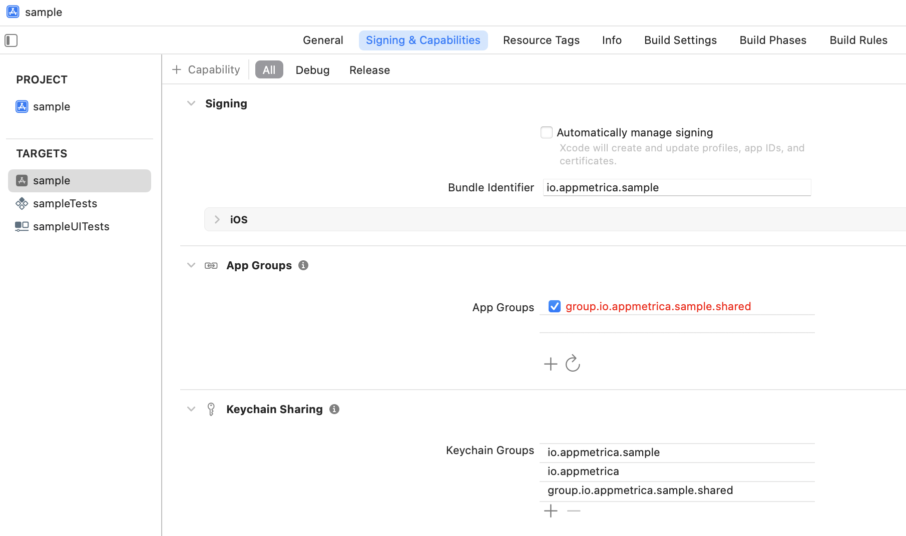
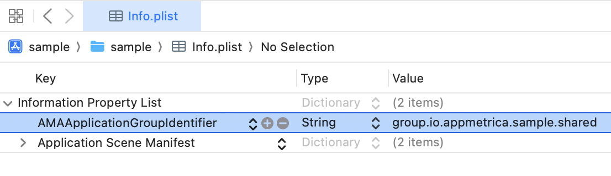

# Поддержка App Extensions

AppMetrica поддерживает работу в App Extensions и позволяет использовать одни и те же идентификаторы для приложения и расширений.

## Настройка {#setup}

1. Следуя [инструкции](https://developer.apple.com/documentation/xcode/configuring-app-groups/), добавьте App Group в приложение и расширение (app extension). 

    

    App Group должна быть доступна только для приложения и его расширений. Не используйте одну и ту же группу в нескольких приложениях, иначе данные будут искажены.

    

2. Добавьте эту же группу в Keychain Access Group по [инструкции](https://developer.apple.com/documentation/security/sharing-access-to-keychain-items-among-a-collection-of-apps).

    {style="border: solid 1px #cccccc; max-width: 800px;"}

3. Отредактируйте Info.plist приложения и добавьте туда ключ `AMAApplicationGroupIdentifier` со значением группы (без `Team ID`). 
Редактировать Info.plist расширений не нужно, они используют данные из Info.plist основного приложения.

    {style="border: solid 1px #cccccc; max-width: 800px;"}

## Как работает AppMetrica {#how-it-works}

Приложение и расширения используют для хранения идентификаторов приватные хранилища (файл в песочнице, keychain) и общие, созданные с помощью App Group (файл в App Group, общий keychain).

Приложение и расширения пытаются прочитать данные из всех источников и выбрать наиболее приоритетный: для приложения это приватные хранилища, для расширения — общие. Если все хранилища пусты, генерируются новые идентификаторы. Затем идентификаторы записываются в остальные хранилища.

## Если в расширениях уже была настроена AppMetrica {#migration-to-appgroup}

Если в расширениях уже была настроена AppMetrica, новая версия будет использовать идентификаторы приложения. Это приведет к тому, что существующие данные станут недействительными.

В некоторых случаях (например, если расширение было запущено раньше приложения) возможны аномалии в аналитических данных из-за потери идентификаторов в расширениях и последующей синхронизации в основном приложении. 

{{ feedback }}

<a href="../../../troubleshooting/feedback-new.html">
  Написать в службу поддержки
</a>


