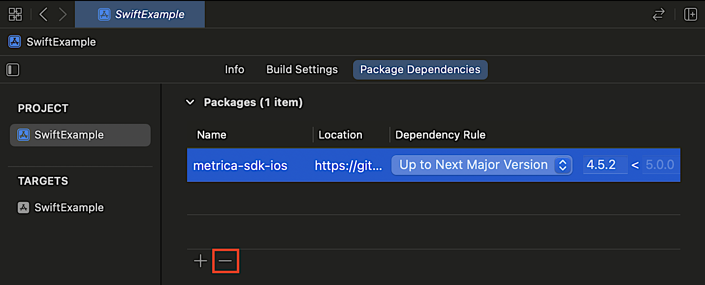
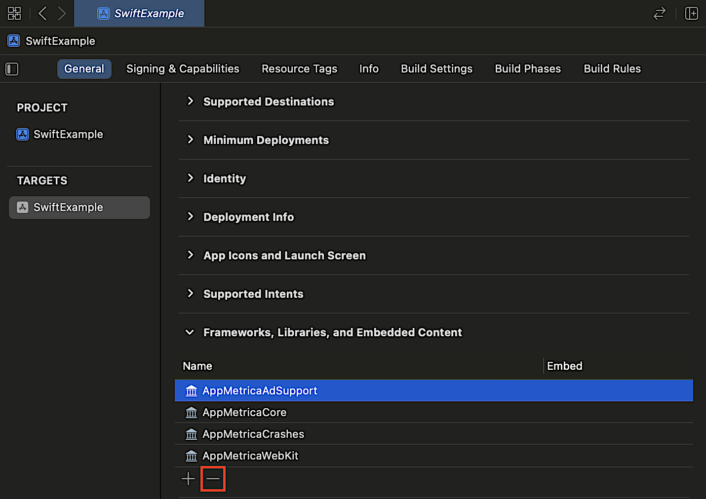

# Руководство по миграции на версию 5.0.0

При миграции приложения с `YandexMobileMetrica` на `AppMetrica` будут сохранены основные идентификаторы и данные, то есть процесс перехода на новую версию не должен вызвать проблем и аномалий в отчетах.

Для миграции на новую версию выполните следующие шаги:

1. Замените зависимости. Необходимые изменения указаны в [разделе по переименованию зависимостей](#rename-modules).
1. Убедитесь, что вы не используете [2 версии AppMetrica SDK одновременно](#two-versions).
1. Импортируйте зависимости в коде. Необходимые изменения указаны в [разделе про импортирование зависимостей](#import-modules).
1. В коде проекта замените те классы и методы, которые были просто переименованы. Необходимые изменения указаны в [разделе по переименованию API](#rename-api).
1. Если вы используете vendor keychain, замените пакет `com.yandex.mobile.appmetrica` на `io.appmetrica`, см. [{#T}](ios-vendor-keychain.md).
1. Перейдите на новый API для отправки ошибок, используя [инструкцию](#crash).
1. Код с остальными ошибками временно закомментируйте, чтобы проект можно было собрать.
1. Исправьте закомментированный код, используя остальные пункты данной инструкции. При возникновении вопросов напишите в [поддержку](../../../troubleshooting/feedback-new.md).

## Переименованные зависимости {#rename-modules}



- CocoaPods

  ```ruby translate=no
  pod 'YandexMobileMetrica', '~> 4.0'
  ```
  
  Замените на:
  
  ```ruby translate=no
  pod 'AppMetricaAnalytics', '~> 5.0.0'
  ```

  AppMetrica SDK состоит из нескольких модулей. Это позволяет подключать только необходимый функционал. При подключении `AppMetricaAnalytics` подключаются все модули. Для более детальной настройки обратитесь к [разделу по интеграции](quick-start.md).

- SPM в Xcode

  #### Если зависимости установлены через Xcode

  1. Удалите зависимость `metrika-sdk-ios`.

     

  2. В окне Xcode навигатора проектов (**Project Navigator**) выберите свой проект (если у вас используется **Workspace**). Затем в верхнем меню нажмите **File** и выберите **Add Package Dependencies...**.

     

  3. Укажите URL репозитория `https://github.com/appmetrica/appmetrica-sdk-ios`.

     

  4. Оставьте только нужные модули (чтобы выключить модуль, в `Add to Target` выберите значение `None`):

     

     

- Package.swift

  #### Если используется Package.swift манифест

  1. Удалите из файла `Package.swift` в вашем проекте зависимость `.package` с `YandexMobileMetrica`, а также все указания на зависимости в разделе `targets:` внутри вашего проекта.
  2. Вставьте следующий код для добавления новой зависимости от `appmetrica-sdk-ios`:

      ```swift translate=no
      dependencies: [
        .package(
          name: "AppMetrica",
          url: "https://github.com/appmetrica/appmetrica-sdk-ios",
          .upToNextMinor(from: "5.0.0")
        ),
      ],
      ```
  3. Добавьте необходимые модули к таргетам вашего проекта.
  
      

      ```swift translate=no
      .target(
          name: "MyTargetName",
          dependencies: [
            .product(name: "AppMetricaCore", package: "AppMetrica"),
            .product(name: "AppMetricaCrashes", package: "AppMetrica"),
            .product(name: "AppMetricaWebKit", package: "AppMetrica"),
            // .product(name: "AppMetricaAdSupport", package: "AppMetrica"), // Этот модуль отлючен
          ]
      ),
      ```



## Одновременное использование двух версий AppMetrica SDK {#two-versions}

Переименованы группа и названия основных артефактов, поэтому в одном приложении могут использоваться сразу две версии AppMetrica SDK: AppMetrica версий 4 и ниже (`YandexMobileMetrica`) и версий 5 и выше (`AppMetrica`). Такая ситуация нежелательна и может возникнуть только в определенных условиях.

### 1. Среди зависимостей приложения прописаны зависимости сразу от двух разных версий AppMetrica SDK



Категорически не рекомендуется одновременная работа в коде приложения с `YandexMobileMetrica` и `AppMetrica` с одним `API key`. То есть нельзя одновременно активировать `YandexMetrica` и `AppMetrica` с одним `API key`. Это не приведет к сбоям и крэшам в приложении, но вызовет искажение и нарушение статистики. При миграции на `AppMetrica` проверьте, что среди зависимостей приложения нет зависимости от `YandexMobileMetrica`.



### 2. Одна из зависимостей приложения транзитивно зависит от AppMetrica SDK

Если приложение и библиотеки используют разные `API key`, данная ситуация является возможной, но нежелательной. Статистика должна собираться нормально, хотя допустимы небольшие отклонения. В этом случае возможно некоторое увеличение размера приложения, так как в составе приложения будут присутствовать два SDK, вместо одного.

### Как убедиться, что не используется YandexMobileMetrica



- CocoaPods

  Откройте файл `Podfile.lock` и выполните поиск `YandexMobileMetrica`.

  Так же по блоку `PODS` в файле `Podfile.lock` можно понять какая зависимость ссылается на `YandexMobileMetrica`.

  ```
  PODS:
    ...
     YandexMobileAds (6.4.0):
      - DivKit (= 28.13.0)
      - YandexMobileMetrica (< 5.0.0, >= 4.0.0)
    ...
  ```

- SPM в Xcode

  #### Если зависимости установлены через Xcode

  Откройте проект в Xcode. Убедитесь, что в `Package Dependencies` нет `YandexMobileMetrica`.

  

- Package.swift

  #### Если используется Package.swift манифест
  
  Если ваш проект использует Package.swift манифест для управления зависимостями, выполните в терминале команду `swift package show-dependencies` в директории вашего проекта. Это выведет список всех зависимостей проекта, включая транзитивные.
  
  ```bash translate=no
  .
  └── yandex-ads-sdk-ios<https://github.com/yandexmobile/yandex-ads-sdk-ios.git@6.4.0>
    ├── metrica-sdk-ios<https://github.com/yandexmobile/metrica-sdk-ios@4.5.2>
    └── divkit-ios<https://github.com/divkit/divkit-ios@28.13.0>
        └── vgsl<https://github.com/yandex/vgsl.git@2.4.1>
  ```

  Также можно проверить файл `Package.resolved` на наличие зависимости  `YandexMobileMetrica`.

  ```json translate=no
  {
    "object": {
      "pins": [
        //...
        {
          "package": "YandexMobileMetrica",
          "repositoryURL": "https://github.com/yandexmobile/metrica-sdk-ios",
          "state": {
            "branch": null,
            "revision": "13d8b11181a33938ef42759d49466a621df5e7db",
            "version": "4.5.2"
          }
        },
        //...
      ]
    },
    // ...
  }
  ```



## Импортирование зависимостей {#import-modules}



- Swift

  ```swift translate=no
  import YandexMobileMetrica
  ```

  Замените на:

  ```swift translate=no
  import AppMetricaCore
  import AppMetricaCrashes // при необходимости работы с ошибками/крэшами
  import AppMetricaWebKit // при необходимости настроить отправку событий из WebView
  ```

- Objective-C

  ```obj-c translate=no
  #import <YandexMobileMetrica/YandexMobileMetrica.h>
  ```

  Замените на:

  ```obj-c translate=no
  #import <AppMetricaCore/AppMetricaCore.h>
  #import <AppMetricaCrashes/AppMetricaCrashes.h> // при необходимости работы с ошибками/крэшами
  #import <AppMetricaWebKit/AppMetricaWebKit.h> // при необходимости настроить отправку событий из WebView
  ```



## Переименование API {#rename-api}



- Swift

  Префикс `YMM` удален.

  * Интерфейс `YMMYandexMetrica` переименован в `AppMetrica`.
    * Метод `handleOpen(_:)` переименован в `trackOpeningURL(_:)`.
    * Метод `initWebViewReporting(_:onFailure:)` переименован в `setupWebViewReporting(with:onFailure:)`, смотрите подробнее в [Отправка события из JavaScript-кода WebView](#vebview).
    * Метод `libraryVersion()` удален, используйте свойство `libraryVersion`.
    * Метод `report(adRevenue:onFailure:)` переименован в `reportAdRevenue(_:onFailure)`.
    * Метод `report(eCommerce:onFailure:)` переименован в `reportECommerce(_:onFailure:)`.
    * Метод `report(error:onFailure:)` перенесен в класс `AppMetricaCrashes` и в модуль `AppMetricaCrashes`, смотрите инструкцию [Работа с крэшами и ошибками](#crash).
    * Метод `report(error:options:onFailure:)` перенесен в класс `AppMetricaCrashes` и в модуль `AppMetricaCrashes`, смотрите инструкцию [Работа с крэшами и ошибками](#crash).
    * Метод `report(nserror:onFailure:)` перенесен в класс `AppMetricaCrashes` и в модуль `AppMetricaCrashes`, смотрите инструкцию [Работа с крэшами и ошибками](#crash).
    * Метод `report(nserror:options:onFailure:)` перенесен в класс `AppMetricaCrashes` и в модуль `AppMetricaCrashes`, смотрите инструкцию [Работа с крэшами и ошибками](#crash).
    * Метод `reportError(_:exception:onFailure:)` удален, смотрите инструкцию [Работа с крэшами и ошибками](#crash).
    * Метод `reportEvent(_:onFailure:)` переименован в `reportEvent(name:onFailure)`.
    * Метод `reportEvent(_:parameters:onFailure:)` переименован в `reportEvent(name:parameters:onFailure)`.
    * Метод `reportReferralUrl(_:)` удален.
    * Метод `reporterForApiKey(_:)` переименован в `reporter(for:)`.
    * Метод `requestAppMetricaDeviceID(withCompletionQueue:completionBlock:)` удален, используйте `requestStartupIdentifiers(for:on:completion:)`.
    * Метод `setErrorEnvironmentValue(_:forKey:)` удален, используйте `AppMetricaCrashes.crashes().set(errorEnvironmentValue: value, forKey: key)`.
    * Метод `setLocation(_:)` удален, используйте свойство `customLocation`.
    * Метод `setLocationTracking(_:)` удален, используйте свойство `isLocationTrackingEnabled`.
    * Метод `setStatisticsSending(_:)` переименован в `setDataSendingEnabled(_:)`.
    * Метод `setUserProfileID(_:)` удален, используйте свойство `userProfileID`.
  * Интерфейс `YMMYandexMetricaConfiguration` переименован в `AppMetricaConfiguration`
    * Свойство `appForKids` удалено, смотрите инструкцию [Использование SDK для детских приложений](#child).
    * Свойство `crashReporting` удалено, смотрите инструкцию [Работа с крэшами и ошибками](#crash).
    * Свойство `location` переименовано в `customLocation`.
    * Свойство `logs` переименовано в `areLogsEnabled`.
    * Свойство `statisticsSending` переименовано в `dataSendingEnabled`.
  * Интерфейс `YMMYandexMetricaPreloadInfo` переименован в `AppMetricaPreloadInfo`.
    * Метод `setAdditional(_:forKey:)` переименован в `setAdditional(info:forKey:)`.

  **Reporter**

  * Интерфейс `YMMMutableReporterConfiguration` переименован в `MutableReporterConfiguration`.
    * Свойство `logs` переименовано в `areLogsEnabled`.
    * Свойство `statisticsSending` переименовано в `dataSendingEnabled`.
  * Интерфейс `YMMPluginErrorDetails` переименован в `PluginErrorDetails`.    
  * Интерфейс `YMMReporterConfiguration` переименован в `ReporterConfiguration`.
    * Свойство `logs` переименовано в `areLogsEnabled`.
    * Свойство `statisticsSending` переименовано в `dataSendingEnabled`.
  * Интерфейс `AppMetricaCrashesConfiguration` добавлен.
  * Интерфейс `YMMStackTraceElement` переименован в `StackTraceElement`.
  * Интерфейс `YMMYandexMetricaPlugins` переименован в `AppMetricaPlugins`.  
    * Метод `getPluginExtension` переименован в `pluginExtension`.
  * Интерфейс `AppMetricaCrashes` добавлен.
    * Метод `-clearErrorEnvironment:` добавлен.
    * Метод `-enableANRMonitoring:` добавлен.
    * Метод `-enableANRMonitoringWithWatchdogInterval:pingInterval:` добавлен.
    * Метод `-requestCrashReportingStateWithCompletionQueue:completionBlock:` добавлен. 
    * Метод `-setErrorEnvironmentValue:forKey:` добавлен.
  * Протокол `YMMYandexMetricaPluginReporting` переименован в `AppMetricaPluginReporting`.  
    * Метод `getPluginExtension` переименован в `pluginExtension`.    
  * Протокол `YMMYandexMetricaReporting` переименован в `AppMetricaReporting`.
    * Метод `report(adRevenue:onFailure:)` переименован в `reportAdRevenue(_:onFailure)`.
    * Метод `report(eCommerce:onFailure:)` переименован в `reportECommerce(_:onFailure:)`.
    * Метод `report(error:onFailure:)` перенесен в протокол `AppMetricaCrashReporting`, в класс `AppMetricaCrashes` и в модуль `AppMetricaCrashes`, смотрите инструкцию [Работа с крэшами и ошибками](#crash).
    * Метод `report(error:options:onFailure:)` перенесен в протокол `AppMetricaCrashReporting`, в класс `AppMetricaCrashes` и в модуль `AppMetricaCrashes`, смотрите инструкцию [Работа с крэшами и ошибками](#crash).
    * Метод `report(nserror:onFailure:)` перенесен в протокол `AppMetricaCrashReporting`, в класс `AppMetricaCrashes` и в модуль `AppMetricaCrashes`, смотрите инструкцию [Работа с крэшами и ошибками](#crash).
    * Метод `report(nserror:options:onFailure:)` перенесен в протокол `AppMetricaCrashReporting`, в класс `AppMetricaCrashes` и в модуль `AppMetricaCrashes`, смотрите инструкцию [Работа с крэшами и ошибками](#crash).
    * Метод `reportEvent(_:onFailure:)` переименован в `reportEvent(name:onFailure)`.
    * Метод `reportEvent(_:parameters:onFailure:)` переименован в `reportEvent(name:parameters:onFailure)`.
    * Метод `setStatisticsSending(_:)` переименован в `setDataSendingEnabled(_:)`.
    * Метод `setUserProfileID(_:)` удален, используйте свойство `userProfileID`.
  * Константа `kYMMPlatformNative` переименована в `PlatformNative`. 
  * Константа `kYMMPlatformFlutter` переименована в `PlatformFlutter`.    
  * Константа `CrashReportingStateKey.enabledKey` добавлена с версии 5.4.0.
  * Константа `CrashReportingStateKey.crashedLastLaunchKey` добавлена с версии 5.4.0.

  **Атрибуты пользователя**

  * Интерфейс `YMMMutableUserProfile` переименован в `MutableUserProfile`.
  * Интерфейс `YMMProfileAttribute` переименован в `ProfileAttribute`.
  * Интерфейс `YMMUserProfile` переименован в `UserProfile`.
  * Перечисление `YMMGenderType` переименовано в `GenderType`.
  * Протокол `YMMBirthDateAttribute` переименован в `BirthDateAttribute`.
  * Протокол `YMMCustomBoolAttribute` переименован в `CustomBoolAttribute`.
  * Протокол `YMMCustomCounterAttribute` переименован в `CustomCounterAttribute`.
  * Протокол `YMMCustomNumberAttribute` переименован в `CustomNumberAttribute`.
  * Протокол `YMMCustomStringAttribute` переименован в `CustomStringAttribute`.
  * Протокол `YMMGenderAttribute` переименован в `GenderAttribute`.
  * Протокол `YMMNameAttribute` переименован в `NameAttribute`.
  * Протокол `YMMNotificationsEnabledAttribute` переименован в `NotificationsEnabledAttribute`.

  **Ошибки**

  * Интерфейс `YMMError` переименован в `AppMetricaError` и перенесен в модуль `AppMetricaCrashes`.
  * Константа `YMMBacktraceErrorKey` переименована в `BacktraceErrorKey` и перенесена в модуль `AppMetricaCrashes`.
  * Перечисление `YMMErrorReportingOptions` переименовано в `ErrorReportingOptions` и перенесено в модуль `AppMetricaCrashes`.
  * Протокол `YMMErrorRepresentable` переименован в `ErrorRepresentable` и перенесен в модуль `AppMetricaCrashes`.

  **AdRevenue**

  * Интерфейс `YMMAdRevenueInfo` переименован в `AdRevenueInfo`.
  * Интерфейс `YMMMutableAdRevenueInfo` переименован в `MutableAdRevenueInfo`.
  * Перечисление `YMMAdType` переименовано в `AdType`.

  **ECommerce**

  * Интерфейс `YMMECommerceAmount` переименован в `ECommerceAmount`.
  * Интерфейс `YMMECommerceCartItem` переименован в `ECommerceCartItem`.
  * Интерфейс `YMMECommerceOrder` переименован в `ECommerceOrder`.
  * Интерфейс `YMMECommercePrice` переименован в `ECommercePrice`.
  * Интерфейс `YMMECommerceProduct` переименован в `ECommerceProduct`.
  * Интерфейс `YMMECommerceReferrer` переименован в `ECommerceReferrer`.
  * Интерфейс `YMMECommerceScreen` переименован в `ECommerceScreen`.
  * Интерфейс `YMMECommerce` переименован в `ECommerce`.

  **Revenue**

  * Интерфейс `YMMMutableRevenueInfo` переименован в `MutableRevenueInfo`.
  * Интерфейс `YMMRevenueInfo` переименован в `RevenueInfo`.
    * Конструктор `init(price:currency:)` удален, используйте `init(priceDecimal:currency)`.
    * Конструктор `init(price:currency:quantity:productID:transactionID:receiptData:payload:)` удален, используйте `init(priceDecimal:currency:quantity:productID:transactionID:receiptData:payload:)`.

- Objective-C

  Префикс `YMM` сменился на `AMA`.

  * Интерфейс `YMMYandexMetrica` переименован в `AMAAppMetrica`.
    * Метод `-getPluginExtension:` перенесен в класс `AMAAppMetricaCrashes` и переименован в `-pluginExtension:`.
    * Метод `+handleOpenURL:` переименован в `+trackOpeningURL:`.
    * Метод `+initWebViewReporting:onFailure:` переименован в `+setupWebViewReporting:onFailure:`, смотрите подробнее в [Отправка события из JavaScript-кода WebView](#vebview).
    * Метод `+libraryVersion:` удален, используйте свойство `libraryVersion`.
    * Метод `+reportError:exception:onFailure:` удален, смотрите инструкцию [Работа с крэшами и ошибками](#crash).
    * Метод `+reportError:onFailure:` перенесен в класс `AppMetricaCrashes` и в модуль `AppMetricaCrashes`, смотрите инструкцию [Работа с крэшами и ошибками](#crash).
    * Метод `+reportError:options:onFailure:` перенесен в класс `AppMetricaCrashes` и в модуль `AppMetricaCrashes`, смотрите инструкцию [Работа с крэшами и ошибками](#crash).
    * Метод `+reportEvent:params:onFailure:` переименован в `+reportEvent:parameters:onFailure:`
    * Метод `+reportNSError:onFailure:` перенесен в класс `AppMetricaCrashes` и в модуль `AppMetricaCrashes`, смотрите инструкцию [Работа с крэшами и ошибками](#crash).
    * Метод `+reportNSError:options:onFailure:` перенесен в класс `AppMetricaCrashes` и в модуль `AppMetricaCrashes`, смотрите инструкцию [Работа с крэшами и ошибками](#crash).
    * Метод `+reportReferralUrl:` удален.
    * Метод `+reporterForApiKey:` переименован в `+reporterForAPIKey:`.
    * Метод `+requestAppMetricaDeviceIDWithCompletionQueue:` удален, используйте `+requestStartupIdentifiersWithKeys:completionQueue:completionBlock:`.
    * Метод `+setErrorEnvironmentValue:forKey:` удален, используйте `[[AMAAppMetricaCrashes crashes] setErrorEnvironmentValue:value forKey:key]`.
    * Метод `+setLocation:` удален, используйте свойство `customLocation`.
    * Метод `+setLocationTracking:` удален, используйте свойство `locationTrackingEnabled`.
    * Метод `+setStatisticsSending:` переименован в `+setDataSendingEnabled:`.
    * Метод `+setUserProfileID:` удален, используйте свойство `userProfileID`.
  * Интерфейс `YMMYandexMetricaConfiguration` переименован в `AMAAppMetricaConfiguration`.
    * Конструктор `-initWithApiKey:` переименован в `-initWithAPIKey:`.
    * Свойство `apiKey` переименован в `APIKey`.
    * Свойство `appForKids` удалено, смотрите инструкцию [Использование SDK для детских приложений](#child).
    * Свойство `crashReporting` удалено, смотрите инструкцию [Работа с крэшами и ошибками](#crash).
    * Свойство `location` переименовано в `customLocation`.
    * Свойство `logs` переименовано в `logsEnabled`.
    * Свойство `statisticsSending` переименовано в `dataSendingEnabled`.
  * Интерфейс `YMMYandexMetricaPreloadInfo` переименован в `AMAAppMetricaPreloadInfo`.

  **Reporter**

  * Интерфейс `YMMMutableReporterConfiguration` переименован в `AMAMutableReporterConfiguration`.
    * Свойство `logs` переименовано в `logsEnabled`.
    * Свойство `statisticsSending` переименовано в `dataSendingEnabled`.
  * Интерфейс `YMMPluginErrorDetails` переименован в `AMAPluginErrorDetails`.
  * Интерфейс `YMMReporterConfiguration` переименован в `AMAReporterConfiguration`.
    * Конструктор `-initWithApiKey:` переименован в `-initWithAPIKey:`.
    * Свойство `apiKey` переименовано в `APIKey`.
    * Свойство `logs` переименовано в `logsEnabled`.
    * Свойство `statisticsSending` переименовано в `dataSendingEnabled`.
  * Интерфейс `AMAAppMetricaCrashesConfiguration` добавлен.
  * Интерфейс `YMMStackTraceElement` переименован в `AMAStackTraceElement`.
  * Интерфейс `YMMYandexMetricaPlugins` переименован в `AMAAppMetricaPlugins`.  
    * Метод `getPluginExtension` переименован в `pluginExtension`.
  * Интерфейс `AMAAppMetricaCrashes` добавлен.
    * Метод `-clearErrorEnvironment:` добавлен.
    * Метод `-enableANRMonitoring:` добавлен.
    * Метод `-enableANRMonitoringWithWatchdogInterval:pingInterval:` добавлен.
    * Метод `-requestCrashReportingStateWithCompletionQueue:completionBlock:` добавлен. 
    * Метод `-setErrorEnvironmentValue:forKey:` добавлен.
  * Протокол `YMMYandexMetricaPluginReporting` переименован в `AMAAppMetricaPluginReporting`.  
    * Метод `getPluginExtension` переименован в `pluginExtension`.  
  * Протокол `YMMYandexMetricaReporting` переименован в `AMAAppMetricaReporting`.
    * Метод `+reportError:onFailure:` перенесен в протокол `AMAAppMetricaCrashReporting`, в класс `AppMetricaCrashes` и в модуль `AppMetricaCrashes`, смотрите инструкцию [Работа с крэшами и ошибками](#crash).
    * Метод `+reportError:options:onFailure:` перенесен в протокол `AMAAppMetricaCrashReporting`, в класс `AppMetricaCrashes` и в модуль `AppMetricaCrashes`, смотрите инструкцию [Работа с крэшами и ошибками](#crash).
    * Метод `+reportEvent:params:onFailure:` переименован в `+reportEvent:parameters:onFailure:`.
    * Метод `+reportNSError:onFailure:` перенесен в протокол `AMAAppMetricaCrashReporting`, в класс `AppMetricaCrashes` и в модуль `AppMetricaCrashes`, смотрите инструкцию [Работа с крэшами и ошибками](#crash).
    * Метод `+reportNSError:options:onFailure:` перенесен в протокол `AMAAppMetricaCrashReporting`, в класс `AppMetricaCrashes` и в модуль `AppMetricaCrashes`, смотрите инструкцию [Работа с крэшами и ошибками](#crash).
    * Метод `+setStatisticsSending:` переименован в `+setDataSendingEnabled:`.
  * Константа `kYMMPlatformNative` переименована в `kAMAPlatformNative`.
  * Константа `kYMMPlatformFlutter` переименована в `kAMAPlatformFlutter`.
  * Константа `kAMACrashReportingStateEnabledKey` добавлена с версии 5.4.0. 
  * Константа `kAMACrashReportingStateCrashedLastLaunchKey` добавлена с версии 5.4.0.

  **Атрибуты пользователя**

  * Интерфейс `YMMMutableUserProfile` переименован в `AMAMutableUserProfile`.
  * Интерфейс `YMMProfileAttribute` переименован в `AMAProfileAttribute`.
  * Интерфейс `YMMUserProfile` переименован в `AMAUserProfile`.
  * Перечисление `YMMGenderType` переименовано в `AMAGenderType`.
  * Протокол `YMMBirthDateAttribute` переименован в `AMABirthDateAttribute`.
  * Протокол `YMMCustomBoolAttribute` переименован в `AMACustomBoolAttribute`.
  * Протокол `YMMCustomCounterAttribute` переименован в `AMACustomCounterAttribute`.
  * Протокол `YMMCustomNumberAttribute` переименован в `AMACustomNumberAttribute`.
  * Протокол `YMMCustomStringAttribute` переименован в `AMACustomStringAttribute`.
  * Протокол `YMMGenderAttribute` переименован в `AMAGenderAttribute`.
  * Протокол `YMMNameAttribute` переименован в `AMANameAttribute`.
  * Протокол `YMMNotificationsEnabledAttribute` переименован в `AMANotificationsEnabledAttribute`.

  **Ошибки**

  * Интерфейс `YMMError` переименован в `AMAError`.
  * Константа `YMMBacktraceErrorKey` переименована в `AMABacktraceErrorKey`.
  * Перечисление `YMMErrorReportingOptions` переименовано в `AMAErrorReportingOptions`.
  * Протокол `YMMErrorRepresentable` переименован в `AMAErrorRepresentable`.

  **AdRevenue**

  * Интерфейс `YMMAdRevenueInfo` переименован в `AMAAdRevenueInfo`.
  * Интерфейс `YMMMutableAdRevenueInfo` переименован в `AMAMutableAdRevenueInfo`.
  * Перечисление `YMMAdType` переименовано в `AMAAdType`.

  **ECommerce**

  * Интерфейс `YMMECommerceAmount` переименован в `AMAECommerceAmount`.
  * Интерфейс `YMMECommerceCartItem` переименован в `AMAECommerceCartItem`.
  * Интерфейс `YMMECommerceOrder` переименован в `AMAECommerceOrder`.
  * Интерфейс `YMMECommercePrice` переименован в `AMAECommercePrice`.
  * Интерфейс `YMMECommerceProduct` переименован в `AMAECommerceProduct`.
  * Интерфейс `YMMECommerceReferrer` переименован в `AMAECommerceReferrer`.
  * Интерфейс `YMMECommerceScreen` переименован в `AMAECommerceScreen`.
  * Интерфейс `YMMECommerce` переименован в `AMAECommerce`.

  **Revenue**

  * Интерфейс `YMMMutableRevenueInfo` переименован в `AMAMutableRevenueInfo`.
  * Интерфейс `YMMRevenueInfo` переименован в `AMARevenueInfo`.
    * Конструктор `-initWithPrice:currency:` удален, используйте `-initWithPriceDecimal:currency:`.
    * Конструктор `-initWithPrice:currency:quantity:productID:transactionID:receiptData:payload:` удален, используйте `-initWithPriceDecimal:currency:quantity:productID:transactionID:receiptData:payload:`.



## Работа с крэшами и ошибками {#crash}

API для работы с ошибками теперь находится в модуле `AppMetricaCrashes`. Если вы подключаете `AppMetricaAnalytics`, отдельное подключение `AppMetricaCrashes` не требуется, так как модуль входит в состав `AppMetricaAnalytics`.



- Swift

  Во все файлы, где используется API крэшей или ошибок, добавьте импорт:

  ```swift translate=no
  import AppMetricaCrashes
  ```

  Настройка стратегии отправки крэшей задается с помощью класса `AppMetricaCrashesConfiguration`:

  ```swift translate=no
  var configuration = AppMetricaCrashesConfiguration()
  configuration.autoCrashTracking = true // Если этот параметр включен, крэши будут автоматически отправляться в AppMetrca
  configuration.probablyUnhandledCrashReporting = true // Используйте этот параметр для включения или отключения отслеживания неявных сбоев, например, OOM крэшей
  configuration.ignoredCrashSignals = [] // Эта настройка позволяет указать массив номеров UNIX-сигналов из sys/signal.h, которые будут проигнорированы системой отслеживания сбоев
  configuration.applicationNotRespondingDetection = true // Эта настройка включает обнаружение ситуации, когда основной поток приложения перестает отвечать (ANR)
  configuration.applicationNotRespondingWatchdogInterval = 4.0 // Устанавливает интервал времени, который будет ожидать watchdog, прежде чем сообщить о состоянии "Приложение не отвечает" (ANR)
  configuration.applicationNotRespondingPingInterval = 0.1 // Устанавливает частоту, с которой watchdog будет проверять состояние "Приложение не отвечает" (ANR)
  AppMetricaCrashes.crashes().setConfiguration(configuration)
  ```

  Для отправки ошибок воспользуйтесь методами из класса `AppMetricaCrashes`. Их сигнатура совпадает с сигнатурами аналогичных методов из `YMMYandexMetrica`. Поэтому достаточно заменить `YMMYandexMetrica` на `AppMetricaCrashes.crashes()`.

  ```swift translate=no
  AppMetricaCrashes.crashes().report(error:error)
  AppMetricaCrashes.crashes().report(error:error, onFailure:nil)
  AppMetricaCrashes.crashes().report(error:error, options:options, onFailure:nil)
  AppMetricaCrashes.crashes().report(nserror:error)
  AppMetricaCrashes.crashes().report(nserror:error, onFailure:nil)
  AppMetricaCrashes.crashes().report(nserror:error, options:options, onFailure:nil)
  ```

- Objective-C

  Во все файлы, где используется API крэшей или ошибок, добавьте импорт:

  ```objectivec translate=no
  #import <AppMetricaCrashes/AppMetricaCrashes.h>
  ```

  Настройка стратегии отправки крэшей задается с помощью класса `AMAAppMetricaCrashesConfiguration`:

  ```objectivec translate=no
  AMAAppMetricaCrashesConfiguration *configuration = [[AMAAppMetricaCrashesConfiguration alloc] init];
  configuration.autoCrashTracking = YES; // Если этот параметр включен, крэши будут автоматически отправляться в AppMetrca
  configuration.probablyUnhandledCrashReporting = YES; // Используйте этот параметр для включения или отключения отслеживания неявных сбоев, например, OOM крэшей
  configuration.ignoredCrashSignals = @[]; // Эта настройка позволяет указать массив номеров UNIX-сигналов из sys/signal.h, которые будут проигнорированы системой отслеживания сбоев
  configuration.applicationNotRespondingDetection = YES; // Эта настройка включает обнаружение ситуации, когда основной поток приложения перестает отвечать (ANR)
  configuration.applicationNotRespondingWatchdogInterval = 4.0; // Устанавливает интервал времени, который будет ожидать watchdog, прежде чем сообщить о состоянии "Приложение не отвечает" (ANR)
  configuration.applicationNotRespondingPingInterval = 0.1; // Устанавливает частоту, с которой watchdog будет проверять состояние "Приложение не отвечает" (ANR)
  [[AMAAppMetricaCrashes crashes] setConfiguration:configuration];
  ```

  Для отправки ошибок воспользуйтесь методами из класса `AppMetricaCrashes`. Их сигнатура совпадает с сигнатурами аналогичных методов из `YMMYandexMetrica`. Поэтому достаточно заменить `YMMYandexMetrica` на `[AMAAppMetricaCrashes crashes]`.

  ```objectivec translate=no
  [[AMAAppMetricaCrashes crashes] reportError:error onFailure:nil];
  [[AMAAppMetricaCrashes crashes] reportError:error options:options onFailure:nil];
  [[AMAAppMetricaCrashes crashes] reportNSError:error onFailure:nil];
  [[AMAAppMetricaCrashes crashes] reportNSError:error options:options onFailure:nil];
  ```



Более подробно про отправку ошибок смотрите в [примерах использования](ios-operations.md#error).

## Отправка события из JavaScript-кода WebView {#vebview}

API для настройки отправки событий из JavaScript-кода WebView теперь находится в модуле `AppMetricaWebKit`. Если вы подключаете `AppMetricaAnalytics`, отдельное подключение `AppMetricaWebKit` не требуется, так как модуль входит в состав `AppMetricaAnalytics`.



- Swift

  В каждом файле, где используется настройка WebView в рамках библиотеки AppMetrica, добавьте следующую строку:

  ```swift translate=no
  import AppMetricaWebKit
  ```

  Необходимо заменить экземпляр `WKUserContentController` на экземпляр обертки `JSController`. Замените:

  ```swift translate=no
  let userController = WKUserContentController()
  YMMYandexMetrica.initWebViewReporting(userController, onFailure: nil)
  ```

  на

  ```swift translate=no
  let userController = WKUserContentController()
  AppMetrica.setupWebViewReporting(with: JSController(userContentController: userController), onFailure: nil)
  ```

- Objective-C

  В каждом файле, где используется настройка WebView, добавьте следующую строку:

  ```objectivec translate=no
  #import <AppMetricaWebKit/AppMetricaWebKit.h>
  ```

  Необходимо заменить экземпляр `WKUserContentController` на экземпляр обертки `AMAJSController`. Замените:

  ```objectivec translate=no
  WKUserContentController *userController = [[WKUserContentController alloc] init];
  [YMMYandexMetrica initWebViewReporting:userController onFailure:nil];
  ```

  на

  ```objectivec translate=no
  WKUserContentController *userController = [[WKUserContentController alloc] init];
  [AMAAppMetrica setupWebViewReporting:[[AMAJSController alloc] initWithUserContentController:userController] onFailure:nil];
  ```



Более подробно про настройку отправки событий из WebView смотрите в [примерах использования](ios-operations.md#js-event).

## Использование SDK для детских приложений {#child}

Чтобы SDK можно было использовать в приложении, ориентированном на детскую аудиторию, исключите модуль `AppMetricaAdSupport`.



- CocoaPods
  
  Вместо

  ```ruby translate=no
  pod 'AppMetricaAnalytics', '~> 5.0.0'
  ```

  используйте

  ```ruby translate=no
  pod 'AppMetricaCore', '~> 5.0.0'
  pod 'AppMetricaCrashes', '~> 5.0.0' # если вам нужны крэши и ошибки
  pod 'AppMetricaWebKit', '~> 5.0.0' # если вам нужно отправлять события из WebView
  ```

- SPM в Xcode

  #### Если зависимости установлены через Xcode

  Исключите `AppMetricaAdSupport` из `Frameworks, Libraries, and Embedded Content` для вашего таргета.

  

- Package.swift

  #### Если используется Package.swift манифест

  Отключите модуль `AppMetricaAdSupport`:

  ```swift translate=no
   .target(
      name: "MyTargetName",
      dependencies: [
         .product(name: "AppMetricaCore", package: "AppMetrica"),
         .product(name: "AppMetricaCrashes", package: "AppMetrica"),
         .product(name: "AppMetricaWebKit", package: "AppMetrica"),
         // .product(name: "AppMetricaAdSupport", package: "AppMetrica"), // Этот модуль отлючен
      ]
   ),
   ```



{{ feedback }}

<a href="../../../troubleshooting/feedback-new.html">
  <span class="button">Написать в службу поддержки</span>
</a>


