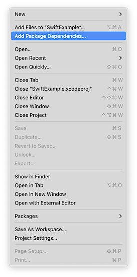
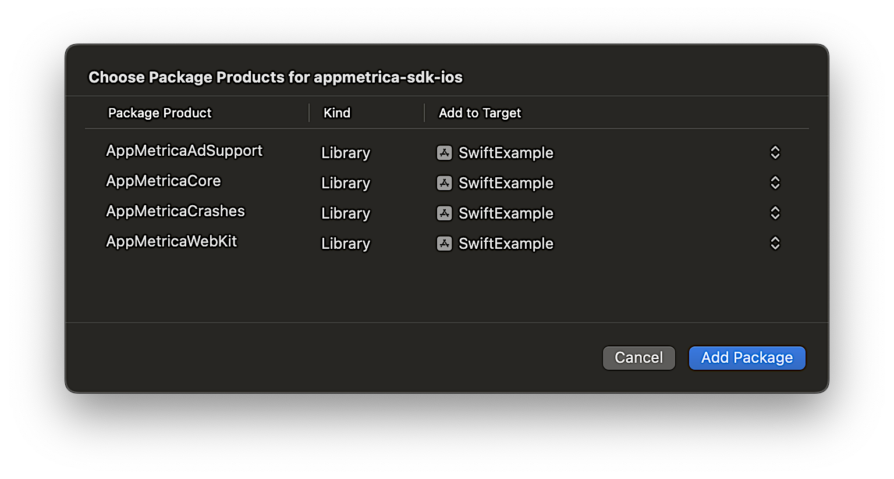

# Интеграция SDK

SDK под iOS предоставляется в виде модулей с исходным кодом.

## Шаг 1. Подключите библиотеку {#integration}



- CocoaPods

  Чтобы подключить библиотеку аналитики, добавьте в Podfile проекта зависимость:

  ```ruby translate=no
  pod 'AppMetricaAnalytics', '~> {{ ios-appmetrica-sdk-version }}'
  ```

  

  Если ваше приложение предназначено для детей, подключите модули без использования `AppMetricaAdSupport`:

  ```ruby translate=no
  pod 'AppMetricaCore', '~> {{ ios-appmetrica-sdk-version }}'
  pod 'AppMetricaCrashes', '~> {{ ios-appmetrica-sdk-version }}'
  pod 'AppMetricaWebKit', '~> {{ ios-appmetrica-sdk-version }}'
  ```

  

  

  Если вам не нужен полный функционал AppMetrica SDK, подключите только необходимые модули:

  ```ruby translate=no
  pod 'AppMetricaCore', '~> {{ ios-appmetrica-sdk-version }}' # Основной модуль для работы с AppMetrica SDK, обязателен для подключения
  pod 'AppMetricaAdSupport', '~> {{ ios-appmetrica-sdk-version }}' # Необходим для сбора идентификаторов, без него не будет собираться IDFA
  pod 'AppMetricaCrashes', '~> {{ ios-appmetrica-sdk-version }}' # Модуль для отлова крэшей и отправки ошибок
  pod 'AppMetricaWebKit', '~> {{ ios-appmetrica-sdk-version }}' # Модуль для настройки отправки событий из JS-кода в WebView
  ```

  

- SPM в Xcode
  
  #### Интеграция через интерфейс Xcode {#integration-xcode}

  Чтобы подключить библиотеку, выполните следующее:

  1. В окне Xcode навигатора проектов (**Project Navigator**) выберите свой проект (если у вас используется **Workspace**). Затем в верхнем меню нажмите **File** и выберите **Add Package Dependencies...**.

     

  2. Укажите URL репозитория `https://github.com/appmetrica/appmetrica-sdk-ios`.

     

  3. Оставьте только нужные модули (чтобы выключить модуль в `Add to Target` выберите значение `None`):

     

     

     

- Package.swift

   #### Интеграция через Package.swift манифест {#integration-package-swift}

   Для начала добавьте следующую зависимость в массив `dependencies:` вашего пакета:

   ```swift translate=no
   dependencies: [
      .package(
         url: "https://github.com/appmetrica/appmetrica-sdk-ios",
         from: "{{ ios-appmetrica-sdk-version }}"
      )
   ],
   ```

   Модули AppMetrica SDK, которые вы можете подключить в зависимости от потребностей вашего проекта:

   

   

   Пример подключения модулей в массиве `dependencies:` таргета:

   ```swift translate=no
   .target(
      name: "MyTargetName",
      dependencies: [
         .product(name: "AppMetricaCore", package: "AppMetrica"),
         .product(name: "AppMetricaCrashes", package: "AppMetrica"),
         .product(name: "AppMetricaWebKit", package: "AppMetrica"),
         // .product(name: "AppMetricaAdSupport", package: "AppMetrica"), // Этот модуль отлючен
      ]
   ),
   ```
   
- Tuist через Package.swift

   #### Интеграция через Tuist с Package.swift манифестом
   
   Добавьте в Tuist/Package.swift
   
   ```
   import PackageDescription

   #if TUIST
       import struct ProjectDescription.PackageSettings

       let packageSettings = PackageSettings(
           productTypes: [:]
       )
   #endif

   let package = Package(
       name: "NewTuist",
       dependencies: [
           .package(url: "https://github.com/appmetrica/appmetrica-sdk-ios", from: "5.0.0")
       ]
   )
   ````
   
   Теперь добавьте зависимости в Project.swift. 
   Для работы AppMetrica требуется флаг линковщика "-ObjC". Добавьте его во все таргеты, которые статически слинкованы с AppMetrica, например:
   
   ```
   dependencies: [
       .external(name: "AppMetricaCore"),
   ],
   settings: .settings(
      base: ["OTHER_LDFLAGS": "$(inherited) -ObjC"]
   )
   ```



## Шаг 2. Инициализируйте библиотеку {#initialization}



- Swift

  Добавьте импорт:

  ```swift translate=no
  import AppMetricaCore
  ```

  Инициализируйте библиотеку в методе `application(_:didFinishLaunchingWithOptions:)` вашего `UIApplicationDelegate`:

  ```swift translate=no
  func application(_ application: UIApplication, didFinishLaunchingWithOptions launchOptions: [UIApplication.LaunchOptionsKey : Any]? = nil) -> Bool {
      // Initializing the AppMetrica SDK.
      let configuration = AppMetricaConfiguration(apiKey: "API key")
      AppMetrica.activate(with: configuration!)
  }
  ```

- Objective-C

  Добавьте импорт:

  ```obj-c translate=no
  #import <AppMetricaCore/AppMetricaCore.h>
  ```

  Инициализируйте библиотеку в методе `application:didFinishLaunchingWithOptions:` вашего `UIApplicationDelegate`:

  ```obj-c translate=no
  - (BOOL)application:(UIApplication *)application didFinishLaunchingWithOptions:(NSDictionary *)launchOptions
  {
      // Initializing the AppMetrica SDK.
      AMAAppMetricaConfiguration *configuration = [[AMAAppMetricaConfiguration alloc] initWithAPIKey:@"API key"];
      [AMAAppMetrica activateWithConfiguration:configuration];
      return YES;
  }
  ```





{{ api-key }}



AppMetrica позволяет отслеживать предустановленные приложения. Подробнее в разделе [трекинг предустановленных приложений](../../../mobile-tracking/preinstalled-app-attr.md).

## Шаг 3. (Опционально) Настройте отправку событий, атрибутов профиля и Revenue {#send}

1. Чтобы собирать информацию о действиях в приложении, настройте отправку собственных событий. Подробнее в разделе [Отправка собственных событий](../../../data-collection/about-events.md).

2. Чтобы собирать информацию о пользователях, настройте отправку атрибутов профиля. Подробнее в разделе [Профили](../../../data-collection/about-profiles.md).

   

   В отличие от событий, атрибут профиля может принимать только одно значение. При отправке нового значения атрибута старое значение перезаписывается.

   

4. Чтобы отслеживать покупки в приложении, настройте отправку Revenue. Подробнее в разделе [In-App покупки](../../../data-collection/about-revenue.md).

## Шаг 4. Протестируйте работу библиотеки {#test}

Чтобы проверить работу библиотеки:

1. Запустите приложение с AppMetrica SDK и используйте его некоторое время.
2. Убедитесь, что устройство подключено к интернету.
3. В интерфейсе AppMetrica убедитесь, что:
   * В отчете [Аудитория](../../../mobile-reports/audience-report.md) появился новый пользователь.
   * В отчете **Вовлечённость** → **Сессии** увеличилось число сессий.
   * В отчете [События](../../../mobile-reports/events-report.md) и [Профили](../../../mobile-reports/profile-report.md) появились отправленные события и атрибуты профиля.

## Узнайте больше {#learn-more}

- [Настройка отправки собственных событий](ios-operations.md#report-event)
- [Настройка отправки атрибутов профиля](ios-operations.md#send-attribute-profile)
- [Настройка отправки событий Ecommerce](ios-operations.md#send-ecommerce)
- [Настройка отправки событий Revenue](ios-operations.md#send-revenue)
- [Настройка отправки событий Ad Revenue](ios-operations.md#send-adrevenue)
- [Как включить отправку данных о местоположении пользователей?](../../../troubleshooting/troubleshooting.md#region)

<!-- - [Пример интеграции библиотеки ССЫЛКА НУЖНА НОВАЯ](https://github.com/yandexmobile/metrica-sample-android)-->

## Возможные проблемы и их решение {#faq}

- [Не увеличивается число сессий](ios-errors.md#faq-session-count)
- [Нет событий](ios-errors.md#no-events)
- [Проблемы со Swift Package Manager](ios-errors.md#swift-manager)
- [В списке нет моей проблемы](ios-errors.md#not-found)

{{ feedback }}

<a href="../../../troubleshooting/feedback-new.html">
  <span class="button">Написать в службу поддержки</span>
</a>


