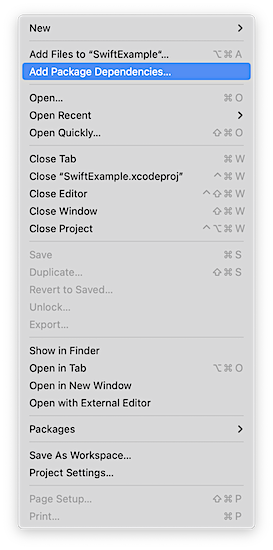
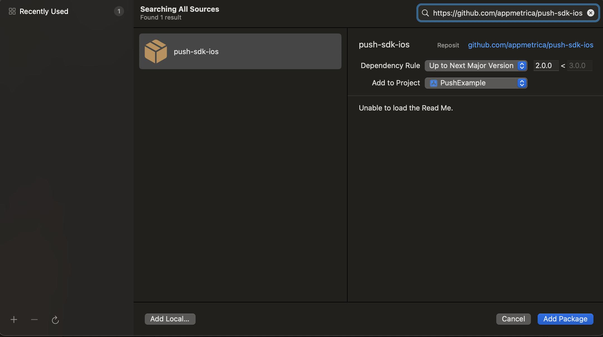
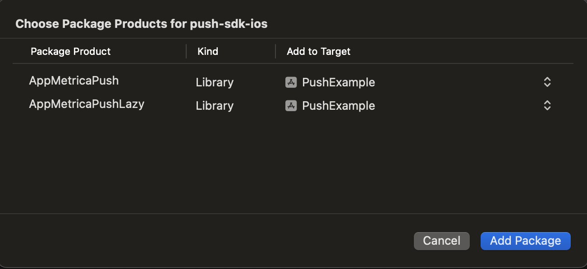

# Подключение и инициализация

Перед началом работы с AppMetrica Push SDK версии {{ ios-push-sdk }} необходимо [подключить и инициализировать AppMetrica SDK](../analytics/quick-start.md) не ниже версии 5.9.0.

## Шаг 1. Подключите библиотеку {#installation}

Библиотека может работать со следующими системами управления зависимостями:



- CocoaPods

  Чтобы подключить библиотеку Push SDK, добавьте в Podfile проекта зависимости:

  ```ruby translate=no
  pod 'AppMetricaPush', '~> {{ ios-push-sdk }}' # Основной модуль для работы с Push SDK, обязателен для подключения
  pod 'AppMetricaPushLazy', '~> {{ ios-push-sdk }}' # Дополнительный модуль для Lazy пушей
  ```

- SPM в Xcode

  **Интеграция через интерфейс Xcode**

  Чтобы подключить библиотеку, выполните следующее:

  1. В окне Xcode навигатора проектов (**Project Navigator**) выберите свой проект (если у вас используется **Workspace**). Затем в верхнем меню нажмите **File** и выберите **Add Package Dependencies...**.

     

  2. Укажите URL репозитория `https://github.com/appmetrica/push-sdk-ios`.

     

  3. Оставьте только нужные модули (чтобы выключить модуль в `Add to Target` выберите значение `None`):

     

     * `AppMetricaPush` — обязательный основной модуль Push SDK. Должен быть подключен для работы.
     * `AppMetricaPushLazy` — дополнительный модуль для Lazy пушей.

- Package.swift

  **Интеграция через Package.swift манифест**

  Для начала добавьте следующую зависимость в массив `dependencies:` вашего пакета:

   ```swift translate=no
   dependencies: [
      .package(
         url: "https://github.com/appmetrica/push-sdk-ios",
         from: "{{ ios-push-sdk }}"
      )
   ],
   ```

   Модули AppMetrica Push SDK, которые вы можете подключить в зависимости от потребностей вашего проекта:

   * `AppMetricaPush` — обязательный основной модуль Push SDK. Должен быть подключен для работы.
   * `AppMetricaPushLazy` — дополнительный модуль для Lazy пушей.
   
   Пример подключения модулей в массиве `dependencies:` таргета:

   ```swift translate=no
   .target(
      name: "MyTargetName",
      dependencies: [
         .product(name: "AppMetricaPush", package: "push-sdk-ios"),
         // .product(name: "AppMetricaPushLazy", package: "push-sdk-ios"), // Этот модуль отлючен
      ]
   ),
   ```




### Шаг 2. Настройте AppMetricaPush {#setup}



- Objective-C

  Добавьте следующий код в соответствующий метод реализации `UIApplicationDelegate`:

  ```objectivec translate=no
  - (BOOL)application:(UIApplication *)application didFinishLaunchingWithOptions:(NSDictionary *)launchOptions
  {
      // Activating AppMetrica.
      ...
      [AMPAppMetricaPush setExtensionAppGroup:appGroup]; // optional, need to send stored events from AppMetricaPush-2.2 and earlier
      ...
      [AMPAppMetricaPush handleApplicationDidFinishLaunchingWithOptions:launchOptions];
      ...
  }
  ```

- Swift

  Добавьте следующий код в соответствующий метод реализации `AppDelegate`:

  ```objectivec translate=no
  func application(_ application: UIApplication, didFinishLaunchingWithOptions launchOptions: [UIApplicationLaunchOptionsKey :Any]? = nil) -> Bool
  {
      // Activating AppMetrica.
      ...
      AppMetricaPush.setExtensionAppGroup(appGroup) // optional, need to send stored events from AppMetricaPush-2.2 and earlier
      ...
      AppMetricaPush.handleApplicationDidFinishLaunching(options: launchOptions)
      ...
  }
  ```



`appGroup` — название общей группы App Groups.


### Cбор статистики отклонений {#dismiss}

Чтобы собирать статистику отклонений push-уведомлений, задайте для категории уведомлений `UNNotificationCategory` следующую опцию:



- Objective-C

  ```objectivec translate=no
  options:UNNotificationCategoryOptionCustomDismissAction
  ```

- Swift

  ```swift translate=no
  options: UNNotificationCategory.customDismissAction
  ```




## Шаг 3. (_Опционально_) Настройка AppMetrica для работы в Notification Service Extension {#notification}

1. В Xcode выберите **File** → **New** → **Target**.
2. В разделе расширений **iOS** выберите из списка **Notification Service Extension** и нажмите **Next**.
3. Введите название расширения в поле **Product Name** и нажмите **Finish**.

Настройте AppMetrica и расширение, см. [{#T}](../analytics/ios-appgroup.md). Добавьте следующий код в Notification Service Extension:



- Swift

  ```swift translate=no
  class NotificationService: UNNotificationServiceExtension {

      var contentHandler: ((UNNotificationContent) -> Void)?
      var bestAttemptContent: UNMutableNotificationContent?
      
      override func didReceive(_ request: UNNotificationRequest, 
                              withContentHandler contentHandler: @escaping (UNNotificationContent) -> Void) {
        // system does not always spawn new process to handle few notification, but AppMetrica ignore second initialization
        let configuration = AppMetricaConfiguration(apiKey: "API-KEY")!
        AppMetrica.activate(with: configuration)

        AppMetricaPush.handleDidReceive(request)
        
        self.contentHandler = contentHandler
        bestAttemptContent = (request.content.mutableCopy() as? UNMutableNotificationContent)
        
        // custom logic
        
        AppMetrica.sendEventsBuffer()

      }
  }
  ```  

- Objective-C

  ```objectivec translate=no
  @interface NotificationService: UNNotificationServiceExtension

  @property (nonatomic, strong) void (^contentHandler)(UNNotificationContent *contentToDeliver);
  @property (nonatomic, strong) UNMutableNotificationContent *bestAttemptContent;

  @end
  @implementation NotificationService

  + (void)initialize {
      if ([self class] == [NotificationService class]) {
          AMAAppMetricaConfiguration *configuration =
              [[AMAAppMetricaConfiguration alloc] initWithAPIKey:@"API-KEY"];
          [AMAAppMetrica activateWithConfiguration:configuration];
      }
  }

  - (void)didReceiveNotificationRequest:(UNNotificationRequest *)request 
                    withContentHandler:(void (^)(UNNotificationContent * _Nonnull))contentHandler {
      
      [AMPAppMetricaPush handleDidReceiveNotificationRequest:request];
      
      self.contentHandler = contentHandler;
      self.bestAttemptContent = [request.content mutableCopy];
      
      // custom logic
      
      [AMAAppMetrica sendEventsBuffer]; // force send all events
  }

  @end
  ```  



## Шаг 4. Зарегистрируйте приложение в Apple Push Notification Service (APNs) {#apns}

Регистрация необходима для подготовки приложения к работе с push-уведомлениями. Для отправки уведомлений на устройства с iOS добавьте следующие изменения в код приложения:



- Swift

  ```swift translate=no
  let center = UNUserNotificationCenter.current()
  center.requestAuthorization(options:\[.badge, .alert, .sound\]) { (granted, error) in
    // Enable or disable features based on authorization.
  }
  application.registerForRemoteNotifications()
  ```
  
  Как правило, эти данные передаются в следующем методе:
  
  ```swift translate=no
  func application(_ application: UIApplication, didFinishLaunchingWithOptions
                   launchOptions: [UIApplicationLaunchOptionsKey :Any]? = nil) -> Bool
  ```
  
  Подробно об используемых методах в документации на `developer.apple.com`:
  
  * [UNUserNotificationCenter.current()](https://developer.apple.com/documentation/usernotifications/unusernotificationcenter/1649510-current)
  * [UNUserNotificationCenter.requestAuthorization(options:completionHandler:)](https://developer.apple.com/documentation/usernotifications/unusernotificationcenter/1649527-requestauthorization)
  * [UIApplication.registerForRemoteNotifications()](https://developer.apple.com/documentation/uikit/uiapplication/1623078-registerforremotenotifications)

- Objective-C

  ```objectivec translate=no
  UNAuthorizationOptions options =
    UNAuthorizationOptionAlert |
      UNAuthorizationOptionBadge |
      UNAuthorizationOptionSound;
  UNUserNotificationCenter *center = [UNUserNotificationCenter currentNotificationCenter];
  [center requestAuthorizationWithOptions:options completionHandler:^(BOOL granted, NSError *error) {
    // Enable or disable features based on authorization.
  }];
  [application registerForRemoteNotifications];
  ```
  
  Как правило, эти данные передаются в следующем методе:
  
  ```objectivec translate=no
   - (BOOL)application:(UIApplication *)application didFinishLaunchingWithOptions:(NSDictionary *)launchOptions
  ```
  
  Подробно об используемых методах в документации на `developer.apple.com`:
  
  * [[UNUserNotificationCenter currentNotificationCenter]](https://developer.apple.com/documentation/usernotifications/unusernotificationcenter/1649510-currentnotificationcenter?language=objc)
  * [[UNUserNotificationCenter requestAuthorizationWithOptions:completionHandler:]](https://developer.apple.com/documentation/usernotifications/unusernotificationcenter/1649527-requestauthorizationwithoptions?language=objc)
  * [[UIApplication registerForRemoteNotifications]](https://developer.apple.com/documentation/uikit/uiapplication/1623078-registerforremotenotifications?language=objc)



## Шаг 5. Зарегистрируйте device token вашего приложения {#device-token}

Для отправки push-уведомления с помощью AppMetrica необходим device token вашего приложения. Чтобы зарегистрировать его:



- Swift

  Добавьте следующий код в `AppDelegate`:
  
  ```swift translate=no
  func application(_ application: UIApplication, didRegisterForRemoteNotificationsWithDeviceToken deviceToken: Data)
  {
      // If the AppMetrica SDK library was not initialized before this step,
      // calling the method causes the app to crash.
      AppMetricaPush.setDeviceTokenFrom(deviceToken)
  }
  ```

- Objective-C

  Добавьте следующий код в вашу реализацию `UIApplicationDelegate`:
  
  ```objectivec translate=no
  - (void)application:(UIApplication *)application didRegisterForRemoteNotificationsWithDeviceToken:(NSData *)deviceToken
  {
      // If the AppMetrica SDK library was not initialized before this step,
      // calling the method causes the app to crash.
      [AMPAppMetricaPush setDeviceTokenFromData:deviceToken];
  }
  ```



Чтобы зарегистрировать device token и отправить окружение APNs, используйте следующий код:



- Swift

  ```swift translate=no
  func application(_ application: UIApplication, didRegisterForRemoteNotificationsWithDeviceToken deviceToken: Data)
  {
      // If the AppMetrica SDK library was not initialized before this step,
      // calling the method causes the app to crash.
      #if DEBUG
          let pushEnvironment = AppMetricaPushEnvironment.development
      #else
          let pushEnvironment = AppMetricaPushEnvironment.production
      #endif
      AppMetricaPush.setDeviceTokenFrom(deviceToken, pushEnvironment: pushEnvironment)
  }
  ```
  
- Objective-C

  ```objectivec translate=no
  - (void)application:(UIApplication *)application didRegisterForRemoteNotificationsWithDeviceToken:(NSData *)deviceToken
  {
      // If the AppMetrica SDK library was not initialized before this step,
      // calling the method causes the app to crash.
      #ifdef DEBUG
          AMPAppMetricaPushEnvironment pushEnvironment = AMPAppMetricaPushEnvironmentDevelopment;
      #else
          AMPAppMetricaPushEnvironment pushEnvironment = AMPAppMetricaPushEnvironmentProduction;
      #endif
      [AMPAppMetricaPush setDeviceTokenFromData:deviceToken pushEnvironment:pushEnvironment];
  }
  ```





AppMetrica позволяет отправлять push-уведомления в Sandbox APNs. Но обработка push-уведомлений может работать некорректно, если на устройстве запускались версии приложения с разным окружением (_development_ и _production_). Чтобы избежать этого, можно использовать отдельный тестовый API key для _development_ окружения.



## Шаг 6. Настройте обработку открытия push-уведомления {#opening}

Настройте обработку открытия push-уведомления:

1. Воспользуйтесь делегатом `UserNotificationCenterDelegate`/`AMPUserNotificationCenterDelegate`. Он обрабатывает получение push-уведомлений автоматически, при их открытии.

    Внесите следующие изменения в код:

    
    
    - Swift

      ```swift translate=no
      import UserNotifications

      // In the "func application(_ application: UIApplication, didFinishLaunchingWithOptions 
      //                          launchOptions: [UIApplicationLaunchOptionsKey : Any]? = nil) -> Bool" method:
      let delegate = AppMetricaPush.userNotificationCenterDelegate
      UNUserNotificationCenter.current().delegate = delegate
      ```

    - Objective-C

      ```objectivec translate=no
      #import <UserNotifications/UserNotifications.h>
          
      // In the   "- (BOOL)application:(UIApplication *)application 
      // didFinishLaunchingWithOptions:(NSDictionary *)launchOptions" method:
      [UNUserNotificationCenter currentNotificationCenter].delegate =
              [AppMetricaPush userNotificationCenterDelegate];
      ```
    
    
    
    Чтобы отслеживать открытие и другие действия с push-уведомлениями, создайте собственный делегат `UNUserNotificationCenterDelegate` и добавьте его в `nextDelegate`:
    
    
    
    - Swift
    
      ```swift translate=no
      AppMetricaPush.userNotificationCenterDelegate.nextDelegate = yourDelegate
      ```
    
    - Objective-C
    
      ```objectivec translate=no
      [AMPAppMetricaPush userNotificationCenterDelegate].nextDelegate = yourDelegate;
      ```
    
    
    
    После этого можно использовать соответствующие методы своего делегата.

2. Если вы дополнительно используете [UISceneDelegate](https://developer.apple.com/documentation/uikit/uiscenedelegate), добавьте следующий код в метод `scene(_:willConnectTo:options:)`:

   

   - Swift

     ```swift translate=no
     func scene(_ scene: UIScene, willConnectTo
                session: UISceneSession, options
                connectionOptions: UIScene.ConnectionOptions) {
          AppMetricaPush.handleSceneWillConnectToSession(with: connectionOptions)
     }
     ```

   - Objective-C

     ```objectivec translate=no
     - (void)scene:(UIScene *)scene willConnectToSession:(UISceneSession *)session
           options:(UISceneConnectionOptions *)connectionOptions
     {
         [AMPAppMetricaPush handleSceneWillConnectToSessionWithOptions:connectionOptions];
     }
     ```

   

## Шаг 7. (_Опционально_) Включите актуализацию push-токенов {#actualization}

Если push-токен устройства стал неактуальным (например, пользователь удалил приложение), сервис APNS может вернуть ошибку 410 «The device token is no longer active for the topic». AppMetrica может поддерживать список актуальных токенов с помощью отправки silent push-уведомлений. Это поможет вам получить представление о количестве устройств до начала пуш-кампании.

Для этого в веб-интерфейсе AppMetrica перейдите в настройки приложения и во вкладке **Push-уведомления** выберите опцию **Актуализировать токены с помощью Silent Push-уведомлений**.

Использование silent push повышает точность оценки аудитории пуш-компании и отчетов по пушам и может повлиять на успешность доставки push-уведомлений приложения.

## Шаг 8. (_Опционально_) Настройте загрузку прикрепленных файлов {#download-file}



В веб-интерфейсе push-кампаний функциональность недоступна.



Вы можете настроить загрузку прикрепленных файлов в push-уведомлениях:

1. Настройте загрузку прикрепленных файлов с помощью метода [downloadAttachmentsForNotificationRequest](objectivec/AMPAppMetricaPush.md#method_downloadAttachmentsForNotificationRequest) Push SDK. С примером интеграции можно ознакомиться в статье [Загрузка прикрепленных файлов](ios-push-download-file.md).
2. Прикрепите вложения (параметр `attachments`) с помощью операции [Отправка push-сообщений](../../../mobile-api/push/post-send-batch.md) Push API.

## Отправка дополнительной информации {#send-additional-info}

При необходимости вы можете передавать вместе с push-уведомлением дополнительную информацию. Эти данные указываются в веб-интерфейсе AppMetrica при [настройке push-кампании](../../../push/marketing.md). Чтобы получать эту информацию, используйте метод:



- Swift

  ```swift translate=no
  let userData = AppMetricaPush.userData(forNotification: userInfo)
  ```

- Objective-C

  ```objectivec translate=no
  NSString *userData = [AMPAppMetricaPush userDataForNotification:userInfo];
  ```



где `userInfo` содержит данные о push-уведомлении.

## Определение получателя уведомления {#detect-internal-push}

AppMetrica позволяет определить <q>свои</q> push-уведомления, если в приложение были встроены несколько Push SDK.

Чтобы определить, является ли AppMetrica получателем сообщения, используйте следующий метод:



- Swift

  ```swift translate=no
  let isRelatedToAppMetricaSDK = AppMetricaPush.isNotificationRelated(toSDK: userInfo)
  ```

- Objective-C

  ```objectivec translate=no
  BOOL isRelatedToAppMetricaSDK = [AMPAppMetricaPush isNotificationRelatedToSDK:userInfo];
  ```



### См. также

- [Пример интеграции библиотеки](https://github.com/yandexmobile/metrica-push-sdk-ios)
- [Настройка приложения на базе iOS для отправки push-уведомлений](ios-settings.md)

{{ feedback }}

<a href="../../../troubleshooting/feedback-new">
  <span class="button">Написать в службу поддержки</span>
</a>


