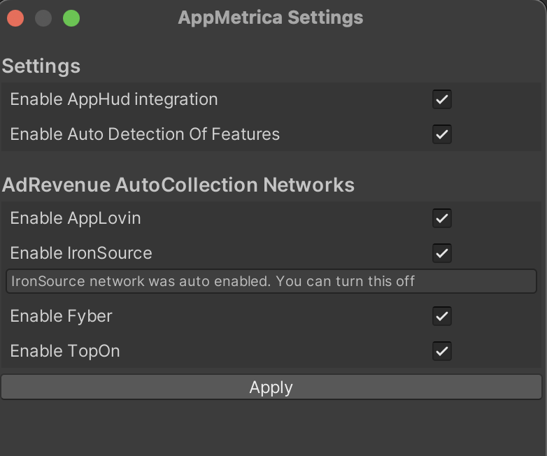

# Примеры использования методов

## Инициализация библиотеки с расширенной конфигурацией {#initialize}

Чтобы инициализировать библиотеку с расширенной стартовой конфигурацией, создайте объект класса `AppMetricaConfig` с необходимыми настройками и активируйте библиотеку с помощью метода `AppMetrica.Activate([NotNull] AppMetricaConfig config)`. С помощью расширенной конфигурации можно, например, включить или отключить логирование, установить тайм-аут сессии, передать параметры для [отслеживания предустановленных приложений](../../../mobile-tracking/preinstalled-app-attr.md) и т. д.

Настройки расширенной конфигурации применяются с момента инициализации библиотеки.

```csharp translate=no
AppMetrica.Activate(new AppMetricaConfig(API_KEY) {
    Logs = true,
});
```

Чтобы настроить библиотеку в процессе работы приложения, используйте методы класса `AppMetrica`.

## Отправка статистики на дополнительный API key {#reporter-different-apikey}

Отправка данных на дополнительный API key позволяет собирать для каждого API key свою статистику. Это можно использовать для управления доступом к информации. Например, чтобы предоставить доступ к статистике для аналитиков, можно продублировать отправку маркетинговых данных на дополнительный API key и предоставить им доступ к этой статистике. Так у них будет доступ только к той информации, которая им необходима.

Для отправки данных на дополнительный API key необходимо использовать репортеры. С помощью них можно отправлять события, сообщения об ошибках, профили и информацию о покупках в приложении. Репортеры могут работать без инициализации AppMetrica SDK.

### Шаг 1. (Опционально) Инициализируйте репортер с расширенной конфигурацией {#reporter-different-apikey-initialize}

Чтобы инициализировать репортер с расширенной конфигурацией, создайте объект класса `ReporterConfig` с необходимыми настройками и активируйте репортер с помощью метода `AppMetrica.ActivateReporter([NotNull] ReporterConfig config)`. Конфигурация применяется для репортера с указанным API key. Для каждого дополнительного API key можно настроить свою конфигурацию.



Инициализацию репортера с расширенной конфигурацией необходимо проводить до первого обращения к репортеру. Иначе репортер будет инициализирован без конфигурации.



  ```csharp translate=no
  AppMetrica.ActivateReporter(new ReporterConfig(ANOTHER_API_KEY) {
      Logs = true,
  });
  ```

### Шаг 2. Настройте отправку данных с помощью репортера {#reporter-different-apikey-send}

Для отправки данных с помощью репортера необходимо получить объект, который реализует интерфейс `IReporter` с помощью метода `AppMetrica.GetReporter([NotNull] string apiKey)`, и использовать методы интерфейса для отправки отчетов. Если репортер не был инициализирован с расширенной конфигурацией, то вызов данного метода произведет инициализацию репортера для указанного API key.

Пример отправки события:

```csharp translate=no
AppMetrica.GetReporter(ANOTHER_API_KEY).ReportEvent("Updates installed");
```

Для корректного отслеживания сессий взаимодействия пользователя с приложением настройте отправку событий о начале и приостановке сессии для каждого репортера. Для этого используйте методы `ResumeSession()` и `PauseSession()` интерфейса `IReporter`:

```csharp translate=no
AppMetrica.GetReporter(ANOTHER_API_KEY).ResumeSession();
  
AppMetrica.GetReporter(ANOTHER_API_KEY).PauseSession();
```

## Отслеживание аварийных остановок приложения {#set-report-crash}

Отчеты об аварийных остановках приложения отправляются по умолчанию.

Чтобы отключить автоматическое отслеживание, инициализируйте библиотеку с конфигурацией, в которой отправка информации об аварийных остановках приложения отключена. Для этого передайте значение `false` в свойство `CrashReporting` при создании расширенной конфигурации библиотеки.

```csharp translate=no
AppMetrica.Activate(new AppMetricaConfig(API_KEY) {
    CrashReporting = false,
});
```

Если автоматическое отслеживание отключено, вы можете [отправлять информацию об аварийных остановках вручную](#report-unhandled).

## Отслеживание аварийных остановок приложения вручную {#report-unhandled}

Отчеты об аварийных остановках приложения отправляются по умолчанию. Чтобы избежать дублирования событий при ручной отправке, необходимо отключить [автоматическое отслеживание аварийных остановок](#set-report-crash).

Чтобы отправлять информацию об аварийных остановках приложения вручную, используйте метод `AppMetrica.ReportUnhandledException([NotNull] Exception exception)`:

```csharp translate=no
try
{
    ...
}
catch (Exception ex)
{
    AppMetrica.ReportUnhandledException(ex);
}
```

## Отправка местоположения устройства библиотекой {#track-location}



Отправка местоположения устройства по умолчанию отключена.



Чтобы включить отправку, инициализируйте библиотеку с конфигурацией, в которой отправка информации о местоположении устройства включена. Для этого передайте значение `true` в свойство `LocationTracking` при создании расширенной конфигурации библиотеки.

```csharp translate=no
AppMetrica.Activate(new AppMetricaConfig(API_KEY) {
    LocationTracking = true,
});
```

Чтобы включить отправку в процессе работы приложения, используйте метод `AppMetrica.SetLocationTracking(bool enabled)`:

```csharp translate=no
AppMetrica.SetLocationTracking(true);
```

Для более точного определения местоположения добавьте в файл AndroidManifest.xml одно из следующих разрешений:

- [android.permission.ACCESS_COARSE_LOCATION](https://developer.android.com/reference/android/Manifest.permission.html#ACCESS_COARSE_LOCATION) — для приблизительного определения.
- [android.permission.ACCESS_FINE_LOCATION](https://developer.android.com/reference/android/Manifest.permission.html#ACCESS_FINE_LOCATION) — для точного определения.

## Установка местоположения вручную {#location-manual}

Перед отправкой собственной информации о местоположении устройства убедитесь, что отправка отчетов была [включена](#track-location).

Библиотека определяет местоположение устройства самостоятельно. Чтобы отправить собственную информацию о местоположении устройства, передайте объект класса `Location` в метод `AppMetrica.SetLocation([CanBeNull] Location? location)`:

```csharp translate=no
AppMetrica.SetLocation(new Location {
    Latitude = ... ,
    Longitude = ... ,
});
```

Чтобы отправить собственную информацию о местоположении устройства с помощью стартовой конфигурации, передайте объект `Location` в свойство `Location` при создании расширенной конфигурации библиотеки.

```csharp translate=no
AppMetrica.Activate(new AppMetricaConfig(API_KEY) {
    Location = new Location {
        Latitude = ... ,
        Longitude = ... ,
    },
});
```

Чтобы возобновить определение местоположения библиотекой, передайте в метод `AppMetrica.SetLocation([CanBeNull] Location? location)` значение `null` и настройте [отправку местоположения устройства](#track-location).

```csharp translate=no
AppMetrica.SetLocation(null);
```

## Отправка собственного события {#report-event}

Чтобы отправить собственное событие без вложенных параметров, передайте короткое название или описание события в метод `AppMetrica.ReportEvent([NotNull] string eventName)`:

```csharp translate=no
AppMetrica.ReportEvent("Updates installed");
```

## Отправка собственного события с вложенными параметрами {#report-event-params}

AppMetrica SDK позволяет отправлять собственные события с вложенными параметрами, которые могут быть заданы в формате JSON строки.

Чтобы передать вложенные параметры события в формате JSON, используйте метод `AppMetrica.ReportEvent([NotNull] string eventName, [CanBeNull] string jsonValue)`:

```csharp translate=no
string eventParameters = "{\"name\":\"Alice\", \"age\":\"18\"}";
AppMetrica.ReportEvent("New person", eventParameters);
```

Веб-интерфейс AppMetrica отображает до пяти уровней вложенности события. Если событие содержит шесть уровней и более, в отчете отобразятся пять верхних. С помощью [API отчетов](../../../mobile-api/api_v1/intro.md) можно выгрузить до десяти уровней.

Подробнее о событиях в разделе [События](../../../data-collection/about-events.md).

## Отправка собственного сообщения об ошибке {#send-report-error}

Чтобы отправить собственное сообщение об ошибке, используйте методы:

```csharp translate=no
AppMetrica.ReportError([NotNull] string message, [NotNull] Exception error);
AppMetrica.ReportError([NotNull] string identifier, [CanBeNull] string message = null, [CanBeNull] Exception error = null);
```



Если ошибки отправляются с помощью методов c groupIdentifier, они группируются по идентификатору.

```csharp translate=no
try 
{
    ...
}
catch (Exception ex) 
{
    AppMetrica.ReportError("Your ID", "Error while parsing some integer number", ex);
}
```

Не используйте переменные значения в качестве идентификатора для группировки. Иначе количество групп будет увеличиваться, и их будет сложно анализировать.

{style="border: solid 1px #cccccc;"}





Если ошибки отправляются с помощью метода `AppMetrica.ReportError([NotNull] string message, [NotNull] Exception error)`, они группируются по [stack trace](https://en.wikipedia.org/wiki/Stack_trace).

```csharp translate=no
try 
{
    ...
}
catch (Exception ex) 
{
    AppMetrica.ReportError("Error while parsing some integer number", ex);
}
```

{style="border: solid 1px #cccccc;"}



## Отправка событий из буфера {#send-events-buffer}

AppMetrica SDK не отправляет событие сразу после того, как оно произошло. Библиотека хранит данные о событиях в буфере. Метод `SendEventsBuffer` инициирует отправку данных из буфера и очищает его. Используйте этот метод для принудительной отправки сохраненных событий после прохождения важных сценариев пользователя.

```csharp translate=no
AppMetrica.SendEventsBuffer();
```



Частое использование метода может привести к повышению энергопотребления и расходу интернет-трафика.



## Отслеживание жизненного цикла приложения вручную {#listen}

AppMetrica отслеживает границы сессии автоматически. При необходимости можно отключить автоматический трекинг сессий, передавая `false` в свойство `SessionsAutoTrackingEnabled` в расширенной конфигурации библиотеки.

```csharp translate=no
AppMetrica.Activate(new AppMetricaConfig(API_KEY) {
    SessionsAutoTrackingEnabled = false,
});
```

Для отслеживания жизненного цикла вручную используйте методы:

- Приостановка сессии:

    ```csharp translate=no
    AppMetrica.PauseSession();
    ```

- Возобновление или начало новой сессии:

    ```csharp translate=no
    AppMetrica.ResumeSession();
    ```
    
## Отправка ProfileId {#send-profile-id}

Если идентификатор пользовательского профиля известен до инициализации AppMetrica SDK, передавайте его до инициализации (`SetUserProfileID`) или во время инициализации с расширенной конфигурацией (`UserProfileID`).

В противном случае будет создан пользовательский профиль с идентификатором `appmetrica_device_id`.



Если отправка `ProfileId` не настроена, [предопределенные атрибуты](../../../data-collection/profile-attributes.md#pre-defined) не отображаются в веб-интерфейсе.



В любой момент можно обновить `ProfileId` с помощью вызова `setUserProfileID`:

```csharp translate=no
AppMetrica.SetUserProfileID("id");
```

## Отправка атрибутов профиля {#send-attribute-profile}

Чтобы отправить атрибуты профиля, передайте в объект `UserProfile` необходимые атрибуты и отправьте этот объект с помощью метода `AppMetrica.ReportUserProfile([NotNull] UserProfile profile)`. Атрибуты профиля создаются с помощью методов класса `Attribute`.

```csharp translate=no
using Io.AppMetrica;
using Io.AppMetrica.Profile;

...

// Creating the UserProfile instance.
UserProfile userProfile = new UserProfile()

    // Updating predefined attributes.
    .Apply(Attribute.Name().WithValue("John"))
    .Apply(Attribute.Gender().WithValue(GenderAttribute.Gender.Male))
    .Apply(Attribute.BirthDate().WithAge(24))
    .Apply(Attribute.NotificationsEnabled().WithValue(false))
      
    // Updating custom attributes.
    .Apply(Attribute.CustomString("string_attribute").WithValue("string"))
    .Apply(Attribute.CustomBoolean("boolean_attribute").WithValue(true))
    .Apply(Attribute.CustomNumber("number_attribute").WithValue(55))
    .Apply(Attribute.CustomCounter("counter_attribute").WithDelta(1));

// Setting the ProfileID using the method of the AppMetrica class.
AppMetrica.SetUserProfileID("id");

// Sending the UserProfile instance.
AppMetrica.ReportUserProfile(userProfile);
```

## Отправка ECommerce-событий {#send-ecommerce}

В AppMetrica нет возможности сегментировать ECommerce-события на «тестовые» и «не тестовые». Если для отладки покупок вы используете основной API key, то тестовые события будут попадать в общую статистику. Поэтому, чтобы отладить отправку ECommerce-событий, используйте отправку статистики на дополнительный API key с помощью репортера.

### Шаг 1. Настройте отправку ECommerce-событий на тестовый API key {#send-ecommerce-test-key}

Для различных действий пользователя есть соответствующие типы ECommerce-событий. Чтобы создать конкретный тип события, используйте нужный метод класса `ECommerceEvent`.

Ниже приведены примеры отправки конкретных типов событий:



  ```csharp translate=no
  using Io.AppMetrica;
  using Io.AppMetrica.Ecommerce;

  ...

  IDictionary<string, string> payload = new Dictionary<string, string>();
  payload.Add("configuration", "landscape");
  payload.Add("full_screen", "true"); 
  // Creating a screen object.
  ECommerceScreen screen = new ECommerceScreen();
  screen.Name = "ProductCardActivity";
  screen.CategoriesPath = new string[] { "Акции", "Красная цена" };
  screen.SearchQuery = "даниссимо кленовый сироп";
  screen.Payload = payload;

  ECommerceEvent showScreenEvent = ECommerceEvent.ShowScreenEvent(screen);
  // Sending an e-commerce event.
  AppMetrica.GetReporter("Testing API key").ReportECommerce(showScreenEvent);
  ```





  ```csharp translate=no
  using Io.AppMetrica;
  using Io.AppMetrica.Ecommerce;

  ...

  IDictionary<string, string> payload = new Dictionary<string, string>();
  payload.Add("configuration", "landscape");
  payload.Add("full_screen", "true"); 
  // Creating a screen object.
  ECommerceScreen screen = new ECommerceScreen();
  screen.Name = "ProductCardActivity";
  screen.CategoriesPath = new string[] { "Акции", "Красная цена" };
  screen.SearchQuery = "даниссимо кленовый сироп";
  screen.Payload = payload;
  // Creating an actualPrice object.
  ECommercePrice actualPrice = new ECommercePrice(new ECommerceAmount(4.53, "USD"));
  actualPrice.InternalComponents = new ECommerceAmount[] { // Optional.
      new ECommerceAmount(30_570_000, "wood"), 
      new ECommerceAmount(26.89, "iron"), 
      new ECommerceAmount(new decimal(5.1), "gold")
  };
  // Creating an originalPrice object.
  ECommercePrice originalPrice = new ECommercePrice(new ECommerceAmount(5.78, "USD"));
  originalPrice.InternalComponents = new ECommerceAmount[] { // Optional.
      new ECommerceAmount(30_590_000, "wood"),
      new ECommerceAmount(26.92, "iron"),
      new ECommerceAmount(new decimal(5.5), "gold") 
  };
  // Creating a product object. 
  ECommerceProduct product = new ECommerceProduct("779213");
  product.ActualPrice = actualPrice; // Optional.
  product.Promocodes = new string[] { "BT79IYX", "UT5412EP" }; // Optional.
  product.Payload = payload; // Optional.
  product.OriginalPrice = originalPrice; // Optional.
  product.Name = "Продукт творожный «Даниссимо» 5.9%, 130 г."; // Optional.
  product.CategoriesPath = new string[] { "Продукты", "Молочные продукты", "Йогурты" }; // Optional.
  ECommerceEvent showProductCardEvent = ECommerceEvent.ShowProductCardEvent(product, screen);
  // Sending an e-commerce event.
  AppMetrica.GetReporter("Testing API key").ReportECommerce(showProductCardEvent);
  ```





  ```csharp translate=no
  using Io.AppMetrica;
  using Io.AppMetrica.Ecommerce;

  ...

  IDictionary<string, string> payload = new Dictionary<string, string>();
  payload.Add("configuration", "landscape");
  payload.Add("full_screen", "true"); 
  // Creating a screen object.
  ECommerceScreen screen = new ECommerceScreen();
  screen.Name = "ProductCardActivity";
  screen.CategoriesPath = new string[] { "Акции", "Красная цена" };
  screen.SearchQuery = "даниссимо кленовый сироп";
  screen.Payload = payload;
  // Creating an actualPrice object.
  ECommercePrice actualPrice = new ECommercePrice(new ECommerceAmount(4.53, "USD"));
  actualPrice.InternalComponents = new ECommerceAmount[] { // Optional.
      new ECommerceAmount(30_570_000, "wood"), 
      new ECommerceAmount(26.89, "iron"), 
      new ECommerceAmount(new decimal(5.1), "gold")
  };
  // Creating an originalPrice object.
  ECommercePrice originalPrice = new ECommercePrice(new ECommerceAmount(5.78, "USD"));
  originalPrice.InternalComponents = new ECommerceAmount[] { // Optional.
      new ECommerceAmount(30_590_000, "wood"),
      new ECommerceAmount(26.92, "iron"),
      new ECommerceAmount(new decimal(5.5), "gold") 
  };
  // Creating a product object. 
  ECommerceProduct product = new ECommerceProduct("779213");
  product.ActualPrice = actualPrice; // Optional.
  product.Promocodes = new string[] { "BT79IYX", "UT5412EP" }; // Optional.
  product.Payload = payload; // Optional.
  product.OriginalPrice = originalPrice; // Optional.
  product.Name = "Продукт творожный «Даниссимо» 5.9%, 130 г."; // Optional.
  product.CategoriesPath = new string[] { "Продукты", "Молочные продукты", "Йогурты" }; // Optional.
  ECommerceEvent showProductCardEvent = ECommerceEvent.ShowProductCardEvent(product, screen);
  // Sending an e-commerce event.
  AppMetrica.GetReporter("Testing API key").ReportECommerce(showProductCardEvent);
  ```





  ```csharp translate=no
  using Io.AppMetrica;
  using Io.AppMetrica.Ecommerce;

  ...

  IDictionary<string, string> payload = new Dictionary<string, string>();
  payload.Add("configuration", "landscape");
  payload.Add("full_screen", "true"); 
  // Creating a screen object.
  ECommerceScreen screen = new ECommerceScreen();
  screen.Name = "ProductCardActivity";
  screen.CategoriesPath = new string[] { "Акции", "Красная цена" };
  screen.SearchQuery = "даниссимо кленовый сироп";
  screen.Payload = payload;
  // Creating an actualPrice object.
  ECommercePrice actualPrice = new ECommercePrice(new ECommerceAmount(4.53, "USD"));
  actualPrice.InternalComponents = new ECommerceAmount[] { // Optional.
      new ECommerceAmount(30_570_000, "wood"), 
      new ECommerceAmount(26.89, "iron"), 
      new ECommerceAmount(new decimal(5.1), "gold")
  };
  // Creating an originalPrice object.
  ECommercePrice originalPrice = new ECommercePrice(new ECommerceAmount(5.78, "USD"));
  originalPrice.InternalComponents = new ECommerceAmount[] { // Optional.
      new ECommerceAmount(30_590_000, "wood"),
      new ECommerceAmount(26.92, "iron"),
      new ECommerceAmount(new decimal(5.5), "gold") 
  };
  // Creating a product object. 
  ECommerceProduct product = new ECommerceProduct("779213");
  product.ActualPrice = actualPrice; // Optional.
  product.Promocodes = new string[] { "BT79IYX", "UT5412EP" }; // Optional.
  product.Payload = payload; // Optional.
  product.OriginalPrice = originalPrice; // Optional.
  product.Name = "Продукт творожный «Даниссимо» 5.9%, 130 г."; // Optional.
  product.CategoriesPath = new string[] { "Продукты", "Молочные продукты", "Йогурты" }; // Optional.
  // Creating a referrer object.
  ECommerceReferrer referrer = new ECommerceReferrer();
  referrer.Type = "button"; // Optional.
  referrer.Identifier = "76890"; // Optional.
  referrer.Screen = screen; // Optional.
  // Creating a cartItem object.
  ECommerceCartItem addedItems1 = new ECommerceCartItem(product, actualPrice, 1.0);
  addedItems1.Referrer = referrer; // Optional.
  ECommerceEvent addCartItemEvent = ECommerceEvent.AddCartItemEvent(addedItems1);
  // Sending an e-commerce event.
  AppMetrica.GetReporter("Testing API key").ReportECommerce(addCartItemEvent);
  ECommerceEvent removeCartItemEvent = ECommerceEvent.RemoveCartItemEvent(addedItems1);
  // Sending an e-commerce event.
  AppMetrica.GetReporter("Testing API key").ReportECommerce(removeCartItemEvent);
  ```





  ```csharp translate=no
  using Io.AppMetrica;
  using Io.AppMetrica.Ecommerce;

  ...

  IDictionary<string, string> payload = new Dictionary<string, string>();
  payload.Add("configuration", "landscape");
  payload.Add("full_screen", "true"); 
  // Creating a screen object.
  ECommerceScreen screen = new ECommerceScreen();
  screen.Name = "ProductCardActivity";
  screen.CategoriesPath = new string[] { "Акции", "Красная цена" };
  screen.SearchQuery = "даниссимо кленовый сироп";
  screen.Payload = payload;
  // Creating an actualPrice object.
  ECommercePrice actualPrice = new ECommercePrice(new ECommerceAmount(4.53, "USD"));
  actualPrice.InternalComponents = new ECommerceAmount[] { // Optional.
      new ECommerceAmount(30_570_000, "wood"), 
      new ECommerceAmount(26.89, "iron"), 
      new ECommerceAmount(new decimal(5.1), "gold")
  };
  // Creating an originalPrice object.
  ECommercePrice originalPrice = new ECommercePrice(new ECommerceAmount(5.78, "USD"));
  originalPrice.InternalComponents = new ECommerceAmount[] { // Optional.
      new ECommerceAmount(30_590_000, "wood"),
      new ECommerceAmount(26.92, "iron"),
      new ECommerceAmount(new decimal(5.5), "gold") 
  };
  // Creating a product object. 
  ECommerceProduct product = new ECommerceProduct("779213");
  product.ActualPrice = actualPrice; // Optional.
  product.Promocodes = new string[] { "BT79IYX", "UT5412EP" }; // Optional.
  product.Payload = payload; // Optional.
  product.OriginalPrice = originalPrice; // Optional.
  product.Name = "Продукт творожный «Даниссимо» 5.9%, 130 г."; // Optional.
  product.CategoriesPath = new string[] { "Продукты", "Молочные продукты", "Йогурты" }; // Optional.
  // Creating a referrer object.
  ECommerceReferrer referrer = new ECommerceReferrer();
  referrer.Type = "button"; // Optional.
  referrer.Identifier = "76890"; // Optional.
  referrer.Screen = screen; // Optional.
  // Creating a cartItem object.
  ECommerceCartItem addedItems1 = new ECommerceCartItem(product, actualPrice, 1.0);
  addedItems1.Referrer = referrer; // Optional.
  // Creating an order object.
  ECommerceOrder order = new ECommerceOrder("88528768", new ECommerceCartItem[] { addedItems1 });
  order.Payload = payload; // Optional.
  ECommerceEvent beginCheckoutEvent = ECommerceEvent.BeginCheckoutEvent(order);
  // Sending an e-commerce event.
  AppMetrica.GetReporter("Testing API key").ReportECommerce(beginCheckoutEvent);
  ECommerceEvent purchaseEvent = ECommerceEvent.PurchaseEvent(order);
  // Sending an e-commerce event.
  AppMetrica.GetReporter("Testing API key").ReportECommerce(purchaseEvent);
  ```



### Шаг 2. Проверьте отчет тестового приложения {#send-ecommerce-test-app}

Совершите тестовые покупки в приложении. Через некоторое время в интерфейсе AppMetrica проверьте отчет «Ecommerce». Убедитесь, что ECommerce-события отображаются в отчете.

Подробнее об отчете в разделе [Ecommerce](../../../mobile-reports/ecommerce-report.md).

### Шаг 3. Настройте отправку на основной API key {#send-ecommerce-key}

После успешного тестирования настройте отправку ECommerce-событий на основной API key.

Чтобы отправить объект `ECommerceEvent` на основной API key, используйте метод `AppMetrica.ReportECommerce([NotNull] ECommerceEvent ecommerce)`.

  ```csharp translate=no
  ...
  // Sending an e-commerce event.
  AppMetrica.ReportECommerce(ecommerceEvent)
  ```

## Отправка Revenue {#send-revenue}



Для валидации покупок на Android используется локальная валидация с помощью публичного ключа. Чтобы включить валидацию, создайте публичный ключ и укажите его в настройках. 



### Шаг 1. Настройте отправку Revenue на тестовый API key {#send-revenue-test-key}

В AppMetrica нет возможности сегментировать Revenue на «тестовые» и «не тестовые». Если для отладки покупок вы используете основной API key, то тестовые покупки будут попадать в общую статистику. Поэтому, чтобы отладить отправку Revenue, используйте отправку статистики на дополнительный API key с помощью репортера.

Ниже описаны этапы отправки Revenue на дополнительный API key:



Чтобы покупки валидировались, настройте отправку объекта `Revenue.Receipt` вместе с `Revenue`:

1. Создайте объект `Revenue.Receipt` с информацией о покупке и подписью. Его необходимо использовать при создании объекта `Revenue` в свойстве `Revenue.Receipt`.
2. Создайте объект `Revenue`.
3. Отправьте объект `Revenue` на тестовый API key с помощью репортера `IReporter`. Подробнее о работе репортеров в разделе [Отправка статистики на дополнительный API key](#reporter-different-apikey).

Данный пример основан на использовании [Unity IAP](https://docs.unity3d.com/Manual/UnityIAP.html).

```csharp translate=no
using Io.AppMetrica;

...

// Declaration of the Receipt structure for getting information about the IAP.
[System.Serializable]
public struct Receipt {
    public string Store;
    public string TransactionID;
    public string Payload;
}

// Additional information about the IAP for Android.
[System.Serializable]
public struct PayloadAndroid {
    public string Json;
    public string Signature;
}

public PurchaseProcessingResult ProcessPurchase(PurchaseEventArgs args) {
    var product = args.purchasedProduct;
    if (String.Equals(product.definition.id, kProductIDConsumable, StringComparison.Ordinal)) {
        string currency = product.metadata.isoCurrencyCode;
        decimal price = product.metadata.localizedPrice;

        // Creating the instance of the Revenue class.
        Revenue revenue = new Revenue(price, currency);
        if (product.receipt != null) {
            // Creating the instance of the Revenue.Receipt class.
            Revenue.Receipt yaReceipt = new Revenue.Receipt();
            Receipt receipt = JsonUtility.FromJson<Receipt>(product.receipt);
        #if UNITY_ANDROID
            PayloadAndroid payloadAndroid = JsonUtility.FromJson<PayloadAndroid>(receipt.Payload);
            yaReceipt.Signature = payloadAndroid.Signature;
            yaReceipt.Data = payloadAndroid.Json;
        #elif UNITY_IPHONE
            yaReceipt.TransactionID = receipt.TransactionID;
            yaReceipt.Data = receipt.Payload;
        #endif
            revenue.ReceiptValue = yaReceipt;
        }
        // Sending data to the AppMetrica server.
        AppMetrica.GetReporter("Testing API key").ReportRevenue(revenue);
    }
    return PurchaseProcessingResult.Complete;
}
```





Чтобы отправить информацию о покупке без валидации:

1. Создайте объект `Revenue`.
2. (Опционально) Чтобы группировать покупки по `OrderID`, укажите его в свойстве `Revenue.Payload`.

   

   Если идентификатор `OrderID` не указан, AppMetrica генерирует идентификатор автоматически.

   

3. Отправьте объект `Revenue` на тестовый API key с помощью репортера `IReporter`. Подробнее о работе репортеров в разделе [Отправка статистики на дополнительный API key](#reporter-different-apikey).

```csharp translate=no
using Io.AppMetrica;

...

public PurchaseProcessingResult ProcessPurchase(PurchaseEventArgs args) {
    var product = args.purchasedProduct;
    if (String.Equals(product.definition.id, kProductIDConsumable, StringComparison.Ordinal)) {
        string currency = product.metadata.isoCurrencyCode;
        decimal price = product.metadata.localizedPrice;

        // Creating the instance of the Revenue class.
        Revenue revenue = new Revenue(price, currency);
        revenue.Payload = "{\"OrderID\":\"Identifier\", \"source\":\"Google Play\"}";
        revenue.Quantity = 2;
        // Sending data to the AppMetrica server.
        AppMetrica.GetReporter("Testing API key").ReportRevenue(revenue);
    }
    return PurchaseProcessingResult.Complete;
}
```



### Шаг 2. Проверьте отчет тестового приложения {#send-revenue-test-app}

В интерфейсе AppMetrica проверьте отчет «Revenue». Убедитесь, что количество покупок увеличилось.

Подробнее об отчете в разделе [In-app и Ad Revenue](../../../mobile-reports/revenue-report.md).

### Шаг 3. Настройте отправку Revenue на основной API key {#send-revenue-key}

После успешного тестирования настройте отправку `Revenue` на основной API key.

Чтобы отправить объект `Revenue` на основной API key, используйте метод `AppMetrica.ReportRevenue([NotNull] Revenue revenue)`.

```csharp translate=no
...
// Sending the Revenue instance.
AppMetrica.ReportRevenue(revenue);
```

## Отправка AdRevenue {#send-adrevenue}

Используйте этот вариант, чтобы самостоятельно настроить передачу данных сервиса рекламной монетизации, который предоставляет Impression level Revenue Data.

Создайте объект класса `AdRevenue`.

```csharp translate=no
IDictionary<string, string> payload = new Dictionary<string, string>();
payload.Add("payload_key_1", "payload_value_1");
payload.Add("payload_key_2", "payload_value_2"); 
AdRevenue adRevenue = new AdRevenue(100.100, "USD");
adRevenue.AdNetwork = "ad_network";
adRevenue.AdPlacementId = "ad_placement_id";
adRevenue.AdPlacementName = "ad_placement_name";
adRevenue.AdType = AdType.Banner;
adRevenue.AdUnitId = "ad_unit_id";
adRevenue.AdUnitName = "ad_unit_name";
adRevenue.Precision = "some_precision";
adRevenue.Payload = payload;
```

Отправьте объект `AdRevenue` с помощью метода `AppMetrica.ReportAdRevenue([NotNull] AdRevenue adRevenue)`.

```csharp translate=no
AppMetrica.ReportAdRevenue(adRevenue);
```

## Автоматический сбор AdRevenue {#adrevenue-autocollection}

Для некоторых рекламных сервисов поддерживается автоматический сбор данных о рекламной монетизации.
При использовании Unity-библиотеки версии 6.5.0+ включен автоматический сбор данных с сервисов AppLovin, ironSource, TopOn. Для сервиса Fyber (Digital Turbine) сбор нужно включить вручную. 

При включении автосбора Fyber (Digital Turbine) убедитесь, что вы не используете методы: 

```csharp translate=no
Banner.SetBannerListener();
Interstitial.SetInterstitialListener();
Rewarded.SetRewardedListener();
```

При использовании перечисленных выше методов работа автоматического сбора не гарантируется. 

Чтобы отключить автоматический сбор, перейдите в раздел **Assets** → **AppMetrica** → **Settings** и выберите нужный рекламный сервис.

Чтобы отключить автоопределение подключенных рекламных сервисов, в настройках отключите опцию **Enable Auto Detection Of Features**.



{style="border: solid 1px #cccccc; max-width: 350px;"}



## Установка длительности тайм-аута сессии {#session-timeout}

По умолчанию длительность тайм-аута сессии равна 10 секундам. Это минимально допустимое значение параметра `SessionTimeout`.

Чтобы изменить длительность тайм-аута, передайте значение в секундах в свойство `SessionTimeout` при создании расширенной конфигурации библиотеки.

```csharp translate=no
AppMetrica.Activate(new AppMetricaConfig(API_KEY) {
    SessionTimeout = 15,
});
```

## Установка версии приложения {#version-app}

По умолчанию версия приложения задается в файле [build.gradle](https://developer.android.com/studio/publish/versioning).

Чтобы указать версию приложения из кода, передайте версию приложения в свойство `AppVersion` при создании расширенной конфигурации библиотеки.

```csharp translate=no
AppMetrica.Activate(new AppMetricaConfig(API_KEY) {
    AppVersion = "1.13.2",
});
```

где `1.13.2` — версия приложения.

## Определение версии библиотеки {#version-sdk}

Чтобы определить версию библиотеки из кода приложения, используйте метод `AppMetrica.GetLibraryVersion()`.

```csharp translate=no
string libraryVersion = AppMetrica.GetLibraryVersion();
```

## Отслеживание источников установки {#source}

Отслеживание источников установок в AppMetrica SDK работает по умолчанию.

## Отслеживание открытий приложения с помощью deeplink {#deeplink}



Для работы с deeplink поддержите их в вашем приложении: [Android](https://developer.android.com/training/app-links/deep-linking#adding-filters), [iOS](https://developer.apple.com/documentation/xcode/allowing-apps-and-websites-to-link-to-your-content) .



Начиная с версии SDK iOS/Android 4.0 отслеживание deeplink при открытии приложения работает автоматически. Подробнее в разделе [Трекинг deeplink](../../../data-collection/deeplinks.md). 

При необходимости отслеживать открытия вручную используйте метод `ReportAppOpen([NotNull] string deeplink)`:

```csharp translate=no
AppMetrica.ReportAppOpen(deeplink);
```



На Android можно поддержать открытие [отложенного deeplink](../../android/analytics/android-deferred-deeplinks.md).



См. также [Как создать ремаркетинг-кампанию в AppMetrica](../../../troubleshooting/troubleshooting.md#remarketing-campaign).

## Запрос отложенного deeplink {#deferreddeeplink-request}

Чтобы запросить отложенный deeplink, передайте в метод `AppMetrica.RequestDeferredDeeplink()` реализацию делегатов `DeferredDeeplink.DeeplinkDelegate` и `DeferredDeeplink.ErrorDelegate`. Метод возвращает отложенный deeplink только при первом запуске приложения после получения Google Play Install Referrer.

```csharp translate=no
void DeeplinkDelegate(string deeplink)
{
    Debug.Log("deeplink: " + deeplink);
}

void ErrorDelegate(DeferredDeeplink.Error? error, string referrer)
{
    Debug.Log("error: " + error + " referrer: " + referrer);
}

...

AppMetrica.RequestDeferredDeeplink(DeeplinkDelegate, ErrorDelegate);
```

Подробнее об отложенных deeplinks в разделе [Поддержка отложенных deeplinks](../../android/analytics/android-deferred-deeplinks.md).

## Запрос параметров отложенного deeplink {#deferreddeeplink-parameters-request}

Чтобы запросить параметры отложенного deeplink, передайте в метод `AppMetrica.RequestDeferredDeeplinkParameters()` методы, реализующие делегат `DeferredDeeplinkParameters.ParametersDelegate`и `DeferredDeeplinkParameters.ErrorDelegate`. Метод возвращает параметры отложенного deeplink только при первом запуске приложения после получения Google Play Install Referrer.

```csharp translate=no
void DeeplinkParametersDelegate(IDictionary<string, string> parameters)
{
    foreach(KeyValuePair<string, string> pair in parameters)
    {
        Debug.Log("key: " + pair.Key + " Value: " + pair.Value);
    }
}

void ErrorParametersDelegate(DeferredDeeplinkParameters.Error? error, string referrer)
{
    Debug.Log("error: " + error + " referrer: " + referrer);
}

...

AppMetrica.RequestDeferredDeeplinkParameters(DeeplinkParametersDelegate, ErrorParametersDelegate);
```

Подробнее об отложенных deeplinks в разделе [Поддержка отложенных deeplinks](../../android/analytics/android-deferred-deeplinks.md).

## Учет новых пользователей {#new-user}

По умолчанию в момент первого запуска приложения все пользователи определяются как новые. Если AppMetrica SDK подключается к приложению, у которого уже есть активные пользователи, то для корректного отслеживания статистики можно настроить учет новых и старых пользователей. Для этого необходимо инициализировать AppMetrica SDK, используя расширенную стартовую конфигурацию `AppMetricaConfig`:

```csharp translate=no
using Io.AppMetrica;
using UnityEngine;

public static class AppMetricaActivator {
    [RuntimeInitializeOnLoadMethod(RuntimeInitializeLoadType.BeforeSceneLoad)]
    private static void Activate() {
        AppMetrica.Activate(new AppMetricaConfig("APIKey") {
            FirstActivationAsUpdate = !IsFirstLaunch(),
        });
    }

    private static bool IsFirstLaunch() {
        // Implement logic to detect whether the app is opening for the first time.
        // For example, you can check for files (settings, databases, and so on),
        // which the app creates on its first launch.
        return true;
    }
}
```

## Отключение и включение отправки статистики {#stat}

Если для отправки статистических данных требуется согласие пользователя, необходимо инициализировать библиотеку с отключенной опцией отправки статистики. Для этого передайте значение `false` в свойство `DataSendingEnabled` при создании расширенной конфигурации библиотеки.

```csharp translate=no
AppMetrica.Activate(new AppMetricaConfig(API_KEY) {
    DataSendingEnabled = false,
});
```

После того как пользователь дал согласие на отправку статистики (например, в настройках приложения или в соглашении при первом открытии), включите отправку статистики с помощью метода `AppMetrica.SetDataSendingEnabled(bool enabled)`:

```csharp translate=no
// Checking the status of the boolean variable. It shows the user confirmation.
if (flag) {
    // Enabling sending data.
    AppMetrica.SetDataSendingEnabled(true);
}
```

### Пример оповещения {#stat-alert-example}

Для информирования пользователей вы можете использовать любой текст. Например:

> Это приложение использует сервис аналитики AppMetrica, предоставляемый компанией ООО «ЯНДЕКС», 119021, Россия,Москва, ул. Л. Толстого, 16 (далее — Яндекс) на [Условиях использования сервиса](https://yandex.ru/legal/metrica_termsofuse/).
>
> AppMetrica анализирует данные об использовании приложения, в том числе об устройстве, на котором оно функционирует, источнике установки, составляет конверсию и статистику вашей активности в целях продуктовой аналитики, анализа и оптимизации рекламных кампаний, а также для устранения ошибок. Собранная таким образом информация не может идентифицировать вас.
>
> Информация об использовании вами данного приложения, собранная при помощи инструментов AppMetrica, в обезличенном виде будет передаваться Яндексу и храниться на сервере Яндекса в ЕС и Российской Федерации. Яндекс будет обрабатывать эту информацию для предоставления статистики использования вами приложения, составления для нас отчетов о работе приложения и предоставления других услуг.

## Получение различных идентификаторов AppMetrica SDK {#get-ids}

Чтобы получить различные идентификаторы AppMetrica SDK (`DeviceId`, `DeviceIdHash`, `UUID`) используйте метод `RequestStartupParams`. Для получения `appmetrica_device_id` нужно запрашивать `DeviceIdHash`.

```csharp translate=no
void StartupParamsDelegateStartupParamsDelegate(StartupParamsResult result, StartupParamsErrorReason errorReason) {
    Debug.Log("Uuid: " + result.Uuid);
    Debug.Log("DeviceId: " + result.DeviceId);
    Debug.Log("DeviceIdHash: " + result.DeviceIdHash);
    Debug.Log("errorReason: " + errorReason);
} 

...

IEnumerable<string> keys = new string[] { StartupParamsKey.AppMetricaUuid, StartupParamsKey.AppMetricaDeviceID, StartupParamsKey.AppMetricaDeviceIDHash };
AppMetrica.RequestStartupParams(StartupParamsDelegateStartupParamsDelegate, keys);
```

## Передача типа устройства {#device-type}

Если вы хотите задать тип устройства, укажите его при создании конфигурации:

```csharp translate=no
AppMetrica.Activate(new AppMetricaConfig(API_KEY) {
    DeviceType = "TV",
});
```

{{ feedback }}

<a href="../../../troubleshooting/feedback-new.html">
    <span class="button">Написать в службу поддержки</span>
</a>


