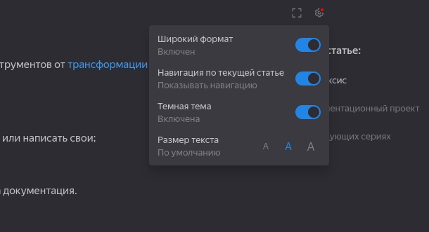

# Медиа

## Изображения {#images}

Изображения должны храниться в каталоге, имя которого начинается с символа `_`, иначе они будут удалены при сборке. Рекомендуемый размер загружаемого файла — 5 МБ, максимальный — 10 МБ.

{gallery=true gallery-id=50 width=300}
![An old rock in the desert][image1]{gallery-id=0}

Текст между картинками 

![An old rock in the desert][image1]{gallery-id=0}


![An old rock in the desert][image1]{gallery-id=0}

Стандартная разметка для вставки изображения имеет вид:
```
{width=100 height=100}
```

  * `alt-текст` —  работает как [атрибут alt в HTML](https://en.wikipedia.org/wiki/Alt_attribute). Отображается, если изображение не загружено, используется для SEO и чтения скринридерами.

      
      
      Чтобы отобразить alt-текст в SVG-изображении, добавьте [атрибут `inline=false`](#img-inline).
      
      
      
      
  * `_images/image.png` — URL или путь до файла изображения.
  * `"текст_подсказки"` — подсказка, которая будет отображаться при наведении на изображение. Необязательный параметр.
  * `width=100`, `height=100` — размер изображения. Необязательные параметры.

    

    Если вы хотите сохранить оригинальное соотношение сторон изображения, укажите только его ширину: `width=100`.

    

    

    Не рекомендуется использовать передачу размера изображения через `=100x200` внутри скобок со ссылкой — этот формат нарушает обратную совместимость с markdown-разметкой.

    

### Изображение-ссылка {#image-link}

Вы можете сделать изображение кликабельным, используя [правила оформления ссылок](./links.md). Для этого добавьте стандартную разметку изображения в ту часть, которая предназначена для указания текста ссылки.

```markdown
[{width=100 height=200}](https://yandex.com/images/search?text=mountain)
```

**Результат:**

[{width=100 height=200}](https://yandex.com/images/search?text=mountain)

### Reference-style разметка для изображений {#reference-style}

Аналогично [reference-style ссылкам](./links.md#reference-style), вы можете один раз объявить изображение в специальном месте, а в остальном документе обращаться к нему по метке. Это позволит использовать изображение несколько раз, не перегружая текст длинными URL или другими параметрами.

```markdown
![An old rock in the desert][image1]

[image1]: ../_images/mountain.jpg "Mountain"
```

**Результат:**

![An old rock in the desert][image1]

[image1]: ../_images/mountain.jpg "Mountain"
[image2]: ../_images/Gallery.jpeg "Gallery"


### Инлайнинг SVG {#img-inline}

Если в документации используются SVG-изображения, Diplodoc при генерации встраивает их напрямую в HTML-код в виде тега `<svg>`. Такое решение позволяет применять настройки текущей темы документации к SVG.

Для форсированного отключения инлайнинга SVG используйте атрибут `inline=false`, тогда

```
{inline=false}
```

будет преобразован в 
```html

```

Управлять инлайнингом SVG-изображений на уровне проекта можно с помощью настройки ##[maxInlineSvgSize](../settings.md#content)##, которая ограничивает максимальный размер встраиваемых изображений. Для отключения инлайнинга SVG установите `maxInlineSvgSize` равным **нулю**.



Настройка изображения `inline` имеет более высокий приоритет, чем настройка проекта `maxInlineSvgSize`: если у SVG-изображения установлен параметр `inline=true` и оно превышает заданное ограничение размера, встраивание в HTML-код будет выполнено.



### Проверка группировки изображений {#gallery-grouping-test}

Этот раздел предназначен для проверки автоматической группировки изображений в галереи. Название каждой картинки указано в ее `alt`-тексте и отображается в галерее.

#### Автоматическая группировка по разделу и табам

Текст перед первой картинкой.

{width=240 gallery=true}



- Таб 1

  {width=240 gallery=true}

- Таб 2

  {width=240 gallery=true}



Текст между первым и вторым блоками табов.

{width=240 gallery=true}

Текст между картинками 4 и 5.

{width=240 gallery=true}



- Таб 3

  {width=240 gallery=true}

- Таб 4

  {width=240 gallery=true}

  {width=240 gallery=true}



Ожидаемые группы: `1`, `2`, `3`, `4 + 5`, `6`, `7 + 8`.

#### Группировка с помощью `gallery-id`

{width=240 gallery=true}

{width=240 gallery-id=manual-x}

{width=240 gallery-id=manual-x}

{width=240 gallery=true}

Текст между картинками 12 и 13.

{width=240 gallery=true}

Ожидаемые группы: `9`, `10 + 11`, `12 + 13`. У картинок 10 и 11 не указан `gallery=true`: наличие `gallery-id` должно включить галерею автоматически.

#### Одинаковый `gallery-id` в разных разделах и табах

{width=240 gallery-id=cross-section}

##### Другой h-раздел



- Таб со сквозной группой

  {width=240 gallery-id=cross-section}

- Другой таб

  {width=240 gallery=true}



{width=240 gallery-id=cross-section}

Ожидаемая сквозная группа: `14 + 15 + 17`. Картинка 16 должна открываться отдельно.

## Видео {#video}



Поддерживаемый список видеохостингов: Yandex, Rutube, VK, Youtube, Vimeo, Vine, Osf, Prezi.

Если ваш видеохостинг не поддерживается, но у него есть кнопка экспорта видео, то воспользуйтесь разделом [Видео из другого видеохостинга](#unsupported-player).



### Видео из поддерживаемого видеохостинга {#supported-host}

1. Чтобы добавить на страницу видео, используйте разметку:

    ```markdown
    @[название_хостинга](id_видео_или_ссылка_на_него)
    ```

1. Замените `название_хостинга` на название видеохостинга из списка: `yandex`, `rutube`, `vk`, `youtube`, `vimeo`, `vine`, `osf`, `prezi`.

1. Откройте страницу с видео, которое нужно встроить в документацию. {#href-for-video}

1. Найдите код для публикации видео (код можно найти при экспорте в теге `iframe`, например, в разделе «Поделиться»).

    ```html
    <iframe src="https://vk.com/video_ext.php?oid=-207738372&id=456239060&hd=2&autoplay=1" width="853" height="480" allow="autoplay; encrypted-media; fullscreen; picture-in-picture; screen-wake-lock;" frameborder="0" allowfullscreen></iframe>
    ```

1. Замените `id_видео_или_ссылка_на_него` на ссылку из атрибута `src`.

**Пример разметки:**

```markdown
@[vk](https://vk.com/video_ext.php?oid=-207738372&id=456239060&hd=2&autoplay=1)
```

**Результат:**

@[vk](https://vk.com/video_ext.php?oid=-207738372&id=456239060&hd=2&autoplay=1)



Если видео не отображается, и окно проигрывателя выдает ошибку `ERR_BLOCKED_BY_CSP`:

1\. Откройте `.yfm` файл конфигурации.
2\. Добавьте видеохостинг в список разрешенных доменов.

```yaml
resources:
  csp:
    - "frame-src":
        - "ссылка_на_видеохостинг"
```



```yaml
allowHtml: true
langs: ['en','ru']

resources:
  csp:
    - "frame-src":
        - "https://vk.com"
        - "https://login.vk.com"        
        - "https://runtime.strm.yandex.ru"

docs-viewer:
  langs: ['en','ru']
...
```





### Видео из другого видеохостинга {#unsupported-player}

1. Чтобы добавить на страницу видео, используйте разметку:

    ```
    @[](id_видео_или_ссылка_на_него)
    ```

1. Получите ссылку на [видео](#href-for-video).

1. Замените `id_видео_или_ссылка_на_него` на полученную ссылку.

**Пример разметки:**

```markdown
@[](https://frontend.vh.yandex.ru/runtime/player/video/vplvic7jsotpobyc7o5b?autoplay=0&branding=0&from=documentation&mute=0&redirect_from=ugc)
```

**Результат:**

@[](https://frontend.vh.yandex.ru/runtime/player/video/vplvic7jsotpobyc7o5b?autoplay=0&branding=0&from=documentation&mute=0&redirect_from=ugc)
