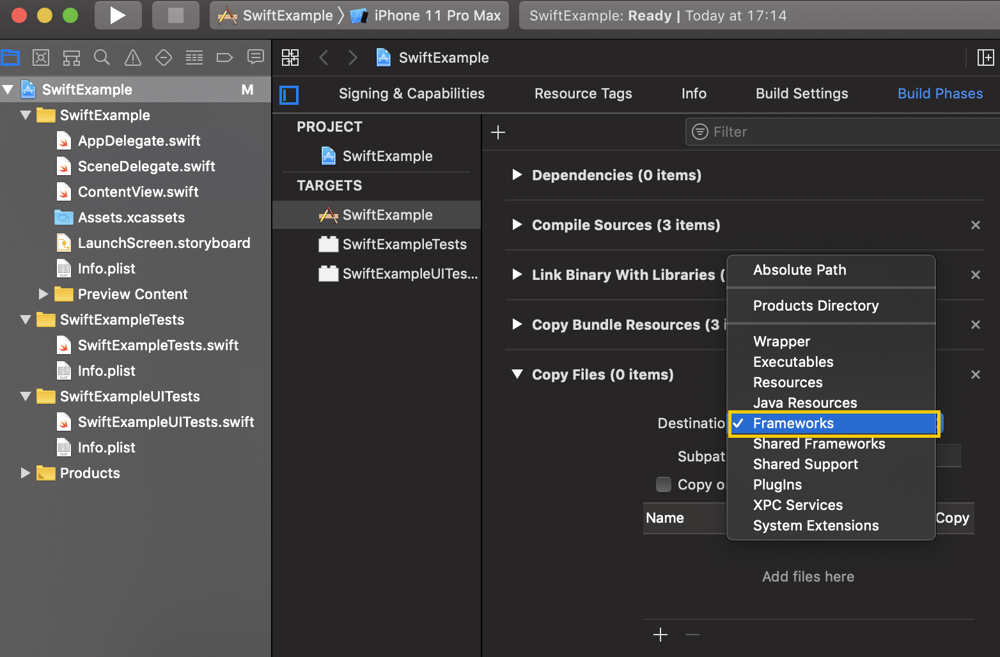

# Частые вопросы и решение проблем

## Создание приложения {#create-app}

#### {#api-key}



Рекомендуем для одного и того же приложения на разных платформах использовать один API-ключ. Это позволит удобнее просматривать общую статистику приложения, статистику по отдельной платформе, а также даст возможность использовать smartlink в трекерах.



## Интеграция SDK {#sdk-integration}

#### {#newest-android-version}



Чтобы проверить, что у вас установлены последние версии библиотек AppMetrica SDK и AppMetrica Push SDK, выполните шаги:

1. В строке меню Android Studio выберите **Analyze** → **Run Inspection By Name**.
2. В появишемся окне введите и выберите **Newer Library Versions Available**.
3. Выберите библиотеки, которые нужно обновить.



#### {#update-version}



Чтобы обновить версию библиотеки AppMetrica SDK, необходимо:



- Android

  1. Отредактировать версию библиотеки в файле `build.gradle`.
  2. Произвести инициализацию библиотеки в приложении.

  Подробнее в разделе [Подключение и инициализация](../sdk/android/analytics/quick-start.md).

- iOS

  1. Отредактировать версию библиотеки в `Podfile` вашего проекта.
  2. Произвести инициализацию библиотеки в приложении.

  Подробнее в разделе [Подключение и инициализация](../sdk/ios/analytics/quick-start.md).





#### {#region}



AppMetrica умеет определять местоположение устройства. Точность определения зависит от конфигурации, с которой инициализируется библиотека:

**С включенной опцией locationTracking**
:   

    Для iOS опция включена по умолчанию, но AppMetrica SDK не запрашивает разрешение на получение данных о местоположении. Это необходимо сделать самостоятельно с помощью методов класса [CLLocationManager](https://developer.apple.com/documentation/corelocation/cllocationmanager?language=objc).

    

    Местоположение определяется с точностью до города. Информация доступна в [отчетах](../mobile-reports/index.md) и в [Logs API](../mobile-api/logs/about.md).

    Приложение запрашивает доступ к GPS. Расход заряда аккумулятора может увеличиться.

**С отключенной опцией locationTracking**
:   

    Начиная с версии 5.0.0 AppMetrica Android SDK опция `locationTracking` по умолчанию отключена.

    Ниже версии 5.0.0 опция `locationTracking` по умолчанию включена.

    

    Местоположение определяется по IP-адресу с точностью до страны. Информация доступна в [отчетах](../mobile-reports/index.md), но не доступна в [Logs API](../mobile-api/logs/about.md).

    Приложение не запрашивает доступ к GPS. Расход заряда аккумулятора не увеличивается.

    

    Если у вас включена маскировка IP-адреса, местоположение определяется так же с точностью до страны по немаскированной части IP-адреса.

    

Примеры см. в разделе [{#T}](../data-collection/geo.md#track-location).



#### {#library-not-found}



Ошибка возникает, потому что Xcode не может подписать библиотеки, которые предоставляет SPM. В проекте SPM заведена [задача на исправление](https://bugs.swift.org/browse/SR-13343), но на текущий момент она не решена.

Чтобы решить проблему, выполните последовательность действий:

1. На этапе сборки вашего приложения добавьте шаг с копированием файлов.

    {style="border: solid 1px #cccccc; max-width: 800px;"}

2. В пункте **Destination** выберите значение **Frameworks**.

    {style="border: solid 1px #cccccc; max-width: 800px;"}

3. Добавьте шаг с запуском скрипта.

    {style="border: solid 1px #cccccc; max-width: 800px;"}

4. Добавьте скрипт. Скрипт подпишет библиотеки, которые предоставляет SPM.

    ```bash translate=no
    find "${CODESIGNING_FOLDER_PATH}" -name '*.framework' -print0 | while read -d $'\0' framework
    do
    codesign --force --deep --sign "${EXPANDED_CODE_SIGN_IDENTITY}" --preserve-metadata=identifier,entitlements --timestamp=none "${framework}"
    done
    ```



#### {#trouble-load}



Во время установки библиотеки может возникнуть ошибка, указанная ниже (пример лога). Чтобы решить проблему, выполните последовательность шагов из раздела [Ошибка "Library Not Found" при запуске приложения на устройстве](#library-not-found).



```bash translate=no
Details

Unable to install "Your App"
Domain: com.apple.dt.MobileDeviceErrorDomain
Code: -402620395
--
A valid provisioning profile for this executable was not found.
Domain: com.apple.dt.MobileDeviceErrorDomain
Code: -402620395
User Info: {
    DVTRadarComponentKey = 487925;
    MobileDeviceErrorCode = "(0xE8008015)";
    "com.apple.dtdevicekit.stacktrace" = (
	0   DTDeviceKitBase                     0x00000001212d493f DTDKCreateNSErrorFromAMDErrorCode + 220
	1   DTDeviceKitBase                     0x0000000121313124 __90-[DTDKMobileDeviceToken installApplicationBundleAtPath:withOptions:andError:withCallback:]_block_invoke + 155
	2   DVTFoundation                       0x000000010576db33 DVTInvokeWithStrongOwnership + 71
	3   DTDeviceKitBase                     0x0000000121312e65 -[DTDKMobileDeviceToken installApplicationBundleAtPath:withOptions:andError:withCallback:] + 1440
	4   IDEiOSSupportCore                   0x0000000121183d28 __118-[DVTiOSDevice(DVTiPhoneApplicationInstallation) processAppInstallSet:appUninstallSet:installOptions:completionBlock:]_block_invoke.292 + 3513
	5   DVTFoundation                       0x000000010589c29a __DVT_CALLING_CLIENT_BLOCK__ + 7
	6   DVTFoundation                       0x000000010589debc __DVTDispatchAsync_block_invoke + 1191
	7   libdispatch.dylib                   0x00007fff73c476c4 _dispatch_call_block_and_release + 12
	8   libdispatch.dylib                   0x00007fff73c48658 _dispatch_client_callout + 8
	9   libdispatch.dylib                   0x00007fff73c4dc44 _dispatch_lane_serial_drain + 597
	10  libdispatch.dylib                   0x00007fff73c4e5d6 _dispatch_lane_invoke + 363
	11  libdispatch.dylib                   0x00007fff73c57c09 _dispatch_workloop_worker_thread + 596
	12  libsystem_pthread.dylib             0x00007fff73ea2a3d _pthread_wqthread + 290
	13  libsystem_pthread.dylib             0x00007fff73ea1b77 start_wqthread + 15
    );
}
--

System Information

macOS Version 10.15.7 (Build 19H15)
Xcode 12.1 (17222)
```





#### {#get-ids}



Получить `appmetrica_device_id` можно с помощью метода `requestStartupParams()`. Запрашивать нужно идентификатор `DeviceIdHashKey`.



## Трекинг {#tracking}

#### {#differences}



- Версии приложения обновляются, и когда пользователи обновят их стандартным образом (через магазин), предустановленное приложение уже невозможно будет отличить от обычного по названию сборки. Даже если собрать приложение с отдельным именем пакета, после обновления оно так же не будет отличаться от обычного.
- Использование трекинга предустановок позволяет привязать пользователя к условному источнику трафика (предустановке) и сегментировать отчеты. Также это удобно при работе с несколькими вендорами: достаточно создать несколько трекеров и использовать разные tracking-ID при инициализации библиотеки AppMetrica.
- Поскольку установка привязана к единственному источнику трафика, за нее не придется платить рекламному партнеру в случае, если во время атрибуции (например, с помощью [Probabilistic Matching](../mobile-tracking/technology.md)) произойдет случайное совпадение.



#### {#remarketing-campaign}



Чтобы создать [ремаркетинг-кампанию](*ремаркетинг-кампанию), сделайте следующее:



- Android

  1. Убедитесь, что у вас AppMetrica SDK версии 3.1.0 или выше.
  2. Добавьте [поддержку deeplink](https://developer.android.com/training/app-links/deep-linking#adding-filters) в своем приложении.
  3. Добавьте [отслеживание открытий deeplink для Android](../sdk/android/analytics/android-operations.md).
  4. Создайте [трекер для ремаркетинг-кампании](../mobile-tracking/add-remarketing-tracker.md).

- iOS

  1. Убедитесь, что у вас AppMetrica SDK версии 3.1.2 или выше.
  2. Добавьте [поддержку Universal Links](https://developer.apple.com/documentation/uikit/core_app/allowing_apps_and_websites_to_link_to_your_content) в своем приложении.
  3. Добавьте [отслеживание открытий deeplink для iOS](../sdk/ios/analytics/ios-operations.md).
  4. Создайте [трекер для ремаркетинг-кампании](../mobile-tracking/add-remarketing-tracker.md).



Подробнее о атрибуции ремаркетинг-кампаний в разделе [Атрибуция ремаркетинг-кампаний](../mobile-tracking/remarketing-attribution.md).



#### {#utm}



AppMetrica позволяет использовать UTM-метки в трекинг-ссылке, целевой ссылке и deeplink. Для этого необходимо дописать UTM-метку в созданную ссылку, как параметр: после знака вопроса в формате _ключ=значение_. Подробнее в разделе [Параметры трекинг-ссылки](../mobile-tracking/tracking-specification.md).



Необязательно сохранять трекинг-ссылку (целевую или deeplink) с UTM-метками при создании трекера, достаточно добавить метки перед рекламным размещением. Таким образом, вы можете использовать одну ссылку с разными UTM-метками.



В отчетах AppMetrica UTM-метки отображаются как параметры трекера и доступны в группировке по параметрам.



#### {#format}



В параметре `click_id` может быть прописана произвольная строка.



#### {#tracking-url}



Чтобы создать трекинг-ссылку, вы можете в веб-интерфейсе AppMetrica [добавить рекламного партнера](../mobile-tracking/add-partner.md). Затем при [создании трекера](../mobile-tracking/add-tracker.md) указать в трекинг-ссылке произвольные параметры, которые вам необходимы. Подробнее о [настраиваемых параметрах](../mobile-tracking/tracking-specification.md).



#### {#tracker-archived}



Если за последние 12 месяцев по трекеру не было установок, трекер автоматически отправляется в архив. Накопленная статистика по трекеру останется в отчетах.

Архивный трекер можно восстановить:

1. Перейдите в список трекеров.
2. Активируйте опцию **Показать архивные**.
3. Нажмите **Восстановить** на нужном трекере.



#### {#security}



Установите на устройстве корректные дату и время.



#### {#tracker-link}



В настройках Smartlink указываются ссылки для разных типов устройств. Вы можете получать ошибку 404 с ПК, если ссылка для десктопных устройств в трекере не настроена. Ее можно указать в Fallback. [Подробнее](../mobile-tracking/add-tracker.md#step2).



#### {#universal-link}



Для iOS вместо обычной трекинг-ссылки нужно использовать [Universal link](../sdk/ios/analytics/ios-universal-links.md).



## Отчеты {#reports}

#### {#downloads}



Google Play и App Store считают установки после загрузки приложения на смартфон, а AppMetrica считает установки после открытия приложения (первой инициализации AppMetrica SDK).



#### {#no-installs}



В отчетах **События** и **Вовлеченность** посмотрите, приходит ли информация о событиях и сессиях:

- Если нет установок, но есть события и сессии, проверьте использование метода или свойства `handleFirstActivationAsUpdate` в расширенной конфигурации.

    По умолчанию параметр отключен, и новые установки отображаются в отчетах. Если параметр активирован, то все установки будут считаться обновлением приложения и не отобразятся в отчетах. См. примеры для [Android](../sdk/android/analytics/android-operations.md) и [iOS](../sdk/ios/analytics/ios-operations.md).

- Если нет установок, событий и сессий, убедитесь, что AppMetrica правильно отслеживает [активность сессий](../sdk/android/analytics/android-listen.md).

    Если ваше приложение поддерживает устройства с версией:

    - Android 4.0 и выше — вызывайте метод `enableActivityAutoTracking` после инициализации библиотеки и до открытия первого экрана.
    - Android ниже 4.0 — используйте методы `AppMetrica.resumeSession(activity)` и `AppMetrica.pauseSession(activity)`.

**Узнать больше**

- [Определить новые установки на Android](../sdk/android/analytics/android-operations.md)
- [Определить новые установки на iOS](../sdk/ios/analytics/ios-operations.md)
- [Сессии на Android](../sdk/android/analytics/android-listen.md)
- [Сессии на iOS](../sdk/ios/analytics/ios-listen.md)



#### {#logs}



AppMetrica группирует крэш-логи по [stack trace](https://en.wikipedia.org/wiki/Stack_trace). Чтобы узнать, в чем именно заключается ошибка, не надо просматривать каждый лог в отдельности, достаточно увидеть один лог из группы.

Чтобы получить статистику по крэшам для определенных видов устройств, рекомендуем использовать сегментацию.





#### {#week-audience}



В большинстве случаев один и тот же пользователь запускает приложение в разные дни в течение недели. Поэтому он учитывается несколько раз в дневной аудитории, но в недельной будет учтен только единожды.

Например, недельная аудитория приложения — 100 пользователей. А если сложить количество пользователей за каждый день, то получится 110 пользователей. Это значит, что некоторые пользователи запускали приложение несколько раз за прошедшую неделю.



#### {#retention-value}





**Узнать больше**

- [Retention-анализ](../mobile-reports/retention-report.md)





#### {#organic}



Google Play дает возможность получить источник органической установки при помощи библиотеки [Play Install Referrer Library](https://developer.android.com/google/play/installreferrer/library). В App Store аналогичного механизма нет.



#### {#send-event}



AppMetrica SDK не отправляет событие сразу после того, как оно произошло. События накапливаются в буфере и отправляются пачками. Для принудительной отправки сохраненных событий после прохождения важных сценариев пользователя можно использовать метод `sendEventsBuffer()` — он отправляет данные из буфера и очищает его.



Частое использование метода `sendEventsBuffer()` может привести к повышению энергопотребления и расходу исходящего интернет-трафика.





## API. Экспорт данных {#api-export}

#### {#differences-logs-api-and-reports}



Данные в отчетах и Logs API могут отличаться:

Отчет User Acquisition

:   В выгрузке из Logs API считаются все установки, в том числе переустановки на одно и то же устройство, которые можно опознать по полю `is_reinstallation`.
В отчете переустановки не считаются. Считается только одна установка на одно устройство.
Подробнее об [отчете User Acquisition](../mobile-reports/user-acquisition-report.md).

Отчет Remarketing

:   В отчете за re-engagement считается количество уникальных устройств, открывших приложение диплинком за рассматриваемый период, а в выгрузке Logs API все открытия deeplink.
Подробнее об [отчете Remarketing](../mobile-reports/remarketing-report.md).



#### {#raw-data}



Сырые данные по событиям, получаемые из Logs API, не содержат информацию об источнике. С событиями приходит идентификатор пользователя `appmetrica_device_id`, и именно по нему в отчетах определяется, что событие принадлежит конкретному пользователю, источник которого определен при установке.

Информация об источнике содержится в выгрузке установок, где также есть `appmetrica_device_id`.

Вы можете выгрузить установки и события, а затем, используя функцию ВПР или любой другой удобный метод, определить пользователя в каждой таблице по `appmetrica_device_id`. Это позволит вам получить для событий соответствующие поля из таблицы установок, связанные с атрибуцией, например:

  - `click_id`
  - `click_url_parameters`
  - `publisher_name`
  - `tracker_name`
  - `tracking_id`



## Интеграция с Yandex Ads SDK {#yandex-ads-sdk}

#### {#yads-sdk-extended}



Инициализируйте AppMetrica SDK самостоятельно, используя API Key в разделе **Настройки** → **Основное**.



#### {#yads-sdk-already-using}



Не нужно, поведение AppMetrica SDK не зависит от Yandex Mobile Ads SDK.



#### {#yads-sdk-disable-auto}



Используйте метод [setAppAdAnalyticsReporting](https://yastatic.net/s3/doc-binary/src/dev/mobile-ads/ru/javadoc/com/yandex/mobile/ads/common/MobileAds.html#setAppAdAnalyticsReporting(java.lang.Boolean)) для Android и [setAppAdAnalyticsReportingEnabled](https://yastatic.net/s3/doc-binary/src/dev/mobile-ads/ru/jazzy/Classes/MobileAds.html#/c:@M@YandexMobileAds@objc(cs)YMAMobileAds(cm)setAppAdAnalyticsReportingEnabled) для iOS в конфигурации Yandex Mobile Ads SDK.



#### {#yads-sdk-other-logic}



[Инициализируйте AppMetrica SDK](../common/quick-start.md#integration-sdk) самостоятельно, используя API Key в разделе **Настройки** → **Основное**.



## Прочее {#misc}

#### {#change-device-id}





Начиная с версии AppMetrica Android SDK 5.0.0 и выше при переустановке приложения на смартфоне меняется `appmetrica_device_id`. Это обусловлено новыми политиками Google.



Условия смены `appmetrica_device_id`:

- актуальные политики Google запрещают использование идентификаторов, которые не сбрасываются после переустановки приложения;
- рекомендуемый источник для генерации идентификатора устройства описан в [документации Google](https://developer.android.com/training/articles/app-set-id). От него сейчас генерируется `appmetrica_device_id`;
- `appmetrica_device_id` сбрасывается при переустановке приложения, если на устройстве установлено только одно приложение от вендора;
- `appmetrica_device_id` не сбрасывается при переустановке одного из приложений, если на устройстве установлено несколько приложений от вендора;
- иное поведение подвергает приложение риску получить претензии со стороны Google.



#### {#get-id}



Значения IDFA/GAID можно получить:

- с помощью postback — если у вас есть собственный сервер, можно отправлять все postback на него. Подробнее о [настройке postback](../mobile-tracking/add-tracker.md).
- c помощью [Logs API](../mobile-api/logs/about.md) — выгружая неагрегированные данные.



#### {#app-stores}



Магазин приложений не влияет на работу AppMetrica. Статистика будет собираться и для приложений, которые распространяются не через магазины.

Трекинг для таких приложений тоже будет работать, в том числе методы атрибуции [Device Identifier Matching](../mobile-tracking/technology.md) и [Probabilistic Matching](../mobile-tracking/technology.md#device-fingerprint-matching).



{{ feedback }}

<a href="feedback-new.html">
  <span class="button">Написать в службу поддержки</span>
</a>



<!--<style>

    .yfm h4 { margin: 0 !important; padding: 0 !important }

</style>-->

[*ремаркетинг-кампанию]: Рекламная кампания, которая направлена на возвращение пользователей в установленное приложение. Подробнее о создании ремаркетинг-кампании в разделе [Создание ремаркетинг-трекера](../mobile-tracking/add-remarketing-tracker.md).

