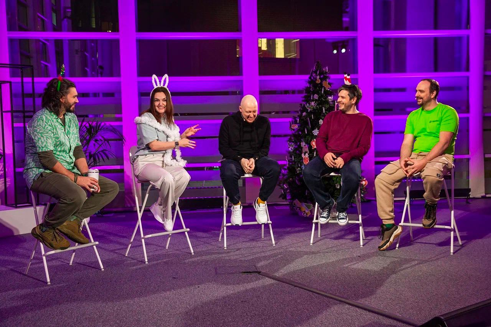

# Веб-разработчик в Платформу документации

## Специфика нашей работы

Мы занимаемся разработкой программной платформы документации в парадигме [documentation as a code](https://yandex.ru/search/?text=documentation+as+a+code&clid=1955453&win=547&lr=2).

Платформа помогает разработчикам и техническим писателям получать качественную документацию, прилагая минимум усилий.

На нешей платформе создана вся документация [Облака](https://cloud.yandex.ru/ru/docs), [Diplodoc](https://diplodoc.com/docs/ru/), страница, которую вы сейчас читаете, и много других продуктов, которые вы пока не сможете увидеть.

Концепция documentation as a code предполагает, что написание документов следует **[принципам написания кода](*documentation-as-a-code-rules)**, целью которых является создание четкой структуры для легкого понимания и чтения.

### Минимум верстки

В плане интерфейса документация - простой сервис.

Основные интерфейсные компоненты мы берем из open source библиотеки [@gravity-ui/uikit](https://gravity-ui.com/libraries/uikit).

Для сложного пользовательского контента мы предоставляем интеграцию с [@gravity-ui/page-constructor](https://gravity-ui.com/libraries/page-constructor).

### Максимум логики

Большая часть нашей работы связана с процессингом текстов, расширением синтаксических [конструкций маркдауна](https://github.com/diplodoc-platform/transform/blob/master/src/transform/plugins/table/index.ts), созданием новых [расширений](https://github.com/diplodoc-platform/mermaid-extension) для платформы.

Важно не теряться в инкрементах циклов, не создавать излишней вложенности. умело выбирать **[структуры данных](*data-structures)**.

### Сервера{#servers}

Платформа работает не только как набор утилит для сборки документации,
но и в виде нескольких серверных инсталяций, которые помогают динамически рендерить документацию, индексировать ее.

Основные технологии с которыми мы работаем на серверах:
{{servers}}

Со всеми перечисленными технологиями мы работаем лично. Следим за стабильностью серверов. Прорабатываем архитектуру. Выстраиваем процессы для обеспечения стабильности.



Суммарно на наши сервера заходит больше одного миллиона уникальных пользователей в день.





Наша задача быстро и без ошибок, в любую погоду, показывать документацию пользователям.



### OpenSource

Большая часть нашей платформы [размещена в open source](https://github.com/diplodoc-platform/diplodoc).

Поддержка open source является важной частью нашей ежедневной работы:

- Общение в issues и pull requests в GitHub на русском и преимущественно английском языке.
- Презентация/продвижение продукта на разных ** [конференциях](*conference)**{.photo} и ** [митапах](*meetup)**{.photo}.
- Разработка продукта не под конкретную компанию, а под совокупный опыт/ожидания сообщества.

## Ожидания от кандидата

Мы ожидаем что вы уже знаете или вам было бы **интересно** быcтро изучить:



Ничего экзотического не требуется. Но в базовых нужно разбираться хорошо. Умело их применять.

{{algorithms}}

Отдельным плюсом будет, если вы сталкивались с алгоритмами токенизации текстов, разбираетесь в алгоритмах поиска по текстам.

Потому что мы разбираем тексты на кусочки, а потом собираем из них что-нибудь новое и прекрасное.





{{servers}}

Потому что [мы много работаем с серверами](#servers)





**CommonMark** спецификаци маркдауна.

**GitHub Flavored Markdown** спецификаци маркдауна.

**JSONSchema** - работаем со схемами чаще среднестатистического разработчика





**Git** - чуть глубже чем просто создание коммитов. Мы используем его на программном уровне.

**GitHub** - так же глубоко интегрирован в наш продукт. Пишем gh-actions, gh-extensions дл внешних потребителей платформы документации.

**Webpack** - на уровне написани собственных плагинов.





Мы будем лучше друг друга понимать, если вы уже читали:

**Чистый код** Роберта Мартина

**Чистая архитектура** Роберта Мартина

**Site Reliability Engineering** Бетси Бейер и др.



Так же мы ожидаем хороший скилл коммуникации. У нас много внешних и внутренних заказчиков.
Много демократичных процессов в рамках развития общей опенсорс технологии.
Нужно много слушать, анализировать, договариваться.

[*documentation-as-a-code-rules]:
- **DRY (Don’t Repeat Yourself)**: важно избегать дублирования информации в документах.
- **KISS (Keep It Simple, Stupid)**: необходимо избегать ненужной сложности и стремиться к простоте изложения информации.
- **SRP (Single Responsibility Principle)**: каждый блок документации должен быть ответственным только за одну часть функциональности для сохранения четкости. структуры.
- **SLAP (Single Level of Abstraction Principle)**: необходимо разбивать большие документы на уровни абстракции и делать для каждого уровня отдельные лаконичные документы.
- **LoD (Law of Demeter)**: необходимо делать ссылки только на релевантные документы.
- Система ориентирована на пользователя, в ней ценятся не только читаемость, но и визуальная составляющая. Поэтому использование визуальных средств, таких как диаграммы, графики и видеоруководства, также становятся все более важными.
- **Проверка качества**: система предполагает единый стиль кодирования, включая структуру текста, отступы, пробелы и т.д. для облегчения понимания.
- **Версионирование**: система интегрирована с популярными vcs.
- **Локализация**: система доступна пользователям на нескольких языках. Это обеспечивается интеграцией с [автоматическими](https://cloud.yandex.ru/ru/docs/translate/?from=int-console-empty-state) и [полу-автоматическими](https://ru.smartcat.com/) сервисами перевода.
- **Доступность**: система доступна плохо видящим пользователям.

[*data-structures]:
{{algorithms}}

[*meetup]:

[*conference]:

